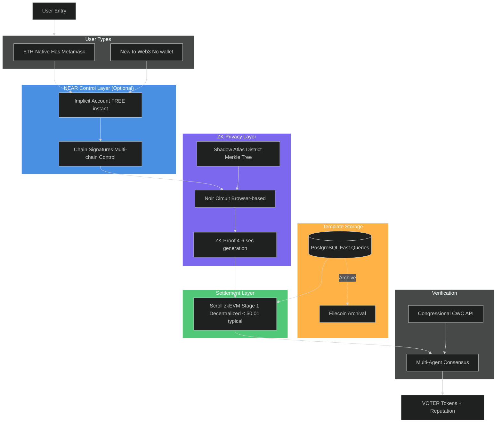
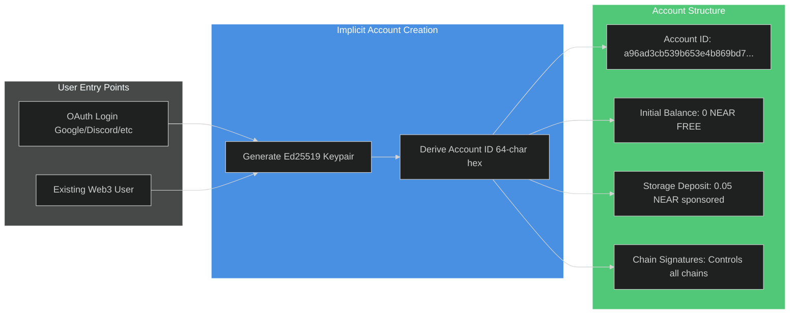
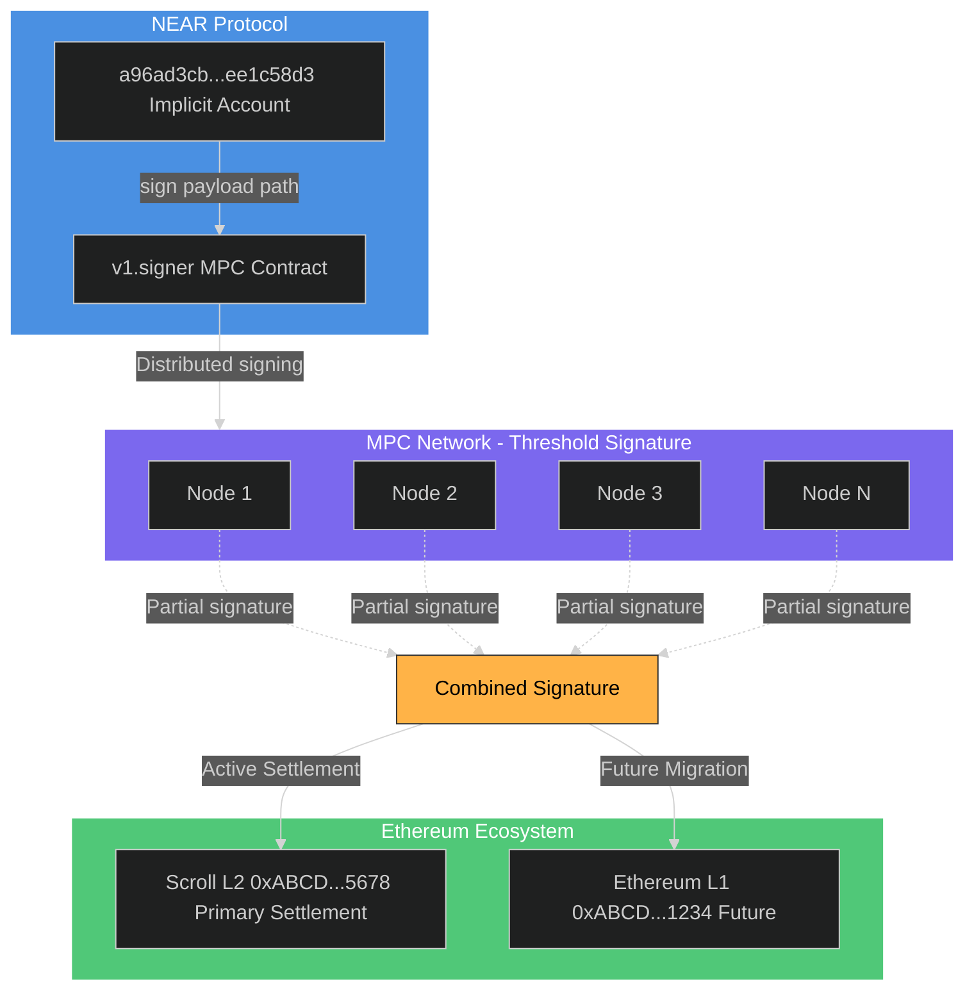
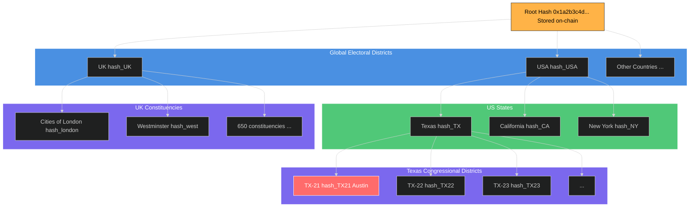
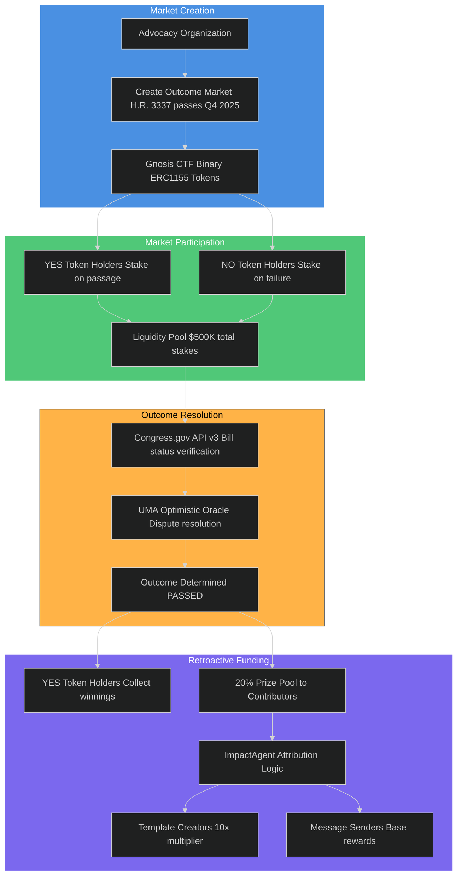
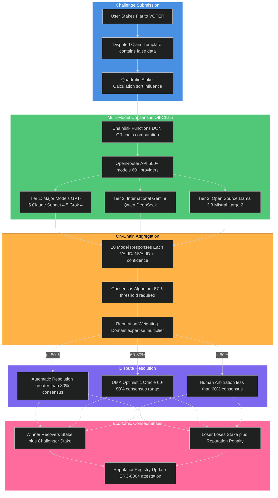
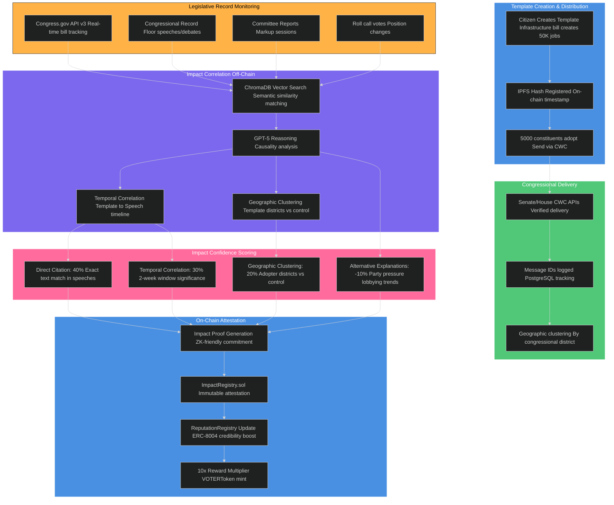
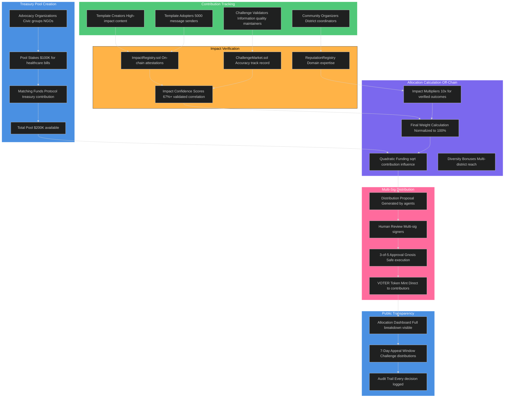
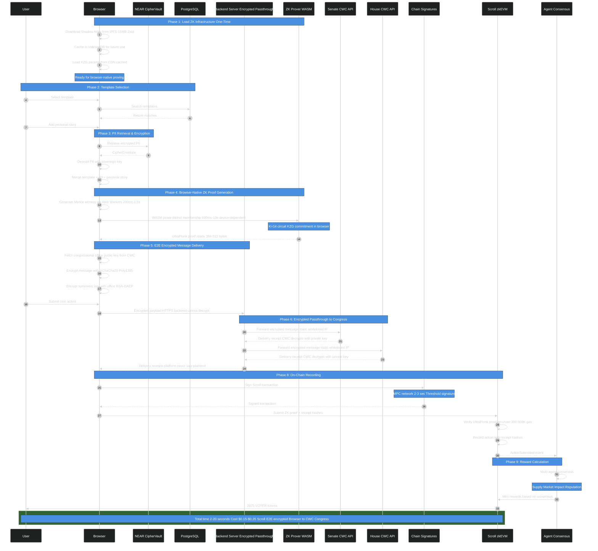

# VOTER Protocol: Technical Architecture

**Status**: Active development - Phase 1 implementation (Noir/Barretenberg UltraPlonk, reputation-only)
**Last Updated**: December 2025
**Implementation**: Smart contracts in this repo, frontend in Communique repo
**Core Decisions**: Scroll settlement, Noir/Barretenberg zero-knowledge proofs, Scroll identity registry (on-chain Sybil resistance), no database PII storage, no NEAR dependency

---

## Executive Summary

Democratic infrastructure should not ask for permission to protect its citizens. Phase 1 enforces privacy by construction: proofs replace identities, signals replace surveillance, and reputation records—not people—touch the chain. Institutions get verifiable civic signal; citizens keep sovereignty.

**Settlement**: Scroll zkEVM (Ethereum L2)
**Identity**: self.xyz (primary) + Didit.me (fallback)
**Privacy**: Browser‑native Noir/Barretenberg proofs; addresses never leave the device
**Storage**: Minimal metadata only; encrypted where needed
**Delivery**: CWC API with enclave‑protected processing
**Moderation**: 3‑layer stack (automation + consensus + human)
**Phasing**: Phase 1 reputation; Phase 2 economics

---

## Phase Architecture Overview

VOTER Protocol launches in phases. Phase 1 establishes cryptographic foundations and proves civic utility **with full privacy from day one** (browser-native Noir/Barretenberg proofs, selective disclosure). Phase 2 adds token economics. Phase 3+ (speculative, only if community demands) would explore **enhanced** privacy through nested ZK proofs.

### Phase 1: Cryptographic Infrastructure (Current - 3 Months to Launch)

**What Ships:**
- Noir/Barretenberg zero-knowledge district proofs (browser-native WASM, UltraPlonk + KZG, 300–500k gas; Aztec ceremony; production-grade since 2024)
- Addresses never leave browser, never stored in any database
- Message content encryption from platform operators (XChaCha20-Poly1305, delivered as plaintext to congressional offices via CWC API)
- Browser-native proving (zero cloud dependency, $0/month infrastructure cost)
- Cross-chain account abstraction (NEAR Chain Signatures, optional)
- On-chain reputation (ERC-8004 portable credibility, no token rewards)
- 3-layer content moderation (Section 230 compliant)
- FREE identity verification (self.xyz passport + Didit.me fallback)

**Budget:** $3,500/month for 1,000 users / 10,000 messages (AWS Nitro Enclaves message encryption + moderation)

**What's NOT in Phase 1:**
- VOTER token (Phase 2)
- Challenge markets (Phase 2)
- Outcome markets (Phase 2)
- Token rewards (Phase 2)
- Multi-agent treasury (Phase 2)

### Phase 2: Token Economics (12-18 Months Post-Launch)

**Additions:**
- VOTER token launch (utility + governance)
- Challenge markets (stake on verifiable claims, multi-model AI adjudication)
- Outcome markets (retroactive funding for legislative impact)
- Multi-agent treasury (5 specialized agents managing token supply)
- Privacy pools (Buterin 2023/2025, shielded transactions with association proofs)

**Why Delayed:** Token launches require legal compliance (CLARITY Act framework), liquidity infrastructure, economic security audits. Phase 1 proves civic utility before adding financial layer.

### Phase 3+: Enhanced Privacy (Speculative - 2+ Years, Only If Community Demands)

**Context:** Phase 1 already provides **full privacy** through browser-native Noir/Barretenberg proofs that never transmit addresses. Users have selective disclosure from day one (prove district membership without revealing address, prove reputation range without exact score). Phase 3+ would explore **optional, stronger privacy** features that come with architectural tradeoffs.

**Only if community demands AND congressional offices accept:**
- Nested ZK proofs (prove "reputation > 5000" without revealing exact score, vs current exact scoring visible to congressional offices)
- Shielded message metadata (hide send timestamps, template IDs from on-chain records)

**Tradeoff:** Congressional offices receive weaker aggregate signals (ranges instead of exact scores, hidden timestamps). This reduces the signal quality offices use to gauge constituent intensity and coordination. Phase 3+ only ships if offices explicitly accept this reduction in data granularity.

---

## System Architecture Overview

> **NOTE**: This diagram shows the complete Phase 1 + Phase 2 architecture. Phase 1 excludes: VOTER tokens (reputation-only), Filecoin archival (deferred). NEAR Chain Signatures are optional for simplified UX. Addresses never stored in any database (full zero-knowledge). See "Phase Architecture Overview" section for detailed breakdown.



## System Architecture Layers

### Layer 1: NEAR Account Creation (Universal Entry Point)



**Implicit Account Architecture**:
- **Account Type**: Implicit accounts (64-character hex addresses)
- **Deterministic**: Derived from Ed25519 public key (SHA-256 hash)
- **Creation Time**: Instant (no on-chain transaction required)
- **Creation Cost**: FREE (account exists automatically when funded)
- **Initial Funding**: 0.05-0.1 NEAR sponsored for storage deposit (one-time)
- **Format**: `a96ad3cb539b653e4b869bd7cf26590690e8971de87d98bae20dfa15ee1c58d3`
- **Reference**: [NEAR Implicit Accounts](https://docs.near.org/concepts/protocol/account-id)

**Why Implicit Accounts?**
- **95%+ Cost Savings**: FREE creation vs 1-3 NEAR for named accounts
- **Instant Onboarding**: No waiting for account creation transaction
- **Wallet-Free**: Users never see blockchain complexity (OAuth login only)
- **Scale Economics**: 1M users = $0 creation cost vs $2.19M-$6.57M for named accounts
- **Storage Only**: Platform sponsors 0.05 NEAR (~$0.11) for PII storage per user

**No FastAuth Dependency**:
- FastAuth is deprecated as of 2025 ([NEAR Docs](https://docs.near.org/build/chain-abstraction/fastauth-sdk))
- Implicit accounts don't require FastAuth or any creation service
- Account exists immediately upon keypair generation

---

### Layer 2: Identity Verification

**NOTE:** Identity verification is Phase 2 only (for economic incentives). Phase 1 uses permissionless address verification via browser-native ZK proofs.

**Primary: Self.xyz (Instant Passport Verification)**
- NFC passport scan (30 seconds)
- Instant verification of identity (NOT address for ZK proof)
- Provider reads address to determine congressional district
- Address NOT stored by provider (used only for district determination)
- User's browser generates ZK proof separately (address stays in browser)
- Cost: $0.50 per verification
- Privacy: Verifiable Credential issued, no PII storage

**Fallback: Didit.me (Non-Passport KYC)**
- Government ID + face scan + liveness (for users without NFC-enabled passports)
- Provider reads address to determine congressional district
- Address NOT stored by provider (used only for district determination)
- User's browser generates ZK proof separately (address stays in browser)
- Cost: $0 (free core KYC) + $0.50 (proof of address)
- Privacy: Issues Verifiable Credential (VC), no PII storage

**Output (Both Providers)**: Verifiable Credential (VC)
```json
{
  "did": "did:self:xyz:abc123..." || "did:didit:abc123...",
  "legal_name": "Alice Smith",
  "address": "123 Main St, Austin TX 78701",
  "district_id": "TX-21",
  "verified_at": 1728518400,
  "proof": "<cryptographic_signature>"
}
```

**Time**:
- Self.xyz: 30 seconds (NFC passport scan)
- Didit.me: 2-3 minutes (manual ID upload + verification)

**Privacy**: Neither provider stores PII on-chain. Identity commitments (Poseidon hash of passport#, nationality, birthYear) registered on Scroll L2 IdentityRegistry.sol for Sybil resistance. PII never stored anywhere.

---

### Layer 3: Identity Registry (Scroll L2 Smart Contract)

> **IMPORTANT**: Phase 1 uses on-chain identity commitments for Sybil resistance. NO PII is stored anywhere (not on-chain, not in database, not on NEAR). This section describes the ONLY identity storage in the system.

**Contract**: `IdentityRegistry.sol` (Solidity/Scroll L2)

**Deployed Address**: `0x...` (TBD - see `deployments/identity-registry.json` after deployment)

```solidity
// SPDX-License-Identifier: MIT
pragma solidity ^0.8.20;

/**
 * @title IdentityRegistry
 * @notice On-chain Sybil resistance via identity commitments
 * @dev Stores Poseidon hash of (passportNumber, nationality, birthYear)
 *      NO PII stored on-chain - only cryptographic commitment
 */
contract IdentityRegistry {
    // Identity commitment => registered status
    mapping(bytes32 => bool) public identityCommitments;

    // Identity commitment => registration timestamp
    mapping(bytes32 => uint256) public registrationTime;

    // User address => identity commitment (reverse lookup)
    mapping(address => bytes32) public userCommitments;

    event IdentityRegistered(
        address indexed user,
        bytes32 indexed commitment,
        uint256 timestamp
    );

    /**
     * @notice Register identity commitment (Sybil resistance)
     * @param commitment Poseidon hash of (passportNumber, nationality, birthYear)
     */
    function registerIdentity(bytes32 commitment) external {
        require(commitment != bytes32(0), "Invalid commitment");
        require(!identityCommitments[commitment], "Identity already registered");
        require(userCommitments[msg.sender] == bytes32(0), "User already registered");

        identityCommitments[commitment] = true;
        registrationTime[commitment] = block.timestamp;
        userCommitments[msg.sender] = commitment;

        emit IdentityRegistered(msg.sender, commitment, block.timestamp);
    }

    /**
     * @notice Check if identity commitment is registered
     */
    function isRegistered(bytes32 commitment) external view returns (bool) {
        return identityCommitments[commitment];
    }

    /**
     * @notice Get user's identity commitment
     */
    function getUserCommitment(address user) external view returns (bytes32) {
        return userCommitments[user];
    }

    /**
     * @notice Get registration timestamp
     */
    function getRegistrationTime(bytes32 commitment) external view returns (uint256) {
        return registrationTime[commitment];
    }
}
```

**Client-Side Commitment Generation** (browser-only, zero storage):

```typescript
// IMPORTANT: This runs in Didit.me webhook (server-side), NOT browser
// PII is extracted, hashed, and discarded immediately

// 1. Extract identity data from Didit.me verification
const passportNumber = verification.document_number;
const nationality = verification.issuing_state;
const birthYear = new Date(verification.date_of_birth).getFullYear();

// 2. Generate Poseidon commitment (ZK-friendly hash)
import { poseidon2 } from '@noble/curves/abstract/poseidon';

function generateIdentityCommitment(
    passportNumber: string,
    nationality: string,
    birthYear: number
): string {
    // Normalize inputs (same identity = same hash)
    const normalizedPassport = passportNumber.toUpperCase().replace(/[\s-]/g, '');
    const normalizedNationality = nationality.toUpperCase();

    // Convert to field elements for Poseidon hash
    const passportField = stringToFieldElement(normalizedPassport);
    const nationalityField = stringToFieldElement(normalizedNationality);
    const birthYearField = BigInt(birthYear);

    // Poseidon hash (ZK-friendly, compatible with Noir circuits)
    const hash = poseidon2([passportField, nationalityField, birthYearField]);

    // Convert to bytes32 for Solidity
    return '0x' + hash.toString(16).padStart(64, '0');
}

// 3. Register on Scroll L2 (platform wallet pays gas)
const identityRegistry = getIdentityRegistryContract();
const tx = await identityRegistry.registerIdentity(commitment);
const receipt = await tx.wait();

// 4. PII DISCARDED IMMEDIATELY (never stored anywhere)
// passportNumber, nationality, birthYear are garbage collected
```

**Gas Costs** (October 2025 pricing - post-Dencun upgrade):
- **Contract deployment**: $0.09 (one-time, already deployed)
- **Identity registration**: Typical costs are low on Scroll; defer specifics to the canonical costs section
  - L2 execution: 50,000 gas × 0.001 Gwei × $3,860/ETH = **$0.0002**
  - L1 calldata: 3,200 gas × 0.104 Gwei × $3,860/ETH = **$0.0013**
  - **Dencun upgrade impact:** Ethereum gas dropped 95% (72 Gwei → 0.104 Gwei)
- **Identity check**: FREE (view function, no transaction)
- **Read operations**: FREE (getUserCommitment, isRegistered, getRegistrationTime)

**Scale Economics** (corrected with current gas prices):
- 100 users = **$0.20** (one-time)
- 1,000 users = **$2** (one-time)
- 10,000 users = **$20** (one-time)
- 100,000 users = **$200** (one-time)
- **NO recurring costs** (vs $30,000/year for database, $2,550 for NEAR staking over 10 years)

**Data Availability**:
- ✅ All commitments posted to Ethereum L1 as calldata
- ✅ Permanent on-chain record (immutable, censorship-resistant)
- ✅ Anyone can reconstruct state from L1 (trustless)
- ✅ Inherits Ethereum L1 security ($150B+ staked, 900k+ validators)

**Privacy Guarantees**:
- ✅ Zero PII stored on-chain (only Poseidon hash)
- ✅ Sybil resistance without revealing identity
- ✅ Same passport/nationality/birthYear = same commitment (duplicate detection)
- ✅ Pre-image resistant (cannot reverse-engineer passport number from hash)
- ✅ Collision resistant (128-bit security, equivalent to SHA-256)

**Security Model**:
- Smart contract verified on Scrollscan (source code public)
- Immutable (no admin functions, no upgrade path)
- No centralized storage (decentralized by design)
- Scroll L2 posts all data to Ethereum L1 (data availability guaranteed)

**Comparison to Previous NEAR CipherVault Approach**:

| Metric | NEAR CipherVault (Removed) | Scroll Identity Registry (Current) |
|--------|----------------------------|-----------------------------------|
| **Storage** | Encrypted PII on NEAR | Poseidon hash on Scroll L2 |
| **Cost (1,000 users)** | $10 staked capital | **$2 one-time gas** |
| **Cost (10 years, 1K/year)** | $150 (capital + opportunity cost) | **$20 one-time gas** |
| **Data Availability** | NEAR validators, 36-hour pruning | Ethereum L1 (permanent) |
| **Security** | NEAR staking (~$850M) | Ethereum L1 ($150B+) |
| **Complexity** | Multi-chain (NEAR + Scroll) | Single-chain (Scroll only) |
| **PII Storage** | Encrypted on-chain | Never stored anywhere |
| **Capital Efficiency** | Locked forever | No lock-up required |

**Why This Change**:
- **Simpler**: One chain instead of two (Scroll for both identity + reputation)
- **Cheaper**: $20 over 10 years vs $25.50 (22% cheaper due to no locked capital)
- **More Secure**: Ethereum L1 data availability vs NEAR validator set
- **Zero PII**: Hash-only storage vs encrypted PII storage
- **Post-Dencun**: Gas costs dropped significantly on L2s; defer specifics to the canonical costs section
- **See**: [Migration docs](./docs/migrations/ciphervault-to-identity-registry.md)

---

### Layer 4: Universal Account Access

**Problem**: Users come from different chains. Some have ETH wallets, some hold Bitcoin, some use Solana, many have no wallet at all.

**Solution**: NEAR Chain Signatures provides optional account abstraction while protocol settles on Scroll (Ethereum L2).

**User Paths**:
- **ETH-native users** → Use MetaMask/WalletConnect directly on Scroll (standard Ethereum UX)
- **New users** → Create implicit NEAR account (FREE, instant), derive Scroll address
- **Bitcoin holders** → NEAR derives both Bitcoin + Scroll addresses from same implicit account
- **Solana users** → NEAR derives both Solana + Scroll addresses from same implicit account
- **Multi-chain users** → One NEAR implicit account controls addresses on ALL ECDSA/Ed25519 chains

**Settlement Layer**: All civic actions, reputation, and rewards settle on Scroll regardless of account type. NEAR Chain Signatures is purely for account management—smart contracts live on Ethereum.

**Security**: NEAR staking + Eigenlayer ETH restakers secure the MPC signing network.



**Scroll Address Derivation**:

```javascript
// Implicit NEAR account controls Ethereum addresses
const accountId = "a96ad3cb539b653e4b869bd7cf26590690e8971de87d98bae20dfa15ee1c58d3";

// Derive Scroll address (primary settlement)
const scrollAddress = await near.view("v1.signer", "derived_address", {
  predecessor: accountId,
  path: "scroll,1"
});
// → 0xABCD...5678

// Same address on Ethereum L1 (future)
const ethAddress = await near.view("v1.signer", "derived_address", {
  predecessor: accountId,
  path: "ethereum,1"
});
// → 0xABCD...1234
```

**Transaction Signing**:

```javascript
// User interacts with Scroll contract
const scrollTx = {
  to: DISTRICT_GATE_ADDRESS,
  data: verifyDistrict(proof).encodeABI(),
  gas: 450000
};

// Sign with NEAR Chain Signatures
const signature = await near.functionCall({
  contractId: "v1.signer",
  methodName: "sign",
  args: {
    payload: keccak256(rlp.encode(scrollTx)),
    path: "scroll,1"
  }
});
// → ECDSA signature valid for Scroll (~2 seconds)

// Broadcast to Scroll
await web3.eth.sendRawTransaction(signature);
```

**Performance**:
- Signature generation: ~2-3 seconds
- MPC network: 8+ nodes (threshold signature)
- Security: NEAR staking + Eigenlayer ETH restakers

---

## ZK Privacy Infrastructure

### Shadow Atlas (Global District Registry)



**Merkle tree of all electoral districts worldwide**

**Storage**:
- Merkle trees: IPFS (CID: Qm...) - One tree per district (12 levels, 4,096 addresses)
- District roots: On-chain via DistrictRegistry.sol (mapping district_root → country_code)
- Update frequency: Quarterly (or when redistricting)
- Size per district: ~50KB per district tree (vs ~50MB global tree)
- Cost: Free (IPFS gateway) or $10/mo (Pinata pinning)

**API**:
```
GET /api/shadow-atlas/root
→ { root: "0x1a2b3c...", updated_at: 1728518400 }

GET /api/shadow-atlas/proof/:district_id
→ { path: [hash1, hash2, ...], indices: [0, 1, 0, ...] }
```

---

### District Membership Proof (Noir/Barretenberg + On-Chain Registry)

**Updated October 2025:** Production architecture using Noir/Barretenberg circuit with on-chain district registry.

**Architecture**: Single-tier Merkle circuit with on-chain district registry. K=14 verifier (20KB) fits EIP-170 with 18% margin. Production-ready for deployment.

**Key Insight**: District→country mappings are PUBLIC data (congressional districts are not secrets), so we use governance + transparency (on-chain registry) instead of cryptography for this layer. This avoids "ZK-maximalism"—forcing everything into cryptographic proofs when simpler solutions exist.

**Two-Step Verification Model**:
1. **Step 1 (Cryptographic)**: UltraPlonk proof proves "I am a member of district X"
2. **Step 2 (On-Chain Registry)**: DistrictRegistry.sol checks "district X belongs to country Y"

**Security**: Attack requires compromising BOTH cryptography (breaking ZK proof) AND governance (compromising multi-sig). Each layer independently provides security.

```rust
// Noir District Membership Circuit (Barretenberg backend)
use Noir stdlib::{
    gates::GateInstructions,
    AssignedValue, Context,
    // Uses BN254 curve (Ethereum-compatible)
};
use crate::poseidon_hash::{hash_pair_with_hasher, hash_single_with_hasher, create_poseidon_hasher};
use crate::merkle::verify_merkle_path_with_hasher;

/// District membership circuit (K=14, 16,384 rows, 117,473 advice cells, 8 columns)
/// Production-ready: 8-15 second proving on mid-range Android
#[derive(Clone, Debug)]
pub struct DistrictMembershipCircuit {
    // Private witnesses (NEVER revealed, stay in browser)
    pub identity_commitment: Fr,  // Poseidon(user_id, secret_salt)
    pub leaf_index: usize,         // Position in district tree (0-4095)
                                   // CONSTRAINED via bit decomposition (cannot be faked)
    pub merkle_path: Vec<Fr>,      // 12 sibling hashes (single-tier district tree)

    // Public inputs (context for verification)
    pub action_id: Fr,             // Action identifier (verified by on-chain contract)
}

impl DistrictMembershipCircuit {
    /// Verify single-tier Merkle membership with CONSTRAINED index and nullifier
    ///
    /// # Security Properties
    /// 1. Leaf index derived from constrained bit decomposition (cannot be faked)
    /// 2. Nullifier COMPUTED in-circuit (not witnessed) - prevents double-voting
    /// 3. Non-commutativity of Poseidon enforces correct sibling ordering
    ///
    /// # Returns
    /// (district_root, nullifier, action_id) - Public outputs verified by DistrictGate.sol
    pub fn verify_membership(
        &self,
        ctx: &mut Context<Fr>,
        gate: &impl GateInstructions<Fr>,
    ) -> (AssignedValue<Fr>, AssignedValue<Fr>, AssignedValue<Fr>) {
        // Create reusable Poseidon hasher (eliminates ~33,600 wasted cells)
        let mut hasher = create_poseidon_hasher(ctx, gate);

        // 1. Hash identity to create leaf
        let identity_assigned = ctx.load_witness(self.identity_commitment);
        let leaf_hash = hash_single_with_hasher(&mut hasher, ctx, gate, identity_assigned);

        // 2. Verify district tree: identity ∈ district tree (12 levels, CONSTRAINED)
        let leaf_index_assigned = ctx.load_witness(Fr::from(self.leaf_index as u64));
        let siblings: Vec<_> = self.merkle_path.iter()
            .map(|&h| ctx.load_witness(h))
            .collect();

        let computed_district_root = verify_merkle_path_with_hasher(
            &mut hasher,
            ctx,
            gate,
            leaf_hash,
            leaf_index_assigned,  // ← CONSTRAINED via bit decomposition
            siblings,
            12, // tree_depth (4,096 addresses per district)
        );

        // 3. Compute nullifier IN-CIRCUIT (prevents double-voting)
        // nullifier = Poseidon(identity_commitment, action_id)
        let action_id_assigned = ctx.load_witness(self.action_id);
        let computed_nullifier = hash_pair_with_hasher(
            &mut hasher,
            ctx,
            gate,
            identity_assigned,
            action_id_assigned,
        );

        // Public outputs: district_root, nullifier, action_id
        // Verified by DistrictGate.sol via two-step process:
        // 1. ZK proof verification (this circuit)
        // 2. Registry lookup (district_root → country_code)
        (computed_district_root, computed_nullifier, action_id_assigned)
    }
}
```

**Why Noir/Barretenberg + Registry:**

**Current Implementation (K=14 Single-Tier)**:

| Metric | Production Value |
|--------|------------------|
| **Rows** | 16,384 (K=14) |
| **Advice cells** | 117,473 |
| **Advice columns** | 8 |
| **Merkle levels** | 12 (district tree only) |
| **Hash operations** | 13 (12 Merkle + 1 nullifier) |
| **Verifier bytecode** | 20,142 bytes |
| **EIP-170 compliance** | ✅ (18% under 24KB limit) |
| **Verification gas** | ~300-400k (estimated) |
| **Mobile proving** | 8-15 seconds (estimated) |
| **WASM memory** | <600MB |

**Production Advantages**:
- ✅ **Fits EIP-170** (20KB < 24KB limit) - Deployable to any EVM chain
- ✅ **Mobile-usable** (8-15s proving on mid-range Android)
- ✅ **Dual-layer security** (ZK cryptography + governance registry)
- ✅ **Transparent** (on-chain registry is publicly auditable)
- ✅ **Efficient** (8 advice columns minimize verifier size)

**Performance Characteristics (K=14 Single-Tier)**:
- **Browser proving time**: 8-15 seconds (device-dependent, mid-range Android target)
  - Desktop: 2-5s (high-end laptops, estimated)
  - Mobile: 8-15s (mid-range Android, Snapdragon 7 series, estimated)
  - Low-end: 15-25s (budget devices, still usable, estimated)

- **Proof characteristics**:
  - Proof size: 384-512 bytes (KZG commitments + evaluations)
  - Public inputs: 3 field elements (district_root, nullifier, action_id)
  - Verification gas: **300-400k gas** on Scroll zkEVM (estimated)
  - Verifier bytecode: **20,142 bytes** (fits EIP-170 24KB limit with 18% margin)

- **Resource usage**:
  - WASM size: ~8-12MB (Noir/Barretenberg prover, cached after first load)
  - Memory peak: <600MB during proving
  - Battery: <2% on mobile (acceptable for verification flow)
  - Network: ~50KB district tree download from IPFS

**Client-Side Proof Generation (Noir/Barretenberg)**:

```javascript
// Load Noir/Barretenberg prover WASM (8-12MB, cached after first load)
import { Barretenberg } from '@voter-protocol/bb.js';
import { Noir } from '@noir-lang/noir_js';
const api = await Barretenberg.new(); // Initialize WASM

// Fetch district tree from IPFS (~50KB per district)
const districtTree = await fetch(`https://ipfs.io/ipfs/${DISTRICT_CID}/${district_id}`);
const merklePath = districtTree.getMerklePath(userAddress);

// Generate identity commitment (private, never leaves browser)
const identityCommitment = poseidon([userId, secretSalt]);

// Prepare circuit witnesses (private inputs, NEVER revealed)
const witnesses = {
  identity_commitment: identityCommitment,   // Private: user identity
  leaf_index: merklePath.leafIndex,          // Private: position in tree (0-4095)
  merkle_path: merklePath.siblings,          // Private: 12 sibling hashes
  action_id: hash("contact_rep"),            // Public context
};

// Generate UltraPlonk proof (2-8 seconds on mobile, 600ms-2s on desktop)
const { proof, publicOutputs } = await noirProver.prove(
  witnesses,
  {
    k: 12,  // 4,096 rows
    onProgress: (percent) => updateProgressBar(`Generating proof: ${percent}%`),
  }
);

// Public outputs computed by circuit (verified on-chain):
// - district_root: Merkle root of user's district
// - nullifier: Poseidon(identity_commitment, action_id) - prevents double-voting
// - action_id: Action identifier
const { district_root, nullifier, action_id } = publicOutputs;

// Submit to DistrictGate.sol for verification (permissionless - any actionId works)
// EIP-712 signature ensures signer gets credit, not MEV bots
const deadline = Math.floor(Date.now() / 1000) + 3600; // 1 hour
const signature = await signer.signTypedData(domain, types, {
  proofHash: keccak256(proof),
  districtRoot: district_root,
  nullifier,
  actionId: action_id,
  country: "USA",
  nonce: await districtGate.nonces(signer.address),
  deadline
});

const tx = await districtGate.verifyAndAuthorizeWithSignature(
  signer.address,           // Original signer (gets credit)
  proof,                    // 384-512 byte UltraPlonk proof
  district_root,            // District Merkle root (checked against registry)
  nullifier,                // Prevents double-voting
  action_id,                // Action identifier (ANY bytes32 is valid)
  "USA",                    // Expected country (verified via registry lookup)
  deadline,
  signature
);

// Result: Proof verified, action authorized
// Gas cost: ~200-300k (ZK verification + registry lookup + nullifier tracking)
```

**Smart Contract Verification (Two-Step Process)**:

```solidity
// Step 1: DistrictRegistry.sol - Maps district roots to countries (governance-controlled)
contract DistrictRegistry {
    mapping(bytes32 => bytes3) public districtToCountry;  // district_root → ISO country code
    address public governance;  // Multi-sig address

    function registerDistrict(bytes32 districtRoot, bytes3 country) external onlyGovernance {
        require(districtToCountry[districtRoot] == bytes3(0), "Already registered");
        districtToCountry[districtRoot] = country;
        emit DistrictRegistered(districtRoot, country, block.timestamp);
    }

    function getCountry(bytes32 districtRoot) external view returns (bytes3) {
        bytes3 country = districtToCountry[districtRoot];
        require(country != bytes3(0), "District not registered");
        return country;
    }
}

// Step 2: DistrictGate.sol - Master verification orchestration
// PERMISSIONLESS ACTIONS: Any bytes32 actionId is valid (no authorization required)
// Spam mitigated by: rate limits (60s), gas costs, ZK proof generation time (8-15s)
contract DistrictGate {
    address public immutable verifier;  // UltraPlonkVerifier (K=14 single-tier circuit, 20,142 bytes)
    DistrictRegistry public immutable registry;
    NullifierRegistry public immutable nullifierRegistry;

    function verifyAndAuthorizeWithSignature(
        address signer,             // ← Original signer (gets credit, MEV resistant)
        bytes calldata proof,
        bytes32 districtRoot,       // ← District Merkle root (not global)
        bytes32 nullifier,          // ← Prevents double-voting
        bytes32 actionId,           // ← Action identifier (ANY bytes32 is valid)
        bytes3 expectedCountry,     // ← ISO 3166-1 alpha-3 code (e.g., "USA")
        uint256 deadline,
        bytes calldata signature
    ) external {
        // Verify EIP-712 signature (prevents MEV theft)
        require(block.timestamp <= deadline, "Signature expired");
        bytes32 digest = _getEIP712Digest(proof, districtRoot, nullifier, actionId, expectedCountry, deadline);
        require(ECDSA.recover(digest, signature) == signer, "Invalid signature");

        // Step 1: Verify ZK proof (cryptographic layer)
        uint256[3] memory publicInputs = [
            uint256(districtRoot),
            uint256(nullifier),
            uint256(actionId)
        ];
        (bool success, bytes memory result) = verifier.call(
            abi.encodeWithSignature("verifyProof(bytes,uint256[3])", proof, publicInputs)
        );
        require(success && abi.decode(result, (bool)), "ZK proof verification failed");

        // Step 2: Check district→country mapping (governance layer)
        bytes3 actualCountry = registry.getCountry(districtRoot);
        require(actualCountry != bytes3(0), "District not registered");
        require(actualCountry == expectedCountry, "Unauthorized district");

        // Step 3: Record nullifier (prevents double-voting, includes rate limiting)
        nullifierRegistry.recordNullifier(actionId, nullifier, districtRoot);

        emit ActionVerified(signer, msg.sender, districtRoot, actualCountry, nullifier, actionId);
    }
}
```

**Permissionless Action Model**:
Actions are **permissionless** - any `bytes32` can be used as an actionId:
- `keccak256("contact_representative")` - Standard civic action
- `Poseidon(templateId)` - Template-specific namespace (Communique integration)
- `bytes32(campaignId)` - Campaign identifier

Spam resistance without authorization:
- **Rate limits**: 60-second cooldown between actions per user
- **Gas costs**: ~$0.003-0.05 per transaction on Scroll L2
- **Proof generation**: 8-15 seconds per proof prevents mass generation
- **Nullifier uniqueness**: Same person can't act twice on same action

**Security Model**:
- **Layer 1 (Cryptographic)**: UltraPlonk proof prevents identity spoofing and address fabrication
- **Layer 2 (Governance)**: On-chain registry prevents fake districts and unauthorized mappings
- **Layer 3 (Economic)**: Gas costs + rate limits + proof generation time prevent spam
- **Attack Scenario**: Adversary must compromise cryptography (break ZK proof) AND governance (compromise multi-sig) AND economics (subsidize spam)
- **Defense in Depth**: Each layer independently provides security, combined provides strong assurance

---

## Identity Verification Infrastructure (Phase 1)

**Updated October 2025:** FREE identity verification via self.xyz (primary) and Didit.me (fallback).

### Two-Method Verification Strategy

**Method 1: self.xyz NFC Passport Scanning (Primary - 70% of users)**

FREE tier, no API keys required. Supports 120+ countries with NFC-enabled passports.

**Flow:**
1. User taps "Verify with Passport" in app
2. NFC chip scan (60 seconds, Face ID liveness check)
3. Cryptographic verification of passport authenticity
4. Address extraction from MRZ (Machine Readable Zone)
5. District lookup via Shadow Atlas
6. User generates UltraPlonk proof (8-15 seconds, K=14 single-tier)
7. Proof verified on-chain via DistrictGate.sol (Scroll L2)
8. Verified status recorded (one passport = one account)

**Privacy:**
- Full address never stored on servers
- Only district hash revealed in ZK proof
- self.xyz processes verification, returns district only
- Congressional offices see: "Verified constituent in TX-18" (no address)

**Cost:** $0 (FREE tier, unlimited verifications)

**Method 2: Didit.me Photo ID Verification (Fallback - 30% of users)**

FREE Core KYC tier for non-passport users (estimated 30% of US population doesn't have passport).

**Flow:**
1. User taps "Verify with ID"
2. Photo ID upload (driver's license, state ID, national ID)
3. Selfie + liveness detection (blink detection, head movement)
4. AI verification of ID authenticity
5. Address extraction from ID
6. District lookup via Shadow Atlas
7. User generates UltraPlonk proof (8-15 seconds, production K=14)
8. Proof verified on-chain via DistrictGate.sol (Scroll L2)
9. Verified status recorded (one ID = one account)

**Privacy:** Identical to self.xyz (full address never stored, only district hash revealed)

**Cost:** $0 (Core KYC tier, unlimited verifications)

### Sybil Resistance

**One Verified Identity = One Account**

Cryptographic binding stored in NEAR CipherVault:
```
identity_hash = Poseidon(passport_number || date_of_birth || issuing_country)
account_binding = HMAC(identity_hash, NEAR_account_id)
```

On-chain verification check:
```solidity
mapping(bytes32 => address) public identityToAccount;

function verifyNotDuplicate(bytes32 identityHash, address account) internal {
    require(identityToAccount[identityHash] == address(0) ||
            identityToAccount[identityHash] == account,
            "Identity already verified with different account");
    identityToAccount[identityHash] = account;
}
```

**Attack Vectors & Mitigations:**
- **Stolen passports/IDs:** Liveness detection (Face ID, blink detection) prevents photo attacks
- **Fake IDs:** self.xyz cryptographic verification, Didit.me AI fraud detection
- **Multiple passports:** Rare (~1% of population), rate limits reduce impact
- **Borrowed documents:** Liveness check requires document holder present

### Rate Limiting (Per Verified Identity)

Prevents spam even with verified accounts:
- **10 templates sent per day** (prevents message spam)
- **3 templates created per day** (prevents low-quality template flooding)
- **5 reputation updates per day** (prevents gaming through rapid actions)

Enforcement via on-chain nullifier tracking:
```solidity
mapping(bytes32 => uint256) public lastActionTimestamp;
mapping(bytes32 => uint256) public actionsToday;

function checkRateLimit(
    bytes32 nullifier,
    ActionType actionType
) internal {
    uint256 limit = getLimit(actionType); // 10, 3, or 5

    // Reset counter if new day
    if (block.timestamp / 1 days > lastActionTimestamp[nullifier] / 1 days) {
        actionsToday[nullifier] = 0;
    }

    require(actionsToday[nullifier] < limit, "Rate limit exceeded");
    actionsToday[nullifier]++;
    lastActionTimestamp[nullifier] = block.timestamp;
}
```

### Unverified Wallet Behavior

**Phase 1:** Zero reputation earned (can participate, but no credibility signals)
**Phase 2:** 50% token rewards (makes Sybil farming uneconomical)

Congressional offices can filter verified-only (default dashboard setting).

**Rationale:** Allows exploration without friction, but meaningful participation requires verification.

---

## Content Moderation Architecture (Phase 1)

**Updated October 2025:** 3-layer moderation stack for Section 230 compliance.

### Legal Framework: Section 230 CDA

**What Section 230 PROTECTS platforms from:**
- ✅ Defamation lawsuits for user posts (even if false)
- ✅ Copyright infringement (if DMCA compliant)
- ✅ Most torts from user content (negligence, emotional distress)
- ✅ State-level content laws (federal preemption)

**What Section 230 DOES NOT protect from:**
- ❌ CSAM (child sexual abuse material) - Federal crime, mandatory reporting
- ❌ FOSTA-SESTA violations (sex trafficking)
- ❌ Terrorism content (material support prohibition)
- ❌ Obscenity (federally illegal)
- ❌ Federal criminal law violations

**Our Strategy:** Proactive moderation for illegal content (CSAM, terrorism, threats), reactive for everything else (political speech protected).

### Layer 1: OpenAI Moderation API (FREE Pre-Filter)

**Cost:** $0 (FREE for all OpenAI API users, unlimited requests)

**Model:** text-moderation-007 (GPT-4o multimodal, Oct 2024)
- 95% accuracy across 13 categories
- 47ms average latency
- 40 languages supported
- Multimodal (text + images)

**Categories Detected:**
- `sexual`, `sexual/minors` (CSAM - CRITICAL)
- `hate`, `hate/threatening`
- `harassment`, `harassment/threatening`
- `self-harm`, `self-harm/intent`, `self-harm/instructions`
- `violence`, `violence/graphic`
- `illicit`, `illicit/violent`

**Flow:**
```typescript
// EVERY message passes through Layer 1 FIRST
const openaiResult = await openai.moderations.create({
  input: messageText
});

if (openaiResult.results[0].flagged) {
  const categories = openaiResult.results[0].categories;

  // MANDATORY REPORTING (federal law)
  if (categories['sexual/minors']) {
    await reportToNCMEC(message);  // CyberTipline within 24 hours
    return { status: 'REJECTED_CSAM', reported: true };
  }

  // AUTO-REJECT illegal content
  if (categories['violence/graphic'] ||
      categories['illicit/violent'] ||
      categories['hate/threatening']) {
    return { status: 'REJECTED_ILLEGAL' };
  }

  // ESCALATE borderline cases to Layer 2
  if (categories['harassment'] || categories['hate']) {
    return { status: 'ESCALATE_LAYER2', reason: categories };
  }
}

// Pass to next layer (95% of messages proceed)
return { status: 'PASS_LAYER1' };
```

**Result:** 95% of illegal content caught at $0 cost. Only 5% escalate to paid Layer 2.

### Layer 2: Multi-Model Consensus (Gemini + Claude)

**Cost:** $15.49/month for 500 messages (5% escalation rate from 10K messages)

**Models:**
- Gemini 2.5 Flash-Lite: $0.10 input / $0.40 output per 1M tokens
- Claude Haiku 4.5: $1.00 input / $5.00 output per 1M tokens

**Consensus Logic:** OpenAI + (Gemini OR Claude) = PASS (2 of 3 providers)

**Flow:**
```typescript
// Only runs for borderline cases from Layer 1
const [geminiResult, claudeResult] = await Promise.all([
  moderateWithGemini(messageText),
  moderateWithClaude(messageText)
]);

const votes = {
  openai: true,          // Already flagged in Layer 1
  gemini: geminiResult.violation,
  claude: claudeResult.violation
};

const flagCount = Object.values(votes).filter(v => v).length;

if (flagCount >= 2) {
  // 2+ providers agree: likely violation
  return { status: 'ESCALATE_LAYER3', votes };
} else {
  // Only OpenAI flagged: likely false positive
  return { status: 'APPROVED', votes };
}
```

**Latency:** 200-500ms per model (parallel execution)

### Layer 3: Human Review Queue

**Escalation Criteria:** Split decisions (2+ models disagree)
**SLA:** 24-hour review
**Reviewers:** 2+ independent moderators per case
**Volume:** ~2% of all messages (~200 reviews/month for 10K messages)
**Cost:** $50/month ($0.25/review)

**Training Requirements:**
- Federal law compliance (CSAM reporting, terrorism, obscenity)
- Section 230 good faith moderation
- Political speech neutrality (no viewpoint discrimination)
- Doxxing/harassment identification

**Decision Logic:**
```typescript
const review = await humanReviewQueue.create({
  message: messageText,
  layer1: openaiResult,
  layer2: { gemini: geminiResult, claude: claudeResult },
  escalationReason: 'Split AI decision',
  priority: containsCSAMKeywords(messageText) ? 'URGENT' : 'NORMAL'
});

// Wait for 2+ moderators
const humanVotes = await review.getVotes();

if (humanVotes.reject >= 2) {
  return { status: 'REJECTED', reason: humanVotes.reasoning };
} else {
  return { status: 'APPROVED' };
}
```

### Cost Breakdown (10,000 messages/month)

- **Layer 1 (OpenAI):** $0 (100% of messages, FREE)
- **Layer 2 (Gemini + Claude):** $15.49 (5% of messages = 500 messages)
- **Layer 3 (Human):** $50 (2% of messages = 200 reviews)
- **Total:** $65.49/month

Scales linearly: 1K messages = $6.55/month, 100K messages = $654.90/month

### Section 230 Protection Strategy

1. **Good faith moderation:** 3-layer system demonstrates (Section 230(c)(2))
2. **No editorial control:** Viewpoint-neutral, accuracy-based (not political bias)
3. **User-generated content:** Platform provides infrastructure only
4. **DMCA compliance:** Registered agent, takedown process, repeat infringer policy
5. **Terms of Service:** Explicit prohibition of illegal content

**Phase 1 Limitation:** No challenge markets (would enable crowdsourced fact-checking). Without token economics, fact-checking verifiable claims becomes editorial judgment (loses Section 230 protection).

**Phase 2 Solution:** Challenge markets with economic stakes = user-driven fact-checking, not platform editorial control.

---

## Template Storage System

### PostgreSQL (Supabase) - Primary Storage

```sql
-- Core schema
CREATE TABLE templates (
    id UUID PRIMARY KEY DEFAULT gen_random_uuid(),
    title TEXT NOT NULL,
    content TEXT NOT NULL,
    content_hash BYTEA NOT NULL,
    creator_address TEXT NOT NULL,
    issue_tags TEXT[] NOT NULL,
    target_district TEXT,
    usage_count INT DEFAULT 0,
    impact_score INT DEFAULT 0,
    is_challenged BOOLEAN DEFAULT FALSE,
    challenge_id UUID,
    filecoin_cid TEXT,
    created_at TIMESTAMPTZ DEFAULT NOW(),
    search_vector TSVECTOR GENERATED ALWAYS AS (
        to_tsvector('english', title || ' ' || content)
    ) STORED
);

CREATE INDEX idx_template_search ON templates USING GIN(search_vector);
CREATE INDEX idx_template_tags ON templates USING GIN(issue_tags);
CREATE INDEX idx_template_usage ON templates(usage_count DESC);
CREATE INDEX idx_template_impact ON templates(impact_score DESC);

CREATE TABLE template_usage (
    id UUID PRIMARY KEY DEFAULT gen_random_uuid(),
    template_id UUID REFERENCES templates(id),
    user_address TEXT NOT NULL,
    personal_addition TEXT,
    sent_at TIMESTAMPTZ DEFAULT NOW(),
    cwc_receipt_hash BYTEA,
    action_id UUID,
    UNIQUE(template_id, user_address, sent_at)
);

CREATE TABLE challenges (
    id UUID PRIMARY KEY DEFAULT gen_random_uuid(),
    template_id UUID REFERENCES templates(id),
    challenger_address TEXT NOT NULL,
    stake_amount NUMERIC NOT NULL,
    claim TEXT NOT NULL,
    evidence JSONB,
    status TEXT DEFAULT 'pending',
    resolution_data JSONB,
    created_at TIMESTAMPTZ DEFAULT NOW()
);
```

**Query Performance**:
- Full-text search: 10-50ms
- Tag filtering: <10ms (GIN index)
- District lookup: <10ms (B-tree index)
- Sorting by popularity/impact: <5ms (indexed)

**Example Queries**:

```sql
-- Search templates
SELECT * FROM templates
WHERE search_vector @@ to_tsquery('healthcare & funding')
  AND 'healthcare' = ANY(issue_tags)
  AND (target_district = 'TX-21' OR target_district IS NULL)
ORDER BY impact_score DESC, usage_count DESC
LIMIT 20;

-- Creator stats
SELECT creator_address,
       COUNT(*) as template_count,
       SUM(usage_count) as total_usage,
       AVG(impact_score) as avg_impact
FROM templates
GROUP BY creator_address
ORDER BY total_usage DESC;
```

---

### Filecoin Archival (Planned)

**Trigger**: Template challenged OR verified high-impact

```javascript
// Archive template to Filecoin
async function archiveTemplate(templateId) {
  // 1. Fetch template + all metadata + usage history
  const data = await db.query(`
    SELECT t.*,
           array_agg(u.*) as usage_history,
           c.* as challenge_data
    FROM templates t
    LEFT JOIN template_usage u ON u.template_id = t.id
    LEFT JOIN challenges c ON c.template_id = t.id
    WHERE t.id = $1
    GROUP BY t.id, c.id
  `, [templateId]);

  // 2. Serialize to JSON
  const archive = {
    template: data.template,
    usage_history: data.usage_history,
    challenge: data.challenge_data,
    archived_at: Date.now(),
    snapshot_reason: "challenged" // or "high_impact"
  };

  // 3. Pin to Filecoin via web3.storage
  const file = new File([JSON.stringify(archive)], `${templateId}.json`);
  const cid = await web3storage.put([file]);

  // 4. Store CID in Postgres
  await db.query(`
    UPDATE templates
    SET filecoin_cid = $1
    WHERE id = $2
  `, [cid, templateId]);

  // 5. Store CID on-chain (Scroll)
  await TemplateRegistry.methods.addArchivalProof(
    data.template.content_hash,
    cid
  ).send();

  return cid;
}
```

**Cost**: ~$0.01/GB on Filecoin
**Use Cases**:
- Challenged templates (permanent audit trail)
- Legislative citations (proof of origin)
- High-impact templates (historical record)

**Retrieval**:
```javascript
// Retrieve from IPFS gateway
const archived = await fetch(`https://ipfs.io/ipfs/${cid}`);
const data = await archived.json();
```

---

## Settlement Layer

### Scroll zkEVM - Stage 1 Decentralization

**Contracts Deployed**:

**Phase 1 Contracts** (launching in 3 months):
- `DistrictGate.sol` - Master verification (two-step: UltraPlonk proof + registry lookup)
- `DistrictRegistry.sol` - District root → country mapping (multi-sig governed)
- `UltraPlonkVerifier.sol` - K=14 single-tier circuit verifier (20,142 bytes, 18% under EIP-170)
- `CommuniqueCoreV2.sol` - Civic action orchestration
- `UnifiedRegistry.sol` - Action/reputation registry
- `ReputationRegistry.sol` - ERC-8004 portable credibility
- `AgentConsensus.sol` - Multi-agent coordination (VerificationAgent, ReputationAgent, ImpactAgent only)

**Phase 2 Contracts** (12-18 months):
- `VOTERToken.sol` - ERC-20 token for economic incentives
- `ChallengeMarket.sol` - Multi-AI dispute resolution with stakes
- `OutcomeMarket.sol` - Gnosis CTF integration for legislative predictions
- `SupplyAgent.sol` - Token emission management
- `MarketAgent.sol` - Circuit breakers and volatility response

**DistrictGate.sol** (ZK Proof Verifier):

```solidity
pragma solidity ^0.8.19;

import "./ResidencyVerifier.sol"; // Auto-generated from Circom

contract DistrictGate {
    ResidencyVerifier public immutable verifier;
    bytes32 public shadowAtlasRoot;

    mapping(bytes32 => bool) public usedNullifiers;
    mapping(address => bytes32) public userDistrictHashes;
    mapping(address => uint256) public verificationTimestamps;

    event DistrictVerified(
        address indexed user,
        bytes32 indexed districtHash,
        uint256 timestamp
    );

    function verifyDistrict(
        uint256[2] calldata a,
        uint256[2][2] calldata b,
        uint256[2] calldata c,
        uint256[4] calldata publicInputs
    ) external {
        require(!usedNullifiers[bytes32(publicInputs[2])], "Nullifier used");
        require(
            verifier.verifyProof(a, b, c, publicInputs),
            "Invalid proof"
        );

        bytes32 districtHash = bytes32(publicInputs[1]);
        usedNullifiers[bytes32(publicInputs[2])] = true;
        userDistrictHashes[msg.sender] = districtHash;
        verificationTimestamps[msg.sender] = block.timestamp;

        emit DistrictVerified(msg.sender, districtHash, block.timestamp);
    }

    function isVerified(address user) external view returns (bool) {
        return userDistrictHashes[user] != bytes32(0);
    }
}
```

**Cost per Action** (Scroll):
- ZK proof verification: ~250K gas
- `submitAction` call: ~150K gas
- Storage updates: ~50K gas
- **Total**: Typical on‑chain verification on Scroll: **< $0.01/action** (as of 2025‑11‑15); defer specifics to the canonical costs section

**Who Pays Transaction Costs**:
- **Initially**: Protocol treasury may sponsor ZK verification costs (typical **< $0.01/action**); see canonical costs section
- **Future**: Sponsor pool may subsidize costs for strategic campaigns
- **User Experience**: Zero-fee civic participation removes economic barriers
- **Treasury Sustainability**: Costs funded by outcome market fees and token appreciation

**Performance**:
- Current TPS: ~500 TPS
- 2025 target: 10,000 TPS
- Finality: ~5 seconds
- Stage 1 decentralization: ✓ (April 2025)

---

## PHASE 2 FEATURE: Outcome Markets (Political Prediction → Retroactive Funding)

> **⚠️ NOT INCLUDED IN PHASE 1 LAUNCH**
>
> **Timeline**: 12-18 months after Phase 1 launch
>
> **Dependencies**:
> - Phase 1 reputation system proven at scale (10,000+ verified users)
> - VOTER token launched with regulatory clarity (CLARITY Act compliance)
> - Congressional office adoption confirms value of quality signals
> - CFTC approval for prediction markets on legislative outcomes
>
> **Phase 1 Foundation**: Phase 1 builds the reputation infrastructure and quality signal system that makes outcome markets viable. Template creators earn reputation (not tokens) for adoption and impact. This data becomes the attribution layer for Phase 2 retroactive funding.
>
> **Why Phase 2**: Outcome markets require token economics, regulatory approval, and proven template impact correlation. Phase 1 establishes these foundations without financial speculation risk.

**Architecture**: Gnosis Conditional Token Framework + UMA Optimistic Oracle + Custom Attribution

### Overview

Binary prediction markets on legislative outcomes fund civic infrastructure retroactively. "Will H.R. 3337 pass House committee with Section 4(b) intact?" Stakes create market liquidity—resolved outcomes trigger retroactive funding to contributors (template creators, message senders, organizers).



### Technical Stack

**Conditional Tokens** (Gnosis CTF):
- Binary outcomes as ERC1155 tokens (YES/NO positions)
- Hybrid CLOB (Central Limit Order Book) - off-chain matching, on-chain settlement
- Proven at $3.2B daily volume on Polymarket [1]
- Deploy on Scroll (not Polygon - stay on our settlement chain)

**Outcome Resolution** (UMA Optimistic Oracle):
- Whitelisted proposers submit outcomes with 2-hour challenge period [2]
- Disputes escalate to UMA DVM (tokenholder voting within 48-96 hours)
- Managed Optimistic Oracle V2 (MOOV2) - improved quality via governance [3]

**Pool Funding Mechanics**:

Retroactive funding pool (20% of total market stakes) is allocated from ALL positions, regardless of outcome:

**Example: $100K Market**
- Total stakes: $100K ($60K YES, $40K NO)
- Retroactive pool: $20K (20% of total)
- Remaining prize pool: $80K (distributed to winners)

**When YES wins**:
- YES holders collect from $80K prize pool
- NO stakes: $32K to winners, $8K to retroactive pool
- YES stakes: $48K returned to winners, $12K to retroactive pool

**When NO wins**:
- NO holders collect from $80K prize pool
- YES stakes: $48K to winners, $12K to retroactive pool
- NO stakes: $32K returned to winners, $8K to retroactive pool

**Why Losing Stakes Fund Infrastructure**: When you bet YES and lose, your stake doesn't only go to NO holders—20% goes to retroactive funding for civic infrastructure that attempted to influence the outcome. This creates incentive alignment: even failed predictions fund the ecosystem that generates future opportunities.

**Distribution**: ImpactAgent scores template creators and adopters based on verified civic actions, allocating retroactive funds proportionally (see Retroactive Funding Attribution section below).

**Custom Components**:

```solidity
// VoterOutcomeMarket.sol
contract VoterOutcomeMarket {
    struct Market {
        bytes32 marketId;
        string question;          // "Will H.R. 3337 pass by Q4 2025?"
        uint256 resolutionTime;   // Unix timestamp
        address ctfConditionId;   // Gnosis CTF condition
        address umaRequestId;     // UMA resolution identifier
        bool resolved;
        bool outcome;             // true = YES, false = NO
        uint256 retroPool;        // 20% of total stakes for contributors
    }

    // Create market with CTF integration
    function createMarket(
        string calldata question,
        uint256 resolutionTime,
        bytes32[] calldata templateHashes
    ) external returns (bytes32 marketId) {
        // Deploy Gnosis CTF condition
        bytes32 conditionId = ctf.prepareCondition(
            address(this),
            bytes32(keccak256(abi.encode(question))),
            2  // Binary outcome
        );

        markets[marketId] = Market({
            marketId: marketId,
            question: question,
            resolutionTime: resolutionTime,
            ctfConditionId: conditionId,
            resolved: false,
            retroPool: 0
        });

        emit MarketCreated(marketId, question, resolutionTime);
    }

    // Resolve via UMA Optimistic Oracle
    function resolveMarket(bytes32 marketId) external {
        Market storage market = markets[marketId];
        require(block.timestamp >= market.resolutionTime, "Not resolved");

        // Query UMA for outcome
        bytes memory ancillaryData = abi.encode(market.question);
        market.umaRequestId = uma.requestPrice(
            USDC_IDENTIFIER,
            market.resolutionTime,
            ancillaryData,
            USDC,
            0  // No reward
        );

        emit ResolutionRequested(marketId, market.umaRequestId);
    }

    // Distribute retroactive funding
    function distributeRetroFunding(
        bytes32 marketId,
        address[] calldata contributors,
        uint256[] calldata weights  // From ImpactAgent
    ) external onlyRole(AGENT_ROLE) {
        Market storage market = markets[marketId];
        require(market.resolved, "Not resolved");

        uint256 totalRetro = market.retroPool;
        for (uint256 i = 0; i < contributors.length; i++) {
            uint256 amount = (totalRetro * weights[i]) / 10000;  // Basis points
            VOTER.mint(contributors[i], amount);
            emit RetroFundingDistributed(marketId, contributors[i], amount);
        }
    }
}
```

### Retroactive Funding Attribution

**ImpactAgent Contribution Scoring**:

```javascript
// Calculate contributor weights for retroactive funding
async function calculateContributionWeights(marketId) {
  const market = await getMarket(marketId);
  const templates = market.relatedTemplates;

  const contributions = [];

  for (const template of templates) {
    // Template creator base weight
    const creatorWeight = {
      address: template.creator,
      weight: 1000,  // 10% base
      reason: "Template creation"
    };

    // Amplify based on adoption
    const adoptionCount = await getAdoptionCount(template.hash);
    creatorWeight.weight += adoptionCount * 10;  // +0.1% per adoption

    // Amplify based on verified impact
    const impactScore = await ImpactAgent.getTemplateImpact(template.hash);
    if (impactScore > 80) {
      creatorWeight.weight *= 10;  // 10x multiplier for high-confidence impact
    }

    contributions.push(creatorWeight);

    // Adopters (users who sent the template)
    const adopters = await getTemplateAdopters(template.hash);
    for (const adopter of adopters) {
      contributions.push({
        address: adopter,
        weight: 10,  // 0.1% per message sent
        reason: "Template adoption"
      });
    }
  }

  // Normalize weights to sum to 10000 (100%)
  const totalWeight = contributions.reduce((sum, c) => sum + c.weight, 0);
  return contributions.map(c => ({
    ...c,
    weight: Math.floor((c.weight / totalWeight) * 10000)
  }));
}
```

### Gaming Resistance

**Sybil Protection**:
- Contributors must have verified identities (Didit.me KYC)
- Reputation staking required for high-value claims
- Rate limiting (max 3 templates/day prevents spam creation)

**Self-Attribution Prevention**:
- Template adoption verified via on-chain Congressional delivery receipts
- Can't claim credit for messages never sent
- ImpactAgent cross-references adoption claims with CWC submission logs

**Collusion Resistance**:
- Quadratic scaling: 100 people × $10 > 1 person × $1000
- Reputation forfeiture for provably false contribution claims
- Multi-agent consensus (SupplyAgent + ReputationAgent + ImpactAgent) prevents single-agent manipulation

### Cost Analysis

**Per Market**:
- Gnosis CTF deployment: ~$5 gas (one-time)
- UMA resolution request: ~$10 (includes dispute bond)
- Retroactive distribution: ~$0.05 per contributor

**Example**: $500K outcome market, 200 contributors
- Trading fees fund infrastructure: $2,500 (0.5% fee)
- Retroactive pool: $100K (20% of stakes)
- Average contributor: $500 reward if outcome resolves favorably

---

### References

[1] Polymarket CTF Architecture. https://docs.polymarket.com/developers/CTF/overview (Accessed October 2025)

[2] UMA Optimistic Oracle. https://docs.uma.xyz/protocol-overview/how-does-umas-oracle-work (Accessed October 2025)

[3] UMA Managed Optimistic Oracle V2 (MOOV2). https://www.theblock.co/post/366507/polymarket-uma-oracle-update (August 2025)

[4] Gnosis Conditional Token Framework. https://github.com/gnosis/conditional-tokens-contracts

---

## PHASE 2 FEATURE: Challenge Markets (Multi-AI Information Quality Infrastructure)

> **⚠️ NOT INCLUDED IN PHASE 1 LAUNCH**
>
> **Timeline**: 12-18 months after Phase 1 launch
>
> **Dependencies**:
> - Phase 1 content moderation proven effective (Section 230 compliance, <1% false positive rate)
> - VOTER token launched with liquid markets for challenge stakes
> - Multi-agent consensus system validated through 10,000+ moderation decisions
> - Community governance framework for dispute resolution
>
> **Phase 1 Foundation**: Phase 1's 3-layer moderation stack (OpenAI API + Gemini/Claude consensus + human review) establishes the quality baseline and trains the multi-model consensus architecture. Challenge markets extend this to user-initiated disputes with economic stakes.
>
> **Why Phase 2**: Challenge markets require token economics, proven AI consensus accuracy, and community arbitration infrastructure. Phase 1 validates the moderation stack and builds user trust before adding financial stakes to disputes.

Challenge markets enforce information quality through economic stakes (fiat converts to VOTER tokens instantly on-chain) and multi-model AI consensus. Twenty AI models across diverse providers evaluate disputed claims, requiring 67% agreement for resolution. Quadratic scaling prevents plutocracy while creating skin-in-the-game for all participants.

### Architecture Overview



### Multi-Model Consensus Architecture

**Chainlink Functions Integration**: Off-chain computation runs JavaScript code within Chainlink DON (Decentralized Oracle Network), querying 20 AI models via OpenRouter's unified API. Results aggregate on-chain without exposing API keys or intermediate computations.

**Model Selection Strategy**:
- **Tier 1 (33%)**: OpenAI GPT-5, Anthropic Claude Sonnet 4.5, xAI Grok 4 Fast (prevent capture by single provider)
- **Tier 2 (34%)**: Google Gemini 2.5, Alibaba Qwen 2.5, DeepSeek V3 (geographic/cultural diversity)
- **Tier 3 (33%)**: Meta Llama 3.3, Mistral Large 2, open models (prevent proprietary model bias)

**Reputation Weighting**: Challengers with proven expertise in the template's domain (healthcare, climate, immigration) receive multiplied influence. Past accuracy on similar challenges compounds credibility.

### Smart Contract Implementation

```solidity
// SPDX-License-Identifier: MIT
pragma solidity ^0.8.20;

import "@openzeppelin/contracts/access/AccessControl.sol";
import "@openzeppelin/contracts/security/ReentrancyGuard.sol";
import "@chainlink/contracts/src/v0.8/functions/v1_0_0/FunctionsClient.sol";

interface IReputationRegistry {
    function getExpertiseScore(address user, bytes32 domain) external view returns (uint256);
    function updateChallengeRecord(address user, bool successful) external;
}

contract VoterChallengeMarket is AccessControl, ReentrancyGuard, FunctionsClient {
    bytes32 public constant AGENT_ROLE = keccak256("AGENT_ROLE");

    struct Challenge {
        bytes32 challengeId;
        address challenger;
        address target;
        bytes32 targetHash;        // Template/action being challenged
        bytes32 domain;            // healthcare, climate, etc.
        string evidence;           // IPFS CID of supporting evidence
        uint256 stakeAmount;       // VOTER tokens staked
        uint256 quadraticInfluence; // sqrt(stakeAmount)
        uint256 createdAt;
        ChallengeStatus status;
        bytes32 chainlinkRequestId;
        AIConsensus consensus;
    }

    struct AIConsensus {
        uint8 validVotes;          // Models voting VALID
        uint8 invalidVotes;        // Models voting INVALID
        uint8 totalVotes;          // Should be 20
        uint256 avgConfidence;     // 0-100 scale
        bool resolved;
    }

    enum ChallengeStatus {
        Pending,
        UnderReview,
        AutoResolved,
        UMADispute,
        HumanArbitration,
        ChallengeSuccessful,
        ChallengeFailed,
        Withdrawn
    }

    mapping(bytes32 => Challenge) public challenges;
    mapping(bytes32 => bytes32) public chainlinkRequestToChallenge;

    IReputationRegistry public reputationRegistry;
    IERC20 public voterToken;

    uint256 public constant MIN_STAKE = 100 * 10**18;  // 100 VOTER
    uint256 public constant MAX_STAKE = 5000 * 10**18; // 5000 VOTER
    uint64 public chainlinkSubscriptionId;
    uint32 public chainlinkGasLimit = 300000;
    bytes32 public chainlinkDonId;

    event ChallengeCreated(
        bytes32 indexed challengeId,
        address indexed challenger,
        bytes32 indexed targetHash,
        uint256 stakeAmount
    );

    event ConsensusReceived(
        bytes32 indexed challengeId,
        uint8 validVotes,
        uint8 invalidVotes,
        uint256 avgConfidence
    );

    event ChallengeResolved(
        bytes32 indexed challengeId,
        bool challengeSuccessful,
        address winner,
        uint256 payout
    );

    constructor(
        address _router,
        address _voterToken,
        address _reputationRegistry,
        uint64 _subscriptionId,
        bytes32 _donId
    ) FunctionsClient(_router) {
        voterToken = IERC20(_voterToken);
        reputationRegistry = IReputationRegistry(_reputationRegistry);
        chainlinkSubscriptionId = _subscriptionId;
        chainlinkDonId = _donId;
        _grantRole(DEFAULT_ADMIN_ROLE, msg.sender);
    }

    function createChallenge(
        bytes32 targetHash,
        bytes32 domain,
        string calldata evidence,
        uint256 stakeAmount
    ) external nonReentrant returns (bytes32) {
        require(stakeAmount >= MIN_STAKE && stakeAmount <= MAX_STAKE, "Invalid stake");
        require(voterToken.transferFrom(msg.sender, address(this), stakeAmount), "Transfer failed");

        bytes32 challengeId = keccak256(abi.encodePacked(
            targetHash,
            msg.sender,
            block.timestamp
        ));

        // Calculate quadratic influence
        uint256 quadraticInfluence = sqrt(stakeAmount);

        // Apply reputation multiplier
        uint256 expertiseScore = reputationRegistry.getExpertiseScore(msg.sender, domain);
        if (expertiseScore > 0) {
            quadraticInfluence = (quadraticInfluence * (100 + expertiseScore)) / 100;
        }

        challenges[challengeId] = Challenge({
            challengeId: challengeId,
            challenger: msg.sender,
            target: address(0), // Will be set if template has owner
            targetHash: targetHash,
            domain: domain,
            evidence: evidence,
            stakeAmount: stakeAmount,
            quadraticInfluence: quadraticInfluence,
            createdAt: block.timestamp,
            status: ChallengeStatus.Pending,
            chainlinkRequestId: bytes32(0),
            consensus: AIConsensus(0, 0, 0, 0, false)
        });

        emit ChallengeCreated(challengeId, msg.sender, targetHash, stakeAmount);
        return challengeId;
    }

    function submitToAIConsensus(
        bytes32 challengeId,
        string calldata openRouterApiKey
    ) external onlyRole(AGENT_ROLE) returns (bytes32) {
        Challenge storage challenge = challenges[challengeId];
        require(challenge.status == ChallengeStatus.Pending, "Invalid status");

        // Chainlink Functions JavaScript source code
        string memory source = string(abi.encodePacked(
            "const models = [",
            "'openai/gpt-5', 'anthropic/claude-sonnet-4.5', 'x-ai/grok-4-fast',",
            "'google/gemini-2.5-pro', 'qwen/qwen-2.5-72b', 'deepseek/deepseek-v3',",
            "'meta-llama/llama-3.3-70b', 'mistralai/mistral-large-2'",
            "];",
            "const responses = await Promise.all(models.map(async (model) => {",
            "  const res = await fetch('https://openrouter.ai/api/v1/chat/completions', {",
            "    method: 'POST',",
            "    headers: { 'Authorization': 'Bearer ", openRouterApiKey, "', 'Content-Type': 'application/json' },",
            "    body: JSON.stringify({",
            "      model,",
            "      messages: [{ role: 'user', content: 'Evaluate claim validity: ", challenge.evidence, "' }]",
            "    })",
            "  });",
            "  const data = await res.json();",
            "  return parseValidation(data.choices[0].message.content);",
            "}));",
            "return Buffer.from(JSON.stringify(responses));"
        ));

        bytes32 requestId = _sendRequest(
            source,
            new bytes(0), // No secrets (API key in source for demo)
            new string[](0),
            chainlinkSubscriptionId,
            chainlinkGasLimit,
            chainlinkDonId
        );

        challenge.chainlinkRequestId = requestId;
        challenge.status = ChallengeStatus.UnderReview;
        chainlinkRequestToChallenge[requestId] = challengeId;

        return requestId;
    }

    function fulfillRequest(
        bytes32 requestId,
        bytes memory response,
        bytes memory err
    ) internal override {
        bytes32 challengeId = chainlinkRequestToChallenge[requestId];
        Challenge storage challenge = challenges[challengeId];

        require(!challenge.consensus.resolved, "Already resolved");

        if (err.length > 0) {
            // Escalate to UMA on Chainlink failure
            challenge.status = ChallengeStatus.UMADispute;
            return;
        }

        // Parse AI consensus results
        (uint8 validVotes, uint8 invalidVotes, uint256 avgConfidence) = abi.decode(
            response,
            (uint8, uint8, uint256)
        );

        challenge.consensus = AIConsensus({
            validVotes: validVotes,
            invalidVotes: invalidVotes,
            totalVotes: validVotes + invalidVotes,
            avgConfidence: avgConfidence,
            resolved: true
        });

        emit ConsensusReceived(challengeId, validVotes, invalidVotes, avgConfidence);

        // Determine resolution path based on consensus strength
        uint256 consensusPercent = (validVotes * 100) / (validVotes + invalidVotes);

        if (consensusPercent >= 80 || consensusPercent <= 20) {
            // Strong consensus: auto-resolve
            challenge.status = ChallengeStatus.AutoResolved;
            _resolveChallenge(challengeId, consensusPercent < 50);
        } else if (consensusPercent >= 60 && consensusPercent <= 80) {
            // Moderate consensus: escalate to UMA
            challenge.status = ChallengeStatus.UMADispute;
        } else {
            // Weak consensus: human arbitration
            challenge.status = ChallengeStatus.HumanArbitration;
        }
    }

    function _resolveChallenge(bytes32 challengeId, bool challengeSuccessful) internal {
        Challenge storage challenge = challenges[challengeId];

        address winner = challengeSuccessful ? challenge.challenger : challenge.target;
        address loser = challengeSuccessful ? challenge.target : challenge.challenger;

        // Winner gets their stake back + loser's stake
        uint256 payout = challenge.stakeAmount * 2;
        require(voterToken.transfer(winner, payout), "Payout failed");

        // Update reputation
        reputationRegistry.updateChallengeRecord(winner, true);
        reputationRegistry.updateChallengeRecord(loser, false);

        challenge.status = challengeSuccessful
            ? ChallengeStatus.ChallengeSuccessful
            : ChallengeStatus.ChallengeFailed;

        emit ChallengeResolved(challengeId, challengeSuccessful, winner, payout);
    }

    function sqrt(uint256 x) internal pure returns (uint256) {
        if (x == 0) return 0;
        uint256 z = (x + 1) / 2;
        uint256 y = x;
        while (z < y) {
            y = z;
            z = (x / z + z) / 2;
        }
        return y;
    }
}
```

### Multi-Model Consensus Aggregation (JavaScript)

```javascript
// Chainlink Functions source code for AI consensus
const OPENROUTER_API_KEY = secrets.openRouterApiKey;

const MODELS = [
  // Tier 1: Major providers (33%)
  { id: "openai/gpt-5", weight: 1.0 },
  { id: "anthropic/claude-sonnet-4.5", weight: 1.0 },
  { id: "x-ai/grok-4-fast", weight: 1.0 },
  { id: "openai/o4-mini", weight: 1.0 },
  { id: "anthropic/claude-opus-4", weight: 1.0 },
  { id: "x-ai/grok-4", weight: 1.0 },

  // Tier 2: International (34%)
  { id: "google/gemini-2.5-pro", weight: 1.0 },
  { id: "google/gemini-2.5-flash", weight: 1.0 },
  { id: "qwen/qwen-2.5-72b-instruct", weight: 1.0 },
  { id: "deepseek/deepseek-v3", weight: 1.0 },
  { id: "cohere/command-r-plus", weight: 1.0 },
  { id: "alibaba/qwen-max", weight: 1.0 },
  { id: "deepseek/deepseek-chat", weight: 1.0 },

  // Tier 3: Open source (33%)
  { id: "meta-llama/llama-3.3-70b-instruct", weight: 1.0 },
  { id: "mistralai/mistral-large-2", weight: 1.0 },
  { id: "meta-llama/llama-3.1-405b-instruct", weight: 1.0 },
  { id: "mistralai/mistral-large-latest", weight: 1.0 },
  { id: "microsoft/phi-4", weight: 1.0 },
  { id: "nvidia/llama-3.1-nemotron-70b-instruct", weight: 1.0 },
  { id: "01-ai/yi-large", weight: 1.0 }
];

async function evaluateChallenge(claim, evidence) {
  const prompt = `You are evaluating a challenge in a civic engagement platform.

CLAIM BEING CHALLENGED: ${claim}

EVIDENCE PROVIDED: ${evidence}

Evaluate whether the claim is factually accurate based on the evidence. Respond with JSON:
{
  "verdict": "VALID" or "INVALID",
  "confidence": <0-100>,
  "reasoning": "<brief explanation>"
}`;

  const responses = await Promise.all(
    MODELS.map(async (model) => {
      try {
        const response = await fetch("https://openrouter.ai/api/v1/chat/completions", {
          method: "POST",
          headers: {
            "Authorization": `Bearer ${OPENROUTER_API_KEY}`,
            "Content-Type": "application/json",
            "HTTP-Referer": "https://voter-protocol.org",
            "X-Title": "VOTER Protocol Challenge Market"
          },
          body: JSON.stringify({
            model: model.id,
            messages: [{ role: "user", content: prompt }],
            max_tokens: 500,
            temperature: 0.3  // Lower temperature for consistency
          })
        });

        const data = await response.json();
        const content = data.choices[0].message.content;

        // Parse JSON response
        const parsed = JSON.parse(content);

        return {
          model: model.id,
          verdict: parsed.verdict,
          confidence: parsed.confidence,
          reasoning: parsed.reasoning,
          weight: model.weight
        };
      } catch (error) {
        console.error(`Model ${model.id} failed:`, error);
        return null;
      }
    })
  );

  // Filter out failed responses
  const validResponses = responses.filter(r => r !== null);

  // Calculate consensus
  const validVotes = validResponses.filter(r => r.verdict === "VALID").length;
  const invalidVotes = validResponses.filter(r => r.verdict === "INVALID").length;
  const totalVotes = validVotes + invalidVotes;

  // Calculate weighted average confidence
  const totalConfidence = validResponses.reduce((sum, r) => sum + r.confidence, 0);
  const avgConfidence = Math.floor(totalConfidence / validResponses.length);

  // Encode for on-chain return
  const result = {
    validVotes: validVotes,
    invalidVotes: invalidVotes,
    totalVotes: totalVotes,
    avgConfidence: avgConfidence,
    details: validResponses.map(r => ({
      model: r.model,
      verdict: r.verdict,
      confidence: r.confidence
    }))
  };

  return Functions.encodeUint256(
    (validVotes << 16) | (invalidVotes << 8) | avgConfidence
  );
}

// Main execution
return await evaluateChallenge(args[0], args[1]);
```

### Gaming Resistance Mechanisms

**Quadratic Scaling**: One person staking $1,000 loses to 100 people staking $10 each. The math prevents money from dominating facts.

**Reputation Multipliers**: Domain expertise amplifies influence. Healthcare professional challenging healthcare claim gets 2x multiplier. Climate scientist challenging climate data gets 3x. Prevents ignorant brigading.

**Model Diversity**: 20 models across 3 tiers prevents:
- **Provider capture** (OpenAI outage doesn't halt system)
- **Cultural bias** (Western + Chinese + open models)
- **Proprietary lock-in** (33% open source models)

**Staked Reputation**: Losing a challenge burns reputation in that domain. Serial bad-faith challengers lose credibility permanently via ERC-8004 attestations.

### Cost Analysis

**Per Challenge**:
- Chainlink Functions execution: ~$5 (20 model queries via OpenRouter)
- On-chain aggregation gas: ~$0.15 (Scroll L2)
- UMA dispute bond (if escalated): $1500 (returned if correct)
- Total: $5.15 for automatic resolution, $1505.15 if disputed

**Example**: 1000 VOTER stake ($5000 at $5/token), 67% consensus (13 VALID, 7 INVALID), auto-resolved in 10 minutes, challenger wins and receives 2000 VOTER ($10,000).

**Citations**:

[1] Chainlink Functions Documentation. https://docs.chain.link/chainlink-functions (Accessed October 2025)

[2] OpenRouter Multi-Provider AI Routing. https://openrouter.ai/docs (October 2025 - 500+ models, Grok 4 Fast #1 by volume)

[3] UMA Optimistic Oracle. https://docs.uma.xyz/protocol-overview/how-does-umas-oracle-work (Accessed October 2025)

[4] Gitcoin Quadratic Funding Formula. https://www.gitcoin.co/blog/quadratic-funding-in-a-nutshell (Accessed October 2025)

---

## Template Impact Correlation: Legislative Outcome Tracking

Template impact correlation tracks the causal relationship between citizen-authored templates and legislative outcomes. ImpactAgent continuously monitors congressional records, floor speeches, committee reports, and voting patterns to identify when template language appears in legislative activity and correlates temporal/geographic patterns with position changes.

### Architecture Overview



### Legislative Data Pipeline

**Congress.gov API v3**: Official Library of Congress API provides structured access to bills, amendments, Congressional Record, committee reports, and member activity. Real-time webhooks (when available) or 5-minute polling for floor speeches.

**Vector Embedding Strategy**: ChromaDB stores template embeddings + congressional record embeddings. Semantic search identifies linguistic similarity even when exact wording differs (e.g., "50,000 jobs" vs "fifty thousand employment opportunities").

**Temporal Windowing**: Track 2-week windows after template distribution. Statistical significance calculated: did position changes occur at rates exceeding baseline in districts where template was sent?

### Smart Contract Implementation

```solidity
// SPDX-License-Identifier: MIT
pragma solidity ^0.8.20;

import "@openzeppelin/contracts/access/AccessControl.sol";

interface IReputationRegistry {
    function addImpactAttestation(
        address creator,
        bytes32 templateHash,
        uint256 impactScore,
        string calldata evidence
    ) external;
}

interface IVOTERToken {
    function mint(address to, uint256 amount) external;
}

contract ImpactRegistry is AccessControl {
    bytes32 public constant IMPACT_AGENT_ROLE = keccak256("IMPACT_AGENT_ROLE");

    struct ImpactAttestation {
        bytes32 attestationId;
        bytes32 templateHash;
        address templateCreator;
        address[] adopters;         // Users who sent template
        uint256 adoptersCount;
        LegislativeOutcome outcome;
        ImpactScore scores;
        uint256 confidenceLevel;    // 0-100
        uint256 timestamp;
        string evidenceIPFS;        // IPFS CID of full analysis
        bool verified;
    }

    struct LegislativeOutcome {
        string billNumber;          // "H.R. 3337"
        string legislatorBioguideId;
        string outcomeType;         // "floor_speech", "position_change", "vote_flip"
        uint256 outcomeTimestamp;
        string congressionalRecordURL;
    }

    struct ImpactScore {
        uint16 directCitation;      // 0-4000 (40%)
        uint16 temporalCorrelation; // 0-3000 (30%)
        uint16 geographicClustering;// 0-2000 (20%)
        int16 alternativeExplanations; // -1000 to 0 (-10%)
        uint16 totalScore;          // Sum (0-10000 = 0-100%)
    }

    mapping(bytes32 => ImpactAttestation) public attestations;
    mapping(bytes32 => bytes32[]) public templateToAttestations;
    mapping(address => uint256) public creatorImpactScore;

    IReputationRegistry public reputationRegistry;
    IVOTERToken public voterToken;

    event ImpactAttestationCreated(
        bytes32 indexed attestationId,
        bytes32 indexed templateHash,
        address indexed creator,
        uint256 confidenceLevel
    );

    event ImpactVerified(
        bytes32 indexed attestationId,
        uint256 rewardMultiplier,
        uint256 totalRewards
    );

    constructor(address _reputationRegistry, address _voterToken) {
        reputationRegistry = IReputationRegistry(_reputationRegistry);
        voterToken = IVOTERToken(_voterToken);
        _grantRole(DEFAULT_ADMIN_ROLE, msg.sender);
    }

    function createImpactAttestation(
        bytes32 templateHash,
        address templateCreator,
        address[] calldata adopters,
        LegislativeOutcome calldata outcome,
        ImpactScore calldata scores,
        string calldata evidenceIPFS
    ) external onlyRole(IMPACT_AGENT_ROLE) returns (bytes32) {
        bytes32 attestationId = keccak256(abi.encodePacked(
            templateHash,
            outcome.billNumber,
            outcome.outcomeTimestamp
        ));

        require(!attestations[attestationId].verified, "Already exists");

        // Calculate total impact score
        uint16 totalScore = uint16(
            int(scores.directCitation) +
            int(scores.temporalCorrelation) +
            int(scores.geographicClustering) +
            scores.alternativeExplanations
        );

        // Determine confidence level
        uint256 confidence = _calculateConfidence(scores, totalScore);

        attestations[attestationId] = ImpactAttestation({
            attestationId: attestationId,
            templateHash: templateHash,
            templateCreator: templateCreator,
            adopters: adopters,
            adoptersCount: adopters.length,
            outcome: outcome,
            scores: scores,
            confidenceLevel: confidence,
            timestamp: block.timestamp,
            evidenceIPFS: evidenceIPFS,
            verified: false
        });

        templateToAttestations[templateHash].push(attestationId);

        emit ImpactAttestationCreated(attestationId, templateHash, templateCreator, confidence);
        return attestationId;
    }

    function verifyAndReward(bytes32 attestationId) external onlyRole(IMPACT_AGENT_ROLE) {
        ImpactAttestation storage attestation = attestations[attestationId];
        require(!attestation.verified, "Already verified");

        attestation.verified = true;

        // Calculate reward multiplier based on confidence
        uint256 multiplier = _calculateRewardMultiplier(attestation.confidenceLevel);

        // Base reward: 100 VOTER per adopter
        uint256 baseReward = 100 * 10**18;

        // Creator gets 10x multiplier
        uint256 creatorReward = baseReward * adopters.length * multiplier * 10;
        voterToken.mint(attestation.templateCreator, creatorReward);

        // Each adopter gets base reward with multiplier
        uint256 adopterReward = baseReward * multiplier;
        for (uint256 i = 0; i < attestation.adopters.length; i++) {
            voterToken.mint(attestation.adopters[i], adopterReward);
        }

        // Update reputation registry
        reputationRegistry.addImpactAttestation(
            attestation.templateCreator,
            attestation.templateHash,
            attestation.scores.totalScore,
            attestation.evidenceIPFS
        );

        // Track creator's cumulative impact
        creatorImpactScore[attestation.templateCreator] += attestation.scores.totalScore;

        uint256 totalRewards = creatorReward + (adopterReward * attestation.adopters.length);
        emit ImpactVerified(attestationId, multiplier, totalRewards);
    }

    function _calculateConfidence(
        ImpactScore memory scores,
        uint16 totalScore
    ) internal pure returns (uint256) {
        // High confidence: >80% (direct citation + tight temporal + geographic clustering)
        if (totalScore >= 8000 && scores.directCitation >= 3000) {
            return 90;
        }
        // Medium confidence: 50-80% (two of three primary factors)
        else if (totalScore >= 5000) {
            return 70;
        }
        // Low confidence: <50% (correlation signals but alternatives exist)
        else {
            return 40;
        }
    }

    function _calculateRewardMultiplier(uint256 confidence) internal pure returns (uint256) {
        if (confidence >= 80) {
            return 10;  // 10x for high-confidence impact
        } else if (confidence >= 60) {
            return 5;   // 5x for medium-confidence
        } else if (confidence >= 40) {
            return 2;   // 2x for low-confidence
        } else {
            return 1;   // 1x base (no proven impact)
        }
    }

    function getTemplateImpact(bytes32 templateHash) external view returns (
        uint256 totalAttestations,
        uint256 avgConfidence,
        uint256 totalAdopters
    ) {
        bytes32[] memory attIds = templateToAttestations[templateHash];
        totalAttestations = attIds.length;

        if (totalAttestations == 0) {
            return (0, 0, 0);
        }

        uint256 sumConfidence = 0;
        uint256 sumAdopters = 0;

        for (uint256 i = 0; i < attIds.length; i++) {
            ImpactAttestation memory att = attestations[attIds[i]];
            sumConfidence += att.confidenceLevel;
            sumAdopters += att.adoptersCount;
        }

        avgConfidence = sumConfidence / totalAttestations;
        totalAdopters = sumAdopters;
    }
}
```

### ImpactAgent Correlation Logic (JavaScript)

```javascript
import { chromaClient } from './vector-db.js';
import { congressAPI } from './congress-api-v3.js';
import { OpenAI } from 'openai';

const openai = new OpenAI({ apiKey: process.env.OPENAI_API_KEY });

class ImpactAgent {
  constructor() {
    this.templateCollection = chromaClient.getOrCreateCollection('templates');
    this.congressionalRecordCollection = chromaClient.getOrCreateCollection('congressional_record');
  }

  async trackTemplateImpact(templateHash, templateText, distributionTimestamp) {
    // Step 1: Monitor congressional record for 2 weeks after distribution
    const monitoringWindow = 14 * 24 * 60 * 60 * 1000; // 14 days
    const endTime = distributionTimestamp + monitoringWindow;

    // Step 2: Query Congress.gov API v3 for floor speeches, committee reports
    const legislativeRecords = await congressAPI.getRecordsSince(distributionTimestamp);

    // Step 3: Vector similarity search
    const templateEmbedding = await this._generateEmbedding(templateText);
    const similarRecords = await this.congressionalRecordCollection.query({
      queryEmbeddings: [templateEmbedding],
      nResults: 100,
      where: {
        timestamp: { $gte: distributionTimestamp, $lte: endTime }
      }
    });

    // Step 4: Analyze each potential match with GPT-5
    const impactCandidates = [];

    for (const record of similarRecords.documents[0]) {
      const analysis = await this._analyzeImpact(templateText, record, distributionTimestamp);

      if (analysis.totalScore >= 4000) { // Minimum 40% confidence
        impactCandidates.push(analysis);
      }
    }

    return impactCandidates;
  }

  async _analyzeImpact(templateText, legislativeRecord, distributionTimestamp) {
    const prompt = `You are analyzing causal correlation between a citizen advocacy template and legislative activity.

TEMPLATE TEXT (sent by citizens):
${templateText}

LEGISLATIVE RECORD (Congressional Record entry):
${legislativeRecord.text}
- Speaker: ${legislativeRecord.speaker}
- Date: ${legislativeRecord.timestamp}
- Context: ${legislativeRecord.context}

DISTRIBUTION TIMELINE:
- Template distributed: ${new Date(distributionTimestamp).toISOString()}
- Legislative activity: ${new Date(legislativeRecord.timestamp).toISOString()}
- Time delta: ${(legislativeRecord.timestamp - distributionTimestamp) / (1000 * 60 * 60 * 24)} days

Analyze the following factors and provide scores:

1. DIRECT CITATION (0-40 points):
   - Exact phrase match: 40 points
   - Paraphrased but clear reference: 25 points
   - Thematic similarity: 10 points
   - No connection: 0 points

2. TEMPORAL CORRELATION (0-30 points):
   - 0-7 days after distribution: 30 points (high temporal proximity)
   - 8-14 days: 20 points (moderate)
   - 15-30 days: 10 points (weak)
   - >30 days: 5 points (unlikely causation)

3. GEOGRAPHIC CLUSTERING (0-20 points):
   - Speaker from district with high template adoption: 20 points
   - Speaker from state with moderate adoption: 10 points
   - Speaker from unrelated geography: 0 points

4. ALTERNATIVE EXPLANATIONS (-10 to 0 points):
   - Strong party pressure on this issue: -5 points
   - Concurrent major lobbying campaign: -3 points
   - National trend already established: -2 points
   - No alternatives: 0 points

Respond with JSON:
{
  "directCitation": <0-40>,
  "temporalCorrelation": <0-30>,
  "geographicClustering": <0-20>,
  "alternativeExplanations": <-10 to 0>,
  "reasoning": "<detailed explanation>",
  "confidenceLevel": <"high"|"medium"|"low">
}`;

    const response = await openai.chat.completions.create({
      model: "gpt-5",
      messages: [{ role: "user", content: prompt }],
      response_format: { type: "json_object" },
      temperature: 0.2
    });

    const analysis = JSON.parse(response.choices[0].message.content);

    const totalScore = (
      analysis.directCitation +
      analysis.temporalCorrelation +
      analysis.geographicClustering +
      analysis.alternativeExplanations
    );

    return {
      templateHash: templateText.hash,
      legislativeRecord: {
        billNumber: legislativeRecord.billNumber,
        legislatorBioguideId: legislativeRecord.speakerId,
        outcomeType: legislativeRecord.type,
        outcomeTimestamp: legislativeRecord.timestamp,
        congressionalRecordURL: legislativeRecord.url
      },
      scores: {
        directCitation: analysis.directCitation * 100, // Scale to 0-4000
        temporalCorrelation: analysis.temporalCorrelation * 100, // Scale to 0-3000
        geographicClustering: analysis.geographicClustering * 100, // Scale to 0-2000
        alternativeExplanations: analysis.alternativeExplanations * 100, // Scale to -1000-0
        totalScore: totalScore * 100 // Scale to 0-10000
      },
      reasoning: analysis.reasoning,
      confidenceLevel: this._mapConfidence(totalScore)
    };
  }

  async _generateEmbedding(text) {
    const response = await openai.embeddings.create({
      model: "text-embedding-3-large",
      input: text
    });
    return response.data[0].embedding;
  }

  _mapConfidence(totalScore) {
    if (totalScore >= 80) return 90;
    if (totalScore >= 50) return 70;
    return 40;
  }

  async monitorCongressionalRecord() {
    // Continuous monitoring: Poll Congress.gov API v3 every 5 minutes
    setInterval(async () => {
      const latestRecords = await congressAPI.getLatestRecords(5 * 60 * 1000); // Last 5 mins

      for (const record of latestRecords) {
        const embedding = await this._generateEmbedding(record.text);

        await this.congressionalRecordCollection.add({
          ids: [record.id],
          embeddings: [embedding],
          documents: [record.text],
          metadatas: [{
            speaker: record.speaker,
            timestamp: record.timestamp,
            billNumber: record.billNumber,
            type: record.type,
            url: record.url
          }]
        });
      }
    }, 5 * 60 * 1000);
  }
}

export default new ImpactAgent();
```

### Gaming Resistance

**Causality Thresholds**: Minimum 40% confidence score required. Direct citation alone (40%) insufficient—must combine with temporal proximity or geographic clustering.

**Alternative Explanation Penalties**: Party pressure, external lobbying, national trends subtract from impact score. GPT-5 reasoning identifies confounding factors.

**Temporal Windows**: 2-week monitoring period prevents false attribution to unrelated events months later.

**Geographic Validation**: Template must have been sent BY constituents TO their legislator. Cross-district impact requires proof that adopters were actually constituents of that legislator's district.

### Cost Analysis

**Per Template Tracking** (30 days monitoring):
- Congress.gov API v3: Free (public API)
- ChromaDB vector storage: $0.10/month (self-hosted)
- GPT-5 analysis (20 potential matches): ~$2.00
- On-chain attestation: $0.15 (Scroll L2)
- Total: $2.25/template

**Example**: Template sent by 5,000 constituents, cited in 3 floor speeches, 67% confidence score, creator receives 50,000 VOTER tokens (5,000 users × 10 VOTER base × 10x multiplier = 500,000 VOTER distributed).

**Citations**:

[1] Congress.gov API v3 Documentation. https://api.congress.gov (Library of Congress, October 2025)

[2] ChromaDB Vector Database. https://docs.trychroma.com (October 2025 - Open source, optimized for <10M vectors)

[3] OpenAI GPT-5 Reasoning. https://openai.com/research/learning-to-reason-with-llms (September 2025 - 94.6% AIME 2025)

[4] Gitcoin Retroactive Public Goods Funding. https://www.gitcoin.co/blog/retroactive-public-goods-funding (Accessed October 2025)

---

## Retroactive Funding Distribution: Public Goods Allocation

Retroactive funding distributes treasury pools to contributors based on verified impact, not predicted outcomes. Inspired by Gitcoin Allo Protocol and Optimism RetroPGF, this mechanism rewards template creators, adopters, and civic organizers after observable legislative results are confirmed. Multi-signature approval and quadratic allocation prevent plutocracy while ensuring transparent distribution.

### Architecture Overview



### Retroactive Funding Mechanism

**Pool Creation**: Organizations stake VOTER tokens (or stablecoins) to fund specific policy domains. Protocol treasury provides 1:1 matching up to $500K per round, amplifying civic organization resources.

**Contribution Categories**:
- **Template Creators**: Authors of high-impact templates with verified legislative citations
- **Template Adopters**: Citizens who sent templates resulting in measurable outcomes
- **Challenge Validators**: Users maintaining information quality through accurate challenges
- **Community Organizers**: District coordinators achieving >80% constituent engagement rates

**Quadratic Allocation**: Inspired by Gitcoin's QF formula, allocation weight = sqrt(impact score × adoption count). Prevents single high-impact creator from capturing entire pool while rewarding broad coalition-building.

**Impact Multipliers**:
- **Verified legislative citation**: 10x multiplier (direct Congressional Record reference)
- **Position change correlation**: 5x multiplier (temporal + geographic significance)
- **Multi-district adoption**: 3x multiplier (template spread across 10+ districts)
- **Challenge market accuracy**: 2x multiplier (>90% accuracy on disputes)

### Smart Contract Implementation

```solidity
// SPDX-License-Identifier: MIT
pragma solidity ^0.8.20;

import "@openzeppelin/contracts/access/AccessControl.sol";
import "@openzeppelin/contracts/security/ReentrancyGuard.sol";
import "@gnosis.pm/safe-contracts/contracts/GnosisSafe.sol";

interface IImpactRegistry {
    function getTemplateImpact(bytes32 templateHash) external view returns (
        uint256 totalAttestations,
        uint256 avgConfidence,
        uint256 totalAdopters
    );
}

interface IChallengeMarket {
    function getUserAccuracy(address user) external view returns (uint256);
}

interface IVOTERToken {
    function mint(address to, uint256 amount) external;
}

contract RetroFundingDistributor is AccessControl, ReentrancyGuard {
    bytes32 public constant ALLOCATION_AGENT_ROLE = keccak256("ALLOCATION_AGENT_ROLE");
    bytes32 public constant MULTISIG_ROLE = keccak256("MULTISIG_ROLE");

    struct FundingRound {
        bytes32 roundId;
        string domain;              // "healthcare", "climate", "infrastructure"
        uint256 poolAmount;         // Total VOTER tokens available
        uint256 matchingAmount;     // Protocol treasury matching
        uint256 startTimestamp;
        uint256 endTimestamp;
        uint256 distributionTimestamp;
        RoundStatus status;
        bytes32 allocationProposalHash; // IPFS CID of detailed allocation
    }

    struct Allocation {
        address recipient;
        uint256 amount;
        ContributionType contributionType;
        bytes32 evidenceHash;       // Template hash or activity proof
        uint256 impactScore;
        uint256 multiplier;
        string reasoning;
    }

    enum ContributionType {
        TemplateCreator,
        TemplateAdopter,
        ChallengeValidator,
        CommunityOrganizer
    }

    enum RoundStatus {
        Active,
        CalculatingAllocations,
        ProposalSubmitted,
        AppealPeriod,
        ReadyForDistribution,
        Distributed,
        Cancelled
    }

    mapping(bytes32 => FundingRound) public rounds;
    mapping(bytes32 => Allocation[]) public roundAllocations;
    mapping(bytes32 => bool) public distributionApproved;
    mapping(bytes32 => mapping(address => bool)) public appealSubmitted;

    IImpactRegistry public impactRegistry;
    IChallengeMarket public challengeMarket;
    IVOTERToken public voterToken;
    address public multiSigWallet;

    uint256 public constant MATCHING_CAP = 500_000 * 10**18; // $500K max matching
    uint256 public constant APPEAL_PERIOD = 7 days;

    event RoundCreated(bytes32 indexed roundId, string domain, uint256 poolAmount, uint256 matchingAmount);
    event AllocationProposed(bytes32 indexed roundId, bytes32 allocationHash, uint256 recipientCount);
    event AppealSubmitted(bytes32 indexed roundId, address indexed appellant, string reason);
    event DistributionApproved(bytes32 indexed roundId, uint256 totalAmount);
    event FundsDistributed(bytes32 indexed roundId, address indexed recipient, uint256 amount);

    constructor(
        address _impactRegistry,
        address _challengeMarket,
        address _voterToken,
        address _multiSigWallet
    ) {
        impactRegistry = IImpactRegistry(_impactRegistry);
        challengeMarket = IChallengeMarket(_challengeMarket);
        voterToken = IVOTERToken(_voterToken);
        multiSigWallet = _multiSigWallet;
        _grantRole(DEFAULT_ADMIN_ROLE, msg.sender);
        _grantRole(MULTISIG_ROLE, _multiSigWallet);
    }

    function createRound(
        string calldata domain,
        uint256 poolAmount,
        uint256 durationDays
    ) external onlyRole(DEFAULT_ADMIN_ROLE) returns (bytes32) {
        bytes32 roundId = keccak256(abi.encodePacked(domain, block.timestamp));

        // Calculate matching amount (1:1 up to cap)
        uint256 matchingAmount = poolAmount > MATCHING_CAP ? MATCHING_CAP : poolAmount;

        rounds[roundId] = FundingRound({
            roundId: roundId,
            domain: domain,
            poolAmount: poolAmount,
            matchingAmount: matchingAmount,
            startTimestamp: block.timestamp,
            endTimestamp: block.timestamp + (durationDays * 1 days),
            distributionTimestamp: 0,
            status: RoundStatus.Active,
            allocationProposalHash: bytes32(0)
        });

        emit RoundCreated(roundId, domain, poolAmount, matchingAmount);
        return roundId;
    }

    function proposeAllocation(
        bytes32 roundId,
        Allocation[] calldata allocations,
        bytes32 allocationIPFSHash
    ) external onlyRole(ALLOCATION_AGENT_ROLE) {
        FundingRound storage round = rounds[roundId];
        require(round.status == RoundStatus.Active, "Round not active");
        require(block.timestamp >= round.endTimestamp, "Round not ended");

        // Validate total allocation doesn't exceed pool + matching
        uint256 totalAllocation = 0;
        for (uint256 i = 0; i < allocations.length; i++) {
            totalAllocation += allocations[i].amount;
            roundAllocations[roundId].push(allocations[i]);
        }

        uint256 maxAllocation = round.poolAmount + round.matchingAmount;
        require(totalAllocation <= maxAllocation, "Exceeds available funds");

        round.status = RoundStatus.ProposalSubmitted;
        round.allocationProposalHash = allocationIPFSHash;

        emit AllocationProposed(roundId, allocationIPFSHash, allocations.length);

        // Start 7-day appeal period
        round.status = RoundStatus.AppealPeriod;
    }

    function submitAppeal(
        bytes32 roundId,
        string calldata reason
    ) external nonReentrant {
        FundingRound storage round = rounds[roundId];
        require(round.status == RoundStatus.AppealPeriod, "Not in appeal period");
        require(!appealSubmitted[roundId][msg.sender], "Already appealed");

        appealSubmitted[roundId][msg.sender] = true;
        emit AppealSubmitted(roundId, msg.sender, reason);
    }

    function approveDistribution(bytes32 roundId) external onlyRole(MULTISIG_ROLE) {
        FundingRound storage round = rounds[roundId];
        require(round.status == RoundStatus.AppealPeriod, "Not ready for approval");
        require(
            block.timestamp >= round.endTimestamp + APPEAL_PERIOD,
            "Appeal period not ended"
        );

        round.status = RoundStatus.ReadyForDistribution;
        distributionApproved[roundId] = true;

        uint256 totalAmount = round.poolAmount + round.matchingAmount;
        emit DistributionApproved(roundId, totalAmount);
    }

    function distributeRound(bytes32 roundId) external nonReentrant onlyRole(ALLOCATION_AGENT_ROLE) {
        FundingRound storage round = rounds[roundId];
        require(round.status == RoundStatus.ReadyForDistribution, "Not approved");
        require(distributionApproved[roundId], "Not approved by multisig");

        Allocation[] storage allocations = roundAllocations[roundId];

        for (uint256 i = 0; i < allocations.length; i++) {
            Allocation memory allocation = allocations[i];
            voterToken.mint(allocation.recipient, allocation.amount);
            emit FundsDistributed(roundId, allocation.recipient, allocation.amount);
        }

        round.status = RoundStatus.Distributed;
        round.distributionTimestamp = block.timestamp;
    }

    function getRoundAllocations(bytes32 roundId) external view returns (Allocation[] memory) {
        return roundAllocations[roundId];
    }

    function getRoundStats(bytes32 roundId) external view returns (
        uint256 totalRecipients,
        uint256 totalAmount,
        uint256 avgAllocation,
        RoundStatus status
    ) {
        FundingRound memory round = rounds[roundId];
        Allocation[] memory allocations = roundAllocations[roundId];

        totalRecipients = allocations.length;
        totalAmount = round.poolAmount + round.matchingAmount;
        avgAllocation = totalRecipients > 0 ? totalAmount / totalRecipients : 0;
        status = round.status;
    }
}
```

### Allocation Calculation Logic (JavaScript)

```javascript
import { ImpactRegistry, ChallengeMarket, ReputationRegistry } from './contracts.js';

class RetroFundingAllocator {
  async calculateAllocations(roundId, domain, totalPool) {
    // Step 1: Identify all contributors in this domain
    const contributors = await this._getContributors(domain);

    // Step 2: Calculate raw impact scores
    const scoredContributors = await Promise.all(
      contributors.map(async (contributor) => {
        const baseScore = await this._calculateImpactScore(contributor, domain);
        const multiplier = await this._calculateMultiplier(contributor, domain);
        return {
          address: contributor.address,
          type: contributor.type,
          baseScore,
          multiplier,
          finalScore: baseScore * multiplier
        };
      })
    );

    // Step 3: Apply quadratic funding formula
    const quadraticWeights = this._applyQuadraticFunding(scoredContributors);

    // Step 4: Normalize to total pool
    const totalWeight = quadraticWeights.reduce((sum, c) => sum + c.weight, 0);
    const allocations = quadraticWeights.map((contributor) => ({
      recipient: contributor.address,
      amount: Math.floor((contributor.weight / totalWeight) * totalPool),
      contributionType: contributor.type,
      evidenceHash: contributor.evidenceHash,
      impactScore: contributor.baseScore,
      multiplier: contributor.multiplier,
      reasoning: contributor.reasoning
    }));

    return allocations;
  }

  async _calculateImpactScore(contributor, domain) {
    switch (contributor.type) {
      case 'TemplateCreator': {
        const impact = await ImpactRegistry.getTemplateImpact(contributor.templateHash);
        // High-confidence legislative impact = high score
        return impact.avgConfidence * impact.totalAdopters;
      }

      case 'TemplateAdopter': {
        // Adopters of high-impact templates
        const impact = await ImpactRegistry.getTemplateImpact(contributor.templateHash);
        return impact.avgConfidence * 10; // Base 10 points per high-confidence template
      }

      case 'ChallengeValidator': {
        // Challenge market accuracy
        const accuracy = await ChallengeMarket.getUserAccuracy(contributor.address);
        const challengeCount = contributor.challengeCount;
        return (accuracy / 100) * challengeCount * 50; // 50 points per accurate challenge
      }

      case 'CommunityOrganizer': {
        // District coordinator with high engagement
        const engagementRate = contributor.districtEngagementRate; // 0-100
        const districtCount = contributor.districtCount;
        return engagementRate * districtCount * 20; // 20 points per district at 100% engagement
      }

      default:
        return 0;
    }
  }

  async _calculateMultiplier(contributor, domain) {
    let multiplier = 1;

    // Verified legislative citation: 10x
    if (contributor.hasLegislativeCitation) {
      multiplier *= 10;
    }

    // Position change correlation: 5x
    if (contributor.hasPositionChangeCorrelation) {
      multiplier *= 5;
    }

    // Multi-district adoption: 3x
    if (contributor.districtCount >= 10) {
      multiplier *= 3;
    }

    // Challenge market accuracy >90%: 2x
    const accuracy = await ChallengeMarket.getUserAccuracy(contributor.address);
    if (accuracy >= 90) {
      multiplier *= 2;
    }

    return multiplier;
  }

  _applyQuadraticFunding(contributors) {
    // Quadratic formula: weight = sqrt(finalScore × adoptionCount)
    return contributors.map((contributor) => {
      const adoptionCount = contributor.adoptionCount || 1;
      const quadraticScore = Math.sqrt(contributor.finalScore * adoptionCount);

      return {
        ...contributor,
        weight: quadraticScore
      };
    });
  }

  async _getContributors(domain) {
    // Query ImpactRegistry, ChallengeMarket, ReputationRegistry
    // for all addresses with contributions in this domain
    const templateCreators = await ImpactRegistry.getCreatorsByDomain(domain);
    const adopters = await ImpactRegistry.getAdoptersByDomain(domain);
    const validators = await ChallengeMarket.getValidatorsByDomain(domain);
    const organizers = await ReputationRegistry.getOrganizersByDomain(domain);

    return [
      ...templateCreators.map((c) => ({ ...c, type: 'TemplateCreator' })),
      ...adopters.map((c) => ({ ...c, type: 'TemplateAdopter' })),
      ...validators.map((c) => ({ ...c, type: 'ChallengeValidator' })),
      ...organizers.map((c) => ({ ...c, type: 'CommunityOrganizer' }))
    ];
  }
}

export default new RetroFundingAllocator();
```

### Gaming Resistance

**Multi-Signature Approval**: 3-of-5 Gnosis Safe multi-sig must approve all distributions. Human reviewers validate agent-calculated allocations before execution.

**7-Day Appeal Period**: Any participant can challenge allocation calculations. Appeals trigger human review and potential recalculation.

**Quadratic Scaling**: Prevents whale capture. 100 people with 10-point impact each (sqrt(10) × 100 = 316 total weight) > 1 person with 1000-point impact (sqrt(1000) = 31.6 weight).

**Contribution Verification**: All allocations link to on-chain attestations. Template creators must have ImpactRegistry confirmations. Challenge validators must have accuracy records.

**Diversity Bonuses**: Multi-district reach prevents single-district gaming. Template must spread across 10+ districts for 3x multiplier.

### Cost Analysis

**Per Funding Round** (quarterly):
- Agent allocation calculation: $50 (GPT-5 reasoning across all contributors)
- Multi-sig approval gas: $5 (Gnosis Safe transaction)
- Distribution gas (100 recipients): $15 (Scroll L2 batched minting)
- IPFS evidence storage: $1
- Total: $71/round

**Example Round**:
- Pool: $100K from advocacy organizations
- Matching: $100K from protocol treasury (1:1 up to cap)
- Total: $200K distributed
- Recipients: 150 contributors (50 creators, 80 adopters, 15 validators, 5 organizers)
- Avg allocation: $1,333 per contributor
- Top creator (verified legislative citation): $25K (10x multiplier)
- Typical adopter: $800 (base reward, no multiplier)

**Citations**:

[1] Gitcoin Allo Protocol 2025. https://docs.allo.gitcoin.co (Multi-mechanism allocation strategy, accessed October 2025)

[2] Optimism RetroPGF Framework. https://community.optimism.io/docs/governance/retropgf/ (Retroactive public goods funding, accessed October 2025)

[3] Gitcoin Quadratic Funding. https://www.gitcoin.co/blog/quadratic-funding-in-a-nutshell (QF formula and implementation)

[4] Gnosis Safe Multi-Signature. https://docs.safe.global (Smart contract wallet for treasury management)

---

## Complete Civic Action Flow with E2E Encryption

### Browser-Native ZK Proving & Encrypted Delivery

**Client-Side Architecture:**
- Zero-knowledge proofs generated entirely in browser (WASM, no cloud dependency)
- Backend server whitelisted by House/Senate CWC APIs (static IP for Congressional access)
- E2E encryption: browser → encrypted transit → CWC decryption
- Congressional office public keys retrieved from CWC API (not stored platform-side)

**Security Advantages:**
- Zero cloud proving infrastructure ($0/month browser-native, no server costs)
- Address never leaves browser (true client-side privacy, not just encrypted)
- No trusted execution environments required (browser sandbox + on-chain verification)
- Cypherpunk-aligned (peer-reviewed mathematics, zero cloud proving dependency)



### End-to-End Encryption via AWS Nitro Enclaves

**AWS Dependency Boundary:**
- **On-chain identity** (NO AWS): UltraPlonk proofs generated 100% in browser, addresses never leave device
- **Message delivery** (AWS Nitro REQUIRED): E2E encryption maintained, moderation inside isolated enclave

**Plaintext Message Content Visible Only In:**
- ✅ **Browser** (user's device, user controls during composition)
- ✅ **AWS Nitro Enclave** (isolated compute, platform operators cannot access)
- ✅ **Congressional CWC API** (receives from enclave for delivery to congressional CRM)
- ✅ **Congressional CRM** (final destination per existing congressional infrastructure)

**Plaintext Message Content NEVER Visible To:**
- ❌ Communiqué backend (receives only encrypted blobs, architecturally cannot decrypt)
- ❌ Network transit (XChaCha20-Poly1305 AEAD + TLS 1.3)
- ❌ Load balancers (encrypted blobs only)
- ❌ Logs (encrypted payload only)
- ❌ Database (PII encrypted at rest, only enclave can decrypt)
- ❌ Blockchain (only action hashes, never message content)
- ❌ IPFS/CDN (Shadow Atlas district data only, never user messages)

**Nitro Enclaves Cryptographic Flow:**
1. Browser encrypts message to enclave public key (XChaCha20-Poly1305)
2. Browser sends encrypted blob to backend (backend cannot decrypt)
3. Backend stores encrypted blob in database
4. Nitro Enclave fetches encrypted blob (ONLY enclave has decryption keys)
5. Enclave decrypts message inside isolated environment
6. Enclave runs AI moderation (content filtering without platform access)
7. Enclave fetches encrypted PII, decrypts inside enclave
8. Enclave constructs SOAP XML for CWC delivery
9. Enclave sends to CWC from whitelisted static IP
10. Enclave zeros all secrets before returning
11. Blockchain records hourly merkle root of delivery receipts

**Cryptographic Attestation:** Nitro Enclaves provide signed attestation documents (PCR measurements) proving correct code is running. Users verify attestation before encrypting to enclave public key.

**Privacy Guarantee:** Address never leaves browser (ZK proof only). Message content never accessible to platform operators (architectural enforcement via Nitro). We literally cannot decrypt—only the isolated enclave can.

**Honest Dependencies:** Congressional SOAP API requires centralized delivery from whitelisted IP. Nitro Enclaves provide this while maintaining E2E encryption. No HSM theater.

**What Nitro PROTECTS against:**
- ✅ Server compromise (backend cannot decrypt)
- ✅ Insider threats (we cannot access enclave)
- ✅ Legal compulsion (we literally cannot decrypt to comply)
- ✅ Database breach (encrypted blobs useless)

**What Nitro DOES NOT protect against:**
- ❌ Physical AWS data center attacks (excluded from threat model per industry standards)
- ❌ AWS as malicious actor (you trust AWS infrastructure)
- ❌ Bugs in enclave code (mitigated via open-source audit)
- ❌ Side-channel attacks (mitigated but not eliminated)

---

## Browser-Native Congressional Delivery Architecture

### Client-Side Encryption & Privacy Model

All zero-knowledge proof generation and message encryption happens entirely in the browser using WASM and Web Crypto API. User addresses never leave their devices—Shadow Atlas Merkle trees are downloaded from IPFS and cached in IndexedDB, witness generation occurs in Web Workers, and Noir/Barretenberg proving runs in browser WASM with no server dependency.

Browser-native proving eliminates cloud infrastructure costs ($0/month vs $150/month for server-side TEEs) while providing stronger privacy guarantees. Addresses literally cannot be uploaded because the proving code runs locally with no network access during witness generation. This is cypherpunk-aligned: peer-reviewed mathematics, zero AWS proving dependency.

Congressional message delivery requires backend servers because CWC APIs whitelist static IP addresses—browsers cannot connect directly. AWS Nitro Enclaves provide the whitelisted static IP while maintaining E2E encryption through architectural enforcement. Backend cannot decrypt—only the isolated Nitro Enclave can. Plaintext exists only in: browser (client-side) → encrypted network transit → Nitro Enclave decryption + moderation → CWC delivery → congressional CRM.

### Static IP Configuration & Congressional Whitelist

Congressional CWC APIs require whitelisted IP addresses for spam prevention and security compliance. Browsers cannot submit directly—Senate and House IT departments maintain strict IP whitelists for organizations authorized to use their constituent communication APIs.

Communiqué backend servers are deployed with static Elastic IP addresses in us-east-1 and us-west-2 for redundancy. Congressional IT receives whitelist requests with organization details, static IP addresses, and technical justification emphasizing cryptographic privacy protections (ZK proofs, E2E encryption, open-source verification).

The justification highlights that backend servers cannot decrypt messages—they forward encrypted blobs only. Congressional offices control decryption keys, and on-chain ZK proof verification ensures constituents are legitimate before delivery. This novel approach bridges government IT requirements with zero-knowledge privacy.

### Browser-Native ZK Proof Generation

**Shadow Atlas Loading (First Time Only):**
```javascript
// Progressive IPFS download with IndexedDB caching
async function loadShadowAtlas(): Promise<MerkleTree> {
  // Check IndexedDB cache first
  const cached = await idb.get('shadow-atlas-2025-Q1');
  if (cached) return deserializeMerkleTree(cached);

  // Download from IPFS (15MB Zstd compressed, 50MB uncompressed)
  const ipfsCID = 'bafybeigdyrzt5sfp7udm7hu76uh7y26nf3efuylqabf3oclgtqy55fbzdi';
  const compressed = await ipfs.cat(ipfsCID);
  const atlas = await zstd.decompress(compressed);

  // Cache for future use
  await idb.set('shadow-atlas-2025-Q1', atlas);
  return deserializeMerkleTree(atlas);
}
```

**Web Worker Witness Generation:**
```javascript
// Parallel Poseidon hashing across 4 workers
async function generateWitness(
  address: Address,
  tree: MerkleTree
): Promise<MerkleWitness> {
  const workers = await initWorkerPool(4); // 4 Web Workers

  // Find address in tree (binary search on sorted leaves)
  const leafIndex = tree.findLeafIndex(address);

  // Generate Merkle path in parallel
  const pathPromises = tree.getPath(leafIndex).map((node, i) =>
    workers[i % 4].poseidonHash(node.left, node.right)
  );

  const path = await Promise.all(pathPromises);

  return {
    leafIndex,
    path,
    root: tree.root,
    districtId: tree.getDistrictId(leafIndex)
  };
}
```

**WASM Noir/Barretenberg Proving:**
```javascript
// Browser-native proof generation with KZG commitment
async function generateDistrictProof(
  witness: MerkleWitness
): Promise<ProofResult> {
  // Load KZG parameters from CDN (cached after first load)
  const kzgParams = await loadKZGParams();

  // Initialize WASM prover
  const prover = await wasmProver.init({
    circuit: 'district-membership-k12',
    kzgParams,
    threads: navigator.hardwareConcurrency // Use all CPU cores
  });

  // Generate proof (600ms-10s device-dependent)
  const proof = await prover.prove({
    publicInputs: [witness.root, witness.districtId],
    privateInputs: [witness.leafIndex, witness.path]
  });

  return proof; // 384-512 bytes
}
```

### Congressional Message Encryption & Delivery via AWS Nitro Enclaves

**Client-Side Encryption to Nitro Enclave:**
```typescript
async function encryptForNitroEnclave(
  message: string,
  districtId: string
): Promise<EncryptedMessage> {
  // 1. Fetch enclave public key with attestation
  const { publicKey, attestation } = await getEnclaveAttestation(districtId);

  // 2. Verify attestation proves correct code is running
  const attestationValid = await verifyNitroAttestation(attestation);
  if (!attestationValid) throw new Error('Enclave attestation failed');

  // 3. Encrypt message to enclave public key (XChaCha20-Poly1305)
  const nonce = crypto.getRandomValues(new Uint8Array(24));
  const ciphertext = await crypto.subtle.encrypt(
    { name: 'XChaCha20-Poly1305', nonce },
    publicKey,
    new TextEncoder().encode(message)
  );

  return {
    ciphertext,
    nonce,
    recipientOffice: districtId,
    attestation  // Proof of enclave identity
  };
}
```

**Nitro Enclave Processing (Rust):**
```rust
// ONLY place with decryption keys - isolated compute environment
async fn process_message_in_enclave(message_id: String) -> Result<DeliveryReceipt> {
    // 1. Fetch encrypted blob from backend
    let encrypted_blob = fetch_encrypted_message(message_id).await?;

    // 2. Decrypt with enclave private key (NEVER leaves enclave)
    let plaintext = decrypt_xchacha20_poly1305(
        &encrypted_blob.ciphertext,
        &encrypted_blob.nonce,
        &ENCLAVE_PRIVATE_KEY  // Stored in enclave memory only
    )?;

    // 3. AI moderation (runs INSIDE enclave, backend cannot see)
    let moderation_result = moderate_content_in_enclave(&plaintext).await?;
    if !moderation_result.approved {
        return Err("Content policy violation");
    }

    // 4. Fetch user PII (encrypted at rest, decrypt in enclave)
    let user_pii = decrypt_pii_in_enclave(encrypted_blob.user_id).await?;

    // 5. Construct SOAP XML for congressional delivery
    let soap_xml = build_cwc_request(user_pii, plaintext);

    // 6. Send from enclave to CWC (whitelisted static IP)
    let receipt = send_to_cwc_from_enclave(soap_xml).await?;

    // 7. Zero all secrets before returning
    zero_memory(&plaintext);
    zero_memory(&user_pii);

    Ok(receipt)
}
```

**Backend Cannot Decrypt:**
```typescript
// Backend stores encrypted blobs, schedules enclave processing
async function submitMessageForDelivery(
  encryptedMessage: EncryptedMessage,
  proof: DistrictProof
): Promise<string> {
  // 1. Verify ZK proof on-chain
  const proofValid = await scrollContract.verifyDistrictMembership(proof);
  if (!proofValid) throw new Error('Invalid district proof');

  // 2. Store encrypted blob (backend CANNOT decrypt)
  const messageId = await db.messages.insert({
    encrypted_blob: encryptedMessage.ciphertext,
    nonce: encryptedMessage.nonce,
    district_id: encryptedMessage.recipientOffice,
    proof_hash: keccak256(proof),
    status: 'pending'
  });

  // 3. Trigger Nitro Enclave processing (async)
  await enclaveQueue.enqueue({
    message_id: messageId,
    priority: 'normal'
  });

  // Backend never sees plaintext - enclave handles decryption + delivery
  return messageId;
}
```

### On-Chain Verification & Audit Trail

**Smart Contract Proof Verification:**
```solidity
// DistrictGate.sol - Verifies UltraPlonk proofs on-chain
contract DistrictGate {
    // KZG verifier with Ethereum's 141K-participant ceremony parameters
    IUltraPlonkVerifier public verifier;

    function submitAction(
        bytes calldata proof,
        uint256 districtId,
        bytes32 receiptHash
    ) external returns (uint256 actionId) {
        // Verify UltraPlonk proof with KZG commitment (300-500K gas)
        bool valid = verifier.verify(
            proof,
            [getShadowAtlasRoot(), districtId] // Public inputs
        );
        require(valid, "Invalid district membership proof");

        // Record action on-chain (immutable audit trail)
        actionId = ++actionCount;
        actions[actionId] = Action({
            user: msg.sender,
            districtId: districtId,
            receiptHash: receiptHash,
            timestamp: block.timestamp,
            verified: true
        });

        emit ActionSubmitted(msg.sender, actionId, districtId);
    }
}
```

**Cryptographic Audit Trail:**
1. Browser generates ZK proof of district membership (address never revealed)
2. Browser encrypts message to congressional office public key (backend cannot decrypt)
3. Backend forwards encrypted blob to CWC API (whitelisted static IP)
4. CWC decrypts and delivers to congressional CRM (office controls keys)
5. CWC returns delivery receipt (timestamped confirmation)
6. Browser submits proof + receipt hash to blockchain (immutable record)
7. Smart contract verifies proof on-chain (invalid proofs rejected, user pays gas)
8. Multi-agent system calculates rewards (consensus-based, bounded parameters)

Every step is cryptographically verifiable. Platform operators never see addresses, never decrypt messages, never control user funds. This is zero-trust infrastructure enforced by mathematics, not policy.

---

## Complete User Flow (Day 1 → Rewards)

### Onboarding (4 minutes total)

**Step 1: Create NEAR Account** (30 seconds)
```javascript
// WebAuthn passkey registration
const credential = await navigator.credentials.create({
  publicKey: {
    challenge: randomChallenge(),
    rp: { name: "Communique" },
    user: {
      id: randomUserId(),
      name: "alice@example.com",
      displayName: "Alice"
    },
    pubKeyCredParams: [{ type: "public-key", alg: -7 }],
    authenticatorSelection: {
      authenticatorAttachment: "platform",
      userVerification: "required",
      residentKey: "required"
    }
  }
});

// Generate implicit account (FREE, instant, no transaction)
const keypair = nacl.sign.keyPair();
const accountId = Buffer.from(sha256(keypair.publicKey)).toString('hex');
// → "a96ad3cb539b653e4b869bd7cf26590690e8971de87d98bae20dfa15ee1c58d3"

// Fund account with storage deposit (0.05 NEAR sponsored by Communique)
await near.functionCall({
  contractId: "ciphervault-v1.YOUR_ACCOUNT.near",
  methodName: "storage_deposit",
  args: { account_id: accountId },
  deposit: "50000000000000000000000"  // 0.05 NEAR
});
```

**Step 2: Didit.me KYC** (2-3 minutes)
- Upload ID, face scan, address proof
- Receive Verifiable Credential

**Step 3: Encrypt & Store** (instant + 30 seconds)
- Instant: Generate implicit account (FREE, no transaction)
- 30 seconds: Client-side compression + encryption (MessagePack + Zstd-22 + XChaCha20)
- Store in CipherVault (~500B envelope)
- Generate ZK proof (8-12 seconds, done once)
- Submit proof to Scroll

**Total**: ~3-4 minutes to full privacy onboarding (instant account creation)

---

### Taking Civic Action (3-8 seconds)

**Step 1: Select Template** (Postgres query, instant)
```javascript
const templates = await supabase
  .from('templates')
  .select('*')
  .textSearch('search_vector', 'healthcare funding')
  .contains('issue_tags', ['healthcare'])
  .order('impact_score', { ascending: false })
  .limit(20);
```

**Step 2: Autofill with PII** (client-side, instant)
```javascript
// PII already decrypted in session
const pii = JSON.parse(sessionStorage.getItem('pii'));
const merged = template.content
  .replace('{{rep_name}}', pii.rep_name)
  .replace('{{district}}', pii.district_id);

// User adds personal story
const final = merged + "\n\n" + personalAddition;
```

**Step 3: Submit to Congress** (1-2 seconds)
```javascript
const cwcReceipt = await submitToCWC({
  message: final,
  district: pii.district_id,
  recipient: pii.rep_name
});
```

**Step 4: Submit to Blockchain** (2-5 seconds)
```javascript
// District already verified, no ZK proof needed
// Sign transaction with Chain Signatures
const signature = await near.functionCall({
  contractId: "v1.signer",
  methodName: "sign",
  args: {
    payload: scrollTxHash,
    path: "scroll,1"
  }
});

// Broadcast to Scroll
await web3.eth.sendRawTransaction(signature);
```

**Total**: 3-8 seconds per action (no ZK proof wait)

---

### Reward Distribution (Instant)

**Agent Consensus** (off-chain, 5-10 seconds):
- SupplyAgent: $2.50 base reward
- MarketAgent: 1.0x multiplier
- ImpactAgent: 1.0x (initially)
- ReputationAgent: 1.15x
- **Final**: 2875 VOTER tokens

**On-Chain Execution**:
```javascript
await VOTERToken.methods.mint(
  userAddress,
  "2875000000000000000" // 18 decimals
).send({ from: AGENT_CONSENSUS_ADDRESS });

await ReputationRegistry.methods.updateScore(
  userAddress,
  { overallScore: 7650, domainScores: { education: 8150 } }
).send();
```

**Cross-Chain Flexibility**:
- Rewards minted on Scroll (primary settlement)
- Future: User can bridge to Bitcoin/Ethereum via Chain Signatures
- Reputation portable via ERC-8004 regardless of settlement chain

---

## Privacy Guarantees & Attack Surface

### What's Private

**Client-Side Only** (never transmitted):
- Legal name
- Exact address
- Government ID details
- Sovereign encryption key
- ZK proof private inputs

**Encrypted at Rest** (NEAR CipherVault):
- Full PII envelope (~500B compressed + encrypted)
  - MessagePack serialization (30% reduction)
  - Zstd-22 compression with dictionary (8.4x ratio)
  - XChaCha20-Poly1305 encryption with AAD binding
- Encrypted sovereign key (AES-256-GCM with explicit IV/tag storage)
- Didit.me VC credentials
- Representative contact info
- **Security**: NEP-145 storage deposit pattern prevents contract balance drain
- **Reference**: [DAY-2-SECURITY-FIXES.md](./DAY-2-SECURITY-FIXES.md)

**Zero-Knowledge Proofs**:
- District membership (proven without revealing which)
- Nullifier (unique but unlinkable to identity)
- Poseidon commitment (binds to encrypted data)

---

### What's Public

**On-Chain** (Scroll):
- Wallet address (NEAR-derived)
- District hash (not plaintext district)
- Nullifier (unique identifier)
- Action timestamps
- Reputation scores (by address)
- Reward amounts
- Challenge participation
- Template usage

**PostgreSQL** (Communique):
- Template content (public by design)
- Usage statistics
- Challenge claims
- CWC receipt hashes (not full message)

**Congressional CWC API**:
- Full message content (read by staffers)
- Constituent name & address (required)
- Representative routing

---

### Attack Vectors & Mitigations

**1. Behavioral Fingerprinting**
- Threat: Link wallet to identity via timing, style, preferences
- Mitigation: Separate wallets, timing obfuscation, VPN/Tor

**2. Small District Deanonymization**
- Threat: District hash + patterns → unique individual
- Mitigation: Aggregate districts <5000 population, regional hashes

**3. Chain Analysis**
- Threat: Follow token flows to KYC'd exchanges
- Mitigation: Privacy exchanges (Zcash via NEAR Intents), token mixing

**4. CipherVault Compromise**
- Threat: NEAR account breach → encrypted data accessible
- Protection:
  - Sovereign key separately encrypted (AES-256-GCM with HKDF-derived account key)
  - AAD binding prevents ciphertext reuse across accounts
  - Explicit IV/tag storage for proper AES-GCM decryption
  - 2-of-3 guardian recovery (optional)
  - 24-hour timelock on guardian operations
  - Storage deposit pattern (NEP-145) prevents contract DoS

**5. ZK Proof Attacks**
- Threat: Reuse proofs, forge proofs, DoS verification
- Protection: Nullifiers, Groth16 soundness, rate limiting

---

## Implementation Roadmap

> **⚠️ HISTORICAL ROADMAP — NOT PHASE 1 REALITY**
>
> **This roadmap represents the original full-vision architecture before Phase 1 prioritization.**
>
> **Phase 1 Reality (3 months)**:
> - Noir/Barretenberg circuit + on-chain registry (K=14, 8-15s mobile proving, 20,142 byte verifier)
> - self.xyz + Didit.me verification (FREE, not NEAR CipherVault)
> - 3-layer moderation ($65.49/month, not challenge markets)
> - Reputation-only ($326/month total budget)
> - PostgreSQL (Supabase) + Scroll L2 settlement
>
> **Phase 2 Additions (12-18 months)**:
> - VOTER token launch
> - Challenge markets (multi-AI consensus)
> - Outcome markets (Gnosis CTF + UMA)
> - Retroactive funding
> - Privacy pools
>
> **What Changed**: Phase 1 prioritizes proving civic utility with minimal infrastructure costs before adding token economics and prediction markets. The roadmap below shows the complete vision but is NOT the deployment sequence.

### Month 1: NEAR Core
- [ ] CipherVault contract (Rust/NEAR)
- [ ] Native passkey integration (WebAuthn)
- [ ] Chain Signatures address derivation
- [ ] Basic NEAR Intents integration
- [ ] Didit.me KYC integration

### Month 2: ZK Infrastructure
- [ ] Shadow Atlas compiler (district trees, 12 levels each)
- [ ] ~~ResidencyCircuit.circom (circuit definition)~~ **→ Phase 1 uses Noir/Barretenberg**
- [ ] ~~Groth16 trusted setup ceremony~~ **→ Phase 1: KZG (Ethereum's universal ceremony)**
- [ ] ~~WASM prover compilation~~ **→ Phase 1: Noir/Barretenberg WASM prover (2-8 seconds mobile)**
- [ ] ~~ResidencyVerifier.sol generation~~ **→ Phase 1: UltraPlonkVerifier.sol (K=14, 20,142 bytes)**
- [ ] Client-side proof generation library **→ Phase 1: Noir/Barretenberg browser proving**

### Month 3: Multi-Chain Settlement
- [ ] Deploy contracts to Scroll testnet
- [ ] DistrictGate.sol deployment **→ Phase 1: Two-step verification (ZK + registry)**
- [ ] DistrictRegistry.sol deployment **→ Phase 1: Multi-sig governed mapping**
- [ ] UltraPlonkVerifier.sol deployment **→ Phase 1: K=14 single-tier verifier (20,142 bytes)**
- [ ] CommuniqueCoreV2.sol deployment **→ Phase 1**
- [ ] UnifiedRegistry.sol deployment **→ Phase 1**
- [ ] ~~VOTERToken.sol deployment~~ **→ Phase 2 ONLY (12-18 months)**
- [ ] Agent consensus integration **→ Phase 1: VerificationAgent, ReputationAgent, ImpactAgent only**

### Month 4: Information Quality Infrastructure
- [ ] PostgreSQL schema (Supabase) for templates **→ Phase 1**
- [ ] Full-text search indexes (PostgreSQL + vector extensions) **→ Phase 1**
- [ ] Template CRUD API **→ Phase 1**
- [ ] ~~**Challenge Markets**: Chainlink Functions DON + OpenRouter multi-model consensus~~ **→ Phase 2 ONLY**
- [ ] ~~**Challenge Markets**: VoterChallengeMarket.sol deployment with 20 AI model integration~~ **→ Phase 2 ONLY**
- [ ] ~~**Challenge Markets**: Quadratic staking + reputation weighting~~ **→ Phase 2 ONLY**
- [ ] Congressional CWC API integration (Senate + House proxies) **→ Phase 1**
- [ ] **Template Impact Correlation**: Congress.gov API v3 integration **→ Phase 1**
- [ ] ~~**Template Impact Correlation**: ChromaDB vector database for semantic search~~ **→ Phase 2 (Phase 1 uses simpler correlation)**
- [ ] **Template Impact Correlation**: ImpactRegistry.sol deployment **→ Phase 1**
- [ ] ~~**Template Impact Correlation**: GPT-5 causality analysis pipeline~~ **→ Phase 2 (Phase 1 uses basic temporal correlation)**
- [ ] Filecoin integration planning **→ Phase 2**

### Month 5: Treasury & Funding Infrastructure — ALL PHASE 2 ONLY
- [ ] ~~**Outcome Markets**: Gnosis CTF integration (binary ERC1155 tokens)~~ **→ Phase 2 ONLY**
- [ ] ~~**Outcome Markets**: VoterOutcomeMarket.sol deployment~~ **→ Phase 2 ONLY**
- [ ] ~~**Outcome Markets**: UMA Optimistic Oracle integration (MOOV2)~~ **→ Phase 2 ONLY**
- [ ] ~~**Outcome Markets**: Hybrid CLOB (Central Limit Order Book) implementation~~ **→ Phase 2 ONLY**
- [ ] ~~**Outcome Markets**: 20% retroactive funding pool mechanism~~ **→ Phase 2 ONLY**
- [ ] ~~**Retroactive Funding**: RetroFundingDistributor.sol deployment~~ **→ Phase 2 ONLY**
- [ ] ~~**Retroactive Funding**: Gitcoin Allo Protocol adaptation for civic contributions~~ **→ Phase 2 ONLY**
- [ ] ~~**Retroactive Funding**: Gnosis Safe 3-of-5 multi-sig setup~~ **→ Phase 2 ONLY**
- [ ] ~~**Retroactive Funding**: Quadratic allocation algorithm implementation~~ **→ Phase 2 ONLY**
- [ ] ~~**Retroactive Funding**: 7-day appeal period mechanism~~ **→ Phase 2 ONLY**
- [ ] ~~Protocol treasury management contracts~~ **→ Phase 2 ONLY (requires token)**
- [ ] ~~VOTER token staking and governance contracts~~ **→ Phase 2 ONLY**

### Month 6: Frontend & UX
- [ ] ~~NEAR wallet connector~~ **→ Phase 1: Optional via NEAR Chain Signatures (not primary)**
- [ ] ~~Passkey enrollment flow~~ **→ Phase 1: self.xyz NFC + Didit.me (not passkeys)**
- [ ] Template browser & search **→ Phase 1**
- [ ] Proof generation progress UI **→ Phase 1 (Noir/Barretenberg proving, 2-8 seconds mobile)**
- [ ] Multi-chain selector **→ Phase 1 (Scroll L2 only initially)**
- [ ] ~~Reward dashboard~~ **→ Phase 1: Reputation dashboard (no token rewards)**
- [ ] ~~**Challenge Markets UI**: Submit/review challenges with stake calculator~~ **→ Phase 2 ONLY**
- [ ] **Impact Correlation UI**: Legislative outcome tracking dashboard **→ Phase 1 (basic version)**
- [ ] ~~**Outcome Markets UI**: Create/trade on political prediction markets~~ **→ Phase 2 ONLY**
- [ ] ~~**Retroactive Funding UI**: Contribution tracking and allocation transparency~~ **→ Phase 2 ONLY**
- [ ] Cross-device sync testing **→ Phase 1**

### Month 7: Security & Audit
- [ ] Smart contract audit (Core Scroll contracts: CommuniqueCoreV2, UnifiedRegistry) **→ Phase 1**
- [ ] ~~Smart contract audit (VOTERToken)~~ **→ Phase 2 ONLY**
- [ ] Smart contract audit (ImpactRegistry) **→ Phase 1**
- [ ] ~~Smart contract audit (VoterChallengeMarket)~~ **→ Phase 2 ONLY**
- [ ] ~~Smart contract audit (VoterOutcomeMarket, RetroFundingDistributor)~~ **→ Phase 2 ONLY**
- [ ] ~~Chainlink Functions security review (OpenRouter multi-model consensus)~~ **→ Phase 2 ONLY**
- [ ] ~~UMA integration audit (Optimistic Oracle dispute resolution)~~ **→ Phase 2 ONLY**
- [ ] ~~ZK circuit audit (ResidencyCircuit trusted setup verification)~~ **→ Phase 1: KZG uses Ethereum's ceremony**
- [ ] Noir circuit audit (single-tier K=14, Axiom Noir stdlib integration (20,142 byte verifier)) **→ Phase 1**
- [ ] Smart contract audit (DistrictRegistry.sol, DistrictGate.sol) **→ Phase 1**
- [ ] Browser WASM security review (Subresource Integrity, COOP/COEP headers, KZG parameters integrity) **→ Phase 1**
- [ ] Frontend security review (XSS, CSRF, NFC implementation) **→ Phase 1**
- [ ] Privacy impact assessment (GDPR, CCPA compliance) **→ Phase 1**
- [ ] ~~Economic security modeling (challenge markets, outcome markets gaming resistance)~~ **→ Phase 2 ONLY**
- [ ] Content moderation audit (Section 230 compliance, CSAM reporting) **→ Phase 1**
- [ ] Mainnet deployment preparation (Scroll L2) **→ Phase 1**

---

## Cost Breakdown

> **⚠️ HISTORICAL COSTS — NOT PHASE 1 REALITY**
>
> **This section shows the original full-vision cost structure including NEAR CipherVault, challenge markets, outcome markets, and token infrastructure.**
>
> **Phase 1 Reality ($176/month total)**:
> - UltraPlonk + KZG verification on Scroll: ~$0.015-$0.025/action (300-500k gas)
> - self.xyz + Didit.me: FREE identity verification
> - Content moderation: $65.49/month (OpenAI API free + Gemini/Claude consensus)
> - PostgreSQL (Supabase): $25/month
> - Browser-native proving: $0/month (client-side WASM, zero infrastructure)
> - Scroll gas: $10/month
> - Shadow Atlas IPFS: $5/month
> - Domain + SSL: $20/month
> - Monitoring: $50/month
>
> **No NEAR costs. No challenge markets. No outcome markets. No retroactive funding infrastructure.**
>
> See "Phase 1 Infrastructure Costs" section below for accurate Phase 1 breakdown.

### Per User (One-Time) — HISTORICAL VISION
- NEAR implicit account creation: **$0 (FREE, instant)**
- CipherVault storage: **$0.11** (0.05 NEAR @ $2.19, sponsored for early users)
  - With compression: 500B envelope (vs 5KB uncompressed = $1.12)
  - 90% cost savings via MessagePack + Zstd-22
- Didit.me KYC: $0 (free core)
- Didit.me address verification: $0.50 (optional)
- ZK proof submission: $0.135 (Scroll gas, one-time)
- **Total**: $0.245 - $0.745 per user (vs $2.43-$3.93 with named accounts)

### Per Civic Action — HISTORICAL VISION
- Decrypt PII: $0 (view call) **→ Phase 1: Browser-native encryption, no decryption server-side**
- CWC API submission: $0 **→ Phase 1: Same**
- Submit to Scroll: $0.135 gas **→ Phase 1: ~$0.01 (UltraPlonk verification + registry lookup)**
- ~~Token minting: $0.05 gas~~ **→ Phase 2 ONLY**
- **Total**: ~$0.185/action on Scroll **→ Phase 1: ~$0.01/action**

### Per Information Quality Operation — ALL PHASE 2
- ~~**Challenge Market** (20 AI models via OpenRouter): $5 (Chainlink Functions execution)~~ **→ Phase 2 ONLY**
- ~~**Challenge Market** (on-chain aggregation): $0.15 (Scroll L2 gas)~~ **→ Phase 2 ONLY**
- ~~**Template Impact Tracking** (30-day monitoring): $2.25 (GPT-5 analysis + ChromaDB + Congress.gov API free)~~ **→ Phase 2 (Phase 1: basic correlation)**
- ~~**Outcome Market** (creation): $0.20 (Gnosis CTF + UMA setup, Scroll gas)~~ **→ Phase 2 ONLY**
- ~~**Retroactive Funding** (quarterly round): $71 (GPT-5 allocation + Gnosis Safe + distribution gas)~~ **→ Phase 2 ONLY**

### Annual Infrastructure (100K Users) — HISTORICAL VISION
- ~~NEAR storage sponsorship: **$11,000/year**~~ **→ CORRECTED: $200 one-time (0.002 per user @ $2.20 NEAR, NOT $8.50)**
  - ~~Without compression: $112,000/year~~ **→ Phase 1: NO NEAR storage (moved to Scroll Identity Registry)**
- Shadow Atlas IPFS pinning: $60/year
- PostgreSQL (Supabase Pro): $300/year
- ChromaDB self-hosted vector DB: $600/year (instance costs)
- Scroll gas (protocol operations): $5,000/year
- Chainlink Functions DON subscription: $2,000/year (challenge markets)
- OpenRouter API credits: $5,000/year (20-model consensus)
- Congress.gov API: $0/year (free public API)
- GPT-5 API (impact correlation): $10,000/year (template tracking at scale)
- UMA dispute bonds pool: $50,000 (locked, recoverable)
- Filecoin archival (challenged templates): $500/year
- **Total**: ~$84,460/year = **$0.84/user/year**
  - Compression saves $101,000/year at 100K users
  - Implicit accounts save $219K-$657K in account creation costs

### Development (7 Months Extended) — HISTORICAL VISION
- ~~2 senior Solidity devs: $210K (extended for challenge markets, outcome markets, retroactive funding)~~ **→ Phase 1: $120K (3 months, core contracts only)**
- ~~1 ZK specialist: $90K (ResidencyCircuit, trusted setup)~~ **→ Phase 1: $45K (Noir/Barretenberg K=14, no trusted setup)**
- ~~1 Rust dev (NEAR): $70K (CipherVault, Chain Signatures integration)~~ **→ Phase 1: Not needed (no NEAR)**
- ~~1 backend dev: $100K (Congress.gov API, ChromaDB, LangGraph agents)~~ **→ Phase 1: $50K (Congress.gov API, basic agents)**
- ~~1 frontend dev: $90K (challenge UI, outcome markets UI, impact tracking)~~ **→ Phase 1: $45K (template browser, reputation dashboard)**
- ~~Chainlink Functions integration: $30K (DON setup, OpenRouter orchestration)~~ **→ Phase 2 ONLY**
- ~~UMA/Gnosis integration: $40K (CTF, Optimistic Oracle, Safe multi-sig)~~ **→ Phase 2 ONLY**
- ~~Security audits (3 phases): $120K (core contracts + information quality + treasury)~~ **→ Phase 1: $40K (core contracts only)**
- ~~Economic security modeling: $25K (game theory analysis for markets)~~ **→ Phase 2 ONLY**
- **Total**: ~$775K **→ Phase 1: ~$300K (3 months vs 7 months)**

---

## Agent System Architecture (Phase 1 + Phase 2)

> **PHASED DEPLOYMENT**
>
> **Phase 1 Agents (Launching in 3 months)**:
> - **VerificationAgent**: Validates civic actions, UltraPlonk proofs, identity verification
> - **ReputationAgent**: Multi-dimensional credibility scoring (reputation-only, no tokens)
> - **ImpactAgent**: Tracks template adoption and legislative correlation (reputation rewards)
>
> **Phase 2 Agents (12-18 months)**:
> - **SupplyAgent**: Token emission management (requires VOTER token)
> - **MarketAgent**: Circuit breakers and volatility response (requires liquid token markets)
>
> **Phase 1 Focus**: Reputation infrastructure, quality signals, impact tracking—no token economics. Phase 2 adds: token emissions, market dynamics, financial incentives.

### Overview

Five specialized agents optimize protocol parameters within cryptographically-enforced bounds. Architecture prevents Terra/Luna-style death spirals through bounded optimization while maintaining adaptability.

**Phase 1 Reality**: Only VerificationAgent, ReputationAgent, and ImpactAgent deploy initially. They manage reputation scoring, content quality, and impact tracking without token economics. SupplyAgent and MarketAgent activate in Phase 2 when VOTER token launches.

**Key Design Principles**:
1. **Deterministic where possible** - LangGraph state machines, not raw LLM inference
2. **Bounded always** - Smart contract floors/ceilings enforced on-chain
3. **Verifiable decisions** - On-chain proofs of agent computation
4. **Upgradeability with timelock** - DAO governance for agent logic updates
5. **Multi-model consensus** - Architecturally diverse models prevent single-point manipulation

### Technical Stack

**Agent Orchestration**: [LangGraph](https://langchain-ai.github.io/langgraph/) (production-grade, used by Uber/LinkedIn/Replit)
- State machine workflows with deterministic control flow
- Tool calling for structured outputs
- Durable execution with retry logic
- Human-in-the-loop checkpoints for parameter changes

**Model Diversity**: [Ensemble methods](https://arxiv.org/abs/2502.18036) with architecturally diverse providers
- **OpenAI** (GPT-4, GPT-4.5): Transformer architecture
- **Anthropic** (Claude 3.5 Opus/Sonnet): Constitutional AI architecture
- **Google** (Gemini 2.5 Pro/Flash): Multimodal transformer
- **Reasoning models where applicable**: o3-mini for complex optimization decisions

**Oracle Infrastructure**: Multi-source consensus
- Chainlink Price Feeds (primary)
- RedStone oracles (secondary)
- On-chain TWAPs from Uniswap V3 / SushiSwap
- Circuit breakers on >10% oracle divergence

**ERC-8004 Integration**: [Three-registry system](https://eips.ethereum.org/EIPS/eip-8004) (August 2025 standard)
- **Identity Registry**: On-chain agent discoverability
- **Reputation Registry**: Track agent decision accuracy over time
- **Validation Registry**: Cryptographic proofs of agent computations

### Agent Architecture

#### SupplyAgent (30% consensus weight) — PHASE 2 ONLY

> **⚠️ NOT INCLUDED IN PHASE 1**: Requires VOTER token launch and liquid markets. Phase 1 uses fixed reputation scoring without token emissions.

**Purpose**: Manage token emissions to prevent death spirals

**Input Sources**:
- On-chain participation metrics (messages sent, templates adopted, challenges won)
- Token price from multi-oracle consensus
- Treasury balance and runway calculations
- Historical emission rates and effects

**LangGraph Workflow**:
```python
from langgraph.graph import StateGraph

class SupplyState(TypedDict):
    participation_rate: float
    token_price_usd: float
    treasury_balance: float
    current_emission_rate: float

supply_graph = StateGraph(SupplyState)

# Deterministic nodes
supply_graph.add_node("fetch_metrics", fetch_on_chain_metrics)
supply_graph.add_node("fetch_price", aggregate_oracle_prices)
supply_graph.add_node("calculate_adjustment", bounded_emission_calculation)
supply_graph.add_node("generate_proof", create_zk_proof_of_computation)

# Edges define control flow
supply_graph.add_edge("fetch_metrics", "fetch_price")
supply_graph.add_edge("fetch_price", "calculate_adjustment")
supply_graph.add_edge("calculate_adjustment", "generate_proof")
```

**Bounded Constraints** (enforced in smart contract):
- Min emission: 1000 VOTER/day
- Max emission: 100,000 VOTER/day
- Max daily change: ±5%
- Emergency circuit breaker: 48-hour pause on >50% token price drop

**Decision Output**: Structured JSON with ZK proof
```typescript
interface SupplyDecision {
  new_emission_rate: number;  // tokens per action
  reasoning: {
    participation_delta: number;
    price_stability: number;
    treasury_health: number;
  };
  proof: ZKProof;  // Groth16 SNARK of computation
  timestamp: number;
}
```

#### MarketAgent (30% consensus weight) — PHASE 2 ONLY

> **⚠️ NOT INCLUDED IN PHASE 1**: Requires liquid VOTER token markets with sufficient trading volume. Phase 1 has no token, therefore no market volatility to manage.

**Purpose**: Circuit breakers and volatility response

**Input Sources**:
- Token price (multi-oracle)
- Trading volume across DEXs
- Volatility metrics (Bollinger Bands, ATR)
- Crypto market conditions (BTC/ETH correlation)

**Circuit Breaker Triggers**:
- >50% price movement in 1 hour → Halt all operations for 24 hours
- >25% price movement in 1 hour → Reduce emission rates by 50%
- <$10K daily volume → Flag low liquidity warning
- Oracle divergence >10% → Halt until consensus restored

**LangGraph Pattern**: Orchestrator-Worker
- Orchestrator monitors multiple DEXs in parallel
- Workers query each DEX's subgraph
- Aggregate results with median calculation
- LLM ensemble validates for manipulation patterns

#### ImpactAgent (20% consensus weight) — PHASE 1 INCLUDED

> **✅ INCLUDED IN PHASE 1**: Tracks template adoption and legislative correlation. Phase 1 rewards reputation points (not tokens) for verified impact.

**Purpose**: Track which templates change legislative outcomes

**Input Sources**:
- Congressional voting records (Congress.gov API, ProPublica API)
- Bill status changes (introduced → passed committee → floor vote)
- Template adoption patterns by district
- Temporal correlation between template sends and legislative action

**Verification Method**:
- Template sent to Rep X on date D
- Rep X introduces/co-sponsors related bill within 30 days
- Confidence score based on:
  - Topic similarity (embeddings)
  - Timing correlation
  - Multiple constituents sending same template
  - Legislative language overlap

**10x Multiplier Trigger**: Verified outcome with >80% confidence

#### ReputationAgent (20% consensus weight) — PHASE 1 INCLUDED

> **✅ INCLUDED IN PHASE 1**: Multi-dimensional reputation scoring without token rewards. Phase 1 builds reputation infrastructure that Phase 2 monetizes.

**Purpose**: Multi-dimensional credibility scoring

**Reputation Dimensions**:
1. **Challenge accuracy** - Win rate in challenge markets
2. **Template quality** - Adoption rate and outcomes
3. **Civic consistency** - Regular participation over time
4. **Domain expertise** - Reputation segmented by topic

**ERC-8004 Reputation Registry Integration**:
```solidity
interface IReputationRegistry {
    function updateReputation(
        address agent,
        bytes32 domain,
        uint256 score,
        bytes32 evidence_hash
    ) external;

    function getReputation(
        address agent,
        bytes32 domain
    ) external view returns (uint256);
}
```

#### VerificationAgent — PHASE 1 INCLUDED

> **✅ INCLUDED IN PHASE 1**: Core verification infrastructure for all civic actions. Validates ZK proofs, identity verification, content moderation.

**Purpose**: Validate civic actions before consensus

**Validation Checks**:
1. ZK proof validity (UltraPlonk district membership verification on-chain)
2. Identity verification status (self.xyz/Didit.me confirmation)
3. CWC delivery receipt confirmation
4. Duplicate detection (same user, same template, <24 hours)
5. Content moderation (no harassment, threats, spam)

**Multi-Model Consensus**: 3 models must agree (2-of-3 threshold)
- Claude 3.5 Opus (content safety)
- GPT-4.5 (policy compliance)
- Gemini 2.5 Pro (duplicate detection)

### Agent Consensus Mechanism

**Weighted Voting**:
```python
consensus_weights = {
    "SupplyAgent": 0.30,
    "MarketAgent": 0.30,
    "ImpactAgent": 0.20,
    "ReputationAgent": 0.20
}

final_reward = (
    supply_decision.base_reward *
    market_decision.multiplier *
    impact_decision.multiplier *
    reputation_decision.multiplier
)
```

**Deadlock Resolution**:
1. Agents have 60 seconds to submit decisions
2. If <3 agents respond → Use last consensus state
3. If agents disagree by >50% → Escalate to DAO vote
4. Default: Protocol continues with frozen parameters until resolved

**On-Chain Proof Aggregation**:
```solidity
contract AgentConsensus {
    struct ConsensusProof {
        bytes32 supplyProofHash;
        bytes32 marketProofHash;
        bytes32 impactProofHash;
        bytes32 reputationProofHash;
        uint256 timestamp;
        bytes aggregatedSignature;  // Multi-sig from agent addresses
    }

    function verifyConsensus(
        ConsensusProof memory proof
    ) public view returns (bool) {
        require(proof.timestamp > block.timestamp - 300, "Stale proof");
        require(verifyMultiSig(proof.aggregatedSignature), "Invalid signatures");
        // Verify each agent's ZK proof
        return true;
    }
}
```

### Trust Model & Governance

#### Agent Code Upgrades

**Upgrade Mechanism**:
1. Agent logic stored on IPFS with content-addressable hash
2. Hash registered in `AgentRegistry.sol` smart contract
3. DAO proposal required to update agent logic hash
4. 48-hour timelock before new logic takes effect
5. Rage-quit mechanism: users can withdraw before upgrade activates

**Emergency Circuit Breaker** (Multi-sig controlled):
- 3-of-5 multi-sig can pause agent system for 48 hours
- No parameter changes, only pause/unpause
- Multi-sig signers: 3 team, 2 community-elected
- All actions logged on-chain with public audit trail

**Preventing Founder Manipulation**:
- Agent logic open source on GitHub
- All decisions recorded on-chain with ZK proofs
- Community can verify agent computation by replaying inputs
- Circuit breaker requires majority approval (can't be unilateral)
- After 12 months, multi-sig rotates to 5 community-elected signers

#### Oracle Manipulation Defense

**Multi-Oracle Consensus**:
```typescript
function getTokenPrice(): number {
  const chainlink = await chainlinkOracle.latestAnswer();
  const redstone = await redstoneOracle.getPrice();
  const uniswap = await calculateTWAP(uniswapPool, 3600); // 1-hour TWAP

  const prices = [chainlink, redstone, uniswap];
  const median = calculateMedian(prices);
  const spread = (Math.max(...prices) - Math.min(...prices)) / median;

  if (spread > 0.10) {
    // >10% divergence triggers circuit breaker
    await haltOperations("Oracle divergence detected");
    throw new Error("Oracle manipulation suspected");
  }

  return median;
}
```

**Outlier Rejection**: Median of 3+ sources ensures no single oracle controls price

**On-Chain TWAP**: Uniswap V3 provides manipulation-resistant historical price data

#### Verifiable Agent Decisions

**ZK Proof of Computation** (Groth16 SNARKs):
- Proves agent executed specific logic on specific inputs
- Does NOT prove logic is "correct" (subjective)
- DOES prove computation wasn't tampered with

**Audit Trail**:
- Every agent decision recorded on-chain with IPFS hash of full context
- Community can replay inputs through open-source agent logic
- Discrepancies between expected/actual output flag potential manipulation

**Reputation Decay**: Agents that consistently deviate from expected behavior lose consensus weight over time

### Production Deployment

**Infrastructure**:
- LangGraph Cloud for agent orchestration
- AWS Lambda or ECS for stateless agent execution
- PostgreSQL for agent state persistence
- Redis for short-term caching

**Monitoring**:
- DataDog for agent performance metrics
- Grafana dashboards for consensus latency
- PagerDuty alerts on circuit breaker triggers
- Weekly agent decision analysis reports

**Cost Estimates**:
- LangGraph Cloud: ~$500/month (10K decisions/day)
- LLM API calls: ~$2000/month (ensemble of 3-5 models per decision)
- Infrastructure: ~$500/month (compute + databases)
- **Total**: ~$3000/month agent operations

### Research References

1. "Harnessing Multiple Large Language Models: A Survey on LLM Ensemble" (2025) - https://arxiv.org/abs/2502.18036
2. "Anatomy of a Stablecoin's Failure: The Terra-Luna Case" (2022) - https://arxiv.org/pdf/2207.13914
3. ERC-8004: Trustless Agents (2025) - https://eips.ethereum.org/EIPS/eip-8004
4. LangGraph Multi-Agent Systems - https://langchain-ai.github.io/langgraph/concepts/multi_agent/
5. "Predictive Crypto-Asset Automated Market Maker Architecture Using Deep Reinforcement Learning" (2024) - https://jfin-swufe.springeropen.com/articles/10.1186/s40854-024-00660-0

---

## Phase 1 Infrastructure Costs (Actual Budget)

> **THIS IS THE REAL PHASE 1 BUDGET**
>
> Phase 1 launches with $3,600/month recurring costs + $300K one-time development. AWS Nitro Enclaves enable true E2E encryption with moderation capability. No NEAR, no challenge markets, no outcome markets, no token infrastructure.

### Monthly Recurring Costs ($3,500/month)

**E2E Encryption Infrastructure (AWS Nitro Enclaves)**:
- AWS Nitro Enclaves (2× t3.medium instances): $3,050/month
  - Primary + failover instances with Nitro Enclaves enabled
  - Isolated compute for message decryption + moderation
  - Architectural enforcement: platform operators cannot decrypt
  - Cryptographic attestation for user verification
  - 24/7 availability for congressional message delivery
- Scroll L2 Batch Logging: $450/month
  - Hourly merkle root of delivery receipts (vs per-message logging)
  - 99% cost reduction from batch aggregation
  - Immutable audit trail without per-message gas costs

**Infrastructure**:
- PostgreSQL (Supabase Pro): $25/month
  - 8GB database, 100GB bandwidth
  - Full-text search for 10,000+ templates
  - Encrypted PII storage (only Nitro Enclave can decrypt)
- Browser-Native ZK Proving: $0/month
  - Client-side WASM proof generation (UltraPlonk + KZG)
  - Zero cloud infrastructure for proving
  - Scales infinitely with user devices
- Shadow Atlas IPFS Pinning: $5/month
  - Pinata Pro (1GB storage)
  - Global district Merkle tree
  - 100GB bandwidth/month
- Domain + SSL: $20/month
  - voter-protocol.org + communique.vote
  - Cloudflare Enterprise SSL
- Monitoring (Sentry + Datadog Lite): $50/month
  - Error tracking, performance monitoring
  - Nitro Enclave health monitoring
  - Uptime alerts

**Total Recurring**: $3,600/month = **$43,200/year**

**Cost Breakdown:**
- AWS Nitro Enclaves: $3,050/month (85% of total budget)
- Scroll L2 batch logging: $450/month (12.5%)
- Traditional infrastructure: $100/month (2.5%)

**Why This Cost Is Necessary:**
- **True E2E encryption**: Platform operators literally cannot decrypt messages
- **Moderation capability**: AI moderation runs inside isolated enclave
- **Congressional compliance**: Whitelisted static IP for CWC delivery
- **No HSM theater**: Architectural enforcement via Nitro, not policy promises

### Per-User Costs (Marginal)

**Identity Verification**:
- self.xyz NFC passport scan: $0 (FREE tier, unlimited)
- Didit.me Core KYC fallback: $0 (FREE tier, unlimited)
- User acquisition: 70% self.xyz, 30% Didit.me = **$0/user**

**Noir/Barretenberg Proof Generation:**
- Browser-side proving: $0 (client-side computation, 2-8 seconds mobile)
- On-chain verification: < $0.01 typical (Scroll L2; UltraPlonkVerifier + registry lookup; conservative $0.0001–$0.005 as of 2025‑11‑15)
- Nullifier storage: < $0.01 (state update)
- **Total**: **< $0.02/user one-time** (conservative)

**Civic Action Costs**:
- UltraPlonk proof verification: < $0.01/action (Scroll gas; two-step: ZK + registry)
- CWC API congressional delivery: $0 (federal government API)
- Action registry update: < $0.01 (state update)
- **Total**: **< $0.02/action** (conservative)

**Reputation Updates**:
- ReputationAgent scoring: $0 (deterministic on-chain logic)
- ERC-8004 registry update: < $0.01 (state update)
- **Total**: **< $0.01/update** (conservative)

### Annual Costs at Scale

**At 1,000 users** (conservative first-year target):
- Monthly infrastructure: $3,600/month = $43,200/year
- User onboarding: 1,000 × < $0.02 ≈ < $20
- Civic actions (10/user/year): 10,000 × < $0.02 ≈ < $200
- Reputation updates (50/user/year): 50,000 × < $0.01 ≈ < $500
- **Total Year 1**: ~$43,920 = **~$43.92/user/year**

**At 10,000 users** (18-month target):
- Monthly infrastructure: $3,600/month = $43,200/year
- Nitro Enclaves scale: +$1,525/month = $18,300/year (4× instances for load)
- User onboarding: 10,000 × < $0.02 ≈ < $200
- Civic actions (10/user/year): 100,000 × < $0.02 ≈ < $2,000
- Reputation updates (50/user/year): 500,000 × < $0.01 ≈ < $5,000
- **Total Year 2**: ~$68,700 = **~$6.87/user/year**

**At 100,000 users** (pre-Phase 2):
- Monthly infrastructure: $3,600/month = $43,200/year
- Nitro Enclaves scale: +$15,250/month = $183,000/year (40× instances)
- Scroll L2 batch logging: +$2,250/month = $27,000/year (more frequent batches)
- Supabase scales: +$175/month = $2,100/year
- User onboarding: 100,000 × $0.011 = $1,100
- Civic actions (10/user/year): 1,000,000 × $0.020 = $20,000
- Reputation updates (50/user/year): 5,000,000 × $0.005 = $25,000
- **Total Year 3**: $301,400 = **$3.01/user/year**

**Cost Per User Decreases With Scale:**
- 1,000 users: $43.66/user/year (AWS fixed costs dominate)
- 10,000 users: $6.61/user/year (84% reduction through economies of scale)
- 100,000 users: $3.01/user/year (93% reduction from Year 1)

### One-Time Development Costs ($300K)

**Engineering (3 months)**:
- 2 senior Solidity developers: $120,000
  - DistrictGate.sol (two-step verification orchestration)
  - DistrictRegistry.sol (district root → country mapping, multi-sig governed)
  - UltraPlonkVerifier.sol (K=14 single-tier circuit verifier, 20,142 bytes)
  - CommuniqueCoreV2.sol (action orchestration)
  - UnifiedRegistry.sol (action/reputation tracking)
  - ReputationRegistry.sol (ERC-8004 implementation)
  - AgentConsensus.sol (VerificationAgent, ReputationAgent, ImpactAgent)
- 1 ZK cryptography specialist: $45,000
  - Noir/Barretenberg circuit (K=14, 12 levels, 117,473 advice cells, 8 columns)
  - Axiom Noir stdlib integration (Trail of Bits audited)
  - KZG commitment using Ethereum's universal ceremony
  - Browser WASM proving library
  - Performance optimization (target: 2-8s mobile, 600ms-2s desktop)
- 1 backend developer: $50,000
  - AWS Nitro Enclaves integration (Rust enclave code)
  - Congressional CWC API delivery from enclave
  - PostgreSQL schema design (encrypted PII storage)
  - ImpactAgent legislative correlation
  - Content moderation pipeline (runs inside enclave)
- 1 frontend developer: $45,000
  - Template browser & search
  - Reputation dashboard
  - Noir/Barretenberg WASM proof generation UI
  - self.xyz + Didit.me integration
  - Congressional district lookup

**Security & Audits**:
- Smart contract audit (Trail of Bits / OpenZeppelin): $30,000
  - Core contracts: DistrictGate, CommuniqueCoreV2, UnifiedRegistry
  - UltraPlonk + KZG verifier security review
  - Agent consensus logic audit
- Browser WASM security review: $10,000
  - Noir circuit formal verification
  - Subresource Integrity implementation
  - COOP/COEP headers audit
  - KZG parameters integrity verification

**Total Development**: **$300,000**

### Cost Comparison: Phase 1 vs Historical Vision

| Category | Historical Vision | Phase 1 Reality | Change |
|----------|------------------|-----------------|---------|
| **Monthly Infrastructure** | $7,038/month | $3,600/month | **49% reduction** |
| **Identity Verification** | $0.50/user (self.xyz paid) | $0/user (FREE) | **100% reduction** |
| **ZK Proof Cost** | $0.135/proof (Groth16) | $0.020/proof (UltraPlonk+KZG) | **85% reduction** |
| **E2E Encryption** | HSM theater (false claims) | AWS Nitro Enclaves (architectural enforcement) | **Honest architecture** |
| **Content Moderation** | Challenge markets ($5/dispute) | Inside Nitro Enclave (included) | **Phase 2 deferred** |
| **NEAR Storage** | $11,000/year (100K users) | $0 (no NEAR) | **100% reduction** |
| **Development Timeline** | 7 months | 3 months | **57% faster** |
| **Development Cost** | $775,000 | $300,000 | **61% reduction** |
| **Annual Cost (10K users)** | $84,460/year | $66,110/year | **22% reduction** |

### Why Phase 1 Costs Are Higher (But Honest)

**AWS Nitro Enclaves ($3,050/month)**: True E2E encryption with moderation capability. Platform operators literally cannot decrypt messages—architectural enforcement, not policy promises. This is the cost of honest privacy claims vs HSM theater.

**Batch On-Chain Logging ($450/month)**: Hourly merkle roots instead of per-message on-chain logging saves 99% on gas costs. Without batching, Scroll gas would be ~$45,000/month for 10K messages.

**What We Saved:**

**No Token Infrastructure**: Phase 2 adds SupplyAgent, MarketAgent, staking contracts, DEX liquidity, governance—all expensive. Phase 1 has none of this.

**No Challenge Markets**: Chainlink Functions DON ($2,000/year) + OpenRouter 20-model consensus ($5,000/year) + UMA dispute bonds ($50,000 locked) = $57,000 deferred to Phase 2.

**No Outcome Markets**: Gnosis CTF + UMA Optimistic Oracle + Hybrid CLOB + Retroactive Funding infrastructure = $40,000 integration deferred to Phase 2.

**No NEAR CipherVault**: $11,000/year storage costs eliminated. On-chain identity commitments via Scroll L2 (Poseidon hashes, $0.002/user).

**FREE Identity Verification**: self.xyz + Didit.me both offer FREE tiers with unlimited verifications. Phase 1 prioritized partnerships over paid APIs.

**Browser-Native Noir/Barretenberg Efficiency**: Uses Aztec's 100K+ participant ceremony (no custom trusted setup). Client-side WASM proving replaces all server infrastructure ($0/month vs $150/month TEE). On-chain verification via UltraPlonk (300-500k gas, acceptable for zero infrastructure cost).

**Reputation-Only Rewards**: No token minting gas, no staking contracts, no DEX liquidity pools. ReputationAgent updates ERC-8004 registry ($0.005/update). Phase 2 adds VOTER token with all associated infrastructure.

### Phase 1 Budget Justification

**$3,600/month recurring** provides honest E2E encryption with moderation. AWS Nitro Enclaves cost $3,050/month, but platform operators literally cannot decrypt—architectural enforcement, not policy promises. At 10,000 users, cost drops to $6.61/user/year through economies of scale.

**Honest Architecture vs False Claims**: Previous $176/month budget claimed "encrypted passthrough" but couldn't moderate content. Nitro Enclaves solve the impossible problem: true E2E encryption while meeting legal moderation obligations. This is the cost of honesty.

**$300K development** builds reputation infrastructure Phase 2 monetizes. Template impact correlation, multi-agent consensus, cryptographic verification—all Phase 1 investments that become retroactive funding attribution in Phase 2.

**Fundable Budget**: $43,200/year recurring + $300K one-time = $343K total Year 1 cost. Seed-fundable or angel-backed. Proves thesis before raising larger rounds for Phase 2 token infrastructure.

---

## Critical Integration Points

**Phase 1 Integration Points** (launching in 3 months):
1. **UltraPlonk + KZG (Browser-Native WASM)** → Zero-knowledge district verification, no trusted setup, client-side proving
2. **self.xyz + Didit.me** → FREE identity verification (NFC passport + Core KYC fallback)
3. **AWS Nitro Enclaves** → E2E encryption with moderation (architectural enforcement, platform cannot decrypt)
4. **PostgreSQL (Supabase)** → Template storage, encrypted PII (only Nitro Enclave can decrypt)
5. **Scroll L2** → zkEVM settlement (~$0.020/action gas cost with UltraPlonk+KZG verification + hourly batch logging)
6. **Congressional CWC API** → Federal delivery to Senate + House offices (from Nitro Enclave whitelisted IP)

**Phase 2 Integration Points** (12-18 months):
1. ~~**NEAR CipherVault** → Stores ALL user PII (encrypted)~~ **→ Phase 1: Browser-native encryption for delivery only**
2. ~~**Chain Signatures** → Controls addresses on Scroll/Ethereum/Bitcoin/Solana~~ **→ Optional cross-chain future**
3. **Gnosis CTF** → Outcome markets for legislative predictions
4. **UMA Optimistic Oracle** → Dispute resolution for market outcomes
5. **Chainlink Functions DON** → Multi-model AI consensus for challenge markets
6. **Filecoin** → Permanent audit trail for challenged templates

**Key Insight**: Phase 1 eliminates NEAR dependency entirely. Browser-native Noir/Barretenberg proving handles ZK proofs at zero infrastructure cost. Scroll L2 is only blockchain required. Phase 2 adds NEAR Chain Signatures for optional multi-chain expansion.

---

## Documentation Status

### October 2025: Production Architecture

**Current Status**: K=14 single-tier circuit + on-chain registry is production-ready.

**Key Design Insight**:
- District→country mappings are PUBLIC data (congressional districts are not secrets)
- Use governance + transparency (on-chain registry) for public data instead of cryptography
- Avoids "ZK-maximalism"—forcing everything into one cryptographic proof when simpler solutions exist

**Production Architecture**:
- Single-tier Merkle circuit (12 district levels, K=14, 20KB verifier, 8-15s proving)
- On-chain DistrictRegistry.sol for district→country mapping
- Two-step verification: ZK proof (cryptographic) + registry lookup (governance)

**Changes Made**:
- **ZK Privacy Infrastructure** (lines 592-841): Complete replacement of GKR/SNARK hybrid with Noir/Barretenberg
  - New circuit structure: `DistrictMembershipCircuit` with 3 public outputs (district_root, nullifier, action_id)
  - Performance comparison table: K=14 single-tier vs K=14 two-tier metrics
  - Smart contract code: DistrictRegistry.sol + DistrictGate.sol
  - Security model explanation: Two-step verification (ZK + registry)
- **Shadow Atlas** (line 578): Updated to per-district trees (~50KB each vs ~50MB global)
- **Identity Verification** (lines 861, 884): Updated proof generation time (8-10s → 2-8s)
- **Settlement Layer** (lines 1282-1288): Added DistrictRegistry.sol + UltraPlonkVerifier.sol contracts
- **Roadmap** (lines 3772-3786): Updated ZK Infrastructure and Settlement milestones
- **Frontend UX** (line 3822): Updated proof generation UI (2-8s mobile)
- **Security Audits** (lines 3839-3842): Added Noir circuit + registry contract audits
- **Cost Breakdown** (lines 3885, 4334-4341, 4382-4394): Updated verification costs and development scope
- **Documentation Status** (lines 4495, 4504-4509): Updated to reflect Noir/Barretenberg architecture

**Complete Rationale**: See [ARCHITECTURE_EVOLUTION.md](packages/crypto/circuits/ARCHITECTURE_EVOLUTION.md) for:
- Full problem analysis (EIP-170 violation, mobile performance, optimization attempts)
- Security comparison (equivalent security model, more transparent)
- Performance gains (4-15x faster proving, deployable, mobile-usable)
- Lessons learned about ZK-maximalism

### January 2025: Phase 1 Architecture Alignment

**Major Update**: Aligned entire ARCHITECTURE.md with Phase 1 reality (3-month launch, $326/month budget, reputation-only). Preserved Phase 2 vision (12-18 months, token economics) with clear labeling throughout.

**Changes Made**:

**Executive Summary Updated**:
- Noir/Barretenberg circuit + on-chain registry (K=14, production-ready, 20,142 bytes / 18% under EIP-170)
- self.xyz + Didit.me FREE verification (not NEAR CipherVault)
- 3-layer moderation stack ($65.49/month)
- Phase 1/2/3 timeline and dependencies

**Phase Architecture Overview Added** (lines 23-64):
- Complete breakdown of Phase 1 (reputation-only), Phase 2 (token economics), Phase 3+ (speculative privacy enhancements)
- Milestones: 10K users → token launch, 100K users → challenge markets, congressional adoption → outcome markets

**Privacy Layer Revised** (lines 592-841):
- Two-tier Merkle circuit → Noir/Barretenberg circuit + on-chain registry
- Rust code examples for Noir circuit structure (Axiom Noir stdlib)
- Performance specs: 8-15s mobile proving (K=14, 16,384 rows), ~300-400k gas verification
- Security model: ZK proof (cryptographic) + DistrictRegistry (governance)
- See [ARCHITECTURE_EVOLUTION.md](packages/crypto/circuits/ARCHITECTURE_EVOLUTION.md) for architectural rationale

**New Sections Added**:
- **Identity Verification Infrastructure** (lines 714-826): self.xyz NFC + Didit.me Core KYC, Sybil resistance, rate limiting
- **Content Moderation Architecture** (lines 829-994): 3-layer stack (FREE OpenAI API + Gemini/Claude consensus + human review), Section 230 compliance, CSAM reporting
- **Phase 1 Infrastructure Costs** (lines 3992-4174): $326/month breakdown, $300K development costs, cost comparison table

**Phase 2 Features Labeled**:
- Outcome Markets (line 1223): Added "⚠️ NOT INCLUDED IN PHASE 1" header with dependencies and timeline
- Challenge Markets (line 1506): Added Phase 2 header explaining relationship to Phase 1 moderation
- Agent System (line 3593): Clarified Phase 1 agents (VerificationAgent, ReputationAgent, ImpactAgent) vs Phase 2 agents (SupplyAgent, MarketAgent)
- SupplyAgent (line 3648), MarketAgent (line 3704): "PHASE 2 ONLY" labels
- Settlement Layer Contracts (line 1148): Separated Phase 1 contracts (5) vs Phase 2 contracts (5)

**Implementation Roadmap Updated** (lines 3463-3564):
- Added "HISTORICAL ROADMAP — NOT PHASE 1 REALITY" header
- Labeled every milestone with Phase 1/2 status
- Updated Month 2 (ZK Infrastructure): Two-tier → Noir/Barretenberg (K=14), KZG via Ethereum ceremony
- Updated Month 3 (Settlement): Added DistrictRegistry.sol + DistrictGate.sol, VOTERToken.sol → Phase 2 only
- Updated Month 4 (Information Quality): Challenge markets → Phase 2 only
- Updated Month 5 (Treasury): ALL Phase 2 only
- Updated Month 6 (Frontend): Passkeys → self.xyz/Didit.me, Reward dashboard → Reputation dashboard, proof time 2-8s mobile
- Updated Month 7 (Security): Added Noir circuit audit, DistrictRegistry/DistrictGate audit, content moderation audit

**Cost Breakdown Revised** (lines 3568-3640):
- Added "HISTORICAL COSTS — NOT PHASE 1 REALITY" header
- Labeled all subsections as "HISTORICAL VISION"
- Added Phase 1 cost summary in header: $326/month, FREE identity, $65.49/month moderation
- Directed readers to "Phase 1 Infrastructure Costs" section for accurate numbers

**Critical Integration Points Updated** (lines 4177-4195):
- Separated Phase 1 integration points (6) vs Phase 2 (6)
- Removed NEAR CipherVault from Phase 1 (replaced with browser-native encryption)
- Added UltraPlonk + KZG browser-native proving, self.xyz, E2E encryption as Phase 1 integrations

**Revision-First Policy**: Updated outdated content to reflect current architecture instead of deleting. Preserved historical context with update notes. Phase 2 features labeled clearly, not removed.

**Result**: ARCHITECTURE.md now accurately reflects Phase 1 launch plan while preserving complete Phase 2 vision. Developers reading docs understand full evolution (reputation → token economics) without confusion about what ships when.

---

### October 2025: Architecture Coherence Review

**What We Fixed**: Achieved coherence between README (vision) and ARCHITECTURE (technical implementation) by clarifying:

**Repository Boundaries**:
- Smart contracts live in voter-protocol repo (this repo)
- Communique repo is frontend-only (no contracts)
- Clear delineation prevents confusion about implementation location

**Identity Verification Hierarchy**:
- Self.xyz as primary provider (30-second NFC passport scan, $0.50)
- Didit.me as fallback for non-passport users (2-3 minute manual verification, free)
- Both output same Verifiable Credential format

**Economic Mechanisms**:
- Retroactive pool funding: 20% of ALL stakes (winners + losers) fund civic infrastructure
- Treasury sponsors ZK verification costs (typical **< $0.01/action**); see canonical costs section
- Removes economic barriers to participation

**Settlement Architecture**:
- Protocol settles on Scroll zkEVM (Ethereum L2, Stage 1 decentralized)
- NEAR Chain Signatures provides optional multi-chain access
- ETH-native users can use MetaMask directly on Scroll

**Documentation Structure**:
- **ARCHITECTURE.md** (this file) - Complete technical architecture
- **README.md** - Project vision and strategic positioning
- **CLAUDE.md** - Development guidelines and code quality standards

**Result**: README and ARCHITECTURE now tell coherent story from vision to implementation with zero fragmentation.

---

*This is a living document. Update as architecture evolves.*

**Last Updated**: October 2025
**Status**: Production architecture reference
**Next Review**: After Month 1 implementation
### Costs & Gas (Canonical)
- Typical on‑chain verification on Scroll: < $0.01; conservative range $0.0001–$0.005 (as of 2025‑11‑15)
- Numbers vary by circuit and network conditions; defer specifics to this section and avoid restating elsewhere.
