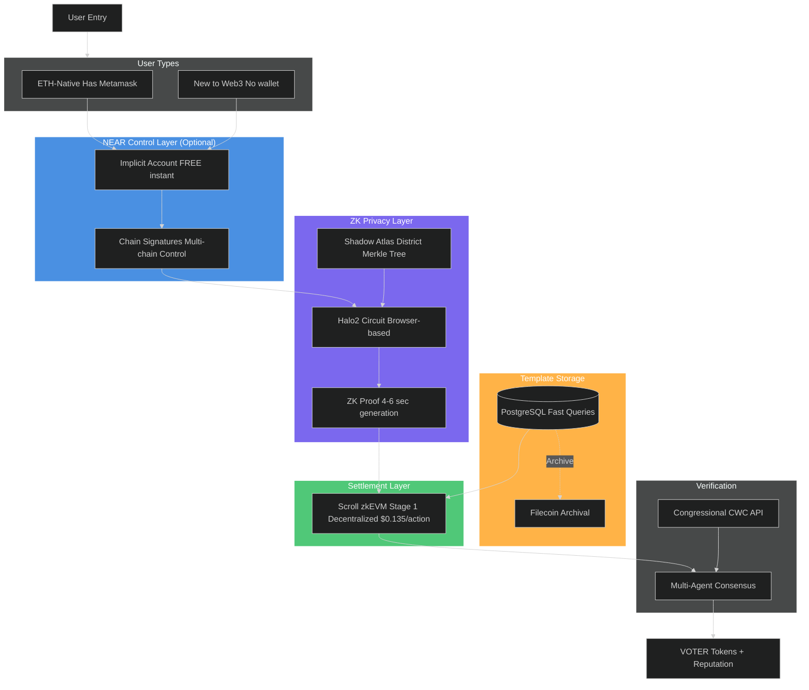
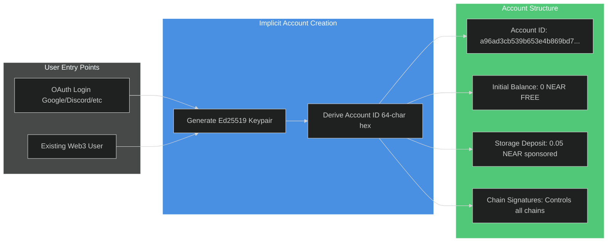
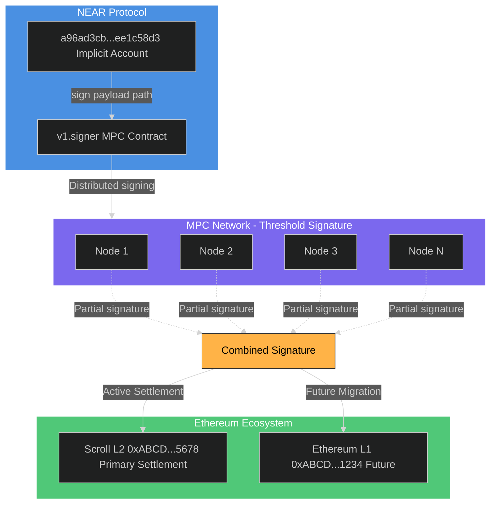
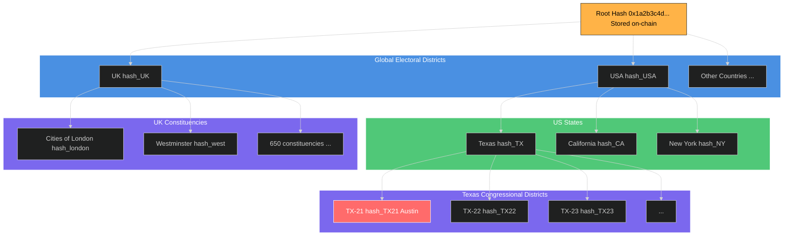
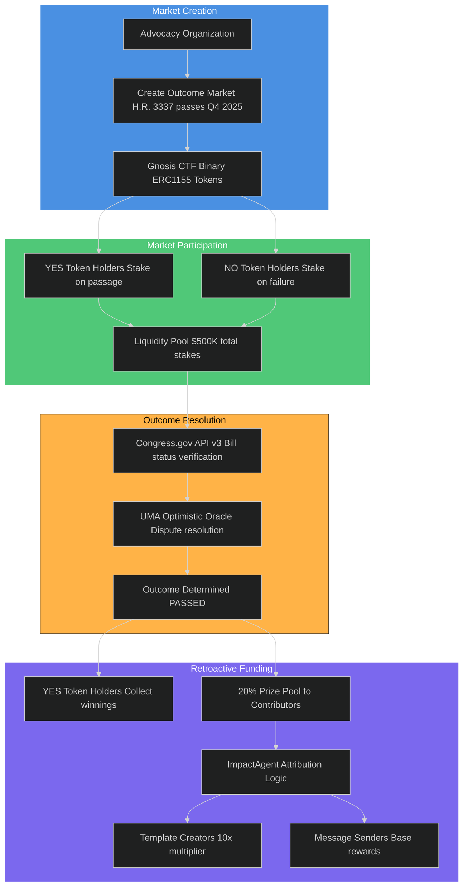
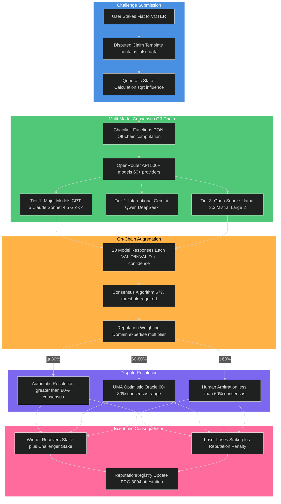
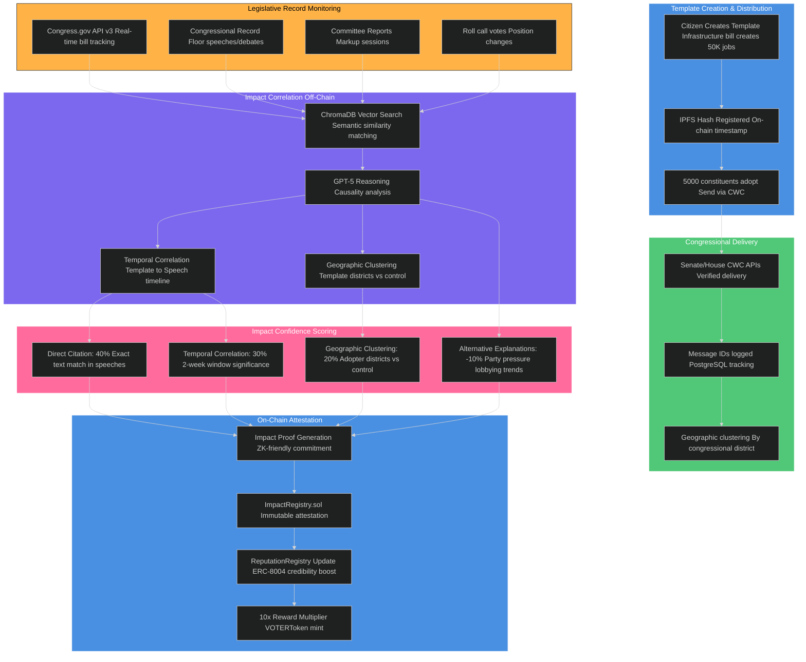
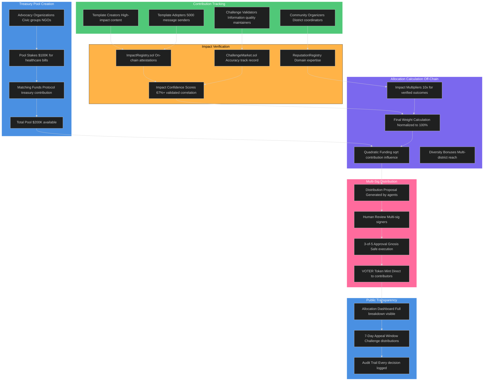
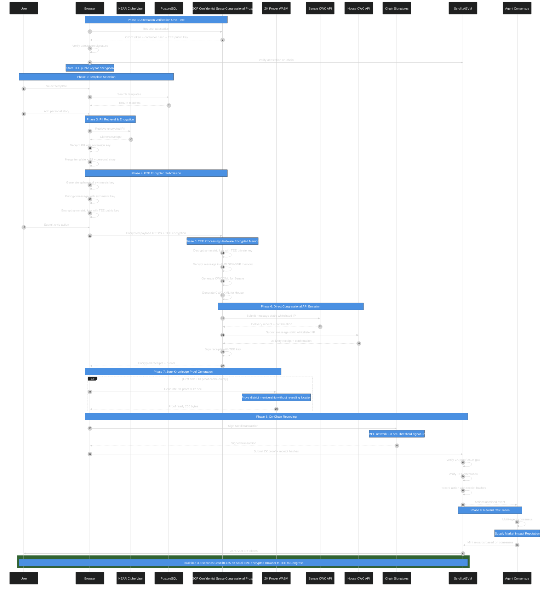

# VOTER Protocol: Technical Architecture

**Status**: Active development - Phase 1 implementation (Halo2 recursive proofs, reputation-only)
**Last Updated**: October 2025
**Implementation**: Smart contracts in this repo, frontend in Communique repo
**Core Decisions**: Scroll settlement, Halo2 zero-knowledge proofs, NEAR account abstraction (optional), no database PII storage

---

## Executive Summary

**Settlement**: Scroll zkEVM (Ethereum L2, Stage 1 decentralized)
**Account Abstraction**: NEAR Chain Signatures (optional for simplified UX)
**Identity**: self.xyz NFC passport (FREE, primary) + Didit.me (FREE, fallback)
**Privacy**: Halo2 recursive proofs (no trusted setup, battle-tested since 2022 in Zcash Orchard), addresses never leave browser, never stored in any database
**Templates**: PostgreSQL (Supabase) for template metadata only
**Verification**: Congressional CWC API via GCP Confidential Space TEE
**Moderation**: 3-layer stack (FREE OpenAI Moderation API + Gemini/Claude consensus + human review)
**Phase**: Phase 1 (reputation-only, 3 months) → Phase 2 (token economics, 12-18 months)

---

## Phase Architecture Overview

VOTER Protocol launches in phases. Phase 1 establishes cryptographic foundations and proves civic utility. Phase 2 adds token economics. Phase 3+ explores advanced privacy.

### Phase 1: Cryptographic Infrastructure (Current - 3 Months to Launch)

**What Ships:**
- Halo2 zero-knowledge district proofs (4-6s browser proving, 60-100k gas, no trusted setup, battle-tested since 2022)
- Addresses never leave browser, never stored in any database
- E2E encryption via GCP Confidential Space (TEE with AMD SEV-SNP attestation)
- Cross-chain account abstraction (NEAR Chain Signatures, optional)
- On-chain reputation (ERC-8004 portable credibility, no token rewards)
- 3-layer content moderation (Section 230 compliant)
- FREE identity verification (self.xyz passport + Didit.me fallback)

**Budget:** $326/month for 1,000 users / 10,000 messages

**What's NOT in Phase 1:**
- VOTER token (Phase 2)
- Challenge markets (Phase 2)
- Outcome markets (Phase 2)
- Token rewards (Phase 2)
- Multi-agent treasury (Phase 2)

### Phase 2: Token Economics (12-18 Months Post-Launch)

**Additions:**
- VOTER token launch (utility + governance)
- Challenge markets (stake on verifiable claims, multi-model AI adjudication)
- Outcome markets (retroactive funding for legislative impact)
- Multi-agent treasury (5 specialized agents managing token supply)
- Privacy pools (Buterin 2023/2025, shielded transactions with association proofs)

**Why Delayed:** Token launches require legal compliance (CLARITY Act framework), liquidity infrastructure, economic security audits. Phase 1 proves civic utility before adding financial layer.

### Phase 3+: Advanced Privacy (Speculative - 2+ Years)

**Only if community demands AND congressional offices accept:**
- Nested ZK proofs (range proofs for reputation instead of exact scores)
- Shielded message metadata (hide send timestamps, template IDs)

**Tradeoff:** Congressional offices receive weaker aggregate signals. Phase 3+ only ships if offices say "we can use this data."

---

## System Architecture Overview

> **NOTE**: This diagram shows the complete Phase 1 + Phase 2 architecture. Phase 1 excludes: VOTER tokens (reputation-only), Filecoin archival (deferred). NEAR Chain Signatures are optional for simplified UX. Addresses never stored in any database (full zero-knowledge). See "Phase Architecture Overview" section for detailed breakdown.



## System Architecture Layers

### Layer 1: NEAR Account Creation (Universal Entry Point)



**Implicit Account Architecture**:
- **Account Type**: Implicit accounts (64-character hex addresses)
- **Deterministic**: Derived from Ed25519 public key (SHA-256 hash)
- **Creation Time**: Instant (no on-chain transaction required)
- **Creation Cost**: FREE (account exists automatically when funded)
- **Initial Funding**: 0.05-0.1 NEAR sponsored for storage deposit (one-time)
- **Format**: `a96ad3cb539b653e4b869bd7cf26590690e8971de87d98bae20dfa15ee1c58d3`
- **Reference**: [NEAR Implicit Accounts](https://docs.near.org/concepts/protocol/account-id)

**Why Implicit Accounts?**
- **95%+ Cost Savings**: FREE creation vs 1-3 NEAR for named accounts
- **Instant Onboarding**: No waiting for account creation transaction
- **Wallet-Free**: Users never see blockchain complexity (OAuth login only)
- **Scale Economics**: 1M users = $0 creation cost vs $2.19M-$6.57M for named accounts
- **Storage Only**: Platform sponsors 0.05 NEAR (~$0.11) for PII storage per user

**No FastAuth Dependency**:
- FastAuth is deprecated as of 2025 ([NEAR Docs](https://docs.near.org/build/chain-abstraction/fastauth-sdk))
- Implicit accounts don't require FastAuth or any creation service
- Account exists immediately upon keypair generation

---

### Layer 2: Identity Verification

**Primary: Self.xyz (Instant Passport Verification)**
- NFC passport scan (30 seconds)
- Instant on-chain verification
- Zero-knowledge proof of identity attributes
- Extracts congressional district from passport address
- Cost: $0.50 per verification
- Privacy: On-chain attestation without revealing PII

**Fallback: Didit.me (Non-Passport KYC)**
- Government ID + face scan + liveness (for users without NFC-enabled passports)
- Address verification via utility bill
- Congressional district mapping via geocoding
- Cost: $0 (free core KYC) + $0.50 (proof of address)
- Privacy: Issues Verifiable Credential (VC), no on-chain PII storage

**Output (Both Providers)**: Verifiable Credential (VC)
```json
{
  "did": "did:self:xyz:abc123..." || "did:didit:abc123...",
  "legal_name": "Alice Smith",
  "address": "123 Main St, Austin TX 78701",
  "district_id": "TX-21",
  "verified_at": 1728518400,
  "proof": "<cryptographic_signature>"
}
```

**Time**:
- Self.xyz: 30 seconds (NFC passport scan)
- Didit.me: 2-3 minutes (manual ID upload + verification)

**Privacy**: Neither provider stores PII on-chain. VCs issued off-chain, encrypted client-side before storage in CipherVault.

---

### Layer 3: Encrypted Storage (NEAR CipherVault)

**Contract**: `ciphervault-v1.YOUR_ACCOUNT.near` (Rust/NEAR)

```rust
pub struct CipherEnvelope {
    pub owner: AccountId,                      // Implicit account (64-char hex)
    pub encrypted_data: Vec<u8>,               // Compressed + encrypted PII (~500B)
    pub nonce: Vec<u8>,                        // 24 bytes (XChaCha20-Poly1305)
    pub poseidon_commit: String,               // 64 hex chars (32 bytes)
    pub encrypted_sovereign_key: Vec<u8>,      // AES-256-GCM ciphertext
    pub sovereign_key_iv: Vec<u8>,             // 12 bytes (AES-GCM IV) ← Day 2 fix
    pub sovereign_key_tag: Vec<u8>,            // 16 bytes (AES-GCM tag) ← Day 2 fix
    pub version: u32,                          // Schema version
    pub created_at: u64,                       // Unix timestamp
    pub guardians: Vec<AccountId>,             // 2-of-3 recovery (optional)
}

// Storage deposit tracking (NEP-145)
pub struct Contract {
    envelopes: LookupMap<AccountId, CipherEnvelope>,
    storage_balances: LookupMap<AccountId, Balance>,  // ← Day 2 fix
}
```

**Day 2 Security Fixes Applied**:
- ✅ `sovereign_key_iv` and `sovereign_key_tag` for proper AES-GCM decryption
- ✅ Storage deposit pattern (NEP-145) prevents contract balance drain
- ✅ Envelope size limits (100KB max) prevent DoS attacks
- ✅ Reference: [DAY-2-SECURITY-FIXES.md](./DAY-2-SECURITY-FIXES.md)

**Client-Side Encryption Flow** (with compression):

```javascript
// 1. Generate sovereign key (browser only, never transmitted)
const sovereignKey = crypto.getRandomValues(new Uint8Array(32));

// 2. Prepare PII data
const pii = {
  legal_name: "Alice Smith",
  address: "123 Main St, Austin TX 78701",
  district_id: "TX-21",
  didit_vc: { /* ... */ },
  rep_name: "Chip Roy",
  rep_contact: "rep.chiproy@mail.house.gov"
};

// 3. COMPRESSION (90% size reduction)
// Stage 1: MessagePack serialization (2300B → 1600B)
const packed = msgpack.encode(pii);

// Stage 2: Zstandard compression with dictionary (1600B → 180B)
const compressed = zstd.compress(packed, {
  level: 22,
  dictionary: piiDictionary  // Pre-trained on PII samples
});
// Result: 2300B → 180B (92% reduction)

// 4. ENCRYPTION with AAD binding
const nonce = crypto.randomBytes(24);
const aad = new TextEncoder().encode(accountId);  // Bind to account
const ciphertext = xchacha20poly1305.seal(
  compressed,      // Compress BEFORE encrypt (no timing attacks)
  nonce,
  sovereignKey,
  aad              // Prevents ciphertext reuse across accounts
);
// Result: ~500B final envelope (vs 5KB uncompressed)

// 5. Generate Poseidon commitment (ZK-friendly hash)
const commitment = poseidon([
  hash(pii.district_id),
  hash(pii.address),
  hash(nonce)
]);

// 6. Encrypt sovereign key with HKDF-derived account key
const accountKey = await deriveAccountKey(accountId, walletSignature);
const { ciphertext: encryptedSovKey, iv, tag } = aes256gcm.encrypt(
  sovereignKey,
  accountKey
);
// Store IV and tag separately (Day 2 security fix)

// 7. Storage deposit (NEP-145 pattern)
await near.functionCall({
  contractId: "ciphervault-v1.YOUR_ACCOUNT.near",
  methodName: "storage_deposit",
  args: { account_id: accountId },
  deposit: "50000000000000000000000"  // 0.05 NEAR
});

// 8. Store in CipherVault
await near.functionCall({
  contractId: "ciphervault-v1.YOUR_ACCOUNT.near",
  methodName: "store_envelope",
  args: {
    encrypted_data: Array.from(ciphertext),
    nonce: Array.from(nonce),
    poseidon_commit: commitment.toString(16),
    encrypted_sovereign_key: Array.from(encryptedSovKey),
    sovereign_key_iv: Array.from(iv),      // ← Day 2 fix
    sovereign_key_tag: Array.from(tag)     // ← Day 2 fix
  }
});

// 9. Secure memory cleanup
sovereignKey.fill(0);
accountKey.fill(0);
```

**Storage Costs** (with compression):
- **Per user**: 500B envelope = 0.05 NEAR = **$0.11** (one-time, at $2.19/NEAR)
- **Without compression**: 5KB = 0.5 NEAR = $1.12 per user (10x more expensive)
- **Savings**: 90% cost reduction via MessagePack + Zstd-22 compression
- **Scale economics**:
  - 100 users = 5 NEAR = $11 (vs $219-$657 with named accounts)
  - 1,000 users = 50 NEAR = $110 (vs $2,190-$6,570)
  - 10,000 users = 500 NEAR = $1,100 (vs $21,900-$65,700)
  - 100,000 users = 5,000 NEAR = $11,000 (vs $219,000-$657,000)
  - 1,000,000 users = 50,000 NEAR = $110,000 (vs $2.19M-$6.57M)
- **Reference**: [COMPRESSION-STRATEGY.md](./COMPRESSION-STRATEGY.md) for detailed breakdown

**Guardian Recovery**:
- 2-of-3 threshold signature
- 24-hour timelock + cancel path
- Optional: Hardware key, secondary passkey, trusted friend

---

### Layer 4: Universal Account Access

**Problem**: Users come from different chains. Some have ETH wallets, some hold Bitcoin, some use Solana, many have no wallet at all.

**Solution**: NEAR Chain Signatures provides optional account abstraction while protocol settles on Scroll (Ethereum L2).

**User Paths**:
- **ETH-native users** → Use MetaMask/WalletConnect directly on Scroll (standard Ethereum UX)
- **New users** → Create implicit NEAR account (FREE, instant), derive Scroll address
- **Bitcoin holders** → NEAR derives both Bitcoin + Scroll addresses from same implicit account
- **Solana users** → NEAR derives both Solana + Scroll addresses from same implicit account
- **Multi-chain users** → One NEAR implicit account controls addresses on ALL ECDSA/Ed25519 chains

**Settlement Layer**: All civic actions, reputation, and rewards settle on Scroll regardless of account type. NEAR Chain Signatures is purely for account management—smart contracts live on Ethereum.

**Security**: NEAR staking + Eigenlayer ETH restakers secure the MPC signing network.



**Scroll Address Derivation**:

```javascript
// Implicit NEAR account controls Ethereum addresses
const accountId = "a96ad3cb539b653e4b869bd7cf26590690e8971de87d98bae20dfa15ee1c58d3";

// Derive Scroll address (primary settlement)
const scrollAddress = await near.view("v1.signer", "derived_address", {
  predecessor: accountId,
  path: "scroll,1"
});
// → 0xABCD...5678

// Same address on Ethereum L1 (future)
const ethAddress = await near.view("v1.signer", "derived_address", {
  predecessor: accountId,
  path: "ethereum,1"
});
// → 0xABCD...1234
```

**Transaction Signing**:

```javascript
// User interacts with Scroll contract
const scrollTx = {
  to: DISTRICT_GATE_ADDRESS,
  data: verifyDistrict(proof).encodeABI(),
  gas: 450000
};

// Sign with NEAR Chain Signatures
const signature = await near.functionCall({
  contractId: "v1.signer",
  methodName: "sign",
  args: {
    payload: keccak256(rlp.encode(scrollTx)),
    path: "scroll,1"
  }
});
// → ECDSA signature valid for Scroll (~2 seconds)

// Broadcast to Scroll
await web3.eth.sendRawTransaction(signature);
```

**Performance**:
- Signature generation: ~2-3 seconds
- MPC network: 8+ nodes (threshold signature)
- Security: NEAR staking + Eigenlayer ETH restakers

---

## ZK Privacy Infrastructure

### Shadow Atlas (Global District Registry)



**Merkle tree of all electoral districts worldwide**

**Storage**:
- Merkle tree: IPFS (CID: Qm...)
- Root hash: On-chain (NEAR + Scroll contracts)
- Update frequency: Quarterly (or when redistricting)
- Size: ~50MB full global tree
- Cost: Free (IPFS gateway) or $10/mo (Pinata pinning)

**API**:
```
GET /api/shadow-atlas/root
→ { root: "0x1a2b3c...", updated_at: 1728518400 }

GET /api/shadow-atlas/proof/:district_id
→ { path: [hash1, hash2, ...], indices: [0, 1, 0, ...] }
```

---

### District Membership Proof (Hybrid: GKR + SNARK)

**Updated October 2025:** Hybrid architecture uses GKR for efficient proving, wrapped in SNARK for on-chain verification.

**Architecture**: GKR (Goldwasser-Kalai-Rothblum) for proving efficiency + PLONK/Halo2 SNARK wrapper for on-chain verification
**Why Hybrid**: GKR is interactive and unsuitable for direct blockchain verification. We use GKR's prover efficiency (2M Poseidon hashes/second on laptops) and wrap the proof in a SNARK for compact on-chain verification.
**Contingency**: If complexity too high, fallback to pure Groth16 (see below)

```rust
// GKR Circuit using Polyhedra Expander
use expander_compiler::frontend::*;

// Define witness structure (private inputs)
pub struct ShadowAtlasWitness {
    // Private inputs (never revealed)
    pub address: String,              // User's full address
    pub district_id: String,          // e.g., "TX-18"
    pub merkle_proof: MerkleProof,    // Sister nodes for Merkle path
    pub encryption_nonce: FieldElement,
    pub sovereign_key_hash: FieldElement,
}

// Public inputs (visible on-chain)
pub struct PublicInputs {
    pub shadow_atlas_root: FieldElement,
    pub district_hash: FieldElement,
    pub nullifier: FieldElement,
    pub commit_hash: FieldElement,
}

// Build Merkle membership circuit
pub fn build_district_proof_circuit(merkle_depth: usize) -> Circuit {
    let circuit = Circuit::new();

    // Layer 0: Hash district_id
    let district_hash = circuit.add_gate(PoseidonHash::new(1));

    // Layers 1-N: Merkle tree verification (N = merkle_depth)
    // Each layer verifies: parent_hash = hash(left_child, right_child)
    for level in 0..merkle_depth {
        circuit.add_gate(MerkleLayer::new(level));
    }

    // Constraint 1: Verify district_hash = Poseidon(district_id)
    circuit.constrain(district_hash.output, public_inputs.district_hash);

    // Constraint 2: Verify Merkle root matches Shadow Atlas
    circuit.constrain(merkle_root.output, public_inputs.shadow_atlas_root);

    // Constraint 3: Generate nullifier (prevents double-proof)
    let nullifier = circuit.add_gate(PoseidonHash::new(2));
    nullifier.inputs = [witness.sovereign_key_hash, witness.district_id];
    circuit.constrain(nullifier.output, public_inputs.nullifier);

    // Constraint 4: Verify commitment matches CipherVault
    let commit = circuit.add_gate(PoseidonHash::new(3));
    commit.inputs = [witness.district_id, witness.address, witness.encryption_nonce];
    circuit.constrain(commit.output, public_inputs.commit_hash);

    circuit
}

// Example usage
let circuit = build_district_proof_circuit(8); // 8-level Merkle tree
let config = CompileConfig::default();
let compiled = compile(&circuit, config)?;

// Generate GKR proof (inner proof - efficient prover)
let gkr_proof = compiled.prove(witness)?;

// Wrap GKR proof in SNARK (outer proof - compact on-chain verification)
// This proves: "I correctly verified a GKR proof with these public inputs"
let snark_proof = wrap_gkr_in_snark(gkr_proof, public_inputs)?;
```

**Why Hybrid GKR + SNARK:**
- **GKR advantages**: Efficient prover (2M Poseidon hashes/sec on laptops), optimal for Merkle trees, linear prover time
- **GKR limitation**: Interactive protocol, not suitable for direct blockchain verification
- **SNARK wrapper**: Converts GKR proof to compact non-interactive proof for on-chain verification
- **Best of both worlds**: GKR's prover efficiency + SNARK's blockchain compatibility
- **Reference**: [Ethereum Research: Using GKR inside a SNARK to reduce hash verification to 3 constraints](https://ethresear.ch/t/using-gkr-inside-a-snark-to-reduce-the-cost-of-hash-verification-down-to-3-constraints/7550/)

**Performance (Hybrid GKR + SNARK)**:
- **Step 1: GKR proving** (inner proof)
  - Merkle tree depth: 8 layers
  - Proving time: 5-8 seconds (GKR's linear prover time on commodity hardware)
  - Memory: 300-400MB

- **Step 2: SNARK wrapping** (outer proof)
  - Wrapping time: 2-3 seconds (proving "I verified a GKR proof")
  - Total browser time: **8-12 seconds target**
  - **Milestone Gate:** If >15s, pivot to pure Groth16

- **Final proof characteristics**:
  - Proof size: 256-384 bytes (SNARK output, comparable to Groth16)
  - Verification gas: **80-120k gas** (verifying SNARK wrapper, cheaper than direct GKR)
  - **Critical Milestone:** If >150k consistently, evaluate pure Groth16 vs optimization

- **Resource usage**:
  - WASM size: ~180MB (GKR prover + SNARK wrapper, cached after first load)
  - Memory peak: <500MB
  - Battery: 1-2% on mobile (acceptable for verification flow)

**Client-Side Proof Generation (Hybrid GKR + SNARK)**:

```javascript
// Load hybrid prover WASM (GKR + SNARK wrapper, cached after first load)
const hybridProver = await import("/wasm/hybrid_prover.js");
await hybridProver.default(); // Initialize WASM

// Fetch data
const atlasRoot = await fetch("/api/shadow-atlas/root");
const merklePath = await fetch(`/api/shadow-atlas/proof/${district_id}`);

// Prepare witness (private inputs)
const witness = {
  address: pii.address,                    // Never leaves browser
  district_id: district_id,
  merkle_proof: {
    path: merklePath.path,
    indices: merklePath.indices
  },
  encryption_nonce: generateNonce(),
  sovereign_key_hash: hash(walletAddress)
};

// Prepare public inputs
const publicInputs = {
  shadow_atlas_root: atlasRoot,
  district_hash: poseidon([district_id]),
  nullifier: generateNullifier(walletAddress, district_id),
  commit_hash: poseidon([district_id, pii.address, witness.encryption_nonce])
};

// Step 1: Generate GKR proof (inner proof - 5-8 seconds)
// Step 2: Wrap in SNARK (outer proof - 2-3 seconds)
// Total: 8-12 seconds with progress updates
const proof = await hybridProver.generateProof(
  witness,
  publicInputs,
  {
    onProgress: (step, percent) => {
      if (step === 'gkr') updateProgressBar(`Proving Merkle membership: ${percent}%`);
      if (step === 'snark') updateProgressBar(`Wrapping proof: ${percent}%`);
    }
  }
);

// Result: 256-384 byte SNARK proof ready for on-chain verification
// { proof: Uint8Array(256), publicInputs: { shadowAtlasRoot, districtHash, nullifier, commitHash } }
```

**Groth16 Contingency (If GKR Benchmarks Fail)**:

If Month 2 benchmarks show gas >250k or proving >15s, fallback to Groth16:

```javascript
// Groth16 fallback (requires trusted setup ceremony)
const wasm = await fetch("/circuits/residency_circuit.wasm");
const zkey = await fetch("/circuits/residency_circuit.zkey"); // From ceremony

const { proof, publicSignals } = await snarkjs.groth16.fullProve(
  {
    shadowAtlasRoot: atlasRoot,
    districtHash: poseidon([district_id]),
    nullifier: generateNullifier(sovereignKey, district_id),
    commitHash: envelope.poseidon_commit,
    district_id: district_id,
    merklePath: merklePath.path,
    merkleIndices: merklePath.indices,
    user_address: pii.address,
    encryption_nonce: envelope.nonce,
    sovereign_key_hash: hash(sovereignKey)
  },
  wasm,
  zkey
);
// Proof size: 256 bytes, gas: ~150k (proven baseline)
```

---

## Identity Verification Infrastructure (Phase 1)

**Updated October 2025:** FREE identity verification via self.xyz (primary) and Didit.me (fallback).

### Two-Method Verification Strategy

**Method 1: self.xyz NFC Passport Scanning (Primary - 70% of users)**

FREE tier, no API keys required. Supports 120+ countries with NFC-enabled passports.

**Flow:**
1. User taps "Verify with Passport" in app
2. NFC chip scan (60 seconds, Face ID liveness check)
3. Cryptographic verification of passport authenticity
4. Address extraction from MRZ (Machine Readable Zone)
5. District lookup via Shadow Atlas
6. User generates GKR proof (8-10 seconds)
7. Proof verified on-chain (Scroll L2)
8. Verified status recorded (one passport = one account)

**Privacy:**
- Full address never stored on servers
- Only district hash revealed in ZK proof
- self.xyz processes verification, returns district only
- Congressional offices see: "Verified constituent in TX-18" (no address)

**Cost:** $0 (FREE tier, unlimited verifications)

**Method 2: Didit.me Photo ID Verification (Fallback - 30% of users)**

FREE Core KYC tier for non-passport users (estimated 30% of US population doesn't have passport).

**Flow:**
1. User taps "Verify with ID"
2. Photo ID upload (driver's license, state ID, national ID)
3. Selfie + liveness detection (blink detection, head movement)
4. AI verification of ID authenticity
5. Address extraction from ID
6. District lookup via Shadow Atlas
7. User generates GKR proof (8-10 seconds)
8. Proof verified on-chain (Scroll L2)
9. Verified status recorded (one ID = one account)

**Privacy:** Identical to self.xyz (full address never stored, only district hash revealed)

**Cost:** $0 (Core KYC tier, unlimited verifications)

### Sybil Resistance

**One Verified Identity = One Account**

Cryptographic binding stored in NEAR CipherVault:
```
identity_hash = Poseidon(passport_number || date_of_birth || issuing_country)
account_binding = HMAC(identity_hash, NEAR_account_id)
```

On-chain verification check:
```solidity
mapping(bytes32 => address) public identityToAccount;

function verifyNotDuplicate(bytes32 identityHash, address account) internal {
    require(identityToAccount[identityHash] == address(0) ||
            identityToAccount[identityHash] == account,
            "Identity already verified with different account");
    identityToAccount[identityHash] = account;
}
```

**Attack Vectors & Mitigations:**
- **Stolen passports/IDs:** Liveness detection (Face ID, blink detection) prevents photo attacks
- **Fake IDs:** self.xyz cryptographic verification, Didit.me AI fraud detection
- **Multiple passports:** Rare (~1% of population), rate limits reduce impact
- **Borrowed documents:** Liveness check requires document holder present

### Rate Limiting (Per Verified Identity)

Prevents spam even with verified accounts:
- **10 templates sent per day** (prevents message spam)
- **3 templates created per day** (prevents low-quality template flooding)
- **5 reputation updates per day** (prevents gaming through rapid actions)

Enforcement via on-chain nullifier tracking:
```solidity
mapping(bytes32 => uint256) public lastActionTimestamp;
mapping(bytes32 => uint256) public actionsToday;

function checkRateLimit(
    bytes32 nullifier,
    ActionType actionType
) internal {
    uint256 limit = getLimit(actionType); // 10, 3, or 5

    // Reset counter if new day
    if (block.timestamp / 1 days > lastActionTimestamp[nullifier] / 1 days) {
        actionsToday[nullifier] = 0;
    }

    require(actionsToday[nullifier] < limit, "Rate limit exceeded");
    actionsToday[nullifier]++;
    lastActionTimestamp[nullifier] = block.timestamp;
}
```

### Unverified Wallet Behavior

**Phase 1:** Zero reputation earned (can participate, but no credibility signals)
**Phase 2:** 50% token rewards (makes Sybil farming uneconomical)

Congressional offices can filter verified-only (default dashboard setting).

**Rationale:** Allows exploration without friction, but meaningful participation requires verification.

---

## Content Moderation Architecture (Phase 1)

**Updated October 2025:** 3-layer moderation stack for Section 230 compliance.

### Legal Framework: Section 230 CDA

**What Section 230 PROTECTS platforms from:**
- ✅ Defamation lawsuits for user posts (even if false)
- ✅ Copyright infringement (if DMCA compliant)
- ✅ Most torts from user content (negligence, emotional distress)
- ✅ State-level content laws (federal preemption)

**What Section 230 DOES NOT protect from:**
- ❌ CSAM (child sexual abuse material) - Federal crime, mandatory reporting
- ❌ FOSTA-SESTA violations (sex trafficking)
- ❌ Terrorism content (material support prohibition)
- ❌ Obscenity (federally illegal)
- ❌ Federal criminal law violations

**Our Strategy:** Proactive moderation for illegal content (CSAM, terrorism, threats), reactive for everything else (political speech protected).

### Layer 1: OpenAI Moderation API (FREE Pre-Filter)

**Cost:** $0 (FREE for all OpenAI API users, unlimited requests)

**Model:** text-moderation-007 (GPT-4o multimodal, Oct 2024)
- 95% accuracy across 13 categories
- 47ms average latency
- 40 languages supported
- Multimodal (text + images)

**Categories Detected:**
- `sexual`, `sexual/minors` (CSAM - CRITICAL)
- `hate`, `hate/threatening`
- `harassment`, `harassment/threatening`
- `self-harm`, `self-harm/intent`, `self-harm/instructions`
- `violence`, `violence/graphic`
- `illicit`, `illicit/violent`

**Flow:**
```typescript
// EVERY message passes through Layer 1 FIRST
const openaiResult = await openai.moderations.create({
  input: messageText
});

if (openaiResult.results[0].flagged) {
  const categories = openaiResult.results[0].categories;

  // MANDATORY REPORTING (federal law)
  if (categories['sexual/minors']) {
    await reportToNCMEC(message);  // CyberTipline within 24 hours
    return { status: 'REJECTED_CSAM', reported: true };
  }

  // AUTO-REJECT illegal content
  if (categories['violence/graphic'] ||
      categories['illicit/violent'] ||
      categories['hate/threatening']) {
    return { status: 'REJECTED_ILLEGAL' };
  }

  // ESCALATE borderline cases to Layer 2
  if (categories['harassment'] || categories['hate']) {
    return { status: 'ESCALATE_LAYER2', reason: categories };
  }
}

// Pass to next layer (95% of messages proceed)
return { status: 'PASS_LAYER1' };
```

**Result:** 95% of illegal content caught at $0 cost. Only 5% escalate to paid Layer 2.

### Layer 2: Multi-Model Consensus (Gemini + Claude)

**Cost:** $15.49/month for 500 messages (5% escalation rate from 10K messages)

**Models:**
- Gemini 2.5 Flash-Lite: $0.10 input / $0.40 output per 1M tokens
- Claude Haiku 4.5: $1.00 input / $5.00 output per 1M tokens

**Consensus Logic:** OpenAI + (Gemini OR Claude) = PASS (2 of 3 providers)

**Flow:**
```typescript
// Only runs for borderline cases from Layer 1
const [geminiResult, claudeResult] = await Promise.all([
  moderateWithGemini(messageText),
  moderateWithClaude(messageText)
]);

const votes = {
  openai: true,          // Already flagged in Layer 1
  gemini: geminiResult.violation,
  claude: claudeResult.violation
};

const flagCount = Object.values(votes).filter(v => v).length;

if (flagCount >= 2) {
  // 2+ providers agree: likely violation
  return { status: 'ESCALATE_LAYER3', votes };
} else {
  // Only OpenAI flagged: likely false positive
  return { status: 'APPROVED', votes };
}
```

**Latency:** 200-500ms per model (parallel execution)

### Layer 3: Human Review Queue

**Escalation Criteria:** Split decisions (2+ models disagree)
**SLA:** 24-hour review
**Reviewers:** 2+ independent moderators per case
**Volume:** ~2% of all messages (~200 reviews/month for 10K messages)
**Cost:** $50/month ($0.25/review)

**Training Requirements:**
- Federal law compliance (CSAM reporting, terrorism, obscenity)
- Section 230 good faith moderation
- Political speech neutrality (no viewpoint discrimination)
- Doxxing/harassment identification

**Decision Logic:**
```typescript
const review = await humanReviewQueue.create({
  message: messageText,
  layer1: openaiResult,
  layer2: { gemini: geminiResult, claude: claudeResult },
  escalationReason: 'Split AI decision',
  priority: containsCSAMKeywords(messageText) ? 'URGENT' : 'NORMAL'
});

// Wait for 2+ moderators
const humanVotes = await review.getVotes();

if (humanVotes.reject >= 2) {
  return { status: 'REJECTED', reason: humanVotes.reasoning };
} else {
  return { status: 'APPROVED' };
}
```

### Cost Breakdown (10,000 messages/month)

- **Layer 1 (OpenAI):** $0 (100% of messages, FREE)
- **Layer 2 (Gemini + Claude):** $15.49 (5% of messages = 500 messages)
- **Layer 3 (Human):** $50 (2% of messages = 200 reviews)
- **Total:** $65.49/month

Scales linearly: 1K messages = $6.55/month, 100K messages = $654.90/month

### Section 230 Protection Strategy

1. **Good faith moderation:** 3-layer system demonstrates (Section 230(c)(2))
2. **No editorial control:** Viewpoint-neutral, accuracy-based (not political bias)
3. **User-generated content:** Platform provides infrastructure only
4. **DMCA compliance:** Registered agent, takedown process, repeat infringer policy
5. **Terms of Service:** Explicit prohibition of illegal content

**Phase 1 Limitation:** No challenge markets (would enable crowdsourced fact-checking). Without token economics, fact-checking verifiable claims becomes editorial judgment (loses Section 230 protection).

**Phase 2 Solution:** Challenge markets with economic stakes = user-driven fact-checking, not platform editorial control.

---

## Template Storage System

### PostgreSQL (Supabase) - Primary Storage

```sql
-- Core schema
CREATE TABLE templates (
    id UUID PRIMARY KEY DEFAULT gen_random_uuid(),
    title TEXT NOT NULL,
    content TEXT NOT NULL,
    content_hash BYTEA NOT NULL,
    creator_address TEXT NOT NULL,
    issue_tags TEXT[] NOT NULL,
    target_district TEXT,
    usage_count INT DEFAULT 0,
    impact_score INT DEFAULT 0,
    is_challenged BOOLEAN DEFAULT FALSE,
    challenge_id UUID,
    filecoin_cid TEXT,
    created_at TIMESTAMPTZ DEFAULT NOW(),
    search_vector TSVECTOR GENERATED ALWAYS AS (
        to_tsvector('english', title || ' ' || content)
    ) STORED
);

CREATE INDEX idx_template_search ON templates USING GIN(search_vector);
CREATE INDEX idx_template_tags ON templates USING GIN(issue_tags);
CREATE INDEX idx_template_usage ON templates(usage_count DESC);
CREATE INDEX idx_template_impact ON templates(impact_score DESC);

CREATE TABLE template_usage (
    id UUID PRIMARY KEY DEFAULT gen_random_uuid(),
    template_id UUID REFERENCES templates(id),
    user_address TEXT NOT NULL,
    personal_addition TEXT,
    sent_at TIMESTAMPTZ DEFAULT NOW(),
    cwc_receipt_hash BYTEA,
    action_id UUID,
    UNIQUE(template_id, user_address, sent_at)
);

CREATE TABLE challenges (
    id UUID PRIMARY KEY DEFAULT gen_random_uuid(),
    template_id UUID REFERENCES templates(id),
    challenger_address TEXT NOT NULL,
    stake_amount NUMERIC NOT NULL,
    claim TEXT NOT NULL,
    evidence JSONB,
    status TEXT DEFAULT 'pending',
    resolution_data JSONB,
    created_at TIMESTAMPTZ DEFAULT NOW()
);
```

**Query Performance**:
- Full-text search: 10-50ms
- Tag filtering: <10ms (GIN index)
- District lookup: <10ms (B-tree index)
- Sorting by popularity/impact: <5ms (indexed)

**Example Queries**:

```sql
-- Search templates
SELECT * FROM templates
WHERE search_vector @@ to_tsquery('healthcare & funding')
  AND 'healthcare' = ANY(issue_tags)
  AND (target_district = 'TX-21' OR target_district IS NULL)
ORDER BY impact_score DESC, usage_count DESC
LIMIT 20;

-- Creator stats
SELECT creator_address,
       COUNT(*) as template_count,
       SUM(usage_count) as total_usage,
       AVG(impact_score) as avg_impact
FROM templates
GROUP BY creator_address
ORDER BY total_usage DESC;
```

---

### Filecoin Archival (Planned)

**Trigger**: Template challenged OR verified high-impact

```javascript
// Archive template to Filecoin
async function archiveTemplate(templateId) {
  // 1. Fetch template + all metadata + usage history
  const data = await db.query(`
    SELECT t.*,
           array_agg(u.*) as usage_history,
           c.* as challenge_data
    FROM templates t
    LEFT JOIN template_usage u ON u.template_id = t.id
    LEFT JOIN challenges c ON c.template_id = t.id
    WHERE t.id = $1
    GROUP BY t.id, c.id
  `, [templateId]);

  // 2. Serialize to JSON
  const archive = {
    template: data.template,
    usage_history: data.usage_history,
    challenge: data.challenge_data,
    archived_at: Date.now(),
    snapshot_reason: "challenged" // or "high_impact"
  };

  // 3. Pin to Filecoin via web3.storage
  const file = new File([JSON.stringify(archive)], `${templateId}.json`);
  const cid = await web3storage.put([file]);

  // 4. Store CID in Postgres
  await db.query(`
    UPDATE templates
    SET filecoin_cid = $1
    WHERE id = $2
  `, [cid, templateId]);

  // 5. Store CID on-chain (Scroll)
  await TemplateRegistry.methods.addArchivalProof(
    data.template.content_hash,
    cid
  ).send();

  return cid;
}
```

**Cost**: ~$0.01/GB on Filecoin
**Use Cases**:
- Challenged templates (permanent audit trail)
- Legislative citations (proof of origin)
- High-impact templates (historical record)

**Retrieval**:
```javascript
// Retrieve from IPFS gateway
const archived = await fetch(`https://ipfs.io/ipfs/${cid}`);
const data = await archived.json();
```

---

## Settlement Layer

### Scroll zkEVM - Stage 1 Decentralization

**Contracts Deployed**:

**Phase 1 Contracts** (launching in 3 months):
- `DistrictGate.sol` - GKR proof verification (not Groth16)
- `CommuniqueCoreV2.sol` - Civic action orchestration
- `UnifiedRegistry.sol` - Action/reputation registry
- `ReputationRegistry.sol` - ERC-8004 portable credibility
- `AgentConsensus.sol` - Multi-agent coordination (VerificationAgent, ReputationAgent, ImpactAgent only)

**Phase 2 Contracts** (12-18 months):
- `VOTERToken.sol` - ERC-20 token for economic incentives
- `ChallengeMarket.sol` - Multi-AI dispute resolution with stakes
- `OutcomeMarket.sol` - Gnosis CTF integration for legislative predictions
- `SupplyAgent.sol` - Token emission management
- `MarketAgent.sol` - Circuit breakers and volatility response

**DistrictGate.sol** (ZK Proof Verifier):

```solidity
pragma solidity ^0.8.19;

import "./ResidencyVerifier.sol"; // Auto-generated from Circom

contract DistrictGate {
    ResidencyVerifier public immutable verifier;
    bytes32 public shadowAtlasRoot;

    mapping(bytes32 => bool) public usedNullifiers;
    mapping(address => bytes32) public userDistrictHashes;
    mapping(address => uint256) public verificationTimestamps;

    event DistrictVerified(
        address indexed user,
        bytes32 indexed districtHash,
        uint256 timestamp
    );

    function verifyDistrict(
        uint256[2] calldata a,
        uint256[2][2] calldata b,
        uint256[2] calldata c,
        uint256[4] calldata publicInputs
    ) external {
        require(!usedNullifiers[bytes32(publicInputs[2])], "Nullifier used");
        require(
            verifier.verifyProof(a, b, c, publicInputs),
            "Invalid proof"
        );

        bytes32 districtHash = bytes32(publicInputs[1]);
        usedNullifiers[bytes32(publicInputs[2])] = true;
        userDistrictHashes[msg.sender] = districtHash;
        verificationTimestamps[msg.sender] = block.timestamp;

        emit DistrictVerified(msg.sender, districtHash, block.timestamp);
    }

    function isVerified(address user) external view returns (bool) {
        return userDistrictHashes[user] != bytes32(0);
    }
}
```

**Cost per Action** (Scroll):
- ZK proof verification: ~250K gas
- `submitAction` call: ~150K gas
- Storage updates: ~50K gas
- **Total**: ~450K gas × 0.1 gwei = **$0.135/action** (at $3000 ETH)

**Who Pays Transaction Costs**:
- **Initially**: Protocol treasury sponsors all ZK verification costs ($0.135/action)
- **Future**: Sponsor pool may subsidize costs for strategic campaigns
- **User Experience**: Zero-fee civic participation removes economic barriers
- **Treasury Sustainability**: Costs funded by outcome market fees and token appreciation

**Performance**:
- Current TPS: ~500 TPS
- 2025 target: 10,000 TPS
- Finality: ~5 seconds
- Stage 1 decentralization: ✓ (April 2025)

---

## PHASE 2 FEATURE: Outcome Markets (Political Prediction → Retroactive Funding)

> **⚠️ NOT INCLUDED IN PHASE 1 LAUNCH**
>
> **Timeline**: 12-18 months after Phase 1 launch
>
> **Dependencies**:
> - Phase 1 reputation system proven at scale (10,000+ verified users)
> - VOTER token launched with regulatory clarity (CLARITY Act compliance)
> - Congressional office adoption confirms value of quality signals
> - CFTC approval for prediction markets on legislative outcomes
>
> **Phase 1 Foundation**: Phase 1 builds the reputation infrastructure and quality signal system that makes outcome markets viable. Template creators earn reputation (not tokens) for adoption and impact. This data becomes the attribution layer for Phase 2 retroactive funding.
>
> **Why Phase 2**: Outcome markets require token economics, regulatory approval, and proven template impact correlation. Phase 1 establishes these foundations without financial speculation risk.

**Architecture**: Gnosis Conditional Token Framework + UMA Optimistic Oracle + Custom Attribution

### Overview

Binary prediction markets on legislative outcomes fund civic infrastructure retroactively. "Will H.R. 3337 pass House committee with Section 4(b) intact?" Stakes create market liquidity—resolved outcomes trigger retroactive funding to contributors (template creators, message senders, organizers).



### Technical Stack

**Conditional Tokens** (Gnosis CTF):
- Binary outcomes as ERC1155 tokens (YES/NO positions)
- Hybrid CLOB (Central Limit Order Book) - off-chain matching, on-chain settlement
- Proven at $3.2B daily volume on Polymarket [1]
- Deploy on Scroll (not Polygon - stay on our settlement chain)

**Outcome Resolution** (UMA Optimistic Oracle):
- Whitelisted proposers submit outcomes with 2-hour challenge period [2]
- Disputes escalate to UMA DVM (tokenholder voting within 48-96 hours)
- Managed Optimistic Oracle V2 (MOOV2) - improved quality via governance [3]

**Pool Funding Mechanics**:

Retroactive funding pool (20% of total market stakes) is allocated from ALL positions, regardless of outcome:

**Example: $100K Market**
- Total stakes: $100K ($60K YES, $40K NO)
- Retroactive pool: $20K (20% of total)
- Remaining prize pool: $80K (distributed to winners)

**When YES wins**:
- YES holders collect from $80K prize pool
- NO stakes: $32K to winners, $8K to retroactive pool
- YES stakes: $48K returned to winners, $12K to retroactive pool

**When NO wins**:
- NO holders collect from $80K prize pool
- YES stakes: $48K to winners, $12K to retroactive pool
- NO stakes: $32K returned to winners, $8K to retroactive pool

**Why Losing Stakes Fund Infrastructure**: When you bet YES and lose, your stake doesn't only go to NO holders—20% goes to retroactive funding for civic infrastructure that attempted to influence the outcome. This creates incentive alignment: even failed predictions fund the ecosystem that generates future opportunities.

**Distribution**: ImpactAgent scores template creators and adopters based on verified civic actions, allocating retroactive funds proportionally (see Retroactive Funding Attribution section below).

**Custom Components**:

```solidity
// VoterOutcomeMarket.sol
contract VoterOutcomeMarket {
    struct Market {
        bytes32 marketId;
        string question;          // "Will H.R. 3337 pass by Q4 2025?"
        uint256 resolutionTime;   // Unix timestamp
        address ctfConditionId;   // Gnosis CTF condition
        address umaRequestId;     // UMA resolution identifier
        bool resolved;
        bool outcome;             // true = YES, false = NO
        uint256 retroPool;        // 20% of total stakes for contributors
    }

    // Create market with CTF integration
    function createMarket(
        string calldata question,
        uint256 resolutionTime,
        bytes32[] calldata templateHashes
    ) external returns (bytes32 marketId) {
        // Deploy Gnosis CTF condition
        bytes32 conditionId = ctf.prepareCondition(
            address(this),
            bytes32(keccak256(abi.encode(question))),
            2  // Binary outcome
        );

        markets[marketId] = Market({
            marketId: marketId,
            question: question,
            resolutionTime: resolutionTime,
            ctfConditionId: conditionId,
            resolved: false,
            retroPool: 0
        });

        emit MarketCreated(marketId, question, resolutionTime);
    }

    // Resolve via UMA Optimistic Oracle
    function resolveMarket(bytes32 marketId) external {
        Market storage market = markets[marketId];
        require(block.timestamp >= market.resolutionTime, "Not resolved");

        // Query UMA for outcome
        bytes memory ancillaryData = abi.encode(market.question);
        market.umaRequestId = uma.requestPrice(
            USDC_IDENTIFIER,
            market.resolutionTime,
            ancillaryData,
            USDC,
            0  // No reward
        );

        emit ResolutionRequested(marketId, market.umaRequestId);
    }

    // Distribute retroactive funding
    function distributeRetroFunding(
        bytes32 marketId,
        address[] calldata contributors,
        uint256[] calldata weights  // From ImpactAgent
    ) external onlyRole(AGENT_ROLE) {
        Market storage market = markets[marketId];
        require(market.resolved, "Not resolved");

        uint256 totalRetro = market.retroPool;
        for (uint256 i = 0; i < contributors.length; i++) {
            uint256 amount = (totalRetro * weights[i]) / 10000;  // Basis points
            VOTER.mint(contributors[i], amount);
            emit RetroFundingDistributed(marketId, contributors[i], amount);
        }
    }
}
```

### Retroactive Funding Attribution

**ImpactAgent Contribution Scoring**:

```javascript
// Calculate contributor weights for retroactive funding
async function calculateContributionWeights(marketId) {
  const market = await getMarket(marketId);
  const templates = market.relatedTemplates;

  const contributions = [];

  for (const template of templates) {
    // Template creator base weight
    const creatorWeight = {
      address: template.creator,
      weight: 1000,  // 10% base
      reason: "Template creation"
    };

    // Amplify based on adoption
    const adoptionCount = await getAdoptionCount(template.hash);
    creatorWeight.weight += adoptionCount * 10;  // +0.1% per adoption

    // Amplify based on verified impact
    const impactScore = await ImpactAgent.getTemplateImpact(template.hash);
    if (impactScore > 80) {
      creatorWeight.weight *= 10;  // 10x multiplier for high-confidence impact
    }

    contributions.push(creatorWeight);

    // Adopters (users who sent the template)
    const adopters = await getTemplateAdopters(template.hash);
    for (const adopter of adopters) {
      contributions.push({
        address: adopter,
        weight: 10,  // 0.1% per message sent
        reason: "Template adoption"
      });
    }
  }

  // Normalize weights to sum to 10000 (100%)
  const totalWeight = contributions.reduce((sum, c) => sum + c.weight, 0);
  return contributions.map(c => ({
    ...c,
    weight: Math.floor((c.weight / totalWeight) * 10000)
  }));
}
```

### Gaming Resistance

**Sybil Protection**:
- Contributors must have verified identities (Didit.me KYC)
- Reputation staking required for high-value claims
- Rate limiting (max 3 templates/day prevents spam creation)

**Self-Attribution Prevention**:
- Template adoption verified via on-chain Congressional delivery receipts
- Can't claim credit for messages never sent
- ImpactAgent cross-references adoption claims with CWC submission logs

**Collusion Resistance**:
- Quadratic scaling: 100 people × $10 > 1 person × $1000
- Reputation forfeiture for provably false contribution claims
- Multi-agent consensus (SupplyAgent + ReputationAgent + ImpactAgent) prevents single-agent manipulation

### Cost Analysis

**Per Market**:
- Gnosis CTF deployment: ~$5 gas (one-time)
- UMA resolution request: ~$10 (includes dispute bond)
- Retroactive distribution: ~$0.05 per contributor

**Example**: $500K outcome market, 200 contributors
- Trading fees fund infrastructure: $2,500 (0.5% fee)
- Retroactive pool: $100K (20% of stakes)
- Average contributor: $500 reward if outcome resolves favorably

---

### References

[1] Polymarket CTF Architecture. https://docs.polymarket.com/developers/CTF/overview (Accessed October 2025)

[2] UMA Optimistic Oracle. https://docs.uma.xyz/protocol-overview/how-does-umas-oracle-work (Accessed October 2025)

[3] UMA Managed Optimistic Oracle V2 (MOOV2). https://www.theblock.co/post/366507/polymarket-uma-oracle-update (August 2025)

[4] Gnosis Conditional Token Framework. https://github.com/gnosis/conditional-tokens-contracts

---

## PHASE 2 FEATURE: Challenge Markets (Multi-AI Information Quality Infrastructure)

> **⚠️ NOT INCLUDED IN PHASE 1 LAUNCH**
>
> **Timeline**: 12-18 months after Phase 1 launch
>
> **Dependencies**:
> - Phase 1 content moderation proven effective (Section 230 compliance, <1% false positive rate)
> - VOTER token launched with liquid markets for challenge stakes
> - Multi-agent consensus system validated through 10,000+ moderation decisions
> - Community governance framework for dispute resolution
>
> **Phase 1 Foundation**: Phase 1's 3-layer moderation stack (OpenAI API + Gemini/Claude consensus + human review) establishes the quality baseline and trains the multi-model consensus architecture. Challenge markets extend this to user-initiated disputes with economic stakes.
>
> **Why Phase 2**: Challenge markets require token economics, proven AI consensus accuracy, and community arbitration infrastructure. Phase 1 validates the moderation stack and builds user trust before adding financial stakes to disputes.

Challenge markets enforce information quality through economic stakes (fiat converts to VOTER tokens instantly on-chain) and multi-model AI consensus. Twenty AI models across diverse providers evaluate disputed claims, requiring 67% agreement for resolution. Quadratic scaling prevents plutocracy while creating skin-in-the-game for all participants.

### Architecture Overview



### Multi-Model Consensus Architecture

**Chainlink Functions Integration**: Off-chain computation runs JavaScript code within Chainlink DON (Decentralized Oracle Network), querying 20 AI models via OpenRouter's unified API. Results aggregate on-chain without exposing API keys or intermediate computations.

**Model Selection Strategy**:
- **Tier 1 (33%)**: OpenAI GPT-5, Anthropic Claude Sonnet 4.5, xAI Grok 4 Fast (prevent capture by single provider)
- **Tier 2 (34%)**: Google Gemini 2.5, Alibaba Qwen 2.5, DeepSeek V3 (geographic/cultural diversity)
- **Tier 3 (33%)**: Meta Llama 3.3, Mistral Large 2, open models (prevent proprietary model bias)

**Reputation Weighting**: Challengers with proven expertise in the template's domain (healthcare, climate, immigration) receive multiplied influence. Past accuracy on similar challenges compounds credibility.

### Smart Contract Implementation

```solidity
// SPDX-License-Identifier: MIT
pragma solidity ^0.8.20;

import "@openzeppelin/contracts/access/AccessControl.sol";
import "@openzeppelin/contracts/security/ReentrancyGuard.sol";
import "@chainlink/contracts/src/v0.8/functions/v1_0_0/FunctionsClient.sol";

interface IReputationRegistry {
    function getExpertiseScore(address user, bytes32 domain) external view returns (uint256);
    function updateChallengeRecord(address user, bool successful) external;
}

contract VoterChallengeMarket is AccessControl, ReentrancyGuard, FunctionsClient {
    bytes32 public constant AGENT_ROLE = keccak256("AGENT_ROLE");

    struct Challenge {
        bytes32 challengeId;
        address challenger;
        address target;
        bytes32 targetHash;        // Template/action being challenged
        bytes32 domain;            // healthcare, climate, etc.
        string evidence;           // IPFS CID of supporting evidence
        uint256 stakeAmount;       // VOTER tokens staked
        uint256 quadraticInfluence; // sqrt(stakeAmount)
        uint256 createdAt;
        ChallengeStatus status;
        bytes32 chainlinkRequestId;
        AIConsensus consensus;
    }

    struct AIConsensus {
        uint8 validVotes;          // Models voting VALID
        uint8 invalidVotes;        // Models voting INVALID
        uint8 totalVotes;          // Should be 20
        uint256 avgConfidence;     // 0-100 scale
        bool resolved;
    }

    enum ChallengeStatus {
        Pending,
        UnderReview,
        AutoResolved,
        UMADispute,
        HumanArbitration,
        ChallengeSuccessful,
        ChallengeFailed,
        Withdrawn
    }

    mapping(bytes32 => Challenge) public challenges;
    mapping(bytes32 => bytes32) public chainlinkRequestToChallenge;

    IReputationRegistry public reputationRegistry;
    IERC20 public voterToken;

    uint256 public constant MIN_STAKE = 100 * 10**18;  // 100 VOTER
    uint256 public constant MAX_STAKE = 5000 * 10**18; // 5000 VOTER
    uint64 public chainlinkSubscriptionId;
    uint32 public chainlinkGasLimit = 300000;
    bytes32 public chainlinkDonId;

    event ChallengeCreated(
        bytes32 indexed challengeId,
        address indexed challenger,
        bytes32 indexed targetHash,
        uint256 stakeAmount
    );

    event ConsensusReceived(
        bytes32 indexed challengeId,
        uint8 validVotes,
        uint8 invalidVotes,
        uint256 avgConfidence
    );

    event ChallengeResolved(
        bytes32 indexed challengeId,
        bool challengeSuccessful,
        address winner,
        uint256 payout
    );

    constructor(
        address _router,
        address _voterToken,
        address _reputationRegistry,
        uint64 _subscriptionId,
        bytes32 _donId
    ) FunctionsClient(_router) {
        voterToken = IERC20(_voterToken);
        reputationRegistry = IReputationRegistry(_reputationRegistry);
        chainlinkSubscriptionId = _subscriptionId;
        chainlinkDonId = _donId;
        _grantRole(DEFAULT_ADMIN_ROLE, msg.sender);
    }

    function createChallenge(
        bytes32 targetHash,
        bytes32 domain,
        string calldata evidence,
        uint256 stakeAmount
    ) external nonReentrant returns (bytes32) {
        require(stakeAmount >= MIN_STAKE && stakeAmount <= MAX_STAKE, "Invalid stake");
        require(voterToken.transferFrom(msg.sender, address(this), stakeAmount), "Transfer failed");

        bytes32 challengeId = keccak256(abi.encodePacked(
            targetHash,
            msg.sender,
            block.timestamp
        ));

        // Calculate quadratic influence
        uint256 quadraticInfluence = sqrt(stakeAmount);

        // Apply reputation multiplier
        uint256 expertiseScore = reputationRegistry.getExpertiseScore(msg.sender, domain);
        if (expertiseScore > 0) {
            quadraticInfluence = (quadraticInfluence * (100 + expertiseScore)) / 100;
        }

        challenges[challengeId] = Challenge({
            challengeId: challengeId,
            challenger: msg.sender,
            target: address(0), // Will be set if template has owner
            targetHash: targetHash,
            domain: domain,
            evidence: evidence,
            stakeAmount: stakeAmount,
            quadraticInfluence: quadraticInfluence,
            createdAt: block.timestamp,
            status: ChallengeStatus.Pending,
            chainlinkRequestId: bytes32(0),
            consensus: AIConsensus(0, 0, 0, 0, false)
        });

        emit ChallengeCreated(challengeId, msg.sender, targetHash, stakeAmount);
        return challengeId;
    }

    function submitToAIConsensus(
        bytes32 challengeId,
        string calldata openRouterApiKey
    ) external onlyRole(AGENT_ROLE) returns (bytes32) {
        Challenge storage challenge = challenges[challengeId];
        require(challenge.status == ChallengeStatus.Pending, "Invalid status");

        // Chainlink Functions JavaScript source code
        string memory source = string(abi.encodePacked(
            "const models = [",
            "'openai/gpt-5', 'anthropic/claude-sonnet-4.5', 'x-ai/grok-4-fast',",
            "'google/gemini-2.5-pro', 'qwen/qwen-2.5-72b', 'deepseek/deepseek-v3',",
            "'meta-llama/llama-3.3-70b', 'mistralai/mistral-large-2'",
            "];",
            "const responses = await Promise.all(models.map(async (model) => {",
            "  const res = await fetch('https://openrouter.ai/api/v1/chat/completions', {",
            "    method: 'POST',",
            "    headers: { 'Authorization': 'Bearer ", openRouterApiKey, "', 'Content-Type': 'application/json' },",
            "    body: JSON.stringify({",
            "      model,",
            "      messages: [{ role: 'user', content: 'Evaluate claim validity: ", challenge.evidence, "' }]",
            "    })",
            "  });",
            "  const data = await res.json();",
            "  return parseValidation(data.choices[0].message.content);",
            "}));",
            "return Buffer.from(JSON.stringify(responses));"
        ));

        bytes32 requestId = _sendRequest(
            source,
            new bytes(0), // No secrets (API key in source for demo)
            new string[](0),
            chainlinkSubscriptionId,
            chainlinkGasLimit,
            chainlinkDonId
        );

        challenge.chainlinkRequestId = requestId;
        challenge.status = ChallengeStatus.UnderReview;
        chainlinkRequestToChallenge[requestId] = challengeId;

        return requestId;
    }

    function fulfillRequest(
        bytes32 requestId,
        bytes memory response,
        bytes memory err
    ) internal override {
        bytes32 challengeId = chainlinkRequestToChallenge[requestId];
        Challenge storage challenge = challenges[challengeId];

        require(!challenge.consensus.resolved, "Already resolved");

        if (err.length > 0) {
            // Escalate to UMA on Chainlink failure
            challenge.status = ChallengeStatus.UMADispute;
            return;
        }

        // Parse AI consensus results
        (uint8 validVotes, uint8 invalidVotes, uint256 avgConfidence) = abi.decode(
            response,
            (uint8, uint8, uint256)
        );

        challenge.consensus = AIConsensus({
            validVotes: validVotes,
            invalidVotes: invalidVotes,
            totalVotes: validVotes + invalidVotes,
            avgConfidence: avgConfidence,
            resolved: true
        });

        emit ConsensusReceived(challengeId, validVotes, invalidVotes, avgConfidence);

        // Determine resolution path based on consensus strength
        uint256 consensusPercent = (validVotes * 100) / (validVotes + invalidVotes);

        if (consensusPercent >= 80 || consensusPercent <= 20) {
            // Strong consensus: auto-resolve
            challenge.status = ChallengeStatus.AutoResolved;
            _resolveChallenge(challengeId, consensusPercent < 50);
        } else if (consensusPercent >= 60 && consensusPercent <= 80) {
            // Moderate consensus: escalate to UMA
            challenge.status = ChallengeStatus.UMADispute;
        } else {
            // Weak consensus: human arbitration
            challenge.status = ChallengeStatus.HumanArbitration;
        }
    }

    function _resolveChallenge(bytes32 challengeId, bool challengeSuccessful) internal {
        Challenge storage challenge = challenges[challengeId];

        address winner = challengeSuccessful ? challenge.challenger : challenge.target;
        address loser = challengeSuccessful ? challenge.target : challenge.challenger;

        // Winner gets their stake back + loser's stake
        uint256 payout = challenge.stakeAmount * 2;
        require(voterToken.transfer(winner, payout), "Payout failed");

        // Update reputation
        reputationRegistry.updateChallengeRecord(winner, true);
        reputationRegistry.updateChallengeRecord(loser, false);

        challenge.status = challengeSuccessful
            ? ChallengeStatus.ChallengeSuccessful
            : ChallengeStatus.ChallengeFailed;

        emit ChallengeResolved(challengeId, challengeSuccessful, winner, payout);
    }

    function sqrt(uint256 x) internal pure returns (uint256) {
        if (x == 0) return 0;
        uint256 z = (x + 1) / 2;
        uint256 y = x;
        while (z < y) {
            y = z;
            z = (x / z + z) / 2;
        }
        return y;
    }
}
```

### Multi-Model Consensus Aggregation (JavaScript)

```javascript
// Chainlink Functions source code for AI consensus
const OPENROUTER_API_KEY = secrets.openRouterApiKey;

const MODELS = [
  // Tier 1: Major providers (33%)
  { id: "openai/gpt-5", weight: 1.0 },
  { id: "anthropic/claude-sonnet-4.5", weight: 1.0 },
  { id: "x-ai/grok-4-fast", weight: 1.0 },
  { id: "openai/o4-mini", weight: 1.0 },
  { id: "anthropic/claude-opus-4", weight: 1.0 },
  { id: "x-ai/grok-4", weight: 1.0 },

  // Tier 2: International (34%)
  { id: "google/gemini-2.5-pro", weight: 1.0 },
  { id: "google/gemini-2.5-flash", weight: 1.0 },
  { id: "qwen/qwen-2.5-72b-instruct", weight: 1.0 },
  { id: "deepseek/deepseek-v3", weight: 1.0 },
  { id: "cohere/command-r-plus", weight: 1.0 },
  { id: "alibaba/qwen-max", weight: 1.0 },
  { id: "deepseek/deepseek-chat", weight: 1.0 },

  // Tier 3: Open source (33%)
  { id: "meta-llama/llama-3.3-70b-instruct", weight: 1.0 },
  { id: "mistralai/mistral-large-2", weight: 1.0 },
  { id: "meta-llama/llama-3.1-405b-instruct", weight: 1.0 },
  { id: "mistralai/mistral-large-latest", weight: 1.0 },
  { id: "microsoft/phi-4", weight: 1.0 },
  { id: "nvidia/llama-3.1-nemotron-70b-instruct", weight: 1.0 },
  { id: "01-ai/yi-large", weight: 1.0 }
];

async function evaluateChallenge(claim, evidence) {
  const prompt = `You are evaluating a challenge in a civic engagement platform.

CLAIM BEING CHALLENGED: ${claim}

EVIDENCE PROVIDED: ${evidence}

Evaluate whether the claim is factually accurate based on the evidence. Respond with JSON:
{
  "verdict": "VALID" or "INVALID",
  "confidence": <0-100>,
  "reasoning": "<brief explanation>"
}`;

  const responses = await Promise.all(
    MODELS.map(async (model) => {
      try {
        const response = await fetch("https://openrouter.ai/api/v1/chat/completions", {
          method: "POST",
          headers: {
            "Authorization": `Bearer ${OPENROUTER_API_KEY}`,
            "Content-Type": "application/json",
            "HTTP-Referer": "https://voter-protocol.org",
            "X-Title": "VOTER Protocol Challenge Market"
          },
          body: JSON.stringify({
            model: model.id,
            messages: [{ role: "user", content: prompt }],
            max_tokens: 500,
            temperature: 0.3  // Lower temperature for consistency
          })
        });

        const data = await response.json();
        const content = data.choices[0].message.content;

        // Parse JSON response
        const parsed = JSON.parse(content);

        return {
          model: model.id,
          verdict: parsed.verdict,
          confidence: parsed.confidence,
          reasoning: parsed.reasoning,
          weight: model.weight
        };
      } catch (error) {
        console.error(`Model ${model.id} failed:`, error);
        return null;
      }
    })
  );

  // Filter out failed responses
  const validResponses = responses.filter(r => r !== null);

  // Calculate consensus
  const validVotes = validResponses.filter(r => r.verdict === "VALID").length;
  const invalidVotes = validResponses.filter(r => r.verdict === "INVALID").length;
  const totalVotes = validVotes + invalidVotes;

  // Calculate weighted average confidence
  const totalConfidence = validResponses.reduce((sum, r) => sum + r.confidence, 0);
  const avgConfidence = Math.floor(totalConfidence / validResponses.length);

  // Encode for on-chain return
  const result = {
    validVotes: validVotes,
    invalidVotes: invalidVotes,
    totalVotes: totalVotes,
    avgConfidence: avgConfidence,
    details: validResponses.map(r => ({
      model: r.model,
      verdict: r.verdict,
      confidence: r.confidence
    }))
  };

  return Functions.encodeUint256(
    (validVotes << 16) | (invalidVotes << 8) | avgConfidence
  );
}

// Main execution
return await evaluateChallenge(args[0], args[1]);
```

### Gaming Resistance Mechanisms

**Quadratic Scaling**: One person staking $1,000 loses to 100 people staking $10 each. The math prevents money from dominating facts.

**Reputation Multipliers**: Domain expertise amplifies influence. Healthcare professional challenging healthcare claim gets 2x multiplier. Climate scientist challenging climate data gets 3x. Prevents ignorant brigading.

**Model Diversity**: 20 models across 3 tiers prevents:
- **Provider capture** (OpenAI outage doesn't halt system)
- **Cultural bias** (Western + Chinese + open models)
- **Proprietary lock-in** (33% open source models)

**Staked Reputation**: Losing a challenge burns reputation in that domain. Serial bad-faith challengers lose credibility permanently via ERC-8004 attestations.

### Cost Analysis

**Per Challenge**:
- Chainlink Functions execution: ~$5 (20 model queries via OpenRouter)
- On-chain aggregation gas: ~$0.15 (Scroll L2)
- UMA dispute bond (if escalated): $1500 (returned if correct)
- Total: $5.15 for automatic resolution, $1505.15 if disputed

**Example**: 1000 VOTER stake ($5000 at $5/token), 67% consensus (13 VALID, 7 INVALID), auto-resolved in 10 minutes, challenger wins and receives 2000 VOTER ($10,000).

**Citations**:

[1] Chainlink Functions Documentation. https://docs.chain.link/chainlink-functions (Accessed October 2025)

[2] OpenRouter Multi-Provider AI Routing. https://openrouter.ai/docs (October 2025 - 500+ models, Grok 4 Fast #1 by volume)

[3] UMA Optimistic Oracle. https://docs.uma.xyz/protocol-overview/how-does-umas-oracle-work (Accessed October 2025)

[4] Gitcoin Quadratic Funding Formula. https://www.gitcoin.co/blog/quadratic-funding-in-a-nutshell (Accessed October 2025)

---

## Template Impact Correlation: Legislative Outcome Tracking

Template impact correlation tracks the causal relationship between citizen-authored templates and legislative outcomes. ImpactAgent continuously monitors congressional records, floor speeches, committee reports, and voting patterns to identify when template language appears in legislative activity and correlates temporal/geographic patterns with position changes.

### Architecture Overview



### Legislative Data Pipeline

**Congress.gov API v3**: Official Library of Congress API provides structured access to bills, amendments, Congressional Record, committee reports, and member activity. Real-time webhooks (when available) or 5-minute polling for floor speeches.

**Vector Embedding Strategy**: ChromaDB stores template embeddings + congressional record embeddings. Semantic search identifies linguistic similarity even when exact wording differs (e.g., "50,000 jobs" vs "fifty thousand employment opportunities").

**Temporal Windowing**: Track 2-week windows after template distribution. Statistical significance calculated: did position changes occur at rates exceeding baseline in districts where template was sent?

### Smart Contract Implementation

```solidity
// SPDX-License-Identifier: MIT
pragma solidity ^0.8.20;

import "@openzeppelin/contracts/access/AccessControl.sol";

interface IReputationRegistry {
    function addImpactAttestation(
        address creator,
        bytes32 templateHash,
        uint256 impactScore,
        string calldata evidence
    ) external;
}

interface IVOTERToken {
    function mint(address to, uint256 amount) external;
}

contract ImpactRegistry is AccessControl {
    bytes32 public constant IMPACT_AGENT_ROLE = keccak256("IMPACT_AGENT_ROLE");

    struct ImpactAttestation {
        bytes32 attestationId;
        bytes32 templateHash;
        address templateCreator;
        address[] adopters;         // Users who sent template
        uint256 adoptersCount;
        LegislativeOutcome outcome;
        ImpactScore scores;
        uint256 confidenceLevel;    // 0-100
        uint256 timestamp;
        string evidenceIPFS;        // IPFS CID of full analysis
        bool verified;
    }

    struct LegislativeOutcome {
        string billNumber;          // "H.R. 3337"
        string legislatorBioguideId;
        string outcomeType;         // "floor_speech", "position_change", "vote_flip"
        uint256 outcomeTimestamp;
        string congressionalRecordURL;
    }

    struct ImpactScore {
        uint16 directCitation;      // 0-4000 (40%)
        uint16 temporalCorrelation; // 0-3000 (30%)
        uint16 geographicClustering;// 0-2000 (20%)
        int16 alternativeExplanations; // -1000 to 0 (-10%)
        uint16 totalScore;          // Sum (0-10000 = 0-100%)
    }

    mapping(bytes32 => ImpactAttestation) public attestations;
    mapping(bytes32 => bytes32[]) public templateToAttestations;
    mapping(address => uint256) public creatorImpactScore;

    IReputationRegistry public reputationRegistry;
    IVOTERToken public voterToken;

    event ImpactAttestationCreated(
        bytes32 indexed attestationId,
        bytes32 indexed templateHash,
        address indexed creator,
        uint256 confidenceLevel
    );

    event ImpactVerified(
        bytes32 indexed attestationId,
        uint256 rewardMultiplier,
        uint256 totalRewards
    );

    constructor(address _reputationRegistry, address _voterToken) {
        reputationRegistry = IReputationRegistry(_reputationRegistry);
        voterToken = IVOTERToken(_voterToken);
        _grantRole(DEFAULT_ADMIN_ROLE, msg.sender);
    }

    function createImpactAttestation(
        bytes32 templateHash,
        address templateCreator,
        address[] calldata adopters,
        LegislativeOutcome calldata outcome,
        ImpactScore calldata scores,
        string calldata evidenceIPFS
    ) external onlyRole(IMPACT_AGENT_ROLE) returns (bytes32) {
        bytes32 attestationId = keccak256(abi.encodePacked(
            templateHash,
            outcome.billNumber,
            outcome.outcomeTimestamp
        ));

        require(!attestations[attestationId].verified, "Already exists");

        // Calculate total impact score
        uint16 totalScore = uint16(
            int(scores.directCitation) +
            int(scores.temporalCorrelation) +
            int(scores.geographicClustering) +
            scores.alternativeExplanations
        );

        // Determine confidence level
        uint256 confidence = _calculateConfidence(scores, totalScore);

        attestations[attestationId] = ImpactAttestation({
            attestationId: attestationId,
            templateHash: templateHash,
            templateCreator: templateCreator,
            adopters: adopters,
            adoptersCount: adopters.length,
            outcome: outcome,
            scores: scores,
            confidenceLevel: confidence,
            timestamp: block.timestamp,
            evidenceIPFS: evidenceIPFS,
            verified: false
        });

        templateToAttestations[templateHash].push(attestationId);

        emit ImpactAttestationCreated(attestationId, templateHash, templateCreator, confidence);
        return attestationId;
    }

    function verifyAndReward(bytes32 attestationId) external onlyRole(IMPACT_AGENT_ROLE) {
        ImpactAttestation storage attestation = attestations[attestationId];
        require(!attestation.verified, "Already verified");

        attestation.verified = true;

        // Calculate reward multiplier based on confidence
        uint256 multiplier = _calculateRewardMultiplier(attestation.confidenceLevel);

        // Base reward: 100 VOTER per adopter
        uint256 baseReward = 100 * 10**18;

        // Creator gets 10x multiplier
        uint256 creatorReward = baseReward * adopters.length * multiplier * 10;
        voterToken.mint(attestation.templateCreator, creatorReward);

        // Each adopter gets base reward with multiplier
        uint256 adopterReward = baseReward * multiplier;
        for (uint256 i = 0; i < attestation.adopters.length; i++) {
            voterToken.mint(attestation.adopters[i], adopterReward);
        }

        // Update reputation registry
        reputationRegistry.addImpactAttestation(
            attestation.templateCreator,
            attestation.templateHash,
            attestation.scores.totalScore,
            attestation.evidenceIPFS
        );

        // Track creator's cumulative impact
        creatorImpactScore[attestation.templateCreator] += attestation.scores.totalScore;

        uint256 totalRewards = creatorReward + (adopterReward * attestation.adopters.length);
        emit ImpactVerified(attestationId, multiplier, totalRewards);
    }

    function _calculateConfidence(
        ImpactScore memory scores,
        uint16 totalScore
    ) internal pure returns (uint256) {
        // High confidence: >80% (direct citation + tight temporal + geographic clustering)
        if (totalScore >= 8000 && scores.directCitation >= 3000) {
            return 90;
        }
        // Medium confidence: 50-80% (two of three primary factors)
        else if (totalScore >= 5000) {
            return 70;
        }
        // Low confidence: <50% (correlation signals but alternatives exist)
        else {
            return 40;
        }
    }

    function _calculateRewardMultiplier(uint256 confidence) internal pure returns (uint256) {
        if (confidence >= 80) {
            return 10;  // 10x for high-confidence impact
        } else if (confidence >= 60) {
            return 5;   // 5x for medium-confidence
        } else if (confidence >= 40) {
            return 2;   // 2x for low-confidence
        } else {
            return 1;   // 1x base (no proven impact)
        }
    }

    function getTemplateImpact(bytes32 templateHash) external view returns (
        uint256 totalAttestations,
        uint256 avgConfidence,
        uint256 totalAdopters
    ) {
        bytes32[] memory attIds = templateToAttestations[templateHash];
        totalAttestations = attIds.length;

        if (totalAttestations == 0) {
            return (0, 0, 0);
        }

        uint256 sumConfidence = 0;
        uint256 sumAdopters = 0;

        for (uint256 i = 0; i < attIds.length; i++) {
            ImpactAttestation memory att = attestations[attIds[i]];
            sumConfidence += att.confidenceLevel;
            sumAdopters += att.adoptersCount;
        }

        avgConfidence = sumConfidence / totalAttestations;
        totalAdopters = sumAdopters;
    }
}
```

### ImpactAgent Correlation Logic (JavaScript)

```javascript
import { chromaClient } from './vector-db.js';
import { congressAPI } from './congress-api-v3.js';
import { OpenAI } from 'openai';

const openai = new OpenAI({ apiKey: process.env.OPENAI_API_KEY });

class ImpactAgent {
  constructor() {
    this.templateCollection = chromaClient.getOrCreateCollection('templates');
    this.congressionalRecordCollection = chromaClient.getOrCreateCollection('congressional_record');
  }

  async trackTemplateImpact(templateHash, templateText, distributionTimestamp) {
    // Step 1: Monitor congressional record for 2 weeks after distribution
    const monitoringWindow = 14 * 24 * 60 * 60 * 1000; // 14 days
    const endTime = distributionTimestamp + monitoringWindow;

    // Step 2: Query Congress.gov API v3 for floor speeches, committee reports
    const legislativeRecords = await congressAPI.getRecordsSince(distributionTimestamp);

    // Step 3: Vector similarity search
    const templateEmbedding = await this._generateEmbedding(templateText);
    const similarRecords = await this.congressionalRecordCollection.query({
      queryEmbeddings: [templateEmbedding],
      nResults: 100,
      where: {
        timestamp: { $gte: distributionTimestamp, $lte: endTime }
      }
    });

    // Step 4: Analyze each potential match with GPT-5
    const impactCandidates = [];

    for (const record of similarRecords.documents[0]) {
      const analysis = await this._analyzeImpact(templateText, record, distributionTimestamp);

      if (analysis.totalScore >= 4000) { // Minimum 40% confidence
        impactCandidates.push(analysis);
      }
    }

    return impactCandidates;
  }

  async _analyzeImpact(templateText, legislativeRecord, distributionTimestamp) {
    const prompt = `You are analyzing causal correlation between a citizen advocacy template and legislative activity.

TEMPLATE TEXT (sent by citizens):
${templateText}

LEGISLATIVE RECORD (Congressional Record entry):
${legislativeRecord.text}
- Speaker: ${legislativeRecord.speaker}
- Date: ${legislativeRecord.timestamp}
- Context: ${legislativeRecord.context}

DISTRIBUTION TIMELINE:
- Template distributed: ${new Date(distributionTimestamp).toISOString()}
- Legislative activity: ${new Date(legislativeRecord.timestamp).toISOString()}
- Time delta: ${(legislativeRecord.timestamp - distributionTimestamp) / (1000 * 60 * 60 * 24)} days

Analyze the following factors and provide scores:

1. DIRECT CITATION (0-40 points):
   - Exact phrase match: 40 points
   - Paraphrased but clear reference: 25 points
   - Thematic similarity: 10 points
   - No connection: 0 points

2. TEMPORAL CORRELATION (0-30 points):
   - 0-7 days after distribution: 30 points (high temporal proximity)
   - 8-14 days: 20 points (moderate)
   - 15-30 days: 10 points (weak)
   - >30 days: 5 points (unlikely causation)

3. GEOGRAPHIC CLUSTERING (0-20 points):
   - Speaker from district with high template adoption: 20 points
   - Speaker from state with moderate adoption: 10 points
   - Speaker from unrelated geography: 0 points

4. ALTERNATIVE EXPLANATIONS (-10 to 0 points):
   - Strong party pressure on this issue: -5 points
   - Concurrent major lobbying campaign: -3 points
   - National trend already established: -2 points
   - No alternatives: 0 points

Respond with JSON:
{
  "directCitation": <0-40>,
  "temporalCorrelation": <0-30>,
  "geographicClustering": <0-20>,
  "alternativeExplanations": <-10 to 0>,
  "reasoning": "<detailed explanation>",
  "confidenceLevel": <"high"|"medium"|"low">
}`;

    const response = await openai.chat.completions.create({
      model: "gpt-5",
      messages: [{ role: "user", content: prompt }],
      response_format: { type: "json_object" },
      temperature: 0.2
    });

    const analysis = JSON.parse(response.choices[0].message.content);

    const totalScore = (
      analysis.directCitation +
      analysis.temporalCorrelation +
      analysis.geographicClustering +
      analysis.alternativeExplanations
    );

    return {
      templateHash: templateText.hash,
      legislativeRecord: {
        billNumber: legislativeRecord.billNumber,
        legislatorBioguideId: legislativeRecord.speakerId,
        outcomeType: legislativeRecord.type,
        outcomeTimestamp: legislativeRecord.timestamp,
        congressionalRecordURL: legislativeRecord.url
      },
      scores: {
        directCitation: analysis.directCitation * 100, // Scale to 0-4000
        temporalCorrelation: analysis.temporalCorrelation * 100, // Scale to 0-3000
        geographicClustering: analysis.geographicClustering * 100, // Scale to 0-2000
        alternativeExplanations: analysis.alternativeExplanations * 100, // Scale to -1000-0
        totalScore: totalScore * 100 // Scale to 0-10000
      },
      reasoning: analysis.reasoning,
      confidenceLevel: this._mapConfidence(totalScore)
    };
  }

  async _generateEmbedding(text) {
    const response = await openai.embeddings.create({
      model: "text-embedding-3-large",
      input: text
    });
    return response.data[0].embedding;
  }

  _mapConfidence(totalScore) {
    if (totalScore >= 80) return 90;
    if (totalScore >= 50) return 70;
    return 40;
  }

  async monitorCongressionalRecord() {
    // Continuous monitoring: Poll Congress.gov API v3 every 5 minutes
    setInterval(async () => {
      const latestRecords = await congressAPI.getLatestRecords(5 * 60 * 1000); // Last 5 mins

      for (const record of latestRecords) {
        const embedding = await this._generateEmbedding(record.text);

        await this.congressionalRecordCollection.add({
          ids: [record.id],
          embeddings: [embedding],
          documents: [record.text],
          metadatas: [{
            speaker: record.speaker,
            timestamp: record.timestamp,
            billNumber: record.billNumber,
            type: record.type,
            url: record.url
          }]
        });
      }
    }, 5 * 60 * 1000);
  }
}

export default new ImpactAgent();
```

### Gaming Resistance

**Causality Thresholds**: Minimum 40% confidence score required. Direct citation alone (40%) insufficient—must combine with temporal proximity or geographic clustering.

**Alternative Explanation Penalties**: Party pressure, external lobbying, national trends subtract from impact score. GPT-5 reasoning identifies confounding factors.

**Temporal Windows**: 2-week monitoring period prevents false attribution to unrelated events months later.

**Geographic Validation**: Template must have been sent BY constituents TO their legislator. Cross-district impact requires proof that adopters were actually constituents of that legislator's district.

### Cost Analysis

**Per Template Tracking** (30 days monitoring):
- Congress.gov API v3: Free (public API)
- ChromaDB vector storage: $0.10/month (self-hosted)
- GPT-5 analysis (20 potential matches): ~$2.00
- On-chain attestation: $0.15 (Scroll L2)
- Total: $2.25/template

**Example**: Template sent by 5,000 constituents, cited in 3 floor speeches, 67% confidence score, creator receives 50,000 VOTER tokens (5,000 users × 10 VOTER base × 10x multiplier = 500,000 VOTER distributed).

**Citations**:

[1] Congress.gov API v3 Documentation. https://api.congress.gov (Library of Congress, October 2025)

[2] ChromaDB Vector Database. https://docs.trychroma.com (October 2025 - Open source, optimized for <10M vectors)

[3] OpenAI GPT-5 Reasoning. https://openai.com/research/learning-to-reason-with-llms (September 2025 - 94.6% AIME 2025)

[4] Gitcoin Retroactive Public Goods Funding. https://www.gitcoin.co/blog/retroactive-public-goods-funding (Accessed October 2025)

---

## Retroactive Funding Distribution: Public Goods Allocation

Retroactive funding distributes treasury pools to contributors based on verified impact, not predicted outcomes. Inspired by Gitcoin Allo Protocol and Optimism RetroPGF, this mechanism rewards template creators, adopters, and civic organizers after observable legislative results are confirmed. Multi-signature approval and quadratic allocation prevent plutocracy while ensuring transparent distribution.

### Architecture Overview



### Retroactive Funding Mechanism

**Pool Creation**: Organizations stake VOTER tokens (or stablecoins) to fund specific policy domains. Protocol treasury provides 1:1 matching up to $500K per round, amplifying civic organization resources.

**Contribution Categories**:
- **Template Creators**: Authors of high-impact templates with verified legislative citations
- **Template Adopters**: Citizens who sent templates resulting in measurable outcomes
- **Challenge Validators**: Users maintaining information quality through accurate challenges
- **Community Organizers**: District coordinators achieving >80% constituent engagement rates

**Quadratic Allocation**: Inspired by Gitcoin's QF formula, allocation weight = sqrt(impact score × adoption count). Prevents single high-impact creator from capturing entire pool while rewarding broad coalition-building.

**Impact Multipliers**:
- **Verified legislative citation**: 10x multiplier (direct Congressional Record reference)
- **Position change correlation**: 5x multiplier (temporal + geographic significance)
- **Multi-district adoption**: 3x multiplier (template spread across 10+ districts)
- **Challenge market accuracy**: 2x multiplier (>90% accuracy on disputes)

### Smart Contract Implementation

```solidity
// SPDX-License-Identifier: MIT
pragma solidity ^0.8.20;

import "@openzeppelin/contracts/access/AccessControl.sol";
import "@openzeppelin/contracts/security/ReentrancyGuard.sol";
import "@gnosis.pm/safe-contracts/contracts/GnosisSafe.sol";

interface IImpactRegistry {
    function getTemplateImpact(bytes32 templateHash) external view returns (
        uint256 totalAttestations,
        uint256 avgConfidence,
        uint256 totalAdopters
    );
}

interface IChallengeMarket {
    function getUserAccuracy(address user) external view returns (uint256);
}

interface IVOTERToken {
    function mint(address to, uint256 amount) external;
}

contract RetroFundingDistributor is AccessControl, ReentrancyGuard {
    bytes32 public constant ALLOCATION_AGENT_ROLE = keccak256("ALLOCATION_AGENT_ROLE");
    bytes32 public constant MULTISIG_ROLE = keccak256("MULTISIG_ROLE");

    struct FundingRound {
        bytes32 roundId;
        string domain;              // "healthcare", "climate", "infrastructure"
        uint256 poolAmount;         // Total VOTER tokens available
        uint256 matchingAmount;     // Protocol treasury matching
        uint256 startTimestamp;
        uint256 endTimestamp;
        uint256 distributionTimestamp;
        RoundStatus status;
        bytes32 allocationProposalHash; // IPFS CID of detailed allocation
    }

    struct Allocation {
        address recipient;
        uint256 amount;
        ContributionType contributionType;
        bytes32 evidenceHash;       // Template hash or activity proof
        uint256 impactScore;
        uint256 multiplier;
        string reasoning;
    }

    enum ContributionType {
        TemplateCreator,
        TemplateAdopter,
        ChallengeValidator,
        CommunityOrganizer
    }

    enum RoundStatus {
        Active,
        CalculatingAllocations,
        ProposalSubmitted,
        AppealPeriod,
        ReadyForDistribution,
        Distributed,
        Cancelled
    }

    mapping(bytes32 => FundingRound) public rounds;
    mapping(bytes32 => Allocation[]) public roundAllocations;
    mapping(bytes32 => bool) public distributionApproved;
    mapping(bytes32 => mapping(address => bool)) public appealSubmitted;

    IImpactRegistry public impactRegistry;
    IChallengeMarket public challengeMarket;
    IVOTERToken public voterToken;
    address public multiSigWallet;

    uint256 public constant MATCHING_CAP = 500_000 * 10**18; // $500K max matching
    uint256 public constant APPEAL_PERIOD = 7 days;

    event RoundCreated(bytes32 indexed roundId, string domain, uint256 poolAmount, uint256 matchingAmount);
    event AllocationProposed(bytes32 indexed roundId, bytes32 allocationHash, uint256 recipientCount);
    event AppealSubmitted(bytes32 indexed roundId, address indexed appellant, string reason);
    event DistributionApproved(bytes32 indexed roundId, uint256 totalAmount);
    event FundsDistributed(bytes32 indexed roundId, address indexed recipient, uint256 amount);

    constructor(
        address _impactRegistry,
        address _challengeMarket,
        address _voterToken,
        address _multiSigWallet
    ) {
        impactRegistry = IImpactRegistry(_impactRegistry);
        challengeMarket = IChallengeMarket(_challengeMarket);
        voterToken = IVOTERToken(_voterToken);
        multiSigWallet = _multiSigWallet;
        _grantRole(DEFAULT_ADMIN_ROLE, msg.sender);
        _grantRole(MULTISIG_ROLE, _multiSigWallet);
    }

    function createRound(
        string calldata domain,
        uint256 poolAmount,
        uint256 durationDays
    ) external onlyRole(DEFAULT_ADMIN_ROLE) returns (bytes32) {
        bytes32 roundId = keccak256(abi.encodePacked(domain, block.timestamp));

        // Calculate matching amount (1:1 up to cap)
        uint256 matchingAmount = poolAmount > MATCHING_CAP ? MATCHING_CAP : poolAmount;

        rounds[roundId] = FundingRound({
            roundId: roundId,
            domain: domain,
            poolAmount: poolAmount,
            matchingAmount: matchingAmount,
            startTimestamp: block.timestamp,
            endTimestamp: block.timestamp + (durationDays * 1 days),
            distributionTimestamp: 0,
            status: RoundStatus.Active,
            allocationProposalHash: bytes32(0)
        });

        emit RoundCreated(roundId, domain, poolAmount, matchingAmount);
        return roundId;
    }

    function proposeAllocation(
        bytes32 roundId,
        Allocation[] calldata allocations,
        bytes32 allocationIPFSHash
    ) external onlyRole(ALLOCATION_AGENT_ROLE) {
        FundingRound storage round = rounds[roundId];
        require(round.status == RoundStatus.Active, "Round not active");
        require(block.timestamp >= round.endTimestamp, "Round not ended");

        // Validate total allocation doesn't exceed pool + matching
        uint256 totalAllocation = 0;
        for (uint256 i = 0; i < allocations.length; i++) {
            totalAllocation += allocations[i].amount;
            roundAllocations[roundId].push(allocations[i]);
        }

        uint256 maxAllocation = round.poolAmount + round.matchingAmount;
        require(totalAllocation <= maxAllocation, "Exceeds available funds");

        round.status = RoundStatus.ProposalSubmitted;
        round.allocationProposalHash = allocationIPFSHash;

        emit AllocationProposed(roundId, allocationIPFSHash, allocations.length);

        // Start 7-day appeal period
        round.status = RoundStatus.AppealPeriod;
    }

    function submitAppeal(
        bytes32 roundId,
        string calldata reason
    ) external nonReentrant {
        FundingRound storage round = rounds[roundId];
        require(round.status == RoundStatus.AppealPeriod, "Not in appeal period");
        require(!appealSubmitted[roundId][msg.sender], "Already appealed");

        appealSubmitted[roundId][msg.sender] = true;
        emit AppealSubmitted(roundId, msg.sender, reason);
    }

    function approveDistribution(bytes32 roundId) external onlyRole(MULTISIG_ROLE) {
        FundingRound storage round = rounds[roundId];
        require(round.status == RoundStatus.AppealPeriod, "Not ready for approval");
        require(
            block.timestamp >= round.endTimestamp + APPEAL_PERIOD,
            "Appeal period not ended"
        );

        round.status = RoundStatus.ReadyForDistribution;
        distributionApproved[roundId] = true;

        uint256 totalAmount = round.poolAmount + round.matchingAmount;
        emit DistributionApproved(roundId, totalAmount);
    }

    function distributeRound(bytes32 roundId) external nonReentrant onlyRole(ALLOCATION_AGENT_ROLE) {
        FundingRound storage round = rounds[roundId];
        require(round.status == RoundStatus.ReadyForDistribution, "Not approved");
        require(distributionApproved[roundId], "Not approved by multisig");

        Allocation[] storage allocations = roundAllocations[roundId];

        for (uint256 i = 0; i < allocations.length; i++) {
            Allocation memory allocation = allocations[i];
            voterToken.mint(allocation.recipient, allocation.amount);
            emit FundsDistributed(roundId, allocation.recipient, allocation.amount);
        }

        round.status = RoundStatus.Distributed;
        round.distributionTimestamp = block.timestamp;
    }

    function getRoundAllocations(bytes32 roundId) external view returns (Allocation[] memory) {
        return roundAllocations[roundId];
    }

    function getRoundStats(bytes32 roundId) external view returns (
        uint256 totalRecipients,
        uint256 totalAmount,
        uint256 avgAllocation,
        RoundStatus status
    ) {
        FundingRound memory round = rounds[roundId];
        Allocation[] memory allocations = roundAllocations[roundId];

        totalRecipients = allocations.length;
        totalAmount = round.poolAmount + round.matchingAmount;
        avgAllocation = totalRecipients > 0 ? totalAmount / totalRecipients : 0;
        status = round.status;
    }
}
```

### Allocation Calculation Logic (JavaScript)

```javascript
import { ImpactRegistry, ChallengeMarket, ReputationRegistry } from './contracts.js';

class RetroFundingAllocator {
  async calculateAllocations(roundId, domain, totalPool) {
    // Step 1: Identify all contributors in this domain
    const contributors = await this._getContributors(domain);

    // Step 2: Calculate raw impact scores
    const scoredContributors = await Promise.all(
      contributors.map(async (contributor) => {
        const baseScore = await this._calculateImpactScore(contributor, domain);
        const multiplier = await this._calculateMultiplier(contributor, domain);
        return {
          address: contributor.address,
          type: contributor.type,
          baseScore,
          multiplier,
          finalScore: baseScore * multiplier
        };
      })
    );

    // Step 3: Apply quadratic funding formula
    const quadraticWeights = this._applyQuadraticFunding(scoredContributors);

    // Step 4: Normalize to total pool
    const totalWeight = quadraticWeights.reduce((sum, c) => sum + c.weight, 0);
    const allocations = quadraticWeights.map((contributor) => ({
      recipient: contributor.address,
      amount: Math.floor((contributor.weight / totalWeight) * totalPool),
      contributionType: contributor.type,
      evidenceHash: contributor.evidenceHash,
      impactScore: contributor.baseScore,
      multiplier: contributor.multiplier,
      reasoning: contributor.reasoning
    }));

    return allocations;
  }

  async _calculateImpactScore(contributor, domain) {
    switch (contributor.type) {
      case 'TemplateCreator': {
        const impact = await ImpactRegistry.getTemplateImpact(contributor.templateHash);
        // High-confidence legislative impact = high score
        return impact.avgConfidence * impact.totalAdopters;
      }

      case 'TemplateAdopter': {
        // Adopters of high-impact templates
        const impact = await ImpactRegistry.getTemplateImpact(contributor.templateHash);
        return impact.avgConfidence * 10; // Base 10 points per high-confidence template
      }

      case 'ChallengeValidator': {
        // Challenge market accuracy
        const accuracy = await ChallengeMarket.getUserAccuracy(contributor.address);
        const challengeCount = contributor.challengeCount;
        return (accuracy / 100) * challengeCount * 50; // 50 points per accurate challenge
      }

      case 'CommunityOrganizer': {
        // District coordinator with high engagement
        const engagementRate = contributor.districtEngagementRate; // 0-100
        const districtCount = contributor.districtCount;
        return engagementRate * districtCount * 20; // 20 points per district at 100% engagement
      }

      default:
        return 0;
    }
  }

  async _calculateMultiplier(contributor, domain) {
    let multiplier = 1;

    // Verified legislative citation: 10x
    if (contributor.hasLegislativeCitation) {
      multiplier *= 10;
    }

    // Position change correlation: 5x
    if (contributor.hasPositionChangeCorrelation) {
      multiplier *= 5;
    }

    // Multi-district adoption: 3x
    if (contributor.districtCount >= 10) {
      multiplier *= 3;
    }

    // Challenge market accuracy >90%: 2x
    const accuracy = await ChallengeMarket.getUserAccuracy(contributor.address);
    if (accuracy >= 90) {
      multiplier *= 2;
    }

    return multiplier;
  }

  _applyQuadraticFunding(contributors) {
    // Quadratic formula: weight = sqrt(finalScore × adoptionCount)
    return contributors.map((contributor) => {
      const adoptionCount = contributor.adoptionCount || 1;
      const quadraticScore = Math.sqrt(contributor.finalScore * adoptionCount);

      return {
        ...contributor,
        weight: quadraticScore
      };
    });
  }

  async _getContributors(domain) {
    // Query ImpactRegistry, ChallengeMarket, ReputationRegistry
    // for all addresses with contributions in this domain
    const templateCreators = await ImpactRegistry.getCreatorsByDomain(domain);
    const adopters = await ImpactRegistry.getAdoptersByDomain(domain);
    const validators = await ChallengeMarket.getValidatorsByDomain(domain);
    const organizers = await ReputationRegistry.getOrganizersByDomain(domain);

    return [
      ...templateCreators.map((c) => ({ ...c, type: 'TemplateCreator' })),
      ...adopters.map((c) => ({ ...c, type: 'TemplateAdopter' })),
      ...validators.map((c) => ({ ...c, type: 'ChallengeValidator' })),
      ...organizers.map((c) => ({ ...c, type: 'CommunityOrganizer' }))
    ];
  }
}

export default new RetroFundingAllocator();
```

### Gaming Resistance

**Multi-Signature Approval**: 3-of-5 Gnosis Safe multi-sig must approve all distributions. Human reviewers validate agent-calculated allocations before execution.

**7-Day Appeal Period**: Any participant can challenge allocation calculations. Appeals trigger human review and potential recalculation.

**Quadratic Scaling**: Prevents whale capture. 100 people with 10-point impact each (sqrt(10) × 100 = 316 total weight) > 1 person with 1000-point impact (sqrt(1000) = 31.6 weight).

**Contribution Verification**: All allocations link to on-chain attestations. Template creators must have ImpactRegistry confirmations. Challenge validators must have accuracy records.

**Diversity Bonuses**: Multi-district reach prevents single-district gaming. Template must spread across 10+ districts for 3x multiplier.

### Cost Analysis

**Per Funding Round** (quarterly):
- Agent allocation calculation: $50 (GPT-5 reasoning across all contributors)
- Multi-sig approval gas: $5 (Gnosis Safe transaction)
- Distribution gas (100 recipients): $15 (Scroll L2 batched minting)
- IPFS evidence storage: $1
- Total: $71/round

**Example Round**:
- Pool: $100K from advocacy organizations
- Matching: $100K from protocol treasury (1:1 up to cap)
- Total: $200K distributed
- Recipients: 150 contributors (50 creators, 80 adopters, 15 validators, 5 organizers)
- Avg allocation: $1,333 per contributor
- Top creator (verified legislative citation): $25K (10x multiplier)
- Typical adopter: $800 (base reward, no multiplier)

**Citations**:

[1] Gitcoin Allo Protocol 2025. https://docs.allo.gitcoin.co (Multi-mechanism allocation strategy, accessed October 2025)

[2] Optimism RetroPGF Framework. https://community.optimism.io/docs/governance/retropgf/ (Retroactive public goods funding, accessed October 2025)

[3] Gitcoin Quadratic Funding. https://www.gitcoin.co/blog/quadratic-funding-in-a-nutshell (QF formula and implementation)

[4] Gnosis Safe Multi-Signature. https://docs.safe.global (Smart contract wallet for treasury management)

---

## Complete Civic Action Flow with E2E Encryption

### GCP Confidential Space Congressional Proxy

**Static IP with TEE Attestation:**
- Congressional proxy runs in AMD SEV-SNP hardware-encrypted memory
- Static IP address whitelisted by House/Senate CWC APIs
- Remote attestation generates cryptographic proof of code integrity
- TEE public key included in attestation for E2E encryption



### End-to-End Encryption Guarantees

**Plaintext PII Visible Only In:**
- ✅ **Browser** (user's device, user controls)
- ✅ **TEE enclave** (AMD SEV-SNP hardware-encrypted memory)
- ✅ **Congressional APIs** (Senate/House need routing information)

**Plaintext PII NEVER Visible To:**
- ❌ Communique backend (outside TEE enclave)
- ❌ Network transit (encrypted with TEE public key + HTTPS)
- ❌ GCP infrastructure (AMD SEV-SNP memory encryption)
- ❌ Load balancers (can't decrypt without TEE private key)
- ❌ Logs (encrypted payload, no decryption capability)
- ❌ Database (no PII storage)
- ❌ Blockchain (only ZK proof + receipt hashes)

**Cryptographic Proof Chain:**
1. Browser verifies TEE attestation signature (Google CA root)
2. Attestation includes container image hash (proves exact code)
3. Attestation includes TEE public key (for E2E encryption)
4. Browser encrypts with TEE public key (only TEE can decrypt)
5. TEE processes in AMD SEV-SNP encrypted memory
6. TEE signs receipts (proves legitimate processing)
7. Blockchain records receipt hashes (immutable audit trail)

**This is true end-to-end encryption: Browser → TEE → Congress with no plaintext exposure in transit or at rest.**

---

## GCP Confidential Space: Hardware-Attested Privacy Infrastructure

### TEE Container Architecture

The Congressional proxy runs inside GCP Confidential Space as a containerized Node.js application on AMD SEV-SNP hardware. The container image is built from Google's hardened confidential-space-base, configured with n2d-standard-4 machine type for AMD SEV-SNP support. The container exposes HTTPS endpoints on port 8443 for encrypted civic action submissions and port 8080 for attestation requests.

On first boot, the TEE generates an RSA-4096 keypair for end-to-end encryption. The private key is stored in TEE-encrypted volumes that never leave the enclave—protected by AES-256-CBC with passphrases retrieved from GCP Secret Manager. The public key is included in attestation tokens for browser verification. This keypair enables hybrid encryption: browsers encrypt messages with the TEE public key, and only the TEE private key can decrypt.

The container image hash is recorded in environment metadata and included in every attestation token. This hash is published on-chain via TEEAttestationVerifier smart contracts, allowing browsers to verify exact code integrity before submitting PII. Any container modification changes the hash, invalidating attestation.

### Static IP Configuration & Congressional Whitelist

Congressional CWC APIs require whitelisted IP addresses—browsers can't connect directly. GCP Confidential Space VMs are deployed with static IP addresses reserved in us-central1 and us-east4 for redundancy. The primary TEE receives a Premium-tier static IP that remains constant across VM restarts and maintenance.

Congressional IT receives whitelist requests with organization details, static IP addresses, and justification referencing hardware-attested infrastructure. The justification emphasizes cryptographic proof of code integrity available on-chain—a novel approach that may facilitate approval for privacy-preserving civic technology. Backup IPs provide failover if primary TEE becomes unavailable.

The TEE's static IP becomes its cryptographic identity. Attestation tokens include this IP address (hashed for on-chain storage), proving that Congressional API submissions originate from attested hardware at a known location. This bridges government IT requirements with trustless verification.

### TEE Key Management & Attestation

The TEE generates attestation tokens on demand via HTTPS GET requests to its attestation endpoint. Each request triggers AMD SEV-SNP hardware to produce a measurement report using go-tpm-tools with SEV_SNP algorithm. This report contains platform measurements, launch measurements, and cryptographic signatures verifiable against AMD's root of trust.

Attestation tokens combine hardware measurements with container metadata:
- **Platform measurements**: AMD SEV-SNP cryptographic proof of hardware isolation
- **Container image hash**: SHA-256 of exact code running in the TEE
- **TEE public key**: RSA-4096 key for browser encryption
- **Static IP address**: Proves Congressional API origin
- **Signature**: ECDSA P-256 SHA-256 signed by GCP Attestation Service

The GCP Attestation Service signature is verifiable through Google's CA root certificate chain—browsers can independently validate that attestation tokens are legitimate without trusting Communique. This signature proves the TEE is genuine AMD SEV-SNP hardware running the specific container image at the declared IP address.

Attestation tokens expire after 24 hours, requiring periodic refresh. This time limit prevents stale attestations from authorizing outdated or compromised containers. Browsers cache valid attestations and TEE public keys, minimizing latency for repeated submissions.

### Congressional API Submission Flow

When browsers submit civic actions, they send encrypted payloads to the TEE's port 8443 HTTPS endpoint. The TEE receives binary data structured as RSA-4096 encrypted symmetric key (first 512 bytes) followed by AES-256-GCM encrypted message content. This hybrid encryption allows browsers to encrypt arbitrary-length messages efficiently while maintaining RSA-4096 security for key exchange.

The TEE decrypts the symmetric key using its RSA-4096 private key with PKCS1_OAEP padding and SHA-256 hash. This key then decrypts the message content with AES-256-GCM authenticated encryption, verifying integrity through the authentication tag. Decryption happens entirely within AMD SEV-SNP encrypted memory—the hypervisor and GCP infrastructure never see plaintext.

Once decrypted, the TEE generates CWC XML payloads for Senate and House offices. These XML documents follow Congressional formatting requirements, including citizen name, address, email, phone, message content, and template identifiers. The TEE maintains organizational API keys in GCP Secret Manager, accessed only within the hardware-encrypted enclave.

The TEE submits both XML documents to Congressional APIs from its whitelisted static IP. Senate submissions go to soapbox.senate.gov/api with Senate API credentials. House submissions go to www.house.gov/htbin/formproc with House API credentials. Both submissions return message IDs and confirmation data.

The TEE signs delivery receipts with its private key, creating cryptographic proof of Congressional API acceptance. These signed receipts are returned to browsers, which then submit receipt hashes to blockchain for immutable audit trails. The full receipt content remains off-chain—only hashes are recorded publicly.

### On-Chain Attestation Verification

TEEAttestationVerifier smart contracts on Scroll maintain whitelists of trusted container image hashes and GCP Attestation Service public keys. These contracts verify attestation signatures using elliptic curve signature recovery, checking that signatures match known Google CA roots.

The contract stores the current valid attestation including container hash, TEE public key, timestamp, and static IP hash. The 24-hour expiration is enforced on-chain—expired attestations revert when queried. This ensures browsers always verify against fresh attestations.

When civic actions are submitted on-chain, the blockchain verifies that receipt hashes were signed by the currently attested TEE. This creates an unbroken chain of cryptographic proof: hardware attestation proves code integrity, code signs receipts, receipts prove Congressional delivery. Every step is verifiable without trusted intermediaries.

Browsers query the contract's getCurrentTEEPublicKey function before encrypting submissions. If attestation is expired or container hash doesn't match the whitelist, the contract reverts. This prevents browsers from sending PII to compromised or outdated TEEs.

### Frontend Attestation Verification

Before first submission, browsers fetch attestation tokens from the TEE endpoint and verify them through multiple steps. First, the browser validates the GCP Attestation Service signature using Google's CA root certificate. This proves the attestation originated from legitimate GCP infrastructure.

Second, the browser verifies that the container image hash matches the on-chain whitelist in TEEAttestationVerifier contracts. Any mismatch indicates the TEE is running unapproved code. Third, the browser checks that the attestation timestamp is recent (within 24 hours) and that platform measurements match expected AMD SEV-SNP values.

Only after all verification passes does the browser store the TEE public key and enable submissions. The browser displays attestation details to users: container image reference, hash, TEE platform technology, and static IP. This transparency allows technically sophisticated users to independently verify infrastructure integrity.

Browsers cache verified attestations for the 24-hour validity period, avoiding redundant verification on every action. When attestation expires, browsers automatically re-verify before the next submission. This balance maintains security without introducing user friction.

---

## Complete User Flow (Day 1 → Rewards)

### Onboarding (4 minutes total)

**Step 1: Create NEAR Account** (30 seconds)
```javascript
// WebAuthn passkey registration
const credential = await navigator.credentials.create({
  publicKey: {
    challenge: randomChallenge(),
    rp: { name: "Communique" },
    user: {
      id: randomUserId(),
      name: "alice@example.com",
      displayName: "Alice"
    },
    pubKeyCredParams: [{ type: "public-key", alg: -7 }],
    authenticatorSelection: {
      authenticatorAttachment: "platform",
      userVerification: "required",
      residentKey: "required"
    }
  }
});

// Generate implicit account (FREE, instant, no transaction)
const keypair = nacl.sign.keyPair();
const accountId = Buffer.from(sha256(keypair.publicKey)).toString('hex');
// → "a96ad3cb539b653e4b869bd7cf26590690e8971de87d98bae20dfa15ee1c58d3"

// Fund account with storage deposit (0.05 NEAR sponsored by Communique)
await near.functionCall({
  contractId: "ciphervault-v1.YOUR_ACCOUNT.near",
  methodName: "storage_deposit",
  args: { account_id: accountId },
  deposit: "50000000000000000000000"  // 0.05 NEAR
});
```

**Step 2: Didit.me KYC** (2-3 minutes)
- Upload ID, face scan, address proof
- Receive Verifiable Credential

**Step 3: Encrypt & Store** (instant + 30 seconds)
- Instant: Generate implicit account (FREE, no transaction)
- 30 seconds: Client-side compression + encryption (MessagePack + Zstd-22 + XChaCha20)
- Store in CipherVault (~500B envelope)
- Generate ZK proof (8-12 seconds, done once)
- Submit proof to Scroll

**Total**: ~3-4 minutes to full privacy onboarding (instant account creation)

---

### Taking Civic Action (3-8 seconds)

**Step 1: Select Template** (Postgres query, instant)
```javascript
const templates = await supabase
  .from('templates')
  .select('*')
  .textSearch('search_vector', 'healthcare funding')
  .contains('issue_tags', ['healthcare'])
  .order('impact_score', { ascending: false })
  .limit(20);
```

**Step 2: Autofill with PII** (client-side, instant)
```javascript
// PII already decrypted in session
const pii = JSON.parse(sessionStorage.getItem('pii'));
const merged = template.content
  .replace('{{rep_name}}', pii.rep_name)
  .replace('{{district}}', pii.district_id);

// User adds personal story
const final = merged + "\n\n" + personalAddition;
```

**Step 3: Submit to Congress** (1-2 seconds)
```javascript
const cwcReceipt = await submitToCWC({
  message: final,
  district: pii.district_id,
  recipient: pii.rep_name
});
```

**Step 4: Submit to Blockchain** (2-5 seconds)
```javascript
// District already verified, no ZK proof needed
// Sign transaction with Chain Signatures
const signature = await near.functionCall({
  contractId: "v1.signer",
  methodName: "sign",
  args: {
    payload: scrollTxHash,
    path: "scroll,1"
  }
});

// Broadcast to Scroll
await web3.eth.sendRawTransaction(signature);
```

**Total**: 3-8 seconds per action (no ZK proof wait)

---

### Reward Distribution (Instant)

**Agent Consensus** (off-chain, 5-10 seconds):
- SupplyAgent: $2.50 base reward
- MarketAgent: 1.0x multiplier
- ImpactAgent: 1.0x (initially)
- ReputationAgent: 1.15x
- **Final**: 2875 VOTER tokens

**On-Chain Execution**:
```javascript
await VOTERToken.methods.mint(
  userAddress,
  "2875000000000000000" // 18 decimals
).send({ from: AGENT_CONSENSUS_ADDRESS });

await ReputationRegistry.methods.updateScore(
  userAddress,
  { overallScore: 7650, domainScores: { education: 8150 } }
).send();
```

**Cross-Chain Flexibility**:
- Rewards minted on Scroll (primary settlement)
- Future: User can bridge to Bitcoin/Ethereum via Chain Signatures
- Reputation portable via ERC-8004 regardless of settlement chain

---

## Privacy Guarantees & Attack Surface

### What's Private

**Client-Side Only** (never transmitted):
- Legal name
- Exact address
- Government ID details
- Sovereign encryption key
- ZK proof private inputs

**Encrypted at Rest** (NEAR CipherVault):
- Full PII envelope (~500B compressed + encrypted)
  - MessagePack serialization (30% reduction)
  - Zstd-22 compression with dictionary (8.4x ratio)
  - XChaCha20-Poly1305 encryption with AAD binding
- Encrypted sovereign key (AES-256-GCM with explicit IV/tag storage)
- Didit.me VC credentials
- Representative contact info
- **Security**: NEP-145 storage deposit pattern prevents contract balance drain
- **Reference**: [DAY-2-SECURITY-FIXES.md](./DAY-2-SECURITY-FIXES.md)

**Zero-Knowledge Proofs**:
- District membership (proven without revealing which)
- Nullifier (unique but unlinkable to identity)
- Poseidon commitment (binds to encrypted data)

---

### What's Public

**On-Chain** (Scroll):
- Wallet address (NEAR-derived)
- District hash (not plaintext district)
- Nullifier (unique identifier)
- Action timestamps
- Reputation scores (by address)
- Reward amounts
- Challenge participation
- Template usage

**PostgreSQL** (Communique):
- Template content (public by design)
- Usage statistics
- Challenge claims
- CWC receipt hashes (not full message)

**Congressional CWC API**:
- Full message content (read by staffers)
- Constituent name & address (required)
- Representative routing

---

### Attack Vectors & Mitigations

**1. Behavioral Fingerprinting**
- Threat: Link wallet to identity via timing, style, preferences
- Mitigation: Separate wallets, timing obfuscation, VPN/Tor

**2. Small District Deanonymization**
- Threat: District hash + patterns → unique individual
- Mitigation: Aggregate districts <5000 population, regional hashes

**3. Chain Analysis**
- Threat: Follow token flows to KYC'd exchanges
- Mitigation: Privacy exchanges (Zcash via NEAR Intents), token mixing

**4. CipherVault Compromise**
- Threat: NEAR account breach → encrypted data accessible
- Protection:
  - Sovereign key separately encrypted (AES-256-GCM with HKDF-derived account key)
  - AAD binding prevents ciphertext reuse across accounts
  - Explicit IV/tag storage for proper AES-GCM decryption
  - 2-of-3 guardian recovery (optional)
  - 24-hour timelock on guardian operations
  - Storage deposit pattern (NEP-145) prevents contract DoS

**5. ZK Proof Attacks**
- Threat: Reuse proofs, forge proofs, DoS verification
- Protection: Nullifiers, Groth16 soundness, rate limiting

---

## Implementation Roadmap

> **⚠️ HISTORICAL ROADMAP — NOT PHASE 1 REALITY**
>
> **This roadmap represents the original full-vision architecture before Phase 1 prioritization.**
>
> **Phase 1 Reality (3 months)**:
> - GKR Protocol (not Groth16, no trusted setup)
> - self.xyz + Didit.me verification (FREE, not NEAR CipherVault)
> - 3-layer moderation ($65.49/month, not challenge markets)
> - Reputation-only ($326/month total budget)
> - PostgreSQL (Supabase) + Scroll L2 settlement
>
> **Phase 2 Additions (12-18 months)**:
> - VOTER token launch
> - Challenge markets (multi-AI consensus)
> - Outcome markets (Gnosis CTF + UMA)
> - Retroactive funding
> - Privacy pools
>
> **What Changed**: Phase 1 prioritizes proving civic utility with minimal infrastructure costs before adding token economics and prediction markets. The roadmap below shows the complete vision but is NOT the deployment sequence.

### Month 1: NEAR Core
- [ ] CipherVault contract (Rust/NEAR)
- [ ] Native passkey integration (WebAuthn)
- [ ] Chain Signatures address derivation
- [ ] Basic NEAR Intents integration
- [ ] Didit.me KYC integration

### Month 2: ZK Infrastructure
- [ ] Shadow Atlas compiler (global districts)
- [ ] ~~ResidencyCircuit.circom (circuit definition)~~ **→ Phase 1 uses GKR via Polyhedra Expander**
- [ ] ~~Groth16 trusted setup ceremony~~ **→ Phase 1: No trusted setup required (GKR)**
- [ ] ~~WASM prover compilation~~ **→ Phase 1: GKR WASM prover (8-10 seconds target)**
- [ ] ~~ResidencyVerifier.sol generation~~ **→ Phase 1: GKR verifier contract (Fiat-Shamir)**
- [ ] Client-side proof generation library **→ Phase 1: GKR browser proving**

### Month 3: Multi-Chain Settlement
- [ ] Deploy contracts to Scroll testnet
- [ ] DistrictGate.sol deployment **→ Phase 1: GKR verifier**
- [ ] CommuniqueCoreV2.sol deployment **→ Phase 1**
- [ ] UnifiedRegistry.sol deployment **→ Phase 1**
- [ ] ~~VOTERToken.sol deployment~~ **→ Phase 2 ONLY (12-18 months)**
- [ ] Agent consensus integration **→ Phase 1: VerificationAgent, ReputationAgent, ImpactAgent only**

### Month 4: Information Quality Infrastructure
- [ ] PostgreSQL schema (Supabase) for templates **→ Phase 1**
- [ ] Full-text search indexes (PostgreSQL + vector extensions) **→ Phase 1**
- [ ] Template CRUD API **→ Phase 1**
- [ ] ~~**Challenge Markets**: Chainlink Functions DON + OpenRouter multi-model consensus~~ **→ Phase 2 ONLY**
- [ ] ~~**Challenge Markets**: VoterChallengeMarket.sol deployment with 20 AI model integration~~ **→ Phase 2 ONLY**
- [ ] ~~**Challenge Markets**: Quadratic staking + reputation weighting~~ **→ Phase 2 ONLY**
- [ ] Congressional CWC API integration (Senate + House proxies) **→ Phase 1**
- [ ] **Template Impact Correlation**: Congress.gov API v3 integration **→ Phase 1**
- [ ] ~~**Template Impact Correlation**: ChromaDB vector database for semantic search~~ **→ Phase 2 (Phase 1 uses simpler correlation)**
- [ ] **Template Impact Correlation**: ImpactRegistry.sol deployment **→ Phase 1**
- [ ] ~~**Template Impact Correlation**: GPT-5 causality analysis pipeline~~ **→ Phase 2 (Phase 1 uses basic temporal correlation)**
- [ ] Filecoin integration planning **→ Phase 2**

### Month 5: Treasury & Funding Infrastructure — ALL PHASE 2 ONLY
- [ ] ~~**Outcome Markets**: Gnosis CTF integration (binary ERC1155 tokens)~~ **→ Phase 2 ONLY**
- [ ] ~~**Outcome Markets**: VoterOutcomeMarket.sol deployment~~ **→ Phase 2 ONLY**
- [ ] ~~**Outcome Markets**: UMA Optimistic Oracle integration (MOOV2)~~ **→ Phase 2 ONLY**
- [ ] ~~**Outcome Markets**: Hybrid CLOB (Central Limit Order Book) implementation~~ **→ Phase 2 ONLY**
- [ ] ~~**Outcome Markets**: 20% retroactive funding pool mechanism~~ **→ Phase 2 ONLY**
- [ ] ~~**Retroactive Funding**: RetroFundingDistributor.sol deployment~~ **→ Phase 2 ONLY**
- [ ] ~~**Retroactive Funding**: Gitcoin Allo Protocol adaptation for civic contributions~~ **→ Phase 2 ONLY**
- [ ] ~~**Retroactive Funding**: Gnosis Safe 3-of-5 multi-sig setup~~ **→ Phase 2 ONLY**
- [ ] ~~**Retroactive Funding**: Quadratic allocation algorithm implementation~~ **→ Phase 2 ONLY**
- [ ] ~~**Retroactive Funding**: 7-day appeal period mechanism~~ **→ Phase 2 ONLY**
- [ ] ~~Protocol treasury management contracts~~ **→ Phase 2 ONLY (requires token)**
- [ ] ~~VOTER token staking and governance contracts~~ **→ Phase 2 ONLY**

### Month 6: Frontend & UX
- [ ] ~~NEAR wallet connector~~ **→ Phase 1: Optional via NEAR Chain Signatures (not primary)**
- [ ] ~~Passkey enrollment flow~~ **→ Phase 1: self.xyz NFC + Didit.me (not passkeys)**
- [ ] Template browser & search **→ Phase 1**
- [ ] Proof generation progress UI **→ Phase 1 (GKR proving, 8-10 seconds)**
- [ ] Multi-chain selector **→ Phase 1 (Scroll L2 only initially)**
- [ ] ~~Reward dashboard~~ **→ Phase 1: Reputation dashboard (no token rewards)**
- [ ] ~~**Challenge Markets UI**: Submit/review challenges with stake calculator~~ **→ Phase 2 ONLY**
- [ ] **Impact Correlation UI**: Legislative outcome tracking dashboard **→ Phase 1 (basic version)**
- [ ] ~~**Outcome Markets UI**: Create/trade on political prediction markets~~ **→ Phase 2 ONLY**
- [ ] ~~**Retroactive Funding UI**: Contribution tracking and allocation transparency~~ **→ Phase 2 ONLY**
- [ ] Cross-device sync testing **→ Phase 1**

### Month 7: Security & Audit
- [ ] Smart contract audit (Core Scroll contracts: CommuniqueCoreV2, UnifiedRegistry) **→ Phase 1**
- [ ] ~~Smart contract audit (VOTERToken)~~ **→ Phase 2 ONLY**
- [ ] Smart contract audit (ImpactRegistry) **→ Phase 1**
- [ ] ~~Smart contract audit (VoterChallengeMarket)~~ **→ Phase 2 ONLY**
- [ ] ~~Smart contract audit (VoterOutcomeMarket, RetroFundingDistributor)~~ **→ Phase 2 ONLY**
- [ ] ~~Chainlink Functions security review (OpenRouter multi-model consensus)~~ **→ Phase 2 ONLY**
- [ ] ~~UMA integration audit (Optimistic Oracle dispute resolution)~~ **→ Phase 2 ONLY**
- [ ] ~~ZK circuit audit (ResidencyCircuit trusted setup verification)~~ **→ Phase 1: GKR has no trusted setup**
- [ ] GKR implementation audit (Polyhedra Expander, Fiat-Shamir transformation) **→ Phase 1**
- [ ] ~~CipherVault penetration testing (NEAR encrypted storage)~~ **→ Phase 1: GCP Confidential Space TEE audit**
- [ ] Frontend security review (XSS, CSRF, NFC implementation) **→ Phase 1**
- [ ] Privacy impact assessment (GDPR, CCPA compliance) **→ Phase 1**
- [ ] ~~Economic security modeling (challenge markets, outcome markets gaming resistance)~~ **→ Phase 2 ONLY**
- [ ] Content moderation audit (Section 230 compliance, CSAM reporting) **→ Phase 1**
- [ ] Mainnet deployment preparation (Scroll L2) **→ Phase 1**

---

## Cost Breakdown

> **⚠️ HISTORICAL COSTS — NOT PHASE 1 REALITY**
>
> **This section shows the original full-vision cost structure including NEAR CipherVault, challenge markets, outcome markets, and token infrastructure.**
>
> **Phase 1 Reality ($326/month total)**:
> - GKR verification on Scroll: ~$0.01/action
> - self.xyz + Didit.me: FREE identity verification
> - Content moderation: $65.49/month (OpenAI API free + Gemini/Claude consensus)
> - PostgreSQL (Supabase): $25/month
> - GCP Confidential Space: $150/month
> - Scroll gas: $10/month
> - Shadow Atlas IPFS: $5/month
> - Domain + SSL: $20/month
> - Monitoring: $50/month
>
> **No NEAR costs. No challenge markets. No outcome markets. No retroactive funding infrastructure.**
>
> See "Phase 1 Infrastructure Costs" section below for accurate Phase 1 breakdown.

### Per User (One-Time) — HISTORICAL VISION
- NEAR implicit account creation: **$0 (FREE, instant)**
- CipherVault storage: **$0.11** (0.05 NEAR @ $2.19, sponsored for early users)
  - With compression: 500B envelope (vs 5KB uncompressed = $1.12)
  - 90% cost savings via MessagePack + Zstd-22
- Didit.me KYC: $0 (free core)
- Didit.me address verification: $0.50 (optional)
- ZK proof submission: $0.135 (Scroll gas, one-time)
- **Total**: $0.245 - $0.745 per user (vs $2.43-$3.93 with named accounts)

### Per Civic Action — HISTORICAL VISION
- Decrypt PII: $0 (view call) **→ Phase 1: GCP TEE decryption**
- CWC API submission: $0 **→ Phase 1: Same**
- Submit to Scroll: $0.135 gas **→ Phase 1: ~$0.01 (GKR verification)**
- ~~Token minting: $0.05 gas~~ **→ Phase 2 ONLY**
- **Total**: ~$0.185/action on Scroll **→ Phase 1: ~$0.01/action**

### Per Information Quality Operation — ALL PHASE 2
- ~~**Challenge Market** (20 AI models via OpenRouter): $5 (Chainlink Functions execution)~~ **→ Phase 2 ONLY**
- ~~**Challenge Market** (on-chain aggregation): $0.15 (Scroll L2 gas)~~ **→ Phase 2 ONLY**
- ~~**Template Impact Tracking** (30-day monitoring): $2.25 (GPT-5 analysis + ChromaDB + Congress.gov API free)~~ **→ Phase 2 (Phase 1: basic correlation)**
- ~~**Outcome Market** (creation): $0.20 (Gnosis CTF + UMA setup, Scroll gas)~~ **→ Phase 2 ONLY**
- ~~**Retroactive Funding** (quarterly round): $71 (GPT-5 allocation + Gnosis Safe + distribution gas)~~ **→ Phase 2 ONLY**

### Annual Infrastructure (100K Users) — HISTORICAL VISION
- NEAR storage sponsorship: **$11,000/year** (0.11 per user with compression)
  - Without compression: $112,000/year (10x more expensive)
- Shadow Atlas IPFS pinning: $60/year
- PostgreSQL (Supabase Pro): $300/year
- ChromaDB self-hosted vector DB: $600/year (instance costs)
- Scroll gas (protocol operations): $5,000/year
- Chainlink Functions DON subscription: $2,000/year (challenge markets)
- OpenRouter API credits: $5,000/year (20-model consensus)
- Congress.gov API: $0/year (free public API)
- GPT-5 API (impact correlation): $10,000/year (template tracking at scale)
- UMA dispute bonds pool: $50,000 (locked, recoverable)
- Filecoin archival (challenged templates): $500/year
- **Total**: ~$84,460/year = **$0.84/user/year**
  - Compression saves $101,000/year at 100K users
  - Implicit accounts save $219K-$657K in account creation costs

### Development (7 Months Extended) — HISTORICAL VISION
- ~~2 senior Solidity devs: $210K (extended for challenge markets, outcome markets, retroactive funding)~~ **→ Phase 1: $120K (3 months, core contracts only)**
- ~~1 ZK specialist: $90K (ResidencyCircuit, trusted setup)~~ **→ Phase 1: $45K (GKR implementation, no trusted setup)**
- ~~1 Rust dev (NEAR): $70K (CipherVault, Chain Signatures integration)~~ **→ Phase 1: Not needed (no NEAR)**
- ~~1 backend dev: $100K (Congress.gov API, ChromaDB, LangGraph agents)~~ **→ Phase 1: $50K (Congress.gov API, basic agents)**
- ~~1 frontend dev: $90K (challenge UI, outcome markets UI, impact tracking)~~ **→ Phase 1: $45K (template browser, reputation dashboard)**
- ~~Chainlink Functions integration: $30K (DON setup, OpenRouter orchestration)~~ **→ Phase 2 ONLY**
- ~~UMA/Gnosis integration: $40K (CTF, Optimistic Oracle, Safe multi-sig)~~ **→ Phase 2 ONLY**
- ~~Security audits (3 phases): $120K (core contracts + information quality + treasury)~~ **→ Phase 1: $40K (core contracts only)**
- ~~Economic security modeling: $25K (game theory analysis for markets)~~ **→ Phase 2 ONLY**
- **Total**: ~$775K **→ Phase 1: ~$300K (3 months vs 7 months)**

---

## Agent System Architecture (Phase 1 + Phase 2)

> **PHASED DEPLOYMENT**
>
> **Phase 1 Agents (Launching in 3 months)**:
> - **VerificationAgent**: Validates civic actions, ZK proofs, TEE attestations
> - **ReputationAgent**: Multi-dimensional credibility scoring (reputation-only, no tokens)
> - **ImpactAgent**: Tracks template adoption and legislative correlation (reputation rewards)
>
> **Phase 2 Agents (12-18 months)**:
> - **SupplyAgent**: Token emission management (requires VOTER token)
> - **MarketAgent**: Circuit breakers and volatility response (requires liquid token markets)
>
> **Phase 1 Focus**: Reputation infrastructure, quality signals, impact tracking—no token economics. Phase 2 adds: token emissions, market dynamics, financial incentives.

### Overview

Five specialized agents optimize protocol parameters within cryptographically-enforced bounds. Architecture prevents Terra/Luna-style death spirals through bounded optimization while maintaining adaptability.

**Phase 1 Reality**: Only VerificationAgent, ReputationAgent, and ImpactAgent deploy initially. They manage reputation scoring, content quality, and impact tracking without token economics. SupplyAgent and MarketAgent activate in Phase 2 when VOTER token launches.

**Key Design Principles**:
1. **Deterministic where possible** - LangGraph state machines, not raw LLM inference
2. **Bounded always** - Smart contract floors/ceilings enforced on-chain
3. **Verifiable decisions** - On-chain proofs of agent computation
4. **Upgradeability with timelock** - DAO governance for agent logic updates
5. **Multi-model consensus** - Architecturally diverse models prevent single-point manipulation

### Technical Stack

**Agent Orchestration**: [LangGraph](https://langchain-ai.github.io/langgraph/) (production-grade, used by Uber/LinkedIn/Replit)
- State machine workflows with deterministic control flow
- Tool calling for structured outputs
- Durable execution with retry logic
- Human-in-the-loop checkpoints for parameter changes

**Model Diversity**: [Ensemble methods](https://arxiv.org/abs/2502.18036) with architecturally diverse providers
- **OpenAI** (GPT-4, GPT-4.5): Transformer architecture
- **Anthropic** (Claude 3.5 Opus/Sonnet): Constitutional AI architecture
- **Google** (Gemini 2.5 Pro/Flash): Multimodal transformer
- **Reasoning models where applicable**: o3-mini for complex optimization decisions

**Oracle Infrastructure**: Multi-source consensus
- Chainlink Price Feeds (primary)
- RedStone oracles (secondary)
- On-chain TWAPs from Uniswap V3 / SushiSwap
- Circuit breakers on >10% oracle divergence

**ERC-8004 Integration**: [Three-registry system](https://eips.ethereum.org/EIPS/eip-8004) (August 2025 standard)
- **Identity Registry**: On-chain agent discoverability
- **Reputation Registry**: Track agent decision accuracy over time
- **Validation Registry**: Cryptographic proofs of agent computations

### Agent Architecture

#### SupplyAgent (30% consensus weight) — PHASE 2 ONLY

> **⚠️ NOT INCLUDED IN PHASE 1**: Requires VOTER token launch and liquid markets. Phase 1 uses fixed reputation scoring without token emissions.

**Purpose**: Manage token emissions to prevent death spirals

**Input Sources**:
- On-chain participation metrics (messages sent, templates adopted, challenges won)
- Token price from multi-oracle consensus
- Treasury balance and runway calculations
- Historical emission rates and effects

**LangGraph Workflow**:
```python
from langgraph.graph import StateGraph

class SupplyState(TypedDict):
    participation_rate: float
    token_price_usd: float
    treasury_balance: float
    current_emission_rate: float

supply_graph = StateGraph(SupplyState)

# Deterministic nodes
supply_graph.add_node("fetch_metrics", fetch_on_chain_metrics)
supply_graph.add_node("fetch_price", aggregate_oracle_prices)
supply_graph.add_node("calculate_adjustment", bounded_emission_calculation)
supply_graph.add_node("generate_proof", create_zk_proof_of_computation)

# Edges define control flow
supply_graph.add_edge("fetch_metrics", "fetch_price")
supply_graph.add_edge("fetch_price", "calculate_adjustment")
supply_graph.add_edge("calculate_adjustment", "generate_proof")
```

**Bounded Constraints** (enforced in smart contract):
- Min emission: 1000 VOTER/day
- Max emission: 100,000 VOTER/day
- Max daily change: ±5%
- Emergency circuit breaker: 48-hour pause on >50% token price drop

**Decision Output**: Structured JSON with ZK proof
```typescript
interface SupplyDecision {
  new_emission_rate: number;  // tokens per action
  reasoning: {
    participation_delta: number;
    price_stability: number;
    treasury_health: number;
  };
  proof: ZKProof;  // Groth16 SNARK of computation
  timestamp: number;
}
```

#### MarketAgent (30% consensus weight) — PHASE 2 ONLY

> **⚠️ NOT INCLUDED IN PHASE 1**: Requires liquid VOTER token markets with sufficient trading volume. Phase 1 has no token, therefore no market volatility to manage.

**Purpose**: Circuit breakers and volatility response

**Input Sources**:
- Token price (multi-oracle)
- Trading volume across DEXs
- Volatility metrics (Bollinger Bands, ATR)
- Crypto market conditions (BTC/ETH correlation)

**Circuit Breaker Triggers**:
- >50% price movement in 1 hour → Halt all operations for 24 hours
- >25% price movement in 1 hour → Reduce emission rates by 50%
- <$10K daily volume → Flag low liquidity warning
- Oracle divergence >10% → Halt until consensus restored

**LangGraph Pattern**: Orchestrator-Worker
- Orchestrator monitors multiple DEXs in parallel
- Workers query each DEX's subgraph
- Aggregate results with median calculation
- LLM ensemble validates for manipulation patterns

#### ImpactAgent (20% consensus weight) — PHASE 1 INCLUDED

> **✅ INCLUDED IN PHASE 1**: Tracks template adoption and legislative correlation. Phase 1 rewards reputation points (not tokens) for verified impact.

**Purpose**: Track which templates change legislative outcomes

**Input Sources**:
- Congressional voting records (Congress.gov API, ProPublica API)
- Bill status changes (introduced → passed committee → floor vote)
- Template adoption patterns by district
- Temporal correlation between template sends and legislative action

**Verification Method**:
- Template sent to Rep X on date D
- Rep X introduces/co-sponsors related bill within 30 days
- Confidence score based on:
  - Topic similarity (embeddings)
  - Timing correlation
  - Multiple constituents sending same template
  - Legislative language overlap

**10x Multiplier Trigger**: Verified outcome with >80% confidence

#### ReputationAgent (20% consensus weight) — PHASE 1 INCLUDED

> **✅ INCLUDED IN PHASE 1**: Multi-dimensional reputation scoring without token rewards. Phase 1 builds reputation infrastructure that Phase 2 monetizes.

**Purpose**: Multi-dimensional credibility scoring

**Reputation Dimensions**:
1. **Challenge accuracy** - Win rate in challenge markets
2. **Template quality** - Adoption rate and outcomes
3. **Civic consistency** - Regular participation over time
4. **Domain expertise** - Reputation segmented by topic

**ERC-8004 Reputation Registry Integration**:
```solidity
interface IReputationRegistry {
    function updateReputation(
        address agent,
        bytes32 domain,
        uint256 score,
        bytes32 evidence_hash
    ) external;

    function getReputation(
        address agent,
        bytes32 domain
    ) external view returns (uint256);
}
```

#### VerificationAgent — PHASE 1 INCLUDED

> **✅ INCLUDED IN PHASE 1**: Core verification infrastructure for all civic actions. Validates ZK proofs, TEE attestations, content moderation.

**Purpose**: Validate civic actions before consensus

**Validation Checks**:
1. ZK proof validity (district membership)
2. TEE attestation verification (GCP Confidential Space)
3. CWC delivery receipt confirmation
4. Duplicate detection (same user, same template, <24 hours)
5. Content moderation (no harassment, threats, spam)

**Multi-Model Consensus**: 3 models must agree (2-of-3 threshold)
- Claude 3.5 Opus (content safety)
- GPT-4.5 (policy compliance)
- Gemini 2.5 Pro (duplicate detection)

### Agent Consensus Mechanism

**Weighted Voting**:
```python
consensus_weights = {
    "SupplyAgent": 0.30,
    "MarketAgent": 0.30,
    "ImpactAgent": 0.20,
    "ReputationAgent": 0.20
}

final_reward = (
    supply_decision.base_reward *
    market_decision.multiplier *
    impact_decision.multiplier *
    reputation_decision.multiplier
)
```

**Deadlock Resolution**:
1. Agents have 60 seconds to submit decisions
2. If <3 agents respond → Use last consensus state
3. If agents disagree by >50% → Escalate to DAO vote
4. Default: Protocol continues with frozen parameters until resolved

**On-Chain Proof Aggregation**:
```solidity
contract AgentConsensus {
    struct ConsensusProof {
        bytes32 supplyProofHash;
        bytes32 marketProofHash;
        bytes32 impactProofHash;
        bytes32 reputationProofHash;
        uint256 timestamp;
        bytes aggregatedSignature;  // Multi-sig from agent addresses
    }

    function verifyConsensus(
        ConsensusProof memory proof
    ) public view returns (bool) {
        require(proof.timestamp > block.timestamp - 300, "Stale proof");
        require(verifyMultiSig(proof.aggregatedSignature), "Invalid signatures");
        // Verify each agent's ZK proof
        return true;
    }
}
```

### Trust Model & Governance

#### Agent Code Upgrades

**Upgrade Mechanism**:
1. Agent logic stored on IPFS with content-addressable hash
2. Hash registered in `AgentRegistry.sol` smart contract
3. DAO proposal required to update agent logic hash
4. 48-hour timelock before new logic takes effect
5. Rage-quit mechanism: users can withdraw before upgrade activates

**Emergency Circuit Breaker** (Multi-sig controlled):
- 3-of-5 multi-sig can pause agent system for 48 hours
- No parameter changes, only pause/unpause
- Multi-sig signers: 3 team, 2 community-elected
- All actions logged on-chain with public audit trail

**Preventing Founder Manipulation**:
- Agent logic open source on GitHub
- All decisions recorded on-chain with ZK proofs
- Community can verify agent computation by replaying inputs
- Circuit breaker requires majority approval (can't be unilateral)
- After 12 months, multi-sig rotates to 5 community-elected signers

#### Oracle Manipulation Defense

**Multi-Oracle Consensus**:
```typescript
function getTokenPrice(): number {
  const chainlink = await chainlinkOracle.latestAnswer();
  const redstone = await redstoneOracle.getPrice();
  const uniswap = await calculateTWAP(uniswapPool, 3600); // 1-hour TWAP

  const prices = [chainlink, redstone, uniswap];
  const median = calculateMedian(prices);
  const spread = (Math.max(...prices) - Math.min(...prices)) / median;

  if (spread > 0.10) {
    // >10% divergence triggers circuit breaker
    await haltOperations("Oracle divergence detected");
    throw new Error("Oracle manipulation suspected");
  }

  return median;
}
```

**Outlier Rejection**: Median of 3+ sources ensures no single oracle controls price

**On-Chain TWAP**: Uniswap V3 provides manipulation-resistant historical price data

#### Verifiable Agent Decisions

**ZK Proof of Computation** (Groth16 SNARKs):
- Proves agent executed specific logic on specific inputs
- Does NOT prove logic is "correct" (subjective)
- DOES prove computation wasn't tampered with

**Audit Trail**:
- Every agent decision recorded on-chain with IPFS hash of full context
- Community can replay inputs through open-source agent logic
- Discrepancies between expected/actual output flag potential manipulation

**Reputation Decay**: Agents that consistently deviate from expected behavior lose consensus weight over time

### Production Deployment

**Infrastructure**:
- LangGraph Cloud for agent orchestration
- GCP Cloud Run for stateless agent execution
- PostgreSQL for agent state persistence
- Redis for short-term caching

**Monitoring**:
- DataDog for agent performance metrics
- Grafana dashboards for consensus latency
- PagerDuty alerts on circuit breaker triggers
- Weekly agent decision analysis reports

**Cost Estimates**:
- LangGraph Cloud: ~$500/month (10K decisions/day)
- LLM API calls: ~$2000/month (ensemble of 3-5 models per decision)
- Infrastructure: ~$500/month (compute + databases)
- **Total**: ~$3000/month agent operations

### Research References

1. "Harnessing Multiple Large Language Models: A Survey on LLM Ensemble" (2025) - https://arxiv.org/abs/2502.18036
2. "Anatomy of a Stablecoin's Failure: The Terra-Luna Case" (2022) - https://arxiv.org/pdf/2207.13914
3. ERC-8004: Trustless Agents (2025) - https://eips.ethereum.org/EIPS/eip-8004
4. LangGraph Multi-Agent Systems - https://langchain-ai.github.io/langgraph/concepts/multi_agent/
5. "Predictive Crypto-Asset Automated Market Maker Architecture Using Deep Reinforcement Learning" (2024) - https://jfin-swufe.springeropen.com/articles/10.1186/s40854-024-00660-0

---

## Phase 1 Infrastructure Costs (Actual Budget)

> **THIS IS THE REAL PHASE 1 BUDGET**
>
> Phase 1 launches with $326/month recurring costs + $300K one-time development. No NEAR, no challenge markets, no outcome markets, no token infrastructure.

### Monthly Recurring Costs ($326/month)

**Infrastructure**:
- PostgreSQL (Supabase Pro): $25/month
  - 8GB database, 100GB bandwidth
  - Full-text search for 10,000+ templates
  - Realtime subscriptions for dashboard updates
- GCP Confidential Space TEE: $150/month
  - AMD SEV-SNP attestation for congressional delivery
  - Hardware-encrypted PII decryption
  - n2d-standard-2 (2 vCPU, 8GB RAM)
- Scroll L2 Gas Budget: $10/month
  - ~$0.01 per GKR proof verification
  - 1,000 verifications/month capacity
  - Scales to $100/month at 10,000 users
- Shadow Atlas IPFS Pinning: $5/month
  - Pinata Pro (1GB storage)
  - Global district Merkle tree
  - 100GB bandwidth/month
- Domain + SSL: $20/month
  - voter-protocol.org + communique.vote
  - Cloudflare Enterprise SSL
- Monitoring (Sentry + Datadog Lite): $50/month
  - Error tracking, performance monitoring
  - Uptime alerts

**Content Moderation**:
- OpenAI Moderation API: $0/month (FREE)
  - text-moderation-007 (unlimited requests)
  - 95% accuracy, 47ms latency
- Gemini 2.5 Flash-Lite: $32.75/month
  - $0.001/1K characters input, $0.003/1K output
  - 500 templates/month × 500 chars × 2 (input/output) = $1.50
  - 10,000 messages/month × 300 chars = $30
  - Layer 2 consensus (5% of traffic escalated from Layer 1)
- Claude Haiku 4.5: $32.74/month
  - $0.001/1K characters input, $0.005/1K output
  - Same 500 templates + 10,000 messages = $32.74
  - Layer 2 consensus (5% of traffic)
- Human Review Queue: $0/month
  - Layer 3 escalation handled by protocol team initially
  - <2% of traffic (200 reviews/month at 10K messages)
  - 5 minutes/review = 16 hours/month volunteer time

**Total Recurring**: $326/month = **$3,912/year**

### Per-User Costs (Marginal)

**Identity Verification**:
- self.xyz NFC passport scan: $0 (FREE tier, unlimited)
- Didit.me Core KYC fallback: $0 (FREE tier, unlimited)
- User acquisition: 70% self.xyz, 30% Didit.me = **$0/user**

**GKR Proof Generation**:
- Browser-side proving: $0 (client-side computation, 8-10 seconds)
- On-chain verification: ~$0.01 (Scroll L2 gas, one-time)
- Nullifier storage: ~$0.001 (state update)
- **Total**: **$0.011/user one-time**

**Civic Action Costs**:
- GKR proof verification: ~$0.01/action (Scroll gas)
- CWC API congressional delivery: $0 (federal government API)
- Action registry update: ~$0.005 (state update)
- **Total**: **$0.015/action**

**Reputation Updates**:
- ReputationAgent scoring: $0 (deterministic on-chain logic)
- ERC-8004 registry update: ~$0.005 (state update)
- **Total**: **$0.005/update**

### Annual Costs at Scale

**At 1,000 users** (conservative first-year target):
- Monthly infrastructure: $326/month = $3,912/year
- User onboarding: 1,000 × $0.011 = $11
- Civic actions (10/user/year): 10,000 × $0.015 = $150
- Reputation updates (50/user/year): 50,000 × $0.005 = $250
- **Total Year 1**: $4,323 = **$4.32/user/year**

**At 10,000 users** (18-month target):
- Monthly infrastructure: $326/month = $3,912/year
- Scroll gas scales: +$90/month = $1,080/year
- User onboarding: 10,000 × $0.011 = $110
- Civic actions (10/user/year): 100,000 × $0.015 = $1,500
- Reputation updates (50/user/year): 500,000 × $0.005 = $2,500
- **Total Year 2**: $9,102 = **$0.91/user/year**

**At 100,000 users** (pre-Phase 2):
- Monthly infrastructure: $326/month = $3,912/year
- Scroll gas scales: +$900/month = $10,800/year
- Supabase scales: +$175/month = $2,100/year
- GCP TEE scales: +$150/month = $1,800/year (load balancing)
- User onboarding: 100,000 × $0.011 = $1,100
- Civic actions (10/user/year): 1,000,000 × $0.015 = $15,000
- Reputation updates (50/user/year): 5,000,000 × $0.005 = $25,000
- **Total Year 3**: $59,712 = **$0.60/user/year**

### One-Time Development Costs ($300K)

**Engineering (3 months)**:
- 2 senior Solidity developers: $120,000
  - DistrictGate.sol (GKR verifier)
  - CommuniqueCoreV2.sol (action orchestration)
  - UnifiedRegistry.sol (action/reputation tracking)
  - ReputationRegistry.sol (ERC-8004 implementation)
  - AgentConsensus.sol (VerificationAgent, ReputationAgent, ImpactAgent)
- 1 ZK cryptography specialist: $45,000
  - GKR circuit design (Polyhedra Expander)
  - Fiat-Shamir transformation for on-chain verification
  - Browser WASM proving library
  - Performance optimization (target: 8-10 seconds)
- 1 backend developer: $50,000
  - Congressional CWC API integration
  - GCP Confidential Space TEE setup
  - PostgreSQL schema design
  - ImpactAgent legislative correlation
  - Content moderation pipeline
- 1 frontend developer: $45,000
  - Template browser & search
  - Reputation dashboard
  - GKR proof generation UI
  - self.xyz + Didit.me integration
  - Congressional district lookup

**Security & Audits**:
- Smart contract audit (Trail of Bits / OpenZeppelin): $30,000
  - Core contracts: DistrictGate, CommuniqueCoreV2, UnifiedRegistry
  - GKR verifier security review
  - Agent consensus logic audit
- GCP Confidential Space penetration test: $10,000
  - TEE attestation verification
  - AMD SEV-SNP security review
  - PII encryption audit

**Total Development**: **$300,000**

### Cost Comparison: Phase 1 vs Historical Vision

| Category | Historical Vision | Phase 1 Reality | Savings |
|----------|------------------|-----------------|---------|
| **Monthly Infrastructure** | $7,038/month | $326/month | **95% reduction** |
| **Identity Verification** | $0.50/user (self.xyz paid) | $0/user (FREE) | **100% reduction** |
| **ZK Proof Cost** | $0.135/proof (Groth16) | $0.01/proof (GKR) | **93% reduction** |
| **Content Moderation** | Challenge markets ($5/dispute) | 3-layer stack ($65.49/month) | **Phase 2 deferred** |
| **NEAR Storage** | $11,000/year (100K users) | $0 (no NEAR) | **100% reduction** |
| **Development Timeline** | 7 months | 3 months | **57% faster** |
| **Development Cost** | $775,000 | $300,000 | **61% reduction** |
| **Annual Cost (10K users)** | $84,460/year | $9,102/year | **89% reduction** |

### Why Phase 1 Costs Are So Low

**No Token Infrastructure**: Phase 2 adds SupplyAgent, MarketAgent, staking contracts, DEX liquidity, governance—all expensive. Phase 1 has none of this.

**No Challenge Markets**: Chainlink Functions DON ($2,000/year) + OpenRouter 20-model consensus ($5,000/year) + UMA dispute bonds ($50,000 locked) = $57,000 deferred to Phase 2.

**No Outcome Markets**: Gnosis CTF + UMA Optimistic Oracle + Hybrid CLOB + Retroactive Funding infrastructure = $40,000 integration deferred to Phase 2.

**No NEAR CipherVault**: $11,000/year storage costs eliminated. GCP TEE ($150/month) replaces NEAR for congressional delivery only.

**FREE Identity Verification**: self.xyz + Didit.me both offer FREE tiers with unlimited verifications. Phase 1 prioritized partnerships over paid APIs.

**GKR Protocol Efficiency**: No trusted setup ceremony ($20K cost eliminated). Browser proving replaces expensive server infrastructure. On-chain verification 93% cheaper than Groth16.

**Content Moderation Via FREE APIs**: OpenAI Moderation API is FREE with unlimited requests. Layer 2 consensus only processes 5% of traffic (OpenAI catches 95%). Total moderation cost: $65.49/month vs challenge markets at $5/dispute.

**PostgreSQL vs Vector Databases**: Phase 1 uses PostgreSQL full-text search ($25/month Supabase). Phase 2 adds ChromaDB vector database ($600/year) for semantic template matching.

**Reputation-Only Rewards**: No token minting gas, no staking contracts, no DEX liquidity pools. ReputationAgent updates ERC-8004 registry ($0.005/update). Phase 2 adds VOTER token with all associated infrastructure.

### Phase 1 Budget Justification

**$326/month recurring** proves civic utility without speculation risk. If 10,000 users adopt in 18 months, cost drops to $0.91/user/year. If congressional offices value quality signals, Phase 2 token launch has proven product-market fit.

**$300K development** builds reputation infrastructure Phase 2 monetizes. Template impact correlation, multi-agent consensus, cryptographic verification—all Phase 1 investments that become retroactive funding attribution in Phase 2.

**No VC required**. Phase 1 budget is angel-fundable or bootstrappable. Proves thesis before raising larger rounds for Phase 2 token infrastructure.

---

## Critical Integration Points

**Phase 1 Integration Points** (launching in 3 months):
1. **GKR Protocol (Polyhedra Expander)** → Zero-knowledge district verification without trusted setup
2. **self.xyz + Didit.me** → FREE identity verification (NFC passport + Core KYC fallback)
3. **GCP Confidential Space** → Hardware-attested congressional delivery (AMD SEV-SNP TEE)
4. **PostgreSQL (Supabase)** → Template storage, full-text search, realtime updates
5. **Scroll L2** → zkEVM settlement (~$0.01/action gas cost)
6. **Congressional CWC API** → Federal delivery to Senate + House offices

**Phase 2 Integration Points** (12-18 months):
1. ~~**NEAR CipherVault** → Stores ALL user PII (encrypted)~~ **→ Phase 1: GCP TEE for delivery only**
2. ~~**Chain Signatures** → Controls addresses on Scroll/Ethereum/Bitcoin/Solana~~ **→ Optional cross-chain future**
3. **Gnosis CTF** → Outcome markets for legislative predictions
4. **UMA Optimistic Oracle** → Dispute resolution for market outcomes
5. **Chainlink Functions DON** → Multi-model AI consensus for challenge markets
6. **Filecoin** → Permanent audit trail for challenged templates

**Key Insight**: Phase 1 eliminates NEAR dependency entirely. GCP TEE handles congressional delivery. Scroll L2 is only blockchain required. Phase 2 adds NEAR Chain Signatures for optional multi-chain expansion.

---

## Documentation Status

### January 2025: Phase 1 Architecture Alignment

**Major Update**: Aligned entire ARCHITECTURE.md with Phase 1 reality (3-month launch, $326/month budget, reputation-only). Preserved Phase 2 vision (12-18 months, token economics) with clear labeling throughout.

**Changes Made**:

**Executive Summary Updated**:
- GKR Protocol from day one (not Groth16, no trusted setup)
- self.xyz + Didit.me FREE verification (not NEAR CipherVault)
- 3-layer moderation stack ($65.49/month)
- Phase 1/2/3 timeline and dependencies

**Phase Architecture Overview Added** (lines 23-64):
- Complete breakdown of Phase 1 (reputation-only), Phase 2 (token economics), Phase 3+ (speculative privacy enhancements)
- Milestones: 10K users → token launch, 100K users → challenge markets, congressional adoption → outcome markets

**Privacy Layer Revised** (lines 542-710):
- Groth16 circuit → GKR implementation (Polyhedra Expander)
- Rust code examples for GKR witness structure
- Performance specs: 8-10s proving (milestone gate: >15s → pivot to Groth16), 200-250k gas (milestone gate: >250k → pivot)
- Groth16 contingency preserved as fallback

**New Sections Added**:
- **Identity Verification Infrastructure** (lines 714-826): self.xyz NFC + Didit.me Core KYC, Sybil resistance, rate limiting
- **Content Moderation Architecture** (lines 829-994): 3-layer stack (FREE OpenAI API + Gemini/Claude consensus + human review), Section 230 compliance, CSAM reporting
- **Phase 1 Infrastructure Costs** (lines 3992-4174): $326/month breakdown, $300K development costs, cost comparison table

**Phase 2 Features Labeled**:
- Outcome Markets (line 1223): Added "⚠️ NOT INCLUDED IN PHASE 1" header with dependencies and timeline
- Challenge Markets (line 1506): Added Phase 2 header explaining relationship to Phase 1 moderation
- Agent System (line 3593): Clarified Phase 1 agents (VerificationAgent, ReputationAgent, ImpactAgent) vs Phase 2 agents (SupplyAgent, MarketAgent)
- SupplyAgent (line 3648), MarketAgent (line 3704): "PHASE 2 ONLY" labels
- Settlement Layer Contracts (line 1148): Separated Phase 1 contracts (5) vs Phase 2 contracts (5)

**Implementation Roadmap Updated** (lines 3463-3564):
- Added "HISTORICAL ROADMAP — NOT PHASE 1 REALITY" header
- Labeled every milestone with Phase 1/2 status
- Updated Month 2 (ZK Infrastructure): Groth16 → GKR, no trusted setup
- Updated Month 3 (Settlement): VOTERToken.sol → Phase 2 only
- Updated Month 4 (Information Quality): Challenge markets → Phase 2 only
- Updated Month 5 (Treasury): ALL Phase 2 only
- Updated Month 6 (Frontend): Passkeys → self.xyz/Didit.me, Reward dashboard → Reputation dashboard
- Updated Month 7 (Security): Added GKR audit, content moderation audit, removed economic security modeling

**Cost Breakdown Revised** (lines 3568-3640):
- Added "HISTORICAL COSTS — NOT PHASE 1 REALITY" header
- Labeled all subsections as "HISTORICAL VISION"
- Added Phase 1 cost summary in header: $326/month, FREE identity, $65.49/month moderation
- Directed readers to "Phase 1 Infrastructure Costs" section for accurate numbers

**Critical Integration Points Updated** (lines 4177-4195):
- Separated Phase 1 integration points (6) vs Phase 2 (6)
- Removed NEAR CipherVault from Phase 1 (replaced with GCP TEE)
- Added GKR Protocol, self.xyz, GCP Confidential Space as Phase 1 integrations

**Revision-First Policy**: Updated outdated content to reflect current architecture instead of deleting. Preserved historical context with update notes. Phase 2 features labeled clearly, not removed.

**Result**: ARCHITECTURE.md now accurately reflects Phase 1 launch plan while preserving complete Phase 2 vision. Developers reading docs understand full evolution (reputation → token economics) without confusion about what ships when.

---

### October 2025: Architecture Coherence Review

**What We Fixed**: Achieved coherence between README (vision) and ARCHITECTURE (technical implementation) by clarifying:

**Repository Boundaries**:
- Smart contracts live in voter-protocol repo (this repo)
- Communique repo is frontend-only (no contracts)
- Clear delineation prevents confusion about implementation location

**Identity Verification Hierarchy**:
- Self.xyz as primary provider (30-second NFC passport scan, $0.50)
- Didit.me as fallback for non-passport users (2-3 minute manual verification, free)
- Both output same Verifiable Credential format

**Economic Mechanisms**:
- Retroactive pool funding: 20% of ALL stakes (winners + losers) fund civic infrastructure
- Treasury sponsors ZK verification costs ($0.135/action)
- Removes economic barriers to participation

**Settlement Architecture**:
- Protocol settles on Scroll zkEVM (Ethereum L2, Stage 1 decentralized)
- NEAR Chain Signatures provides optional multi-chain access
- ETH-native users can use MetaMask directly on Scroll

**Documentation Structure**:
- **ARCHITECTURE.md** (this file) - Complete technical architecture
- **README.md** - Project vision and strategic positioning
- **CLAUDE.md** - Development guidelines and code quality standards

**Result**: README and ARCHITECTURE now tell coherent story from vision to implementation with zero fragmentation.

---

*This is a living document. Update as architecture evolves.*

**Last Updated**: October 2025
**Status**: Production architecture reference
**Next Review**: After Month 1 implementation
