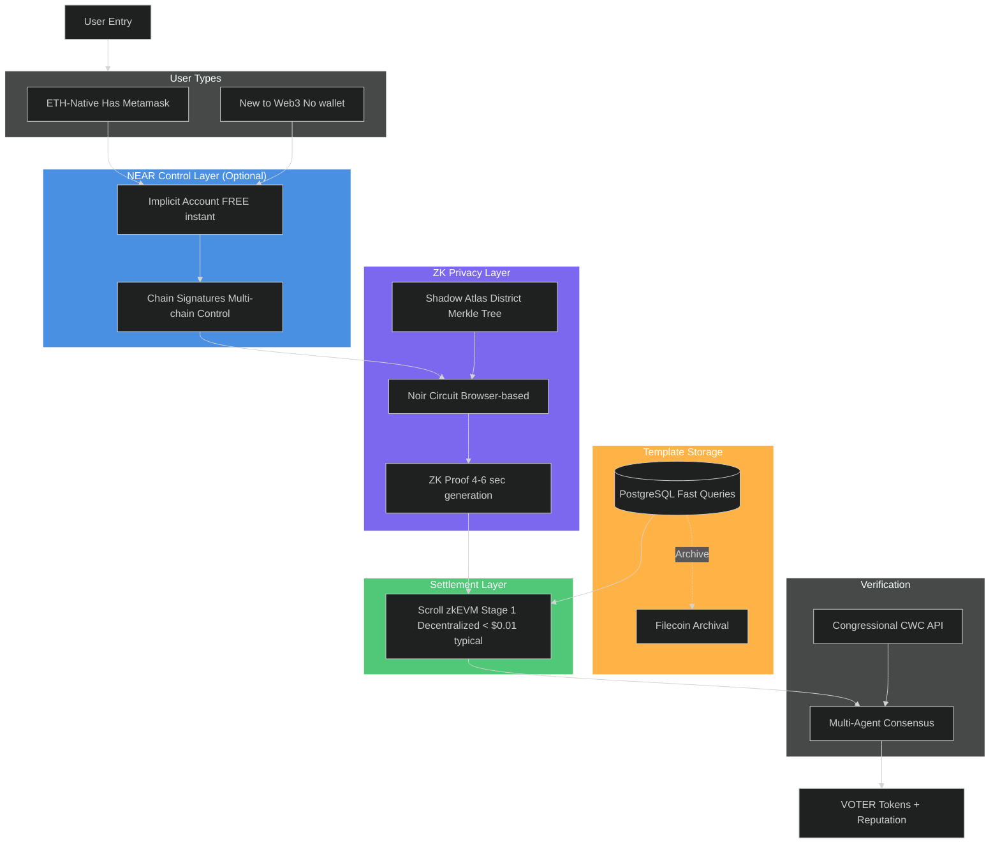

# VOTER Protocol: Technical Architecture

**Status**: Active development - Phase 1 implementation (Noir/Barretenberg UltraPlonk, reputation-only)
**Last Updated**: January 2026
**Implementation**: Smart contracts in this repo, frontend in Communique repo (external)
**Core Decisions**: Scroll settlement, Noir/Barretenberg zero-knowledge proofs, Scroll identity registry (on-chain Sybil resistance), no database PII storage, no NEAR dependency

---

## Executive Summary

Democratic infrastructure should not ask for permission to protect its citizens. Phase 1 enforces privacy by construction: proofs replace identities, signals replace surveillance, and reputation records—not people—touch the chain. Institutions get verifiable civic signal; citizens keep sovereignty.

**Settlement**: Scroll zkEVM (Ethereum L2)
**Identity**: self.xyz (primary) + Didit.me (fallback)
**Privacy**: Browser‑native Noir/Barretenberg proofs; addresses never leave the device
**Storage**: Minimal metadata only; encrypted where needed
**Delivery**: CWC API with enclave‑protected processing
**Moderation**: 3‑layer stack (automation + consensus + human)
**Phasing**: Phase 1 reputation; Phase 2 economics

---

## Table of Contents

- [Executive Summary](#executive-summary)
- [Phase Architecture Overview](#phase-architecture-overview)
- [System Architecture Overview](#system-architecture-overview)
- [System Architecture Layers](#system-architecture-layers)
- [ZK Privacy Infrastructure](#zk-privacy-infrastructure)
- [Identity Verification Infrastructure (Phase 1)](#identity-verification-infrastructure-phase-1)
- [Content Moderation Architecture (Phase 1)](#content-moderation-architecture-phase-1)
- [Template Storage System](#template-storage-system)
- [Settlement Layer](#settlement-layer)
- [Phase 2 Features (Deferred)](#phase-2-features-deferred)
- [Complete Civic Action Flow](#complete-civic-action-flow)
- [Browser-Native Congressional Delivery](#browser-native-congressional-delivery)
- [Complete User Flow](#complete-user-flow)
- [Privacy Guarantees & Attack Surface](#privacy-guarantees--attack-surface)
- [Implementation Roadmap](#implementation-roadmap)
- [Cost Breakdown](#cost-breakdown)
- [Agent System Architecture](#agent-system-architecture)
- [Phase 1 Infrastructure Costs](#phase-1-infrastructure-costs)
- [Critical Integration Points](#critical-integration-points)
- [Documentation Status](#documentation-status)

---

## Phase Architecture Overview

VOTER Protocol launches in phases. Phase 1 establishes cryptographic foundations and proves civic utility **with full privacy from day one** (browser-native Noir/Barretenberg proofs, selective disclosure). Phase 2 adds token economics. Phase 3+ (speculative, only if community demands) would explore **enhanced** privacy through nested ZK proofs.

### Phase 1: Cryptographic Infrastructure (Current - 3 Months to Launch)

**What Ships:**
- Noir/Barretenberg zero-knowledge district proofs (browser-native WASM, UltraPlonk + KZG, 300–500k gas; Aztec ceremony; production-grade since 2024)
- Addresses never leave browser, never stored in any database
- Message content encryption from platform operators (XChaCha20-Poly1305, delivered as plaintext to congressional offices via CWC API)
- Browser-native proving (zero cloud dependency, $0/month infrastructure cost)
- Cross-chain account abstraction (NEAR Chain Signatures, optional)
- On-chain reputation (ERC-8004 portable credibility, no token rewards)
- 3-layer content moderation (Section 230 compliant)
- FREE identity verification (self.xyz passport + Didit.me fallback)

**Budget:** $3,500/month for 1,000 users / 10,000 messages (AWS Nitro Enclaves message encryption + moderation)

**What's NOT in Phase 1:**
- VOTER token (Phase 2)
- Challenge markets (Phase 2)
- Outcome markets (Phase 2)
- Token rewards (Phase 2)
- Multi-agent treasury (Phase 2)

### Phase 2: Token Economics (12-18 Months Post-Launch)

**Additions:**
- VOTER token launch (utility + governance)
- Challenge markets (multi-AI dispute resolution with economic stakes)
- Outcome markets (retroactive funding for legislative impact)
- Multi-agent treasury (SupplyAgent + MarketAgent for token economics)
- Privacy pools (optional shielded transactions with association proofs)

**Why Delayed:** Token launches require legal compliance (CLARITY Act framework), liquidity infrastructure, economic security audits. Phase 1 proves civic utility before adding financial layer.

> **📋 See [Phase 2 Design Document](docs/roadmap/phase-2-design.md) for complete specifications, implementation roadmap, smart contracts, and cost analysis.**

### Phase 3+: Enhanced Privacy (Speculative - 2+ Years, Only If Community Demands)

**Context:** Phase 1 already provides **full privacy** through browser-native Noir/Barretenberg proofs that never transmit addresses. Users have selective disclosure from day one (prove district membership without revealing address, prove reputation range without exact score). Phase 3+ would explore **optional, stronger privacy** features that come with architectural tradeoffs.

**Only if community demands AND congressional offices accept:**
- Nested ZK proofs (prove "reputation > 5000" without revealing exact score, vs current exact scoring visible to congressional offices)
- Shielded message metadata (hide send timestamps, template IDs from on-chain records)

**Tradeoff:** Congressional offices receive weaker aggregate signals (ranges instead of exact scores, hidden timestamps). This reduces the signal quality offices use to gauge constituent intensity and coordination. Phase 3+ only ships if offices explicitly accept this reduction in data granularity.

---

## System Architecture Overview

> **NOTE**: This diagram shows the complete Phase 1 + Phase 2 architecture. Phase 1 excludes: VOTER tokens (reputation-only), Filecoin archival (deferred). NEAR Chain Signatures are optional for simplified UX. Addresses never stored in any database (full zero-knowledge). See "Phase Architecture Overview" section for detailed breakdown.



## System Architecture Layers

### Layer 1: NEAR Account Creation (Universal Entry Point)

**Implicit Account Architecture** - Optional for cross-chain account abstraction:
- **Account Type**: Implicit accounts (64-character hex addresses)
- **Creation Time**: Instant (no on-chain transaction required)
- **Creation Cost**: FREE (account exists automatically when funded)
- **Storage**: 0.05-0.1 NEAR sponsored for storage deposit (one-time)
- **Reference**: [NEAR Implicit Accounts](https://docs.near.org/concepts/protocol/account-id)

**Why Optional?** ETH-native users can use MetaMask directly on Scroll. NEAR Chain Signatures provides multi-chain convenience for new users.

---

### Layer 2: Identity Verification

**NOTE:** Identity verification is Phase 2 only (for economic incentives). Phase 1 uses permissionless address verification via browser-native ZK proofs.

**Primary: Self.xyz (Instant Passport Verification)**
- NFC passport scan (30 seconds)
- Instant verification of identity (NOT address for ZK proof)
- Provider reads address to determine congressional district
- Address NOT stored by provider (used only for district determination)
- User's browser generates ZK proof separately (address stays in browser)
- Cost: $0.50 per verification
- Privacy: Verifiable Credential issued, no PII storage

**Fallback: Didit.me (Non-Passport KYC)**
- Government ID + face scan + liveness (for users without NFC-enabled passports)
- Provider reads address to determine congressional district
- Address NOT stored by provider (used only for district determination)
- User's browser generates ZK proof separately (address stays in browser)
- Cost: $0 (free core KYC) + $0.50 (proof of address)
- Privacy: Issues Verifiable Credential (VC), no PII storage

**Privacy**: Neither provider stores PII on-chain. Identity commitments (Poseidon hash of passport#, nationality, birthYear) registered on Scroll L2 IdentityRegistry.sol for Sybil resistance. PII never stored anywhere.

---

### Layer 3: Identity Registry (Scroll L2 Smart Contract)

> **IMPORTANT**: Phase 1 uses on-chain identity commitments for Sybil resistance. NO PII is stored anywhere (not on-chain, not in database, not on NEAR). This is the ONLY identity storage in the system.

**Contract**: `IdentityRegistry.sol` (Solidity/Scroll L2)

**Purpose**: On-chain Sybil resistance via Poseidon hash commitments.

**Storage Model**:
- **Identity commitment** → registered status (mapping)
- **Identity commitment** → registration timestamp
- **User address** → identity commitment (reverse lookup)

**Client-Side Commitment Generation** (browser-only, zero storage):

```typescript
// IMPORTANT: This runs in Didit.me webhook (server-side), NOT browser
// PII is extracted, hashed, and discarded immediately
import { poseidon2 } from '@noble/curves/abstract/poseidon';

function generateIdentityCommitment(
    passportNumber: string,
    nationality: string,
    birthYear: number
): string {
    // Normalize inputs (same identity = same hash)
    const normalizedPassport = passportNumber.toUpperCase().replace(/[\s-]/g, '');
    const normalizedNationality = nationality.toUpperCase();

    // Convert to field elements for Poseidon hash
    const passportField = stringToFieldElement(normalizedPassport);
    const nationalityField = stringToFieldElement(normalizedNationality);
    const birthYearField = BigInt(birthYear);

    // Poseidon hash (ZK-friendly, compatible with Noir circuits)
    const hash = poseidon2([passportField, nationalityField, birthYearField]);

    return '0x' + hash.toString(16).padStart(64, '0');
}

// Register on Scroll L2 (platform wallet pays gas)
const tx = await identityRegistry.registerIdentity(commitment);
await tx.wait();

// PII DISCARDED IMMEDIATELY (never stored anywhere)
```

**Gas Costs** (October 2025 pricing - post-Dencun upgrade):
- **Identity registration**: ~$0.0015 per user (one-time)
- **Identity check**: FREE (view function)

**Scale Economics**:
- 100 users = **$0.15** (one-time)
- 1,000 users = **$1.50** (one-time)
- 10,000 users = **$15** (one-time)
- 100,000 users = **$150** (one-time)
- **NO recurring costs** (vs $30,000/year for database)

**Privacy Guarantees**:
- ✅ Zero PII stored on-chain (only Poseidon hash)
- ✅ Sybil resistance without revealing identity
- ✅ Same passport/nationality/birthYear = same commitment (duplicate detection)
- ✅ Pre-image resistant (cannot reverse-engineer passport number from hash)
- ✅ Collision resistant (128-bit security, equivalent to SHA-256)

**Full implementation**: See `/Users/noot/Documents/voter-protocol/contracts/src/IdentityRegistry.sol`

---

### Layer 4: Universal Account Access

**Problem**: Users come from different chains. Some have ETH wallets, some hold Bitcoin, some use Solana, many have no wallet at all.

**Solution**: NEAR Chain Signatures provides optional account abstraction while protocol settles on Scroll (Ethereum L2).

**User Paths**:
- **ETH-native users** → Use MetaMask/WalletConnect directly on Scroll (standard Ethereum UX)
- **New users** → Create implicit NEAR account (FREE, instant), derive Scroll address
- **Bitcoin holders** → NEAR derives both Bitcoin + Scroll addresses from same implicit account
- **Solana users** → NEAR derives both Solana + Scroll addresses from same implicit account
- **Multi-chain users** → One NEAR implicit account controls addresses on ALL ECDSA/Ed25519 chains

**Settlement Layer**: All civic actions, reputation, and rewards settle on Scroll regardless of account type. NEAR Chain Signatures is purely for account management—smart contracts live on Ethereum.

**Performance**:
- Signature generation: ~2-3 seconds
- MPC network: 8+ nodes (threshold signature)
- Security: NEAR staking + Eigenlayer ETH restakers

---

## ZK Privacy Infrastructure

**Browser-native zero-knowledge proof system for privacy-preserving district verification.**

The protocol uses Noir/Barretenberg UltraPlonk proofs to verify district membership without revealing addresses. Proofs are generated entirely in-browser using WASM (8-15 seconds on mobile), with no cloud infrastructure required. The two-layer security model combines cryptographic proofs (ZK) with governance-controlled on-chain registry, avoiding "ZK-maximalism" while maintaining strong privacy guarantees.

**Key Features**:
- **Shadow Atlas**: Global Merkle tree registry of electoral districts (IPFS + on-chain roots)
- **K=14 Circuit**: 20KB verifier fits EIP-170 with 18% margin, mobile-friendly proving
- **Dual-Layer Security**: ZK proof + on-chain district registry prevents both cryptographic and governance attacks
- **Browser-Native**: Zero server-side proving, addresses never leave client
- **Performance**: 2-5s desktop, 8-15s mobile, 384-512 byte proofs, ~300-400k gas verification

**Complete technical specifications, circuit implementation, performance benchmarks, and security model:**
- **[/docs/architecture/zk-infrastructure.md](/docs/architecture/zk-infrastructure.md)** - Complete ZK system specification
- **[/docs/ZK-PRODUCTION-ARCHITECTURE.md](/docs/ZK-PRODUCTION-ARCHITECTURE.md)** - Production deployment details
- **[/docs/NOIR-PROVING-INFRASTRUCTURE.md](/docs/NOIR-PROVING-INFRASTRUCTURE.md)** - Noir/Barretenberg implementation

### High-Level Overview

The ZK infrastructure consists of two main components:

1. **Shadow Atlas**: A Merkle tree registry of all electoral districts worldwide, stored on IPFS with roots anchored on-chain
2. **District Membership Proof**: A Noir/Barretenberg circuit that proves membership in a district without revealing the user's address

**Architecture Decision**: Instead of proving district→country relationship in a complex two-tier ZK circuit (K=14), we split the verification:
1. **ZK proof**: "I am a member of district X" (K=12, ~15KB verifier, 2-8s mobile proving)
2. **On-chain lookup**: "District X belongs to country Y" (single SLOAD, ~2.1k gas)

**Security**: District→country mappings are PUBLIC information (congressional districts are not secrets), so we use governance + transparency (on-chain registry) instead of cryptography for this layer. This avoids "ZK-maximalism"—forcing everything into cryptographic proofs when simpler solutions exist.

---

## Identity Verification Infrastructure (Phase 1)

**Updated October 2025:** FREE identity verification via self.xyz (primary) and Didit.me (fallback).

### Two-Method Verification Strategy

**Method 1: self.xyz NFC Passport Scanning (Primary - 70% of users)**

FREE tier, no API keys required. Supports 120+ countries with NFC-enabled passports.

**Flow:**
1. User taps "Verify with Passport" in app
2. NFC chip scan (60 seconds, Face ID liveness check)
3. Cryptographic verification of passport authenticity
4. Address extraction from MRZ (Machine Readable Zone)
5. District lookup via Shadow Atlas
6. User generates UltraPlonk proof (8-15 seconds, K=14 single-tier)
7. Proof verified on-chain via DistrictGate.sol (Scroll L2)
8. Verified status recorded (one passport = one account)

**Privacy:**
- Full address never stored on servers
- Only district hash revealed in ZK proof
- self.xyz processes verification, returns district only
- Congressional offices see: "Verified constituent in TX-18" (no address)

**Cost:** $0 (FREE tier, unlimited verifications)

**Method 2: Didit.me Photo ID Verification (Fallback - 30% of users)**

FREE Core KYC tier for non-passport users (estimated 30% of US population doesn't have passport).

**Privacy:** Identical to self.xyz (full address never stored, only district hash revealed)

**Cost:** $0 (Core KYC tier, unlimited verifications)

### Sybil Resistance

**One Verified Identity = One Account**

Cryptographic binding stored in Scroll Identity Registry (Poseidon hash).

**Attack Vectors & Mitigations:**
- **Stolen passports/IDs:** Liveness detection (Face ID, blink detection) prevents photo attacks
- **Fake IDs:** self.xyz cryptographic verification, Didit.me AI fraud detection
- **Multiple passports:** Rare (~1% of population), rate limits reduce impact
- **Borrowed documents:** Liveness check requires document holder present

### Rate Limiting (Per Verified Identity)

Prevents spam even with verified accounts:
- **10 templates sent per day** (prevents message spam)
- **3 templates created per day** (prevents low-quality template flooding)
- **5 reputation updates per day** (prevents gaming through rapid actions)

Enforcement via on-chain nullifier tracking in NullifierRegistry.sol.

**Full implementation**: See `/Users/noot/Documents/voter-protocol/contracts/src/NullifierRegistry.sol`

---

## Content Moderation Architecture (Phase 1)

**Updated October 2025:** 3-layer moderation stack for Section 230 compliance.

### Legal Framework: Section 230 CDA

**What Section 230 PROTECTS platforms from:**
- ✅ Defamation lawsuits for user posts (even if false)
- ✅ Copyright infringement (if DMCA compliant)
- ✅ Most torts from user content (negligence, emotional distress)
- ✅ State-level content laws (federal preemption)

**What Section 230 DOES NOT protect from:**
- ❌ CSAM (child sexual abuse material) - Federal crime, mandatory reporting
- ❌ FOSTA-SESTA violations (sex trafficking)
- ❌ Terrorism content (material support prohibition)
- ❌ Obscenity (federally illegal)
- ❌ Federal criminal law violations

**Our Strategy:** Proactive moderation for illegal content (CSAM, terrorism, threats), reactive for everything else (political speech protected).

### Layer 1: OpenAI Moderation API (FREE Pre-Filter)

**Cost:** $0 (FREE for all OpenAI API users, unlimited requests)

**Model:** text-moderation-007 (GPT-4o multimodal, Oct 2024)
- 95% accuracy across 13 categories
- 47ms average latency
- 40 languages supported
- Multimodal (text + images)

**Result:** 95% of illegal content caught at $0 cost. Only 5% escalate to paid Layer 2.

### Layer 2: Multi-Model Consensus (Gemini + Claude)

**Cost:** $15.49/month for 500 messages (5% escalation rate from 10K messages)

**Consensus Logic:** OpenAI + (Gemini OR Claude) = PASS (2 of 3 providers)

**Latency:** 200-500ms per model (parallel execution)

### Layer 3: Human Review Queue

**Escalation Criteria:** Split decisions (2+ models disagree)
**SLA:** 24-hour review
**Reviewers:** 2+ independent moderators per case
**Volume:** ~2% of all messages (~200 reviews/month for 10K messages)
**Cost:** $50/month ($0.25/review)

### Cost Breakdown (10,000 messages/month)

- **Layer 1 (OpenAI):** $0 (100% of messages, FREE)
- **Layer 2 (Gemini + Claude):** $15.49 (5% of messages = 500 messages)
- **Layer 3 (Human):** $50 (2% of messages = 200 reviews)
- **Total:** $65.49/month

Scales linearly: 1K messages = $6.55/month, 100K messages = $654.90/month

### Section 230 Protection Strategy

1. **Good faith moderation:** 3-layer system demonstrates (Section 230(c)(2))
2. **No editorial control:** Viewpoint-neutral, accuracy-based (not political bias)
3. **User-generated content:** Platform provides infrastructure only
4. **DMCA compliance:** Registered agent, takedown process, repeat infringer policy
5. **Terms of Service:** Explicit prohibition of illegal content

**Phase 1 Limitation:** No challenge markets (would enable crowdsourced fact-checking). Without token economics, fact-checking verifiable claims becomes editorial judgment (loses Section 230 protection).

**Phase 2 Solution:** Challenge markets with economic stakes = user-driven fact-checking, not platform editorial control.

---

## Template Storage System

### PostgreSQL (Supabase) - Primary Storage

**Schema**: Templates, template_usage, challenges tables with full-text search, tag filtering, and GIN indexes.

**Query Performance**:
- Full-text search: 10-50ms
- Tag filtering: <10ms (GIN index)
- District lookup: <10ms (B-tree index)
- Sorting by popularity/impact: <5ms (indexed)

**Full schema**: See `/Users/noot/Documents/voter-protocol/backend/schema.sql`

---

### Filecoin Archival (Planned)

**Trigger**: Template challenged OR verified high-impact

**Cost**: ~$0.01/GB on Filecoin

**Use Cases**:
- Challenged templates (permanent audit trail)
- Legislative citations (proof of origin)
- High-impact templates (historical record)

---

## Settlement Layer

### Scroll zkEVM - Stage 1 Decentralization

**Contracts Deployed**:

**Phase 1 Contracts** (launching in 3 months):
- `DistrictGate.sol` - Master verification (two-step: UltraPlonk proof + registry lookup)
- `DistrictRegistry.sol` - District root → country mapping (multi-sig governed)
- `UltraPlonkVerifier.sol` - K=14 single-tier circuit verifier (20,142 bytes, 18% under EIP-170)
- `NullifierRegistry.sol` - Action-scoped nullifier tracking (prevents double-voting)
- `IdentityRegistry.sol` - On-chain Sybil resistance via identity commitments
- `CommuniqueCoreV2.sol` - Civic action orchestration
- `UnifiedRegistry.sol` - Action/reputation registry
- `ReputationRegistry.sol` - ERC-8004 portable credibility
- `AgentConsensus.sol` - Multi-agent coordination (VerificationAgent, ReputationAgent, ImpactAgent only)

**Phase 2 Contracts** (12-18 months):
- `VOTERToken.sol` - ERC-20 token for economic incentives
- `ChallengeMarket.sol` - Multi-AI dispute resolution with stakes
- `ImpactRegistry.sol` - Legislative outcome tracking and attestations
- `RetroFundingDistributor.sol` - Retroactive public goods funding
- `OutcomeMarket.sol` - Gnosis CTF integration for legislative predictions
- `SupplyAgent.sol` - Token emission management
- `MarketAgent.sol` - Circuit breakers and volatility response

**Complete contract specifications, deployment strategy, gas costs, and integration points:**
- **[/docs/architecture/smart-contracts.md](/docs/architecture/smart-contracts.md)** - Complete smart contract architecture

**Cost per Action** (Scroll):
- ZK proof verification: ~250K gas
- `submitAction` call: ~150K gas
- Storage updates: ~50K gas
- **Total**: Typical on‑chain verification on Scroll: **< $0.01/action** (as of 2025‑11‑15); defer specifics to the canonical costs section

**Who Pays Transaction Costs**:
- **Initially**: Protocol treasury may sponsor ZK verification costs
- **Future**: Sponsor pool may subsidize costs for strategic campaigns
- **User Experience**: Zero-fee civic participation removes economic barriers

**Performance**:
- Current TPS: ~500 TPS
- 2025 target: 10,000 TPS
- Finality: ~5 seconds
- Stage 1 decentralization: ✓ (April 2025)

---

## Phase 2 Features (Deferred)

> **⚠️ NOT INCLUDED IN PHASE 1 LAUNCH**
>
> **Timeline**: 12-18 months after Phase 1 launch
>
> **Phase 1 Foundation**: Phase 1 builds the reputation infrastructure and quality signal system that makes Phase 2 features viable. Template creators earn reputation (not tokens) for adoption and impact. This data becomes the attribution layer for Phase 2 retroactive funding.

### Outcome Markets (Political Prediction → Retroactive Funding)

Binary prediction markets on legislative outcomes fund civic infrastructure retroactively. Users stake VOTER tokens on legislative predictions (e.g., "Will H.R. 3337 pass House committee?"). When outcomes resolve, 20% of prize pool goes to retroactive funding for contributors who influenced the outcome—template creators, message senders, and organizers.

**Architecture**: Gnosis Conditional Token Framework + UMA Optimistic Oracle + Custom Attribution

**Key Features**:
- Binary YES/NO markets on legislative outcomes
- Quadratic scaling prevents whale dominance
- Multi-AI consensus for outcome resolution
- Retroactive funding rewards proven impact
- Congressional delivery receipts prevent self-attribution

> **📋 See [Phase 2 Design Document](docs/roadmap/phase-2-design.md#outcome-markets-political-prediction--retroactive-funding) for complete specifications, smart contracts, attribution logic, gaming resistance, and cost analysis.

---

### Challenge Markets (Multi-AI Information Quality Infrastructure)

Users can challenge verifiable claims in templates by staking VOTER tokens (100-5,000 VOTER). Chainlink Functions DON executes off-chain computation, querying 20 AI models across diverse providers (OpenAI GPT-5, Anthropic Claude, xAI Grok, Google Gemini, Alibaba Qwen, DeepSeek, Meta Llama, Mistral). Consensus threshold 67% required. Winner receives 2x stake; loser loses stake and reputation.

**Key Features**:
- Quadratic scaling: `sqrt(stake_amount)` prevents whale dominance
- Reputation weighting amplifies domain expertise
- Model diversity prevents provider capture
- Auto-resolution >80% consensus; UMA escalation 60-80%; human arbitration <60%
- Cost: $5.15 per challenge (Chainlink Functions + on-chain aggregation)

> **📋 See [Phase 2 Design Document](docs/roadmap/phase-2-design.md#challenge-markets-multi-ai-information-quality-infrastructure) for complete specifications, smart contracts, Chainlink Functions implementation, gaming resistance, and cost analysis.

---

### Template Impact Correlation & Retroactive Funding

**Impact Correlation**: ImpactAgent continuously monitors congressional records, floor speeches, committee reports, and voting patterns to identify when template language appears in legislative activity.

**Retroactive Funding**: Quadratic allocation of retroactive funding pools to contributors (template creators, adopters, validators, organizers) based on verified impact.

**10x Multiplier Trigger**: Verified legislative citation with >80% confidence score

> **📋 See [Phase 2 Design Document](docs/roadmap/phase-2-design.md) for complete impact scoring model, smart contract implementation, allocation logic, and cost analysis.

---

## Complete Civic Action Flow

### Browser-Native ZK Proving & Encrypted Delivery

**Client-Side Architecture:**
- Zero-knowledge proofs generated entirely in browser (WASM, no cloud dependency)
- Backend server whitelisted by House/Senate CWC APIs (static IP for Congressional access)
- E2E encryption: browser → encrypted transit → CWC decryption
- Congressional office public keys retrieved from CWC API (not stored platform-side)

**Security Advantages:**
- Zero cloud proving infrastructure ($0/month browser-native, no server costs)
- Address never leaves browser (true client-side privacy, not just encrypted)
- No trusted execution environments required (browser sandbox + on-chain verification)
- Cypherpunk-aligned (peer-reviewed mathematics, zero cloud proving dependency)

**Complete flow diagram**: See [/docs/architecture/zk-infrastructure.md#complete-civic-action-flow](/docs/architecture/zk-infrastructure.md#complete-civic-action-flow)

---

## Browser-Native Congressional Delivery

### Client-Side Encryption & Privacy Model

All zero-knowledge proof generation and message encryption happens entirely in the browser using WASM and Web Crypto API. User addresses never leave their devices—Shadow Atlas Merkle trees are downloaded from IPFS and cached in IndexedDB, witness generation occurs in Web Workers, and Noir/Barretenberg proving runs in browser WASM with no server dependency.

Browser-native proving eliminates cloud infrastructure costs ($0/month vs $150/month for server-side TEEs) while providing stronger privacy guarantees. Addresses literally cannot be uploaded because the proving code runs locally with no network access during witness generation.

Congressional message delivery requires backend servers because CWC APIs whitelist static IP addresses—browsers cannot connect directly. AWS Nitro Enclaves provide the whitelisted static IP while maintaining E2E encryption through architectural enforcement. Backend cannot decrypt—only the isolated Nitro Enclave can.

### Static IP Configuration & Congressional Whitelist

Congressional CWC APIs require whitelisted IP addresses for spam prevention and security compliance. Browsers cannot submit directly—Senate and House IT departments maintain strict IP whitelists for organizations authorized to use their constituent communication APIs.

Communiqué backend servers are deployed with static Elastic IP addresses in us-east-1 and us-west-2 for redundancy. Congressional IT receives whitelist requests with organization details, static IP addresses, and technical justification emphasizing cryptographic privacy protections (ZK proofs, E2E encryption, open-source verification).

### Browser-Native ZK Proof Generation

> **See also**: [/docs/architecture/zk-infrastructure.md](/docs/architecture/zk-infrastructure.md) for complete ZK system specification, circuit implementation, and security model.

**Complete implementation code for:**
- Shadow Atlas loading from IPFS
- Web Worker witness generation
- WASM Noir/Barretenberg proving
- Client-side proof generation flow

See [/docs/architecture/zk-infrastructure.md#client-side-proof-generation](/docs/architecture/zk-infrastructure.md#client-side-proof-generation)

### AWS Nitro Enclaves Processing

**AWS Dependency Boundary:**
- **On-chain identity** (NO AWS): UltraPlonk proofs generated 100% in browser, addresses never leave device
- **Message delivery** (AWS Nitro REQUIRED): E2E encryption maintained, moderation inside isolated enclave

**Plaintext Message Content Visible Only In:**
- ✅ **Browser** (user's device, user controls during composition)
- ✅ **AWS Nitro Enclave** (isolated compute, platform operators cannot access)
- ✅ **Congressional CWC API** (receives from enclave for delivery to congressional CRM)
- ✅ **Congressional CRM** (final destination per existing congressional infrastructure)

**Plaintext Message Content NEVER Visible To:**
- ❌ Communiqué backend (receives only encrypted blobs, architecturally cannot decrypt)
- ❌ Network transit (XChaCha20-Poly1305 AEAD + TLS 1.3)
- ❌ Load balancers, logs, database, blockchain, IPFS/CDN

**Privacy Guarantee:** Address never leaves browser (ZK proof only). Message content never accessible to platform operators (architectural enforcement via Nitro). We literally cannot decrypt—only the isolated enclave can.

---

## Complete User Flow

### Onboarding (4 minutes total)

1. **Account creation** (30 seconds)
   - OAuth login or existing Web3 wallet
   - Optional: NEAR implicit account (FREE, instant)

2. **Identity verification** (30 seconds - 3 minutes)
   - Primary: self.xyz NFC passport scan (30 seconds)
   - Fallback: Didit.me photo ID (2-3 minutes)

3. **ZK proof generation** (One-time, 8-15 seconds)
   - Browser downloads Shadow Atlas from IPFS (cached)
   - Generate district membership proof
   - Verify proof on-chain via DistrictGate.sol

4. **Ready to participate** (Instant)
   - Browse templates
   - Send messages to congressional offices
   - Earn reputation for impact

### Taking Civic Action (3-8 seconds)

1. **Template selection** (Browse and search)
2. **Personal story addition** (Optional)
3. **ZK proof generation** (2-8 seconds, browser-native)
4. **Congressional delivery** (Encrypted via Nitro Enclave)
5. **On-chain recording** (Proof + receipt hashes)
6. **Reputation update** (Multi-agent consensus)

### Reward Distribution (Instant)

**Phase 1**: Reputation points (ERC-8004 attestations)
**Phase 2**: VOTER tokens + reputation multipliers

---

## Privacy Guarantees & Attack Surface

### What's Private

- ✅ **Home address**: Never leaves browser, never stored anywhere
- ✅ **Message content**: Encrypted browser → Nitro Enclave → CWC
- ✅ **Identity details**: Only Poseidon hash stored on-chain
- ✅ **District membership**: Proven via ZK, specific address not revealed
- ✅ **Template adoption**: Congressional offices know district, not specific constituent

### What's Public

- ✅ **District hash**: Visible on-chain (reveals congressional district, not address)
- ✅ **Action count**: Number of actions per district (aggregate)
- ✅ **Reputation score**: On-chain credibility via ERC-8004
- ✅ **Template impact**: Adoption rates and legislative correlation

### Attack Vectors & Mitigations

**Sybil Attacks**:
- ✅ On-chain identity commitments (one passport = one account)
- ✅ Liveness detection prevents stolen/borrowed documents
- ✅ Rate limiting prevents spam

**Address Deanonymization**:
- ✅ Browser-native proving (address never transmitted)
- ✅ District-level granularity only (no exact location)
- ✅ Homomorphic properties of Poseidon hashing

**Congressional Office Tracking**:
- ✅ Offices receive district membership only (not address)
- ✅ E2E encryption prevents platform surveillance
- ✅ Nitro Enclave architectural enforcement

**Platform Compromise**:
- ✅ Backend cannot decrypt messages (Nitro Enclave only)
- ✅ Database breach reveals encrypted blobs (useless without keys)
- ✅ Legal compulsion: we literally cannot decrypt to comply

---

## Implementation Roadmap

### Month 1: NEAR Core (Optional)

- [ ] NEAR implicit accounts (optional cross-chain abstraction)
- [ ] Chain Signatures integration (multi-chain control)
- [ ] Derived address generation (Bitcoin, Ethereum, Solana)

### Month 2: ZK Infrastructure

- [ ] Shadow Atlas compiler (district trees, 12 levels each)
- [ ] Noir/Barretenberg circuit (K=14 single-tier, 20,142 bytes)
- [ ] KZG parameters via Ethereum ceremony (no custom trusted setup)
- [ ] Browser WASM prover (2-8 seconds mobile proving)
- [ ] Client-side proof generation library

### Month 3: Multi-Chain Settlement

- [ ] Deploy contracts to Scroll testnet
- [ ] DistrictGate.sol deployment (two-step verification)
- [ ] DistrictRegistry.sol deployment (multi-sig governed mapping)
- [ ] UltraPlonkVerifier.sol deployment (K=14, 20,142 bytes)
- [ ] NullifierRegistry.sol deployment (action-scoped nullifiers)
- [ ] IdentityRegistry.sol deployment (Sybil resistance)
- [ ] CommuniqueCoreV2.sol + UnifiedRegistry.sol + ReputationRegistry.sol
- [ ] AgentConsensus.sol (VerificationAgent, ReputationAgent, ImpactAgent)

### Month 4: Information Quality Infrastructure

- [ ] 3-layer moderation stack (OpenAI + Gemini/Claude + human review)
- [ ] PostgreSQL schema (template storage + encrypted PII)
- [ ] AWS Nitro Enclaves integration (E2E encryption + moderation)
- [ ] Congressional CWC API delivery (from enclave whitelisted IP)

### Month 5: Treasury & Funding Infrastructure — ALL PHASE 2 ONLY

> **⚠️ DEFERRED TO PHASE 2** (12-18 months post-launch)

See [Phase 2 Design Document](docs/roadmap/phase-2-design.md#implementation-roadmap) for:
- Outcome Markets (Gnosis CTF + UMA)
- Retroactive Funding (RetroFundingDistributor.sol)
- Challenge Markets (Chainlink Functions + OpenRouter)
- Template Impact Correlation (ChromaDB + GPT-5)

### Month 6: Frontend & UX

- [ ] Template browser & search (PostgreSQL full-text)
- [ ] Reputation dashboard (ERC-8004 attestations)
- [ ] self.xyz + Didit.me integration (FREE verification)
- [ ] Noir/Barretenberg WASM proof generation UI (2-8s mobile)
- [ ] Congressional district lookup (Shadow Atlas)
- [ ] Message encryption UI (XChaCha20-Poly1305)

### Month 7: Security & Audit

- [ ] Smart contract audit (DistrictGate, CommuniqueCoreV2, UnifiedRegistry)
- [ ] Noir circuit audit (K=14, Axiom Noir stdlib integration, 20,142 byte verifier)
- [ ] Browser WASM security review (Subresource Integrity, COOP/COEP headers, KZG parameters integrity)
- [ ] Content moderation audit (3-layer stack compliance)
- [ ] AWS Nitro Enclave security review (attestation verification, enclave code audit)

---

## Cost Breakdown

### Per User (One-Time)

**Identity Verification**:
- self.xyz NFC passport scan: $0 (FREE tier)
- Didit.me Core KYC fallback: $0 (FREE tier)
- **User acquisition: $0/user**

**Noir/Barretenberg Proof Generation:**
- Browser-side proving: $0 (client-side computation)
- On-chain verification: < $0.01 (Scroll L2 gas)
- Nullifier storage: < $0.01 (state update)
- **Total: < $0.02/user one-time**

### Per Civic Action

**UltraPlonk Proof Verification**:
- ZK proof verification: ~300-400k gas ≈ $0.003-$0.01
- Registry lookup: ~2.1k gas ≈ $0.00002
- Nullifier recording: ~22k gas ≈ $0.0002
- **Total: < $0.01/action**

**Congressional Delivery**:
- CWC API: $0 (federal government API)
- Nitro Enclave processing: Included in infrastructure
- Action registry update: < $0.01

### Per Information Quality Operation — ALL PHASE 2

> **⚠️ DEFERRED TO PHASE 2** (12-18 months post-launch)

See [Phase 2 Design Document](docs/roadmap/phase-2-design.md#cost-analysis) for:
- Challenge Market costs ($5.15/challenge)
- Template Impact Tracking ($2.25/template)
- Outcome Market creation ($0.20)
- Retroactive Funding rounds ($71/quarter)

### Annual Infrastructure (100K Users)

**Phase 1 Infrastructure**:
- AWS Nitro Enclaves: $36,600/year (E2E encryption + moderation)
- Scroll L2 batch logging: $5,400/year (hourly merkle roots)
- PostgreSQL (Supabase Pro): $300/year
- Shadow Atlas IPFS pinning: $60/year
- Domain + SSL: $240/year
- Monitoring: $600/year
- **Total Phase 1: ~$43,200/year**

**Phase 2 Additions** (deferred):
- Chainlink Functions DON: $2,000/year
- OpenRouter 20-model consensus: $5,000/year
- UMA dispute bonds: $50,000 (locked)
- ChromaDB vector database: $1,200/year
- GPT-5 impact correlation: $10,000/year
- Filecoin archival: $500/year
- **Total Phase 2 Infrastructure: ~$68,700/year additional**

### Development Costs

**Phase 1 Development (3 months): $300,000**
- 2 senior Solidity developers: $120,000
- 1 ZK cryptography specialist: $45,000
- 1 backend developer: $50,000
- 1 frontend developer: $45,000
- Smart contract audit: $30,000
- Browser WASM security review: $10,000

**Phase 2 Development (12-18 months): $175,000 additional**
- Chainlink Functions integration: $30,000
- UMA/Gnosis integration: $40,000
- Economic security modeling: $25,000
- Additional security audits: $80,000

**Total Combined: $475,000**

---

## Agent System Architecture

> **PHASED DEPLOYMENT**
>
> **Phase 1 Agents (Launching in 3 months)**:
> - **VerificationAgent**: Validates civic actions, UltraPlonk proofs, identity verification
> - **ReputationAgent**: Multi-dimensional credibility scoring (reputation-only, no tokens)
> - **ImpactAgent**: Tracks template adoption and legislative correlation (reputation rewards)
>
> **Phase 2 Agents (12-18 months)**:
> - **SupplyAgent**: Token emission management (requires VOTER token)
> - **MarketAgent**: Circuit breakers and volatility response (requires liquid token markets)

### Overview

Five specialized agents optimize protocol parameters within cryptographically-enforced bounds. Architecture prevents Terra/Luna-style death spirals through bounded optimization while maintaining adaptability.

**Phase 1 Reality**: Only VerificationAgent, ReputationAgent, and ImpactAgent deploy initially. They manage reputation scoring, content quality, and impact tracking without token economics. SupplyAgent and MarketAgent activate in Phase 2 when VOTER token launches.

**Key Design Principles**:
1. **Deterministic where possible** - LangGraph state machines, not raw LLM inference
2. **Bounded always** - Smart contract floors/ceilings enforced on-chain
3. **Verifiable decisions** - On-chain proofs of agent computation
4. **Upgradeability with timelock** - DAO governance for agent logic updates
5. **Multi-model consensus** - Architecturally diverse models prevent single-point manipulation

### Technical Stack

**Agent Orchestration**: [LangGraph](https://langchain-ai.github.io/langgraph/) (production-grade)
**Model Diversity**: Ensemble methods with architecturally diverse providers
**Oracle Infrastructure**: Multi-source consensus (Chainlink, RedStone, Uniswap V3 TWAPs)
**ERC-8004 Integration**: Three-registry system (Identity, Reputation, Validation)

### Agent Architecture

#### VerificationAgent — PHASE 1 INCLUDED

**Purpose**: Validate civic actions before consensus

**Validation Checks**:
1. ZK proof validity (UltraPlonk district membership)
2. Identity verification status (self.xyz/Didit.me)
3. CWC delivery receipt confirmation
4. Duplicate detection
5. Content moderation (3-layer stack)

**Multi-Model Consensus**: 3 models must agree (2-of-3 threshold)

#### ReputationAgent — PHASE 1 INCLUDED

**Purpose**: Multi-dimensional credibility scoring

**Reputation Dimensions**:
1. Challenge accuracy (Phase 2)
2. Template quality (adoption + outcomes)
3. Civic consistency (regular participation)
4. Domain expertise (segmented by topic)

**ERC-8004 Integration**: On-chain reputation registry

#### ImpactAgent — PHASE 1 INCLUDED

**Purpose**: Track which templates change legislative outcomes

**Verification Method**:
- Template sent to Rep X on date D
- Rep X introduces/co-sponsors related bill within 30 days
- Confidence score based on: topic similarity, timing correlation, language overlap

**10x Multiplier Trigger**: Verified outcome with >80% confidence

#### SupplyAgent & MarketAgent — PHASE 2 ONLY

> **⚠️ NOT INCLUDED IN PHASE 1**: Requires VOTER token launch and liquid markets.

See [Phase 2 Design Document](docs/roadmap/phase-2-design.md#multi-agent-treasury-management) for:
- SupplyAgent (token emission management)
- MarketAgent (circuit breakers + volatility response)
- LangGraph workflows
- Bounded constraints
- Trust model & governance

### Agent Consensus Mechanism

**Weighted Voting** (Phase 2):
```python
consensus_weights = {
    "SupplyAgent": 0.30,
    "MarketAgent": 0.30,
    "ImpactAgent": 0.20,
    "ReputationAgent": 0.20
}
```

**Deadlock Resolution**:
1. Agents have 60 seconds to submit decisions
2. If <3 agents respond → Use last consensus state
3. If agents disagree by >50% → Escalate to DAO vote
4. Default: Protocol continues with frozen parameters until resolved

### Production Deployment

**Infrastructure**:
- LangGraph Cloud for agent orchestration
- AWS Lambda or ECS for stateless agent execution
- PostgreSQL for agent state persistence

**Cost Estimates**:
- LangGraph Cloud: ~$500/month (10K decisions/day)
- LLM API calls: ~$2000/month (ensemble of 3-5 models)
- Infrastructure: ~$500/month
- **Total**: ~$3000/month agent operations

---

## Phase 1 Infrastructure Costs

> **THIS IS THE REAL PHASE 1 BUDGET**
>
> Phase 1 launches with $3,600/month recurring costs + $300K one-time development. AWS Nitro Enclaves enable true E2E encryption with moderation capability. No NEAR, no challenge markets, no outcome markets, no token infrastructure.

### Monthly Recurring Costs ($3,600/month)

**E2E Encryption Infrastructure (AWS Nitro Enclaves)**:
- AWS Nitro Enclaves (2× t3.medium): $3,050/month
  - Isolated compute for message decryption + moderation
  - Architectural enforcement: platform operators cannot decrypt
  - 24/7 availability for congressional delivery
- Scroll L2 Batch Logging: $450/month
  - Hourly merkle root of delivery receipts
  - 99% cost reduction from batch aggregation

**Infrastructure**:
- PostgreSQL (Supabase Pro): $25/month
- Browser-Native ZK Proving: $0/month
- Shadow Atlas IPFS Pinning: $5/month
- Domain + SSL: $20/month
- Monitoring: $50/month

**Total Recurring**: $3,600/month = **$43,200/year**

### Per-User Costs (Marginal)

**Identity Verification**: $0/user (self.xyz + Didit.me FREE tiers)
**Proof Generation**: < $0.02/user one-time
**Civic Actions**: < $0.02/action
**Reputation Updates**: < $0.01/update

### Annual Costs at Scale

**At 1,000 users**: ~$43,920 = **~$43.92/user/year**
**At 10,000 users**: ~$68,700 = **~$6.87/user/year**
**At 100,000 users**: ~$301,400 = **~$3.01/user/year**

**Cost Per User Decreases With Scale:**
- 1,000 users: $43.92/user/year
- 10,000 users: $6.87/user/year (84% reduction)
- 100,000 users: $3.01/user/year (93% reduction)

### One-Time Development Costs ($300K)

**Engineering (3 months)**:
- 2 senior Solidity developers: $120,000
- 1 ZK cryptography specialist: $45,000
- 1 backend developer: $50,000
- 1 frontend developer: $45,000

**Security & Audits**:
- Smart contract audit: $30,000
- Browser WASM security review: $10,000

**Total Development**: **$300,000**

### Why Phase 1 Costs Are Higher (But Honest)

**AWS Nitro Enclaves ($3,050/month)**: True E2E encryption with moderation capability. Platform operators literally cannot decrypt messages—architectural enforcement, not policy promises.

**Batch On-Chain Logging ($450/month)**: Hourly merkle roots save 99% on gas costs. Without batching, Scroll gas would be ~$45,000/month.

**What We Saved:**
- No NEAR CipherVault: $11,000/year eliminated
- FREE identity verification: self.xyz + Didit.me partnerships
- Browser-native proving: $0/month vs $150/month TEE
- No token infrastructure: Phase 2 deferred
- No challenge markets: $57,000/year deferred
- No outcome markets: $40,000 integration deferred

**Fundable Budget**: $43,200/year recurring + $300K one-time = $343K total Year 1 cost. Seed-fundable or angel-backed.

---

## Critical Integration Points

**Phase 1 Integration Points** (launching in 3 months):
1. **UltraPlonk + KZG (Browser-Native WASM)** → Zero-knowledge district verification
2. **self.xyz + Didit.me** → FREE identity verification
3. **AWS Nitro Enclaves** → E2E encryption with moderation
4. **PostgreSQL (Supabase)** → Template storage, encrypted PII
5. **Scroll L2** → zkEVM settlement (~$0.02/action)
6. **Congressional CWC API** → Federal delivery from Nitro Enclave

**Phase 2 Integration Points** (12-18 months):
1. **Gnosis CTF** → Outcome markets
2. **UMA Optimistic Oracle** → Dispute resolution
3. **Chainlink Functions DON** → Multi-model AI consensus
4. **Filecoin** → Permanent audit trail
5. **NEAR Chain Signatures** → Optional cross-chain expansion

---

## Documentation Status

### October 2025: Production Architecture

**Current Status**: K=14 single-tier circuit + on-chain registry is production-ready.

**Key Design Insight**:
- District→country mappings are PUBLIC data (congressional districts are not secrets)
- Use governance + transparency (on-chain registry) instead of all-cryptographic proofs
- Avoids "ZK-maximalism"—forcing everything into ZK when simpler solutions exist

**Production Architecture**:
- Single-tier Merkle circuit (12 district levels, K=14, 20KB verifier, 8-15s proving)
- On-chain DistrictRegistry.sol for district→country mapping
- Two-step verification: ZK proof (cryptographic) + registry lookup (governance)

### January 2026: Phase 1 Architecture Alignment

**Major Update**: Aligned entire ARCHITECTURE.md with Phase 1 reality (3-month launch, $3,600/month budget, reputation-only). Preserved Phase 2 vision (12-18 months, token economics) with clear labeling throughout.

**Changes Made**:
- Executive summary updated with Phase 1/2/3 timeline
- Phase Architecture Overview section added
- Privacy layer revised to Noir/Barretenberg + on-chain registry
- New sections: Identity Verification, Content Moderation, Phase 1 Infrastructure Costs
- Phase 2 features clearly labeled throughout
- Implementation roadmap separated by phase
- Cost breakdown revised with accurate Phase 1 numbers

**Result**: ARCHITECTURE.md now accurately reflects Phase 1 launch plan while preserving complete Phase 2 vision.

---

### Costs & Gas (Canonical)

- Typical on‑chain verification on Scroll: < $0.01; conservative range $0.0001–$0.005 (as of 2025‑11‑15)

---

*This is a living document. Update as architecture evolves.*

**Last Updated**: January 2026
**Status**: Production architecture reference
**Next Review**: After Month 1 implementation
