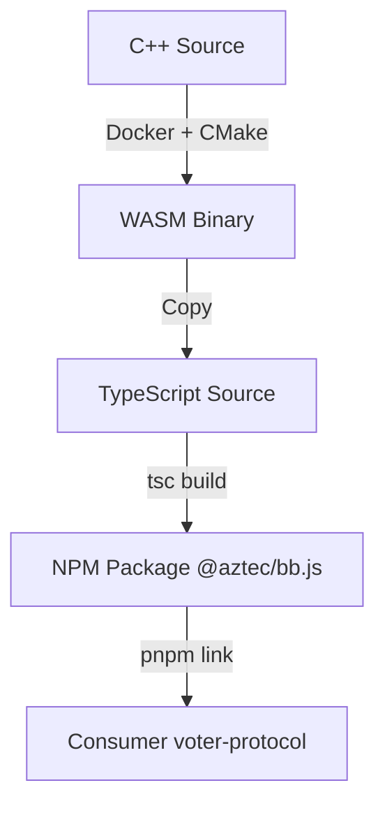

# Noir Proving Infrastructure

**Consolidated documentation for Noir/Barretenberg ZK proving system.**

---

## 1. Migration Specification

### Goals
- Replace Halo2 WASM prover with Barretenberg via `@aztec/bb.js`
- Preserve Shadow Atlas semantics: ZK membership + nullifier per authority/epoch/campaign
- Security-first defaults (COOP/COEP/SRI, integrity pinning)
- Stable for ~10 years until post-quantum migration

### Proving System
- **Backend**: UltraPlonk/UltraHonk on BN254 (trusted setup)
- **Circuit size**: Stay under 2^19 gate count for browser WASM SRS
- **Threads**: Threaded bb.js WASM only; requires `SharedArrayBuffer` + cross-origin isolation
- **Hash**: Poseidon (t=3, rate=2, R_F=8, R_P=57)

### Data Model
```text
Authority{id, kind, name, parents[], epoch, geometryRef}
Leaf commitment: Poseidon(normalized_addr || user_secret || salt)
Nullifier: Poseidon(user_secret || campaign_id || authority_id || epoch_id)
Public inputs: [merkle_root, nullifier, authority_id_hash, epoch_id, campaign_id]
Private inputs: [leaf, merkle_path, leaf_index, user_secret]
```

### Circuit Mapping (Halo2 → Noir)

| Feature | Halo2 | Noir + bb.js |
|---------|-------|--------------|
| Hash | Poseidon (Axiom) | Poseidon builtin gadget |
| Merkle | `verify_merkle_path` depth=12 | Noir Merkle gadget; depth per authority |
| Nullifier | `Poseidon(identity, action_id)` | `Poseidon(user_secret, campaign, authority, epoch)` |
| K | 14 | Gate count < 2^19 |

---

## 2. Browser Execution

### Requirements
- `crossOriginIsolated === true` (fail closed if not)
- Headers:
  - `Cross-Origin-Opener-Policy: same-origin`
  - `Cross-Origin-Embedder-Policy: require-corp`
- SRI pinning for WASM/JS bundles

### Prover Flow
1. Load threaded bb.js WASM
2. Load circuit bytecode (ACIR) and proving key
3. User presents credential blob (encrypted at rest)
4. Prover computes proof with bb.js
5. Verifier checks registry and nullifier

### Performance Targets
- District depth (≤20): <5s on M1, <10s mid-range Android
- Memory: Stay within 4 GiB WASM linear-memory ceiling

---

## 3. Multi-Boundary Composite Proofs

### 3.1 Architecture Overview

Users belong to 12-25 governance boundaries simultaneously. Two proof strategies:

| Strategy | Boundaries | Gas Cost | Latency |
|----------|------------|----------|---------|
| Single | 1 | ~300k | 8-15s |
| Composite | Up to 4 | ~400k | 12-20s |
| Batched | N | N × 300k | Parallelizable |

### 3.2 Composite Circuit Specification

```noir
// composite_membership/src/main.nr

global MAX_BOUNDARIES: u32 = 4;
global MAX_DEPTH: u32 = 22;  // Supports all depth tiers

fn main(
    // Public inputs
    merkle_roots: [Field; MAX_BOUNDARIES],
    nullifier: Field,
    authority_hash: Field,
    epoch_id: Field,
    campaign_id: Field,
    boundary_mask: Field,  // Bitmask: which boundaries are active

    // Private inputs
    leaves: [Field; MAX_BOUNDARIES],
    merkle_paths: [[Field; MAX_DEPTH]; MAX_BOUNDARIES],
    leaf_indices: [u32; MAX_BOUNDARIES],
    user_secret: Field,
) -> pub ([Field; MAX_BOUNDARIES], Field, Field, Field, Field, Field)
```

### 3.3 Proof Strategy Selection

```typescript
function selectProofStrategy(boundaryCount: number): 'single' | 'composite' | 'batched' {
  if (boundaryCount === 1) return 'single';
  if (boundaryCount <= 4) return 'composite';  // 400k gas for 4 boundaries
  return 'batched';  // N × 300k, parallelizable
}
```

### 3.4 ShadowAtlasRegistry Integration

Proofs validate against on-chain registry:

```typescript
// Verify roots before proof generation
const validRoots = await registry.isValidRootBatch(boundaryIds, merkleRoots);
if (!validRoots) throw new Error('Stale or invalid boundary roots');

// Generate composite proof
const proof = await prover.generateCompositeProof({
  boundaries: boundaryIds.slice(0, 4),
  userSecret,
  campaignId,
});
```

See [MERKLE-FOREST-SPEC.md](../specs/MERKLE-FOREST-SPEC.md) Section 5 for registry contract specification.

---

## 4. Keygen Strategy

### Current Situation
`@aztec/bb.js` (npm) only exposes `BarretenbergSync` with curve ops—no `setupGenericProverAndVerifier` or SRS/keygen helpers.

### Manual Keygen via Native `bb` CLI

**Build Barretenberg CLI:**
```bash
git clone https://github.com/AztecProtocol/barretenberg.git
cd barretenberg && git checkout v0.87.0
./scripts/bootstrap.sh
cmake -S cpp -B build -DCMAKE_BUILD_TYPE=Release
cmake --build build --target bb -j$(nproc)
# Output: build/bin/bb
```

**Generate Keys:**
```bash
# Verification key
bb write_vk -b target/<pkg>.json -o dist/bbjs/<depth>/vk

# Proving key
bb write_pk -b target/<pkg>.json -o dist/bbjs/<depth>/pk

# Solidity verifier (optional)
bb write_solidity_verifier -k dist/bbjs/<depth>/vk -o dist/bbjs/<depth>/Verifier.sol
```

**Sanity Check:**
```bash
bb prove -b target/<pkg>.json -w target/<pkg>.gz -o proof
bb verify -k dist/bbjs/<depth>/vk -p proof
```

---

## 5. Vendor Integration Strategy

### In-Tree Vendor Pattern
```text
voter-protocol/
├── packages/
├── contracts/
├── vendor/
│   └── aztec-packages/     ← Clone of AztecProtocol/aztec-packages
└── pnpm-workspace.yaml
```

**Benefits:**
- Agent can read/write vendor code
- Atomic context (consumer + producer visible)
- Simplified linking via `pnpm link`

### Build Pipeline


---

## 6. Upstream Contribution Plan

### Target API
```typescript
async function setupGenericProverAndVerifier(
  acir: Uint8Array, 
  opts?: KeygenOptions
): Promise<{ prover: Prover; verifier: Verifier }>;

interface Prover {
  getProvingKey(): Promise<Uint8Array>;
  prove(witness: Uint8Array): Promise<Uint8Array>;
}

interface Verifier {
  getVerificationKey(): Promise<Uint8Array>;
  verify(proof: Uint8Array): Promise<boolean>;
  getSolidityVerifier(): Promise<string>;
}
```

### Implementation Path
1. **C++ Layer**: Add `WASM_EXPORT` for `acir_get_proving_key`, `acir_load_proving_key`
2. **TypeScript Layer**: Expose new bindings in `Barretenberg` class
3. **Build Pipeline**: Ensure exports preserved in WASM build

### Delivery Plan
1. Fork `aztec-packages`
2. Implement C++ exports
3. Build custom `@voter-protocol/bb.js`
4. Use custom build in project
5. Upstream PR to Aztec

---

## 7. Multi-Depth Deployment

### Artifact Layout
```text
dist/bbjs/
├── single/                    # Single-boundary circuits
│   ├── 14/                    # City council depth
│   │   ├── circuit.json
│   │   ├── pk.bin
│   │   └── vk.bin
│   ├── 20/                    # Congressional depth
│   │   └── ...
│   └── 22/                    # State mega depth
│       └── ...
├── composite/                 # Multi-boundary circuit (MAX_DEPTH=22)
│   ├── circuit.json
│   ├── pk.bin
│   └── vk.bin
└── sri.json                   # Subresource integrity hashes
```

### Depth Classes
| Authority Type | Depth | Est. Leaves |
|----------------|-------|-------------|
| City council | 14 | ~16K |
| Congressional | 20 | ~1M |
| State (mega) | 22 | ~4M |

**Circuit Families:**

The build pipeline generates artifacts for two circuit families:

1. **Single-boundary** (`district_membership`): Proves membership in one boundary
   - Artifacts: `dist/bbjs/{14,20,22}/` (depth-specific)
   - Use case: Simple actions requiring one boundary proof

2. **Composite** (`composite_membership`): Proves membership in up to 4 boundaries simultaneously
   - Artifacts: `dist/bbjs/composite/` (unified MAX_DEPTH=22)
   - Use case: Cross-boundary actions (contact state senator AND congressional rep)

For architecture details, see [MERKLE-FOREST-SPEC.md](../specs/MERKLE-FOREST-SPEC.md) Section 4.

### Manifest
Maps `authority_id → depth_class`; loader picks artifacts by depth; no user choice.

---

## 8. Implementation Status

- [x] Dependencies: `@aztec/bb.js`, `@noir-lang/noir_wasm`, Noir compiler
- [x] Noir circuit: `packages/crypto/noir/district_membership/`
- [x] ACIR compilation working for depths 14/20/22
- [x] Manifest schema and validator
- [x] Legacy Halo2 scripts removed
- [ ] PK/VK generation (blocked on keygen API)
- [ ] Frontend integration with `crossOriginIsolated` guard
- [ ] Solidity verifier swap
- [ ] CI perf checks at depths 14/20/22

---

## References

- [Aztec bb.js](https://github.com/AztecProtocol/aztec-packages/tree/master/barretenberg/ts)
- [Noir Language](https://noir-lang.org/)
- [SharedArrayBuffer Security](https://developer.mozilla.org/en-US/docs/Web/JavaScript/Reference/Global_Objects/SharedArrayBuffer)
