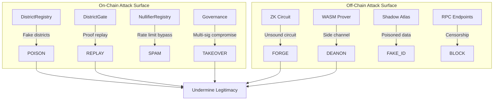

# Security Analysis: Nation-State Attack Vectors

**Consolidated threat analysis for voter-protocol smart contracts and Noir ZK circuits.**

---

## Executive Summary

This analysis examines voter-protocol from the perspective of a well-resourced nation-state adversary. Goal: **undermine civic participation infrastructure**.

> [!CAUTION]
> **Threat Model**: Adversary with $100M+ budget, zero-day exploits, insider access, long time horizons.

---

## Attack Surface Map

---

## Critical Vulnerabilities

### C-1: Governance Single Point of Failure

**Severity**: CRITICAL | **Exploitability**: HIGH

Single `governance` address controls registry updates, circuit breaker, verifier upgrades.

**Mitigation (Implemented)**: GuardianShield with multi-jurisdiction veto, 14-day verifier upgrade timelock.

---

### C-2: Verifier Contract Immutability

**Severity**: CRITICAL

No recovery path for ZK circuit bugs after deployment.

**Mitigation (Implemented)**: Timelocked verifier upgrade with guardian veto capability.

---

### C-3: District Registry Poisoning

**Severity**: HIGH

Compromised governance could register fake Merkle roots.

**Mitigation**: Hierarchical validation (national→state→district), oracle-based root updates with timelock.

---

### C-4: Nullifier Replay

**Severity**: CRITICAL

Without on-chain registry, proofs can be replayed infinitely.

**Mitigation (Implemented)**: NullifierRegistry with per-action-id tracking and rate limiting.

---

## Noir Circuit Security

The Noir circuit (`main.nr`) is **cryptographically sound** with proper constraints:
- ✅ Merkle root assertion (`computed_root == merkle_root`)
- ✅ Nullifier assertion (`computed_nullifier == nullifier`)
- ✅ Leaf index range check (`leaf_index < (1 << DEPTH)`)

### Noir vs Halo2 Comparison

| Aspect | Halo2 | Noir | Delta |
|--------|-------|------|-------|
| Proof System | Halo2 (IPA) | Ultra Honk (KZG) | Different backend |
| Trusted Setup | None (IPA) | Aztec SRS | ⚠️ New trust assumption |
| Nullifier Domain | `H(identity, action_id)` | `H(secret, campaign, authority, epoch)` | ✅ Improved |
| Range Checks | Missing | Present | ✅ Fixed |
| Code Auditability | ~1200 lines Rust | ~57 lines Noir | ✅ Simpler |

### Trust Model Change

**Halo2**: No trusted setup (IPA).

**Barretenberg**: KZG commitments with Aztec Universal SRS from MPC ceremony. If ceremony compromised, proofs can be forged.

> ⚠️ Aztec's SRS is shared across protocols—more eyeballs, but also shared risk.

---

## New Vulnerabilities from Migration

### N-1: Poseidon2 vs Poseidon Mismatch ⚠️ HIGH

Circuit uses `poseidon2_permutation` (T=4); Shadow Atlas may use Axiom Poseidon (T=3).

**Impact**: All existing roots incompatible if mismatched.

**Verification Required**: Check Shadow Atlas hash function.

---

### N-2: Browser Entropy Dependency ⚠️ MEDIUM

Uses `crypto.getRandomValues()` for proof randomness.

**Attack**: Compromised browser environment could control entropy for timing attacks.

**Impact**: Affects zero-knowledge property, not soundness.

---

### N-3: Supply Chain Attack Surface ⚠️ HIGH

Dependencies: `@aztec/bb.js`, `@noir-lang/noir_js`, `pako`

**Attack**: NPM account compromise → backdoored witness generation → deanonymization.

**Mitigation**:
- Pin exact versions (not ranges)
- Subresource Integrity for CDN bundles
- Consider vendoring critical dependencies

---

## Nation-State Attack Scenarios

### Scenario 1: Foreign Actor Flooding

1. Obtain Shadow Atlas (public)
2. Generate 10,000 valid proofs for various districts
3. Submit via Tor bot network
4. Platform aggregates fake "overwhelming support"

**Defense**: Nullifier registry + rate limiting + epoch-based rotation.

### Scenario 2: Domestic Deanonymization

1. Monitor on-chain nullifier submissions
2. Correlate timing with ISP logs
3. Build probabilistic identity graph
4. Cross-reference social media

**Defense**: Batch proof submissions, mandatory Tor recommendations, differential privacy on aggregates.

### Scenario 3: Insider Circuit Backdoor

1. Submit PR removing circuit constraint
2. Code review misses subtle change
3. Deploy to production
4. Exploit 6 months later

**Defense**: 2+ cryptographer review, formal verification, professional audit.

---

## Recommendations

### Before Beta Launch
1. ✅ Implement nullifier registry (done)
2. ✅ Implement root validation (done)
3. Pin dependencies to exact versions
4. Verify Poseidon2 compatibility with Shadow Atlas

### Before Production
5. Professional audit (Veridise, Trail of Bits, Zellic)
6. Formal verification (core circuit constraints)
7. Bug bounty ($50k-$500k)
8. Consider vendoring bb.js

### For Nation-State Resistance
9. Network layer privacy (Tor, batched submissions)
10. Epoch rotation with time-bound proofs
11. Economic stakes for high-visibility actions

---

## Implementation Checklist Status

| Category | Item | Status |
|----------|------|--------|
| Key Management | Private keys never leave device | ✅ OK |
| Smart Contracts | GuardianShield multi-sig | ✅ Implemented |
| Smart Contracts | Verifier upgrade timelock | ✅ 14-day |
| Dependencies | Version pinning | ⚠️ Needs review |
| Circuit Security | Under-constrained check | ✅ Constraints present |
| Nullifier Safety | On-chain registry | ✅ Implemented |
| Root Validation | Known roots only | ✅ DistrictRegistry |
| Audit | Third-party review | ❌ Not done |

---

**Conclusion**: The Noir circuit is mathematically sound. Protocol integration (nullifier registry, root validation) is where attacks would succeed—and these have been addressed. Supply chain and audit remain the open gaps before production.
