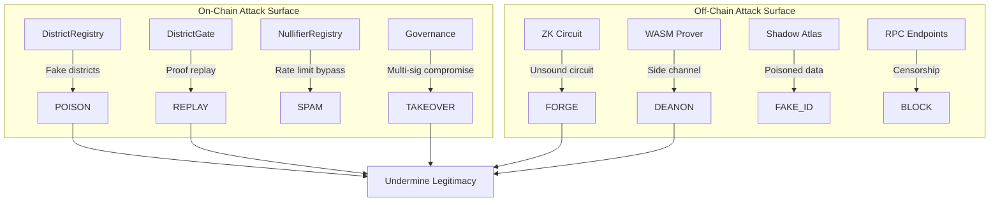

# Security Analysis: Nation-State Attack Vectors

**Consolidated threat analysis for voter-protocol smart contracts and Noir ZK circuits.**

---

## Executive Summary

This analysis examines voter-protocol from the perspective of a well-resourced nation-state adversary. Goal: **undermine civic participation infrastructure**.

> [!CAUTION]
> **Threat Model**: Adversary with $100M+ budget, zero-day exploits, insider access, long time horizons.

---

## Attack Surface Map


```mermaid
graph TD
    subgraph "On-Chain Attack Surface"
        DR[DistrictRegistry] -->|"Fake districts"| POISON
        DG[DistrictGate] -->|"Proof replay"| REPLAY
        NR[NullifierRegistry] -->|"Rate limit bypass"| SPAM
        GOV[Governance] -->|"Multi-sig compromise"| TAKEOVER
    end
    
    subgraph "Off-Chain Attack Surface"
        ZK[ZK Circuit] -->|"Unsound circuit"| FORGE
        WASM[WASM Prover] -->|"Side channel"| DEANON
        SHADOW[Shadow Atlas] -->|"Poisoned data"| FAKE_ID
        RPC[RPC Endpoints] -->|"Censorship"| BLOCK
    end
    
    POISON --> UNDERMINE[Undermine Legitimacy]
    REPLAY --> UNDERMINE
    TAKEOVER --> UNDERMINE
    FORGE --> UNDERMINE
    DEANON --> UNDERMINE
```

---

## Critical Vulnerabilities

### C-1: Governance Single Point of Failure

**Severity**: CRITICAL | **Exploitability**: HIGH

Single `governance` address controls registry updates, circuit breaker, verifier upgrades.

**Mitigation**:
- **Phase 1 (Implemented)**: TimelockGovernance with 7-day governance transfer timelock, 14-day verifier upgrade timelock. Honest acknowledgment: founder key compromise = governance compromise during bootstrap.
- **Phase 2 (Planned)**: GuardianShield with multi-jurisdiction human guardians and 2-of-N veto capability.

---

### C-2: Verifier Contract Immutability

**Severity**: CRITICAL

No recovery path for ZK circuit bugs after deployment.

**Mitigation (Implemented)**: 14-day verifier upgrade timelock via TimelockGovernance. Phase 2 adds guardian veto capability.

---

### C-3: District Registry Poisoning

**Severity**: HIGH

Compromised governance could register fake Merkle roots.

**Mitigation**: Hierarchical validation (national→state→district), oracle-based root updates with timelock.

---

### C-4: Nullifier Replay

**Severity**: CRITICAL

Without on-chain registry, proofs can be replayed infinitely.

**Mitigation (Implemented)**: NullifierRegistry with per-action-id tracking and rate limiting.

---

## Circuit Security

> Authoritative reference: [`specs/CRYPTOGRAPHY-SPEC.md`](../specs/CRYPTOGRAPHY-SPEC.md). This section summarizes the security posture relevant to threat modeling.

Four live Noir circuits (all UltraHonk on BN254):

| Circuit | Public inputs | Purpose |
|---|---|---|
| `three_tree_membership` | 31 | **Canonical civic action proof.** Binds user identity (Tree 1), cell→district mapping (Tree 2), engagement tier (Tree 3), and a Sybil-resistant nullifier. |
| `position_note` | 5 | Debate market settlement (position commitment + per-debate nullifier). |
| `debate_weight` | 2 | Quadratic stake commitment with in-circuit sqrt verification. |
| `bubble_membership` | — | Community field aggregation (Phase 2). Per-epoch nullifier. |

All enforce:
- Merkle / SMT root assertions (leaf, path, root all bound in-circuit).
- Leaf index range check (`index < 2^DEPTH`).
- Poseidon2 domain separation (H1M/H2M/H3M/H4M/PCM/PNL/SONGE_24) preventing cross-arity collisions.
- Identity / nullifier non-zero assertions (SA-011, NUL-001, I-2).
- Authority and engagement tier u8-range checks with BA-007 u64 pre-cast to prevent truncation attacks.

### UltraHonk Trust Model

**Proving system:** UltraHonk (KZG) via Barretenberg.
**Trusted setup:** Aztec Universal SRS, MPC ceremony with 100K+ participants, 1-of-N honesty. No per-circuit ceremony.
**Shared-risk caveat:** Aztec's SRS is shared across all Barretenberg protocols — more eyeballs, but shared compromise would affect every consumer.

### Nullifier Scheme (NUL-001)

Current:
```
nullifier = H2(identity_commitment, action_domain)
```

- `identity_commitment` is deterministic per verified person — stable across re-registrations, so Sybil via key rotation is impossible.
- `action_domain` is a public, contract-controlled input — users cannot rotate it to double-submit.

The single-tree predecessor used `H2(user_secret, action_domain)`, which allowed Sybil via re-registration. Dead code; see CRYPTOGRAPHY-SPEC §11.1.

---

## New Vulnerabilities from Migration

### N-1: Poseidon2 Cross-Language Divergence ⚠️ MITIGATED

The TypeScript `Poseidon2Hasher` wraps the Noir `fixtures` / `sponge_helper` circuits directly — TS and Noir cannot diverge on the permutation. Risk reduced to serialization and domain-tag mismatch, which a CI golden vector check (sponge([1..24]) equality) enforces.

Original concern: circuit used `poseidon2_permutation` (T=4), Shadow Atlas previously used Axiom Poseidon (T=3). Fixed in Wave 1.1 (hash unification).

---

### N-2: Browser Entropy Dependency ⚠️ MEDIUM

Uses `crypto.getRandomValues()` for proof randomness.

**Attack**: Compromised browser environment could control entropy for timing attacks.

**Impact**: Affects zero-knowledge property, not soundness.

---

### N-3: Supply Chain Attack Surface ⚠️ HIGH

Dependencies: `@aztec/bb.js`, `@noir-lang/noir_js`, `pako`

**Attack**: NPM account compromise → backdoored witness generation → deanonymization.

**Mitigation**:
- Pin exact versions (not ranges)
- Subresource Integrity for CDN bundles
- Consider vendoring critical dependencies

---

## Nation-State Attack Scenarios

### Scenario 1: Foreign Actor Flooding

1. Obtain Shadow Atlas (public)
2. Generate 10,000 valid proofs for various districts
3. Submit via Tor bot network
4. Platform aggregates fake "overwhelming support"

**Defense**: Nullifier registry + rate limiting + epoch-based rotation.

### Scenario 2: Domestic Deanonymization

1. Monitor on-chain nullifier submissions
2. Correlate timing with ISP logs
3. Build probabilistic identity graph
4. Cross-reference social media

**Defense**: Batch proof submissions, mandatory Tor recommendations, differential privacy on aggregates.

### Scenario 3: Insider Circuit Backdoor

1. Submit PR removing circuit constraint
2. Code review misses subtle change
3. Deploy to production
4. Exploit 6 months later

**Defense**: 2+ cryptographer review, formal verification, professional audit.

---

## Recommendations

### Before Beta Launch
1. ✅ Implement nullifier registry (done)
2. ✅ Implement root validation (done)
3. Pin dependencies to exact versions
4. Verify Poseidon2 compatibility with Shadow Atlas

### Before Production
5. Professional audit (Veridise, Trail of Bits, Zellic)
6. Formal verification (core circuit constraints)
7. Bug bounty ($50k-$500k)
8. Consider vendoring bb.js

### For Nation-State Resistance
9. Network layer privacy (Tor, batched submissions)
10. Epoch rotation with time-bound proofs
11. Economic stakes for high-visibility actions

---

## Implementation Checklist Status

| Category | Item | Status |
|----------|------|--------|
| Key Management | Private keys never leave device | ✅ OK |
| Smart Contracts | TimelockGovernance (Phase 1) | ✅ Implemented |
| Smart Contracts | GuardianShield multi-sig (Phase 2) | ⏳ Planned |
| Smart Contracts | Verifier upgrade timelock | ✅ 14-day |
| Dependencies | Version pinning | ⚠️ Needs review |
| Circuit Security | Under-constrained check | ✅ Constraints present |
| Nullifier Safety | On-chain registry | ✅ Implemented |
| Root Validation | Known roots only | ✅ DistrictRegistry |
| Audit | Third-party review | ❌ Not done |

---

**Conclusion**: The four Noir circuits are cryptographically sound with comprehensive domain separation and non-zero assertions. Protocol integration (nullifier registry, root validation, timelock governance) is largely addressed. Supply chain pinning, professional audit, formal verification, and reproducible build pipeline remain the open gaps before mainnet launch. See [`specs/CRYPTOGRAPHY-SPEC.md`](../specs/CRYPTOGRAPHY-SPEC.md) §10 for the full known-limitations list.
