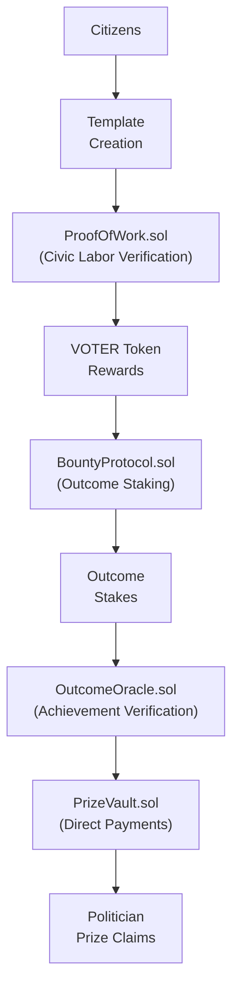

# VOTER Protocol System Architecture

## Overview

VOTER Protocol provides blockchain infrastructure for the first market for political outcomes. Citizens use Communiqué to earn tokens through verified civic labor, stake those tokens on desired policy changes, and politicians claim direct prizes for delivering results. Pure protocol economics powering democratic engagement platforms.

**ERC-8004 was built for AI agents. We extend it to human civic participants.**

## Architecture Components

### Hybrid Deployment Strategy

**Primary Execution Layer: Monad**

Monad provides high-performance EVM execution designed for civic engagement at democratic scale. Cost-efficient anchoring while core VOTER Protocol contracts—ProofOfWork, BountyProtocol, and OutcomeOracle—handle direct political prize distribution with mathematical precision. Communiqué and other platforms integrate with these contracts.

**Optional L2 Mirror: Ethereum Layer 2**

Ethereum Layer 2 mirrors enable ERC-8004 registry consumption by ETH-native applications. Cross-platform reputation portability creates seamless civic credibility transfer. Institutional integration endpoints facilitate enterprise adoption of democratic infrastructure.

### Core Smart Contract Architecture



## Agent Network Architecture

VOTER replaces rigid, hardcoded blockchain mechanics with intelligent AI agents that adapt to real human behavior and political dynamics. Rather than fixed parameters, specialized agents optimize for authentic democratic participation.

### Five Specialized Agents

**VerificationAgent** validates civic actions through multi-source verification, adapting thresholds based on emerging action patterns and network conditions. Congressional APIs provide delivery confirmation while multi-agent consensus ensures quality assessment remains decentralized.

**SupplyAgent** dynamically adjusts VOTER token minting rates responding to participation levels, economic conditions, and evolving governance goals. Inflation prevention balances with engagement incentives through real-time algorithmic optimization.

**MarketAgent** monitors and optimizes economic incentives maintaining sustainable engagement without corrupting democratic authenticity. Challenge market performance tracking ensures reputation scoring accuracy reflects actual civic contribution.

**ImpactAgent**: Measures real civic impact and representative responsiveness to calibrate reward systems. Collects from media coverage, social networks, congressional records, and direct template citations.

**ReputationAgent**: Builds credibility scores from discourse quality and challenge market participation, coordinating priority routing for high-reputation participants. Manages VOTERRecords (soulbound NFTs) and cross-platform reputation portability.

### Multi-Provider Verification

Agent consensus operates through [OpenRouter's 100+ AI models](https://openrouter.ai/docs) distributed across three equal weight classes. Major providers like OpenAI, Anthropic, and Google carry thirty-three percent weight. International models from Mistral, Cohere, and Alibaba represent thirty-four percent. Open source implementations including Llama, Mixtral, and local models operated by staked validators complete the final thirty-three percent.

No single provider can manipulate verification outcomes. Agents must achieve consensus across diverse model classes before any action receives validation.

### Dynamic Parameter Calibration

Unlike traditional protocols trapped by hardcoded constants, VOTER infrastructure continuously calibrates based on observed democratic behavior. Reward calculations adapt to measured civic impact rather than arbitrary "ten tokens per message" rules. Verification thresholds adjust responding to network conditions and emerging spam patterns. Economic incentives evolve maintaining authentic democratic participation while preventing speculative gaming. Governance proposals emerge from systematic analysis of community needs rather than founder preferences.

### ERC-8004 Implementation Strategy

**Three Registry Implementation:**

**1. IdentityRegistry.sol**
- Incremental IDs with congressional district mapping
- Privacy-preserving identity without exposing PII
- Cross-platform portable identity foundation
- `ParticipantID` system for humans with geographic correlation

**2. ReputationRegistry.sol**
- Portable credibility with cross-platform verification
- Domain expertise tracking (healthcare, economy, etc.)
- Challenge market integration with reputation staking
- Time decay and growth algorithms for authentic engagement

**3. ActionRegistry.sol**
- Immutable record of verified civic actions
- Congressional API delivery confirmations
- Template usage tracking with impact correlation
- Challenge market resolution history

## Technical Implementation

### Smart Contract Stack
- **ProofOfWork.sol**: Civic labor verification and VOTER token distribution
- **BountyProtocol.sol**: Outcome staking and prize pool management
- **OutcomeOracle.sol**: Multi-agent achievement verification
- **PrizeVault.sol**: Direct politician prize claiming
- **VOTERToken.sol**: ERC-20 bridge between civic work and outcomes
- **VOTERRecords.sol**: Soulbound reputation and anti-sybil defense
- **AgentConsensus.sol**: Multi-provider verification coordination
- **ChallengeMarket.sol**: Information quality dispute resolution

### Infrastructure Integration: Breaking Down Barriers

**Identity Verification: Democracy Without Economic Gatekeeping**

Why should civic participation cost money? It shouldn't—and now it doesn't.

Didit.me provides free forever core KYC: ID verification, face match, passive liveness detection without storing personal information on-chain. Congressional district mapping enables geographic correlation for democratic routing while premium compliance options ($0.35 AML screening, $0.50 proof of address) serve institutional requirements only when needed.

**The Revolution**: Zero-cost identity verification removes the largest barrier to authentic civic participation at scale.

**Congressional API Integration: Direct Democracy Infrastructure**

Why should citizen messages disappear into bureaucratic voids? They shouldn't—and now they don't.

Both House and Senate route constituent messages through CWC's secure XML schema with built-in rate limits; delivery confirmations provide cryptographic proof of message receipt; multi-agent verification ensures message quality while receipts get pinned to IPFS for permanent verification.

**The Result**: Citizens get cryptographic proof their voices reached legislators; legislators get verified constituent input instead of spam.

**Agent Infrastructure: Intelligence That Serves Democracy**

Why should civic verification depend on centralized human reviewers? It shouldn't—and now it doesn't.

- **LangGraph coordination** between specialized agents that learn democratic patterns
- **Temporal workflows** for complex civic action verification that humans couldn't scale  
- **ChromaDB vector memory** enabling agents to learn from democratic participation patterns
- **N8N automation pipelines** connecting civic actions to real-world legislative consequences

**Security Architecture: Democracy Without Single Points of Failure**

Why should democratic infrastructure depend on any single entity? It shouldn't—and now it doesn't.

- **Multi-sig governance** with emergency pause functionality that prevents capture while enabling evolution
- **Comprehensive auditing** requirements ensuring smart contract security matches institutional standards
- **Redundant oracle networks** preventing single points of failure that could manipulate democratic truth
- **Zero PII on-chain** while maintaining verification capabilities that prove civic participation

**The Result**: Democratic infrastructure that can't be captured, manipulated, or shut down by any single entity.

### Data Flow Architecture: Democracy That Learns

**Why should civic participation create dead-end messages? It shouldn't—and now it doesn't.**

```
Citizen Action → Multi-Agent Verification → Cryptographic Receipt → 
VOTER Token Reward → Reputation Update → Congressional Routing Priority
```

**The Revolutionary Flow**:
1. **Action Submission**: Citizens create templates or send messages that matter
2. **Multi-Source Verification**: Agents verify quality through diverse AI models—no single truth source
3. **Congressional Delivery**: CWC API provides cryptographic proof of legislative receipt
4. **Impact Tracking**: ImpactAgent monitors whether templates actually change minds
5. **Reward Distribution**: SupplyAgent calculates dynamic rewards based on real democratic impact
6. **Reputation Building**: ReputationAgent creates portable credibility that follows you across every platform

**The Result**: Civic participation becomes verifiable infrastructure that builds influence over time.

**3. CivicActionRegistry.sol**
- Event-driven civic action recording with minimal storage
- Privacy-preserving action tracking via events
- Multi-agent verification integration
- Template impact correlation for reward optimization

### Two-Token Economic Model

**VOTER Records (Non-Transferable)**
- Soul-bound proof of civic participation
- Democracy you can't sell, only earn
- Created 1:1 with verified actions (CWC messages, campaigns)
- Immutable historical record of civic engagement

**VOTER Tokens (Tradeable)**  
- Governance and utility tokens with staking rewards
- Agent-optimized rewards based on impact measurement
- Economic incentives for quality civic participation
- Challenge market staking and treasury influence

### Infrastructure That Never Sleeps

**Prize Vault: Direct Politician Rewards**

Politicians earn transparent prizes for achieving what citizens want. No intermediaries, no backroom deals, no corporate treasuries. Citizens stake tokens on outcomes, politicians claim prizes for delivery.

The difference from traditional funding? Every stake visible, every achievement verified, every prize claim public. Transparent taxable income replacing dark money influence.

**Revolutionary Prize Mechanics:**
- Direct staking on policy outcomes—no PAC intermediaries
- Multi-agent verification of achievements—no subjective scoring  
- Algorithmic prize distribution—no executive decisions
- Real-time transparency that makes corporate PACs look primitive

Why should political funding flow through corporate treasuries? It shouldn't—and now it doesn't.

**Bounty Protocol: Can Citizens Price Political Change?**

What happens when citizens can directly fund political outcomes? Markets for policy that bypass traditional campaign finance entirely. Stake tokens on the four-day work week ordinance. Politicians who deliver claim transparent prizes.

**Revolutionary Funding Architecture:**
- Quadratic staking mathematics: many small voices amplified; whale dominance mathematically diminished  
- Multi-agent consensus prevents manipulation—no single truth source
- Direct outcome verification through public records—no subjective interpretation
- Market-driven prize pools that replace traditional fundraising entirely
- Real-time transparency that makes quarterly PAC reports look like cave paintings

**The Mathematics of Democracy:**
Why does quadratic math matter? Simple: 100 people staking $10 each creates more prize money than 1 person staking $1000. Square root scaling ensures that community consensus beats concentrated wealth; maximum 10x amplification prevents runaway scenarios while preserving voice amplification.

**Protocol Innovation Beyond Compliance:**
We're not improving corporate PACs—we're making them obsolete. Citizens stake directly on outcomes. Politicians earn directly for results. Everything traceable, auditable, immutable. The first market for political change in history.

## Sources

1. ERC-8004: Trustless Agents, https://github.com/ethereum/ERCs/blob/master/ERCS/erc-8004.md
2. Monad Docs, https://docs.monad.xyz
3. House.gov, "Communicating with Congress (CWC) Overview," https://www.house.gov/doing-business-with-the-house/communicating-with-congress-cwc
4. House.gov, "CWC Advocacy Vendor Level of Service Standards," https://www.house.gov/sites/default/files/uploads/documents/cwc-advocacy-vendor-level-of-service-standards.pdf
5. Didit.me Documentation, https://docs.didit.me
6. Didit.me Features, "Free Forever Core KYC with Premium Compliance Options," https://didit.me/features
7. OpenRouter Documentation, https://openrouter.ai/docs

### Minds Changed, Not Messages Sent

**Impact Registry: Do Templates Actually Change Minds?**

We track observable behavior, not claimed intentions. Why? Because intentions lie; legislative records don't.

**What We Actually Measure:**
- Template text appearing verbatim in Congressional Record—not correlation, causation
- Temporal sequencing: template creation → coordinated campaign → floor speech citation
- Geographic clustering: districts with template campaigns show position changes; districts without don't
- Representative responsiveness measured algorithmically—with score decay ensuring continuous engagement over party loyalty
- Observable influence patterns that create verifiable chains from citizen information to political outcomes

**The Confidence Algorithm:**
How do we know templates changed minds? Mathematics: 40% weight for direct citation verification; 30% for temporal correlation patterns; 20% for geographic clustering evidence; minus 10% for alternative explanations.

**Transparent Methodology Without Financial Incentive:**
All data public—because if we're measuring democracy, democracy should be able to see how. No financial implications for the registry itself; pure information architecture that any observer can read, verify, and interpret independently.

We create the methodology. You judge the results. Democracy wins when information flows transparently.

### Death to Hardcoded Tyranny

**Why Should Blockchain Parameters Be Hardcoded Forever?**

They shouldn't—and now they aren't.

**The Agent Revolution:**
**SupplyAgent** adapts token economics based on actual network participation—not founder guesses about "optimal" inflation rates.
**MarketAgent** optimizes rewards based on measured civic impact—not arbitrary "10 tokens per message" constants.
**ImpactAgent** tracks real influence in legislative records—adjusting parameters based on what actually changes minds.
**ReputationAgent** builds credibility from discourse quality—learning what predicts constructive engagement.

**Safety Through Mathematical Boundaries:**
Can agents go rogue? No. Every parameter has hard floors and ceilings written into smart contracts. Daily change limits prevent rapid manipulation. Agents optimize within auditable ranges—but humans set the boundaries, and mathematics enforces the limits.

**The Revolutionary Principle:**
Why should smart contracts use the same reward amounts, staking requirements, and system behaviors forever? Static parameters can't adapt to changing political dynamics, network effects, or user behavior patterns.

Our agents learn what works; parameters evolve toward effectiveness; safety rails prevent chaos. The result? Living infrastructure that improves itself while staying mathematically constrained.

Agents optimize. Humans govern. Mathematics enforces. Democracy evolves.

### Quality Discourse Pays. Bad Faith Costs.

**Challenge Markets: Can Economics Fix Information Quality?**

Political discourse drowns in noise because bad information travels as fast as good. What if we could change that? What if quality reasoning paid, and bad faith actually cost money?

**Markets for Truth:**
We fix democracy's information problem with economic consequences for information quality. Community consensus evaluates discourse standards—not truth, not ideology, just the quality of reasoning itself. The result? Market mechanisms that reward constructive engagement and punish bad faith actors.

**Two Types of Challenges:**
**Template Challenges:** Dispute the underlying claims or sourcing in templates—affects everyone using that template. Stakes higher, impact broader.
**Usage Challenges:** Challenge how someone used a template or their personal additions—one-on-one disputes with focused stakes.

**What We Judge:**
- Source quality and citation standards—did you do the homework?
- Evidence-based reasoning that engages with complexity
- Good faith interaction with counterarguments—not strawman demolition
- Constructive discourse contribution—building understanding, not destroying opponents

**What We Don't Judge:**
- Political positions or ideological alignment
- Factual accuracy of claims—that's community consensus, not truth arbitration
- Popularity or mainstream acceptance—groupthink isn't wisdom

**Information Rewards:**
Higher payouts for surprising, verifiable insights that change minds or reveal new data. Templates that shift legislative positions earn creators massive reputation boosts. Community consensus determines credibility—not centralized truth committees.

**Economic Incentives for Quality:**
High reputation participants pay lower stakes—they've earned trust. Broader claims require higher stakes—skin in the game scales with impact. Winners receive losing stakes; bad faith actors literally pay the community for wasting everyone's time.

**The Formula:**
Quality discourse pays; bad faith costs. Community judgment + economic consequences = information architecture that actually works for democracy.

### Non-Transferable Proof of Democracy

**VOTER Registry: Can Democracy Be Soul-Bound?**

**Soul-bound proof.** Democracy you can't sell, only earn.

What happens when civic participation becomes permanent record? Every verified civic action creates immutable, non-transferable proof of democratic engagement. Congressional district mapped without exposing identity. Timestamp preserved permanently. Credibility scores recorded on-chain. Democratic participation that follows you across platforms—but can never be bought or sold.

**Epistemic Leverage in Action:**
Why should all civic actions receive identical rewards? They shouldn't. High-credibility actions receive bonus multipliers—quality information gets mathematically amplified. Template impact scores drive up to 10x reward multipliers for proven effectiveness. The result? Verified civic participation becomes portable reputation that compounds over time.

**The Architecture of Earned Democracy:**
Your civic record can't be transferred, sold, or manipulated—but it travels with you across every democratic platform. Want higher rewards? Build credibility through consistent quality engagement. Want priority access? Prove your track record through verifiable civic actions. 

Democracy stops being something you inherit or purchase. It becomes something you earn—and keep earning.

### ERC-8004: AI-Human Coordination Infrastructure

**ERC-8004: What If Humans and AI Used the Same Coordination Infrastructure?**

**ERC-8004 was built for AI agents. We extended it to humans. Now both can coordinate.**

What does this actually mean? Three registries create coordination infrastructure that serves both artificial and human intelligence:

**IdentityRegistry**: Portable civic identity that works across every democratic platform—human or AI-operated.
**ReputationRegistry**: Cross-platform credibility that follows participants everywhere they engage democratically.  
**CivicActionRegistry**: Event-driven participation tracking that creates machine-readable civic history.

**The Coordination Revolution:**
Why should human civic reputation be trapped in platform silos? It shouldn't. Challenge market wins build portable credibility. Template impact creates cross-platform reputation scores. Domain expertise gets tracked and verified. Reputation hashes enable any platform to verify your democratic track record instantly.

**Machine-Readable Democracy:**
Your civic credibility becomes readable by AI systems; your democratic participation creates portable reputation that other platforms can trust; your earned credibility follows you across the entire ecosystem of democratic tools.

The result? Infrastructure that serves human civic participation and AI coordination simultaneously—because democracy's future involves both.

### CommuniqueCore: Orchestration Intelligence

**Orchestration Intelligence: What If Rewards Matched Real Impact?**

**Templates that change minds get 10x rewards. Quality discourse pays.**

Why should civic actions receive identical rewards regardless of their democratic impact? They shouldn't—and now they don't.

**Three-Layer Impact Multiplication:**
1. **Template Impact**: Did your template actually change legislative positions? Proven effectiveness earns up to 10x reward multipliers.
2. **User Reputation**: Track record matters. Challenge market success and consistent quality create multiplied rewards for proven participants.  
3. **Epistemic Leverage**: High-credibility information gets bonus amplification—because quality should compound, not compete equally with noise.

**The Revolutionary Formula:**
Base rewards start with USD targets divided by real-time token prices—economic sustainability through mathematical relationships, not founder fantasies. Agent optimization adjusts for network conditions; dynamic multipliers reward measured impact; safety bounds prevent manipulation while preserving innovation.

**Living Reward Architecture:**
Why should smart contracts use the same reward calculations forever? Parameters evolve based on what actually changes minds; multipliers adapt to proven democratic effectiveness; the system learns what works—and pays accordingly.

Impact drives economics. Quality compounds rewards. Mathematics prevents gaming. Democracy finally pays for what actually works.

### Security Through Mathematical Constraints

**Security: Can Mathematical Constraints Prevent Human Corruption?**

Critical functions require multiple signatures—because power concentration corrupts, even in smart contracts. Agent parameters have hard bounds written into immutable code—because optimization without limits becomes chaos. Emergency pause mechanisms exist for true crisis scenarios—because even revolutionary systems need circuit breakers.

**The Security Trinity:**
Smart contracts enforce limits that humans can't override. Humans set the boundaries that agents can't exceed. Mathematics prevents manipulation that governance can't detect.

**The Formula for Trust:**
Multi-sig governance + parametric bounds + emergency controls = infrastructure that enables political innovation without becoming reckless.

### Zero-Cost Identity Infrastructure

**Identity Infrastructure: What If Civic Participation Had No Economic Barriers?**

**Revolutionary Identity Economics:**
- **Free Core KYC**: ID verification, face match, passive liveness—unlimited, forever
- **Premium Compliance**: Optional AML screening ($0.35) and proof of address ($0.50) for institutional requirements  
- **Developer Sandbox**: Unlimited testnet verification without burning treasury resources
- **Global Coverage**: ISO 27001 certified, GDPR compliant, 190+ countries ready for democratic participation

**The Zero-Cost Revolution:**
What happens when identity verification costs nothing? Massive civic participation becomes possible. No economic barriers to democratic engagement. Privacy-preserving district mapping enables congressional routing without exposing personal information.

**The Democratic Access Formula:**
Zero-cost identity + privacy preservation + global coverage = civic infrastructure that actually serves democracy instead of gatekeeping it.

### Cross-Platform Integration

**Cross-Platform Integration: Why Should Democratic Credibility Be Platform-Locked?**

**ERC-8004 Portable Reputation:**
It shouldn't—and now it isn't. Civic credibility works across every platform. Challenge market reputation follows you everywhere. Template impact scores travel with you. Domain expertise gets verified once, trusted everywhere. Democratic capital becomes truly portable.

**Institutional Integration Architecture:**
Treasury partnerships enable electoral funding based on verified civic impact. Machine-readable civic credentials let AI systems understand your democratic track record. Government entity integration provides official endpoints. Cross-platform challenge markets create universal standards for information quality.

### Performance at Democratic Scale

**Monad: High-Throughput Democracy Infrastructure**

Why choose Monad for democratic infrastructure? Cost-efficient EVM execution that scales to actual civic engagement volumes—not toy examples. Event-driven architecture minimizes on-chain storage costs while preserving verification integrity. Off-chain agent computation with on-chain anchoring creates the best of both worlds: intelligent optimization with cryptographic guarantees. Batch processing handles high-volume periods without breaking.

**Economic Sustainability Through Smart Design:**
Dynamic USD-based rewards survive token price volatility—because civic participation shouldn't depend on speculation. Multi-oracle consensus prevents price manipulation that could break reward calculations. Smart circuit breakers pause the system during extreme market conditions. Governance parameters scale automatically with adoption patterns.

**The Revolutionary Result:**
This architecture creates transparent, algorithmic political funding that combines proven legal corporate PAC structures with unprecedented blockchain transparency. Democracy infrastructure that actually works—at scale, sustainably, transparently.

**We didn't just build a better civic platform. We built infrastructure for democracy's future.**