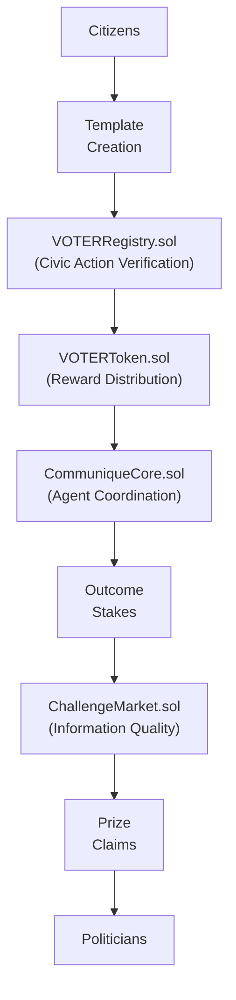

# VOTER Protocol System Architecture

## Overview

VOTER Protocol creates the first market for political outcomes, where citizens directly fund the changes they want to see and politicians earn transparent rewards for delivering results. This isn't another civic engagement platform—it's blockchain infrastructure that makes corporate PACs obsolete.

The architecture starts from a simple observation: ERC-8004 was designed for AI agent coordination, but what if we extended it to human civic participants? The result is infrastructure both humans and AI can use for authentic democratic coordination, where every action is verified, every stake is transparent, and every prize claim is auditable.

## Architecture Components

### Hybrid Deployment Strategy

We face a fundamental challenge: democracy operates at massive scale with millions of participants, but blockchain infrastructure typically handles thousands. Our solution combines the best of multiple chains to create infrastructure that actually works at democratic scale.

Monad serves as our primary execution layer, providing high-performance EVM execution specifically designed for civic engagement volumes. The core VOTER Protocol contracts—ProofOfWork, BountyProtocol, and OutcomeOracle—live here, handling direct political prize distribution with mathematical precision. When citizens stake tokens on policy outcomes or politicians claim prizes, these contracts execute with cost efficiency that makes mass participation viable.

For broader ecosystem compatibility, we maintain optional Ethereum Layer 2 mirrors that enable ERC-8004 registry consumption by ETH-native applications. This creates cross-platform reputation portability where your civic credibility seamlessly transfers between platforms. Institutional partners can integrate through familiar Ethereum infrastructure while benefiting from Monad's performance advantages.

### Core Smart Contract Architecture



## Agent Network Architecture: Death to Hardcoded Tyranny

Traditional blockchain protocols trap themselves with parameters chosen at launch and frozen forever. A founder decides "10 tokens per action" and that arbitrary number becomes immutable law. But democracy isn't static—it evolves, adapts, learns. VOTER Protocol replaces rigid mechanics with intelligent agents that respond to actual human behavior and political dynamics.

Think about the absurdity of hardcoded parameters: why should rewards be the same during a crucial vote as during congressional recess? Why should spam detection thresholds remain constant as attack patterns evolve? Static systems can't answer these questions, but our agent network can.

### Five Specialized Agents Creating Living Infrastructure

The **VerificationAgent** serves as democracy's immune system, validating civic actions through multi-source verification that adapts to emerging patterns. When Congressional APIs confirm message delivery, the agent doesn't just mark it complete—it learns from traffic patterns, adjusts quality thresholds based on network conditions, and maintains decentralized consensus across diverse AI models. During coordinated campaigns, it distinguishes authentic grassroots movements from astroturfing by analyzing participation patterns impossible to fake at scale.

The **SupplyAgent** manages VOTER token economics like a central bank that actually understands its economy. Rather than arbitrary inflation schedules, it dynamically adjusts minting rates based on real participation levels, market conditions, and governance goals. When civic engagement surges during major legislation, rewards scale up to capture momentum. During quiet periods, emissions reduce to prevent dilution. The system breathes with democracy's natural rhythms.

The **MarketAgent** acts as democracy's invisible hand, monitoring economic incentives to maintain authentic engagement without creating perverse incentives. It tracks challenge market performance, adjusts staking requirements based on dispute patterns, and ensures reputation scoring reflects genuine civic contribution rather than gaming. When speculation threatens to overwhelm participation, circuit breakers activate to protect democratic integrity.

The **ImpactAgent** answers democracy's hardest question: did this actually change anything? It measures real civic impact by tracking template language in congressional records, monitoring vote pattern changes after coordinated campaigns, and correlating civic actions with legislative outcomes. This isn't correlation-as-causation nonsense—it uses confidence intervals and humble causal claims to measure observable influence without overstating impact.

The **ReputationAgent** builds democracy's memory, creating credibility scores from discourse quality and challenge market participation. It manages VOTERRecords as soul-bound proof of civic engagement while enabling cross-platform portability through ERC-8004. High-reputation participants earn priority congressional routing and bonus multipliers—your track record becomes your civic capital.

## Agent Consensus: Preventing AI Capture Through Diversity

The greatest risk to any AI-governed system is capture by a single provider or model architecture. If OpenAI controls your verification, what happens when their models share systematic biases? If governance depends on one company's API, you've just created a new form of centralization.

VOTER Protocol prevents this through radical model diversity. Our consensus mechanisms operate through [OpenRouter's 100+ AI models](https://openrouter.ai/docs), but we don't just aggregate opinions—we enforce structural diversity across three equal weight classes.

Major providers like OpenAI, Anthropic, Google, and xAI comprise 33% of voting weight. Their sophisticated models bring capability, but their shared Silicon Valley training creates potential groupthink. International models from Mistral, Cohere, and Alibaba provide 34% weight, introducing different cultural training and architectural assumptions. Open source models running on distributed infrastructure supply the final 33%, ensuring no corporate entity can capture consensus.

Consensus requirements scale with importance. Standard civic actions need just 51% agreement across provider classes—fast and efficient for routine operations. High-value actions exceeding $1000 require 67% consensus with mandatory representation from each class. Parameter changes demand 75% agreement plus human oversight. Emergency actions trigger 90% thresholds with immediate human review.

When agents disagree, the system doesn't just average their opinions. Conflicts escalate through weighted voting where historical accuracy determines influence. An agent that correctly predicted similar situations carries more weight than one consistently wrong. If disagreement exceeds 25%, human arbitrators review with complete transparency—every model's reasoning visible, every decision auditable.

This architecture makes manipulation mathematically expensive. Corrupting one provider means nothing when two other classes disagree. Gaming becomes economically irrational when consensus requires diverse agreement. The result: verification you can trust because no single entity can control it.

### Dynamic Parameter Calibration: Learning What Democracy Needs

Every blockchain protocol starts with founders making educated guesses about optimal parameters. They choose reward amounts, staking requirements, and voting thresholds based on theory and hope. Then reality hits: users behave differently than expected, market conditions change, attackers find exploits. But those parameters are frozen in smart contracts forever.

VOTER infrastructure breaks this pattern through continuous calibration based on observed democratic behavior. Instead of guessing that messages deserve "ten tokens each," we measure which civic actions actually influence outcomes and adjust rewards accordingly. When the ImpactAgent notices templates with certain characteristics consistently change legislative positions, rewards automatically flow toward those patterns.

Verification thresholds respond to network realities rather than founder fantasies. During peaceful periods, the system relaxes to encourage participation. When spam attacks emerge, thresholds tighten within minutes, not months of governance debates. The VerificationAgent learns attack signatures and adapts defenses faster than human governance ever could.

Economic incentives evolve through measurement, not ideology. The MarketAgent tracks which reward structures create authentic engagement versus speculation. When certain incentives produce template farms instead of civic participation, parameters adjust to close the loophole. When genuine grassroots campaigns struggle against whale manipulation, quadratic scaling amplifies to restore balance.

Governance proposals emerge from data, not politics. Instead of founders or large token holders deciding what the protocol needs, agents analyze participation patterns and surface systematic issues. When the data shows certain districts consistently underparticipate, targeted incentive adjustments activate. When challenge markets reveal information quality problems in specific domains, reputation requirements adapt.

This isn't ungoverned chaos—every parameter operates within smart contract bounds that agents cannot exceed. Humans set the rails; agents optimize within them; mathematics enforces the limits. Democracy gets infrastructure that learns and adapts while remaining fundamentally secure.

### ERC-8004 Implementation: Infrastructure for Human-AI Democratic Coordination

ERC-8004 was designed for autonomous AI agents to coordinate without human intervention. We asked a different question: what if humans and AI used the same coordination infrastructure? The answer revolutionizes democratic participation.

Our implementation uses three interconnected registries that create portable, verifiable civic identity across every platform—human or AI-operated.

**IdentityRegistry.sol** creates the foundation with privacy-preserving civic identity. Each participant receives an incremental ID mapped to their congressional district without exposing personal information. This isn't surveillance—it's democratic routing that ensures your message reaches your actual representative while maintaining pseudonymity. The registry operates across platforms, so your civic identity works everywhere without platform lock-in.

**ReputationRegistry.sol** transforms credibility from social media followers into forfeitable collateral. Your reputation becomes your stake in the system—not a shield for spreading misinformation, but skin in the game that scales with influence. Domain-specific scoring prevents someone with healthcare expertise from wielding unearned influence in climate debates. Time-weighted decay ensures no one becomes permanently untouchable—reputation requires continuous quality contribution, not historical accumulation. When you make incorrect challenges, slashing mechanisms reduce your credibility proportional to claim severity.

**ActionRegistry.sol** creates immutable proof of democratic participation. Every verified civic action—from sending congressional messages to winning challenge disputes—gets permanently recorded. Congressional API confirmations provide cryptographic proof of delivery. Template usage tracking correlates your contributions with legislative outcomes. Challenge market history builds your track record across domains. This isn't just record-keeping—it's portable civic capital that any platform can verify and reward.

## Technical Implementation

### Smart Contract Stack
- **VOTERRegistry.sol**: Civic action verification and VOTER token distribution
- **VOTERToken.sol**: ERC-20 governance and utility token with staking
- **CommuniqueCore.sol**: Agent coordination and reward calculation
- **ChallengeMarket.sol**: Information quality dispute resolution
- **AgentParameters.sol**: Dynamic parameter management with safety bounds
- **ActionVerifierMultiSig.sol**: Multi-signature verification coordination
- **TreasuryManager.sol**: Prize pool and treasury management

### Infrastructure Integration: Breaking Down Barriers

**Identity Verification: Democracy Without Economic Gatekeeping**

Why should civic participation cost money? It shouldn't—and now it doesn't.

Didit.me provides free forever core KYC: ID verification, face match, passive liveness detection without storing personal information on-chain. Congressional district mapping enables geographic correlation for democratic routing while premium compliance options ($0.35 AML screening, $0.50 proof of address) serve institutional requirements only when needed.

**The Revolution**: Zero-cost identity verification removes the largest barrier to authentic civic participation at scale.

**Congressional API Integration: Direct Democracy Infrastructure**

Both House and Senate route constituent messages through CWC's secure XML schema with built-in rate limits. Delivery confirmations provide cryptographic proof of message receipt. Multi-agent verification ensures message quality while receipts get pinned to IPFS for permanent verification.

Citizens get cryptographic proof their voices reached legislators; legislators get verified constituent input instead of spam.

**Agent Infrastructure: Intelligence That Serves Democracy**

- **LangGraph coordination** between specialized agents that learn democratic patterns
- **Temporal workflows** for complex civic action verification at scale  
- **ChromaDB vector memory** enabling agents to learn from participation patterns
- **N8N automation pipelines** connecting civic actions to legislative consequences

**Security Architecture**

- **Multi-sig governance** with emergency pause functionality preventing capture while enabling evolution
- **Comprehensive auditing** ensuring smart contract security meets institutional standards
- **Redundant oracle networks** preventing single points of failure
- **Zero PII on-chain** while maintaining verification capabilities

Democratic infrastructure that can't be captured, manipulated, or shut down by any single entity.

### Data Flow Architecture

```
Citizen Action → Multi-Agent Verification → Cryptographic Receipt → 
VOTER Token Reward → Reputation Update → Congressional Routing Priority
```

1. **Action Submission**: Citizens create templates or send messages
2. **Multi-Source Verification**: Agents verify quality through diverse AI models
3. **Congressional Delivery**: CWC API provides cryptographic proof of legislative receipt
4. **Impact Tracking**: ImpactAgent monitors whether templates change minds
5. **Reward Distribution**: SupplyAgent calculates dynamic rewards based on impact
6. **Reputation Building**: ReputationAgent creates portable credibility

Civic participation becomes verifiable infrastructure that builds influence over time.


### Two-Token Economic Model

**VOTER Records (Non-Transferable)**
- Soul-bound proof of civic participation
- Democracy you can't sell, only earn
- Created 1:1 with verified actions (CWC messages, campaigns)
- Immutable historical record of civic engagement

**VOTER Tokens (Tradeable)**  
- Governance and utility tokens with staking rewards
- Agent-optimized rewards based on impact measurement
- Economic incentives for quality civic participation
- Challenge market staking and treasury influence

### Infrastructure That Never Sleeps

**Prize Vault: Direct Politician Rewards**

## Prize Claiming Process

Politicians claim transparent prizes for verified achievement through a multi-step verification process:

1. **Achievement Submission**: Politicians submit claims with supporting documentation (bill numbers, vote records, implementation evidence)
2. **Multi-Agent Verification**: ImpactAgent cross-references claims against public records, legislative databases, and prediction market outcomes
3. **Challenge Period**: 7-day window for community challenges with stake-based disputes
4. **Consensus Verification**: Requires 67% agent consensus across diverse model providers
5. **Prize Release**: Automatic transfer to politician's verified wallet address
6. **Tax Documentation**: 1099 forms generated for transparent taxable income

Every stake visible, every achievement verified, every prize claim public. Transparent taxable income replacing dark money influence.

**Revolutionary Prize Mechanics:**
- Direct staking on policy outcomes—no PAC intermediaries
- Multi-agent verification of achievements—no subjective scoring  
- Algorithmic prize distribution—no executive decisions
- Real-time transparency that makes corporate PACs look primitive

Why should political funding flow through corporate treasuries? It shouldn't—and now it doesn't.

**Bounty Protocol: Can Citizens Price Political Change?**

What happens when citizens can directly fund political outcomes? Markets for policy that bypass traditional campaign finance entirely. Stake tokens on the four-day work week ordinance. Politicians who deliver claim transparent prizes.

**Revolutionary Funding Architecture:**
- Quadratic staking mathematics: many small voices amplified; whale dominance mathematically diminished  
- Multi-agent consensus prevents manipulation—no single truth source
- Direct outcome verification through public records—no subjective interpretation
- Market-driven prize pools that replace traditional fundraising entirely
- Real-time transparency that makes quarterly PAC reports look like cave paintings

**The Mathematics of Democracy:**
Why does quadratic math matter? Simple: 100 people staking $10 each creates more prize money than 1 person staking $1000. Square root scaling ensures that community consensus beats concentrated wealth; maximum 10x amplification prevents runaway scenarios while preserving voice amplification.

**Protocol Innovation Beyond Compliance:**
We're not improving corporate PACs—we're making them obsolete. Citizens stake directly on outcomes. Politicians earn directly for results. Everything traceable, auditable, immutable. The first market for political change in history.

## Sources

1. ERC-8004: Trustless Agents, https://github.com/ethereum/ERCs/blob/master/ERCS/erc-8004.md
2. Monad Docs, https://docs.monad.xyz
3. House.gov, "Communicating with Congress (CWC) Overview," https://www.house.gov/doing-business-with-the-house/communicating-with-congress-cwc
4. House.gov, "CWC Advocacy Vendor Level of Service Standards," https://www.house.gov/sites/default/files/uploads/documents/cwc-advocacy-vendor-level-of-service-standards.pdf
5. Didit.me Documentation, https://docs.didit.me
6. Didit.me Features, "Free Forever Core KYC with Premium Compliance Options," https://didit.me/features
7. OpenRouter Documentation, https://openrouter.ai/docs

## Measuring Impact: From Messages Sent to Minds Changed

Every civic platform counts messages sent. We count minds changed.

This distinction transforms democratic engagement from volume-based activism to impact-oriented participation. Congressional offices receive 81 million messages yearly, but how many actually influence decisions? How many change positions? How many shape legislation? Traditional platforms can't answer because they measure activity, not influence.

The ImpactAgent tracks observable behavior rather than claimed intentions because intentions lie but legislative records don't. When template text appears verbatim in the Congressional Record, that's not correlation—it's direct citation we can verify. When representatives quote citizen language in floor speeches after coordinated campaigns using those exact templates, we map the influence chain from creation to consequence.

Temporal sequencing reveals causation patterns. A template gets created Monday, spreads through coordinated campaigns Tuesday through Thursday, appears in a floor speech Friday. That's observable influence. Geographic clustering strengthens confidence—when districts with heavy template campaigns show position changes while similar districts without campaigns don't, we're seeing democracy in action.

Our confidence algorithm weighs multiple factors: 40% for direct citation verification when template language appears in official records, 30% for temporal correlation between campaigns and position changes, 20% for geographic clustering showing differential impacts, minus 10% for alternative explanations that could account for the change.

This methodology remains completely transparent and publicly auditable. Every data point, every calculation, every conclusion is visible because measuring democracy requires democratic transparency. The registry has no financial stake in these measurements—we provide pure information architecture that anyone can verify independently.

When templates demonstrably change legislative positions, creators earn up to 10x reward multipliers. For the first time in democratic history, we reward actual impact rather than mere activity.

## Living Infrastructure: How VOTER Protocol Evolves With Democracy

Every blockchain protocol launches with parameters that become permanent prisoners of their genesis block. The founders guess that staking should require 1000 tokens, rewards should be 10 tokens per action, and verification needs 5 confirmations. Then reality proves them wrong, but the parameters are frozen forever in immutable smart contracts.

VOTER Protocol breaks this trap through living infrastructure that learns and adapts while remaining mathematically secure. Instead of hardcoded constants, specialized agents continuously optimize parameters based on observed outcomes.

The **SupplyAgent** adapts token economics to actual participation patterns rather than theoretical models. When civic engagement surges during crucial legislation, emission rates increase to capture momentum. During quiet periods, rewards decrease to prevent inflation. The system breathes with democracy's natural rhythm rather than forcing arbitrary schedules.

The **MarketAgent** optimizes reward calculations based on measured impact rather than fixed formulas. Why should a template that changes ten legislative positions earn the same as one that changes none? Dynamic multipliers ensure rewards flow toward actual influence, not just activity.

The **ImpactAgent** tracks which approaches actually work by monitoring legislative records, vote changes, and policy outcomes. When certain template patterns consistently succeed, the system learns and adapts incentives accordingly. Democracy gets smarter through observation.

The **ReputationAgent** builds sophisticated understanding of what predicts quality discourse. Which early signals indicate a participant will contribute constructively versus destructively? The system learns these patterns and adjusts trust accordingly.

But can agents go rogue? No—every parameter operates within hard limits encoded in smart contracts. Rewards can vary between $0.10 and $10 but never exceed those bounds. Daily change caps prevent sudden manipulation. Humans set the rails, agents optimize within them, mathematics enforces the boundaries.

The result is infrastructure that improves continuously without sacrificing security—living democracy that evolves with its participants.

## Challenge Markets: The Economic Solution to Information Quality

Political discourse drowns in misinformation because spreading false claims costs nothing while fact-checking exhausts honest participants. Bad actors profit from confusion while truth-seekers burn out playing defense. VOTER's challenge markets flip this equation: quality discourse pays real money, bad faith costs real stakes.

The mechanism is elegantly simple. When you see a questionable claim about voting records, policy impacts, or political positions, you can stake VOTER tokens to challenge it. But we don't adjudicate opinions or ideology—only verifiable facts. Your grandmother's healthcare story remains protected as personal truth. Claiming a senator voted against a bill they actually supported? That's economically challengeable.

The system recognizes two distinct challenge types that create different economic dynamics:

**Template Challenges** target the underlying claims in templates themselves—the core information that thousands of citizens might adopt and send. Because these affect everyone using that template, stakes run higher and impact spreads broader. Successfully challenging a viral template containing false voting records doesn't just win you tokens—it prevents thousands of citizens from unwittingly spreading misinformation.

**Usage Challenges** focus on personal additions citizens make when customizing templates. Citizens often strengthen templates with personal anecdotes: "This policy destroyed my family's small business" or "My grandmother died waiting for approval." These stories add emotional weight, but when they're fabricated, they corrupt democratic discourse. The staking system scales with verifiability: minor personal details cost 10-50 VOTER to challenge, significant experiences require 100-500 VOTER stakes, and easily verifiable claims through public records demand 1000+ VOTER commitments.

### How Challenge Resolution Actually Works

Resolving challenges requires sophisticated analysis that no single AI model or human reviewer could accomplish alone. Our multi-layer consensus architecture creates robust adjudication through systematic evaluation.

The first layer performs content analysis where specialized agents examine disputed claims from different angles. The VerificationAgent scans for factual inconsistencies, comparing claims against its vast training on political records and public documents. Simultaneously, the ReputationAgent weighs the track records of both challenger and challenged—not to bias toward authority, but to factor in historical accuracy. The ImpactAgent assesses the potential democratic harm if the misinformation spreads unchecked.

The second layer evaluates context that pure content analysis might miss. Agents cross-reference personal claims against public records where possible—did that factory actually close? Did that bill actually pass? Pattern detection algorithms identify suspicious repetitions, like identical "personal" stories appearing across multiple users. Temporal analysis reveals coordination, such as personal additions spiking just before crucial votes.

The third layer integrates democratic participation with algorithmic determination. Agent consensus provides 60% of the decision weight through transparent scoring, while a community validation period contributes 40%—ensuring human wisdom tempers pure algorithmic judgment. Edge cases that confuse both AI and community trigger escalation protocols for specialist human review. Once consensus is reached, smart contracts automatically redistribute stakes from the incorrect party to the truthful one.

### The Standards: What Gets Rewarded vs What Gets Punished

Challenge markets evaluate information quality, not truth itself. This distinction matters because democracy needs good faith disagreement, not algorithmic enforcement of approved facts.

We reward high-quality reasoning regardless of conclusions. Did you cite credible sources? Did you engage with counterarguments honestly rather than constructing strawmen? Did you acknowledge complexity rather than pretending simple answers to difficult questions? These standards create constructive discourse that builds understanding rather than destroying opponents.

We explicitly don't judge political positions or ideological alignment—a conservative argument with excellent sourcing beats a progressive argument with poor evidence, and vice versa. We don't arbitrate ultimate truth—that's for democratic consensus, not algorithmic determination. We don't reward popularity—groupthink isn't wisdom, and contrarian perspectives with solid reasoning deserve rewards even when unpopular.

**Information Rewards:**
Higher payouts for surprising, verifiable insights that change minds or reveal new data. Templates that shift legislative positions earn creators massive reputation boosts. Agent consensus combined with community validation determines credibility—not centralized truth committees.

**Economic Consequences:**
- Stake VOTER tokens to challenge questionable claims
- Winners take losers' stakes through autonomous resolution
- High reputation means more to lose (reputation as forfeitable collateral)
- Quadratic scaling prevents whale dominance through mathematical constraints

### The Resolution Process: From Challenge to Consequence

When someone initiates a challenge, a sophisticated resolution process activates that balances speed with accuracy, automation with human oversight.

The challenger must submit evidence supporting their dispute along with their token stake. This isn't casual flagging—real money is on the line. The system then triggers autonomous evidence gathering, where AI models collect relevant documentation, voting records, public statements, and historical precedents. This happens within minutes, not days.

Twenty-plus AI systems across diverse providers perform independent analysis, each evaluating the evidence through different training and architectures. Some models excel at detecting logical fallacies, others at verifying citations, still others at identifying doctored evidence. Each system produces confidence scores explaining not just their conclusion but their certainty level.

Adversarial review adds another protection layer. Specialized dispute models actively try to find flaws in the majority position, challenging assumptions and poking holes in reasoning. This isn't consensus-seeking—it's stress-testing conclusions before stakes get redistributed.

Consensus formation requires 67% agreement across architecturally diverse systems. This threshold prevents both false positives and false negatives while remaining achievable for clear-cut cases. When consensus crystallizes, smart contracts automatically execute stake redistribution—winners receive losers' stakes minus a small protocol fee that funds system operations.

The formula is simple but powerful: quality discourse literally pays while bad faith actually costs. Economic stakes plus autonomous consensus equals information accountability without censorship.

## Non-Transferable Proof: Democracy as Earned Credibility

Traditional democracy treats all voices equally—the informed expert and the random troll get identical weight. Social media "fixes" this through follower counts that can be bought, manipulated, or inherited. VOTER Protocol offers a third way: democracy as earned, non-transferable credibility.

Every verified civic action you take creates permanent, soul-bound proof of participation. These VOTERRecords can't be sold, transferred, or faked. Your congressional district gets mapped without exposing your identity. Timestamps preserve the chronology of your civic engagement. Credibility scores accumulate based on discourse quality, not popularity.

This civic record follows you across every democratic platform but remains forever yours alone. Unlike NFTs that trade on speculation, VOTERRecords have value precisely because they can't be traded. They represent authentic democratic participation that must be earned through actual civic work.

The system recognizes that not all civic actions deserve identical rewards. High-credibility participants—those with track records of quality discourse and successful challenges—receive bonus multipliers up to 10x. Templates from proven contributors get priority routing to congressional offices. Quality information gets mathematically amplified while noise gets naturally suppressed.

This creates profound incentive alignment. Want higher rewards? Build credibility through consistent quality engagement. Want your templates to reach decision-makers? Establish a track record of accuracy and impact. Want to influence democratic outcomes? Earn trust through verifiable civic contribution.

Democracy transforms from something you're born into or buy into, into something you build through sustained quality participation.

### ERC-8004: AI-Human Coordination Infrastructure

**ERC-8004: What If Humans and AI Used the Same Coordination Infrastructure?**

**ERC-8004 was built for AI agents. We extended it to humans. Now both can coordinate.**

What does this actually mean? Three registries create coordination infrastructure that serves both artificial and human intelligence:

**IdentityRegistry**: Portable civic identity that works across every democratic platform—human or AI-operated.
**ReputationRegistry**: Cross-platform credibility that follows participants everywhere they engage democratically.  
**CivicActionRegistry**: Event-driven participation tracking that creates machine-readable civic history.

**The Coordination Revolution:**
Why should human civic reputation be trapped in platform silos? It shouldn't. Challenge market wins build portable credibility. Template impact creates cross-platform reputation scores. Domain expertise gets tracked and verified. Reputation hashes enable any platform to verify your democratic track record instantly.

**Machine-Readable Democracy:**
Your civic credibility becomes readable by AI systems; your democratic participation creates portable reputation that other platforms can trust; your earned credibility follows you across the entire ecosystem of democratic tools.

The result? Infrastructure that serves human civic participation and AI coordination simultaneously—because democracy's future involves both.

### CommuniqueCore: Orchestration Intelligence

**Orchestration Intelligence: What If Rewards Matched Real Impact?**

**Templates that change minds get 10x rewards. Quality discourse pays.**

Why should civic actions receive identical rewards regardless of their democratic impact? They shouldn't—and now they don't.

**Three-Layer Impact Multiplication:**
1. **Template Impact**: Did your template actually change legislative positions? Proven effectiveness earns up to 10x reward multipliers.
2. **User Reputation**: Track record matters. Challenge market success and consistent quality create multiplied rewards for proven participants.  
3. **Epistemic Leverage**: High-credibility information gets bonus amplification—because quality should compound, not compete equally with noise.

**The Revolutionary Formula:**
Base rewards start with USD targets divided by real-time token prices—economic sustainability through mathematical relationships, not founder fantasies. Agent optimization adjusts for network conditions; dynamic multipliers reward measured impact; safety bounds prevent manipulation while preserving innovation.

**Living Reward Architecture:**
Why should smart contracts use the same reward calculations forever? Parameters evolve based on what actually changes minds; multipliers adapt to proven democratic effectiveness; the system learns what works—and pays accordingly.

Impact drives economics. Quality compounds rewards. Mathematics prevents gaming. Democracy finally pays for what actually works.

### Security Through Mathematical Constraints

**Security: Can Mathematical Constraints Prevent Human Corruption?**

Critical functions require multiple signatures—because power concentration corrupts, even in smart contracts. Agent parameters have hard bounds written into immutable code—because optimization without limits becomes chaos. Emergency pause mechanisms exist for true crisis scenarios—because even revolutionary systems need circuit breakers.

**The Security Trinity:**
Smart contracts enforce limits that humans can't override. Humans set the boundaries that agents can't exceed. Mathematics prevents manipulation that governance can't detect.

**The Formula for Trust:**
Multi-sig governance + parametric bounds + emergency controls = infrastructure that enables political innovation without becoming reckless.

### Zero-Cost Identity Infrastructure

**Identity Infrastructure: What If Civic Participation Had No Economic Barriers?**

**Revolutionary Identity Economics:**
- **Free Core KYC**: ID verification, face match, passive liveness—unlimited, forever
- **Premium Compliance**: Optional AML screening ($0.35) and proof of address ($0.50) for institutional requirements  
- **Developer Sandbox**: Unlimited testnet verification without burning treasury resources
- **Global Coverage**: ISO 27001 certified, GDPR compliant, 190+ countries ready for democratic participation

**The Zero-Cost Revolution:**
What happens when identity verification costs nothing? Massive civic participation becomes possible. No economic barriers to democratic engagement. Privacy-preserving district mapping enables congressional routing without exposing personal information.

**The Democratic Access Formula:**
Zero-cost identity + privacy preservation + global coverage = civic infrastructure that actually serves democracy instead of gatekeeping it.

### Cross-Platform Integration

**Multi-API Gateway Framework**:
- **Unified Interface Layer**: Standardized VOTER Protocol endpoints regardless of underlying national API differences
- **Parliamentary Adapter Pattern**: Standardized integration for OpenParliament, Dados Abertos, Members API, KakaoTalk, and other national systems
- **Regional Compliance Engine**: Automated adaptation to local campaign finance and civic engagement laws
- **Cross-Platform Identity Bridge**: ERC-8004 reputation portability across all integrated parliamentary systems globally

**ERC-8004 Portable Reputation:**
Civic credibility works across every platform. Challenge market reputation follows you everywhere. Template impact scores travel with you. Domain expertise gets verified once, trusted everywhere. Democratic capital becomes truly portable.

**Institutional Integration Architecture:**
Treasury partnerships enable electoral funding based on verified civic impact. Machine-readable civic credentials let AI systems understand your democratic track record. Government entity integration provides official endpoints. Cross-platform challenge markets create universal standards for information quality.

### Performance at Democratic Scale

**Monad: High-Throughput Democracy Infrastructure**

Why choose Monad for democratic infrastructure? Cost-efficient EVM execution that scales to actual civic engagement volumes—not toy examples. Event-driven architecture minimizes on-chain storage costs while preserving verification integrity. Off-chain agent computation with on-chain anchoring creates the best of both worlds: intelligent optimization with cryptographic guarantees. Batch processing handles high-volume periods without breaking.

**Economic Sustainability Through Smart Design:**
Dynamic USD-based rewards survive token price volatility—because civic participation shouldn't depend on speculation. Multi-oracle consensus prevents price manipulation that could break reward calculations. Smart circuit breakers pause the system during extreme market conditions. Governance parameters scale automatically with adoption patterns.

**The Revolutionary Result:**
This architecture creates transparent, algorithmic political funding that combines proven legal corporate PAC structures with unprecedented blockchain transparency. Democracy infrastructure that actually works—at scale, sustainably, transparently.

**We didn't just build a better civic platform. We built infrastructure for democracy's future.**

## Sources and Technical Standards

**Core Protocol References:**
- [ERC-8004 Specification](https://github.com/ethereum/ERCs/blob/master/ERCS/erc-8004.md) - Autonomous Agent Coordination Infrastructure
- [Kleros Protocol](https://kleros.io/assets/whitepaper.pdf) - Decentralized Justice System Design
- [Myerson Mechanism Design](https://www.jstor.org/stable/1911865) - Optimal Auction Theory for Consensus
- [BrightID Social Verification](https://www.brightid.org/whitepaper) - Decentralized Identity Networks
- [CLARITY Act Framework](https://www.congress.gov/bill/118th-congress/house-bill/1628) - Digital Commodity Regulation

**AI and Consensus Research:**
- [Multi-Agent Systems](https://www.wiley.com/en-us/An+Introduction+to+MultiAgent+Systems%2C+2nd+Edition-p-9780470519462) - Distributed Intelligence Architecture
- [Artificial Intelligence: Modern Approach](https://aima.cs.berkeley.edu/) - Autonomous System Design
- [Zero-Knowledge Proofs](https://dl.acm.org/doi/10.1145/22145.22178) - Privacy-Preserving Verification
- [NIST Digital Identity Guidelines](https://pages.nist.gov/800-63-3/) - Identity Verification Standards

**Economic and Reputation Systems:**
- [Reputation Economics](https://www.jstor.org/stable/3132171) - Trust in Internet Transactions
- [Bootstrap Statistical Methods](https://www.routledge.com/An-Introduction-to-the-Bootstrap/Efron-Tibshirani/p/book/9780412042317) - Confidence Interval Methodology
- [Seller Reputation Dynamics](https://www.jstor.org/stable/40864904) - Market-Based Credibility Systems

**Legal and Compliance:**
- [18 U.S.C. §597](https://www.law.cornell.edu/uscode/text/18/597) - Federal Election Crimes Prevention
- [Congressional API Documentation](https://www.house.gov/doing-business-with-the-house/communicating-with-congress-cwc) - Verified Delivery Systems

**Implementation Infrastructure:**
- [OpenAI Platform](https://platform.openai.com/docs) - Commercial AI Model Access
- [Anthropic Claude](https://docs.anthropic.com/) - Constitutional AI Framework  
- [xAI Documentation](https://docs.x.ai/) - Adversarial AI Models

This autonomous consensus architecture transforms democratic participation from human-captured validation to mathematically verifiable civic infrastructure.