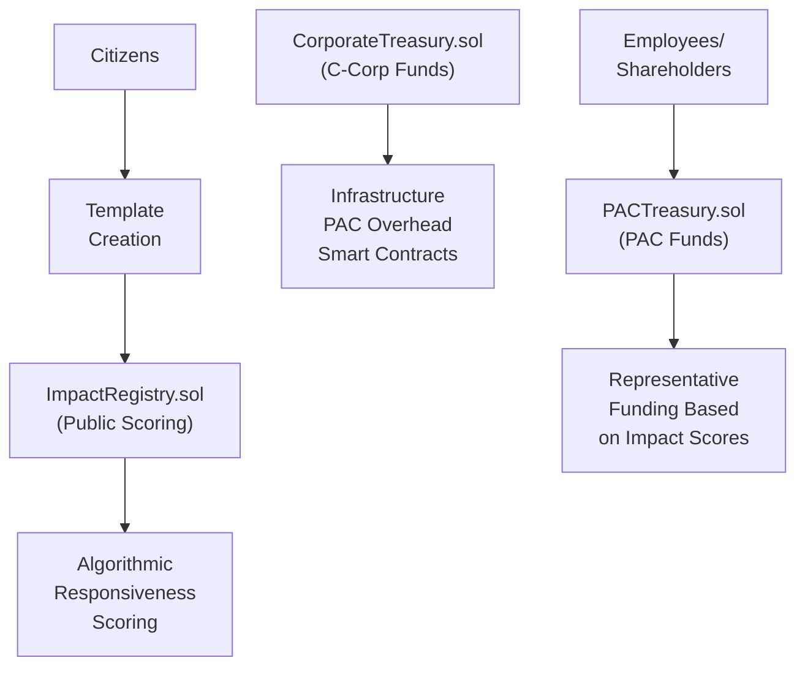

# VOTER Protocol System Architecture

## Overview

VOTER Protocol implements transparent corporate PAC infrastructure using blockchain technology. The system combines legal corporate PAC structures with algorithmic transparency, quadratic funding mechanisms, and observable impact measurement.

**ERC-8004 was built for AI agents. We extend it to human civic participants.**

## Architecture Components

### Hybrid Deployment Strategy

**Primary Execution Layer: Monad**
- High-performance EVM execution for civic engagement scale
- Cost-efficient anchoring with proven infrastructure
- Core contracts: CorporateTreasury, PACTreasury, ImpactRegistry

**Optional L2 Mirror: Ethereum Layer 2**
- ERC-8004 registries for ETH-native consumption
- Cross-platform reputation portability
- Institutional integration endpoints

### Core Smart Contract Architecture

### ERC-8004 Implementation Strategy

**Three Registry Implementation:**

**1. IdentityRegistry.sol**
- Incremental IDs with congressional district mapping
- Privacy-preserving identity without exposing PII
- Cross-platform portable identity foundation
- `ParticipantID` system for humans with geographic correlation

**2. ReputationRegistry.sol**
- Portable credibility with cross-platform verification
- Domain expertise tracking (healthcare, economy, etc.)
- Challenge market integration with reputation staking
- Time decay and growth algorithms for authentic engagement

**3. CivicActionRegistry.sol**
- Event-driven civic action recording with minimal storage
- Privacy-preserving action tracking via events
- Multi-agent verification integration
- Template impact correlation for reward optimization

### Two-Token Economic Model

**VOTER Records (Non-Transferable)**
- Soul-bound proof of civic participation
- Democracy you can't sell, only earn
- Created 1:1 with verified actions (CWC messages, campaigns)
- Immutable historical record of civic engagement

**VOTER Tokens (Tradeable)**  
- Governance and utility tokens with staking rewards
- Agent-optimized rewards based on impact measurement
- Economic incentives for quality civic participation
- Challenge market staking and treasury influence

### Infrastructure That Never Sleeps

**Corporate Treasury: What Happens When Backrooms Meet Blockchain?**

Microsoft PAC operates in backrooms. We operate on blockchain. The difference? Every grant proposal becomes public record. Every vote gets recorded permanently. Every purpose must be validated by smart contracts.

What does multi-sig governance actually prevent? Capture—while enabling rapid infrastructure development that never stops building democratic capacity.

**Revolutionary Mechanisms:**
- Transparent grant allocation—no more black box infrastructure funding
- Multi-signature governance that prevents single-party control
- Smart contract validation of purposes: infrastructure, development, audits, overhead
- Real-time transparency that makes traditional corporate opacity look primitive

Why should corporate treasuries hide their decisions? They shouldn't—and now they can't.

**PAC Treasury: Can Math Kill Plutocracy?**

What happens when smart contracts enforce FEC limits automatically? No human error. No regulatory violations. No backroom decisions about who gets funded—just algorithmic compliance that makes traditional PACs look primitive.

**Revolutionary Funding Architecture:**
- Smart contract FEC enforcement: automatic, auditable, unbreakable
- Quadratic funding mathematics: many small voices amplified; whale dominance mathematically diminished  
- Restricted class solicitation—because legal compliance isn't optional
- Algorithmic funding decisions that replace executive meetings entirely
- Real-time transparency that makes quarterly reports look like cave paintings

**The Mathematics of Democracy:**
Why does quadratic math matter? Simple: 100 people contributing $10 each generates more matching funds than 1 person contributing $1000. Square root scaling ensures that community consensus beats concentrated wealth; maximum 10x amplification prevents runaway scenarios while preserving voice amplification.

**Legal Innovation Through Transparency:**
We use the same legal structure Microsoft and Google use—except everything happens on blockchain. Individual contribution limits? Enforced by smart contracts. Election cycle restrictions? Coded into the mathematics. Reporting requirements? Real-time and permanent. 

Fifty years of corporate PAC precedent meets radical transparency. The law doesn't change—the implementation becomes revolutionary.

### Minds Changed, Not Messages Sent

**Impact Registry: Do Templates Actually Change Minds?**

We track observable behavior, not claimed intentions. Why? Because intentions lie; legislative records don't.

**What We Actually Measure:**
- Template text appearing verbatim in Congressional Record—not correlation, causation
- Temporal sequencing: template creation → coordinated campaign → floor speech citation
- Geographic clustering: districts with template campaigns show position changes; districts without don't
- Representative responsiveness measured algorithmically—with score decay ensuring continuous engagement over party loyalty
- Observable influence patterns that create verifiable chains from citizen information to political outcomes

**The Confidence Algorithm:**
How do we know templates changed minds? Mathematics: 40% weight for direct citation verification; 30% for temporal correlation patterns; 20% for geographic clustering evidence; minus 10% for alternative explanations.

**Transparent Methodology Without Financial Incentive:**
All data public—because if we're measuring democracy, democracy should be able to see how. No financial implications for the registry itself; pure information architecture that any observer can read, verify, and interpret independently.

We create the methodology. You judge the results. Democracy wins when information flows transparently.

### Death to Hardcoded Tyranny

**Why Should Blockchain Parameters Be Hardcoded Forever?**

They shouldn't—and now they aren't.

**The Agent Revolution:**
**SupplyAgent** adapts token economics based on actual network participation—not founder guesses about "optimal" inflation rates.
**MarketAgent** optimizes rewards based on measured civic impact—not arbitrary "10 tokens per message" constants.
**ImpactAgent** tracks real influence in legislative records—adjusting parameters based on what actually changes minds.
**ReputationAgent** builds credibility from discourse quality—learning what predicts constructive engagement.

**Safety Through Mathematical Boundaries:**
Can agents go rogue? No. Every parameter has hard floors and ceilings written into smart contracts. Daily change limits prevent rapid manipulation. Agents optimize within auditable ranges—but humans set the boundaries, and mathematics enforces the limits.

**The Revolutionary Principle:**
Why should smart contracts use the same reward amounts, staking requirements, and system behaviors forever? Static parameters can't adapt to changing political dynamics, network effects, or user behavior patterns.

Our agents learn what works; parameters evolve toward effectiveness; safety rails prevent chaos. The result? Living infrastructure that improves itself while staying mathematically constrained.

Agents optimize. Humans govern. Mathematics enforces. Democracy evolves.

### Quality Discourse Pays. Bad Faith Costs.

**Challenge Markets: Can Economics Fix Information Quality?**

Political discourse drowns in noise because bad information travels as fast as good. What if we could change that? What if quality reasoning paid, and bad faith actually cost money?

**Markets for Truth:**
We fix democracy's information problem with economic consequences for information quality. Community consensus evaluates discourse standards—not truth, not ideology, just the quality of reasoning itself. The result? Market mechanisms that reward constructive engagement and punish bad faith actors.

**Two Types of Challenges:**
**Template Challenges:** Dispute the underlying claims or sourcing in templates—affects everyone using that template. Stakes higher, impact broader.
**Usage Challenges:** Challenge how someone used a template or their personal additions—one-on-one disputes with focused stakes.

**What We Judge:**
- Source quality and citation standards—did you do the homework?
- Evidence-based reasoning that engages with complexity
- Good faith interaction with counterarguments—not strawman demolition
- Constructive discourse contribution—building understanding, not destroying opponents

**What We Don't Judge:**
- Political positions or ideological alignment
- Factual accuracy of claims—that's community consensus, not truth arbitration
- Popularity or mainstream acceptance—groupthink isn't wisdom

**Information Rewards:**
Higher payouts for surprising, verifiable insights that change minds or reveal new data. Templates that shift legislative positions earn creators massive reputation boosts. Community consensus determines credibility—not centralized truth committees.

**Economic Incentives for Quality:**
High reputation participants pay lower stakes—they've earned trust. Broader claims require higher stakes—skin in the game scales with impact. Winners receive losing stakes; bad faith actors literally pay the community for wasting everyone's time.

**The Formula:**
Quality discourse pays; bad faith costs. Community judgment + economic consequences = information architecture that actually works for democracy.

### Non-Transferable Proof of Democracy

**VOTER Registry: Can Democracy Be Soul-Bound?**

**Soul-bound proof.** Democracy you can't sell, only earn.

What happens when civic participation becomes permanent record? Every verified civic action creates immutable, non-transferable proof of democratic engagement. Congressional district mapped without exposing identity. Timestamp preserved permanently. Credibility scores recorded on-chain. Democratic participation that follows you across platforms—but can never be bought or sold.

**Epistemic Leverage in Action:**
Why should all civic actions receive identical rewards? They shouldn't. High-credibility actions receive bonus multipliers—quality information gets mathematically amplified. Template impact scores drive up to 10x reward multipliers for proven effectiveness. The result? Verified civic participation becomes portable reputation that compounds over time.

**The Architecture of Earned Democracy:**
Your civic record can't be transferred, sold, or manipulated—but it travels with you across every democratic platform. Want higher rewards? Build credibility through consistent quality engagement. Want priority access? Prove your track record through verifiable civic actions. 

Democracy stops being something you inherit or purchase. It becomes something you earn—and keep earning.

### ERC-8004: AI-Human Coordination Infrastructure

**ERC-8004: What If Humans and AI Used the Same Coordination Infrastructure?**

**ERC-8004 was built for AI agents. We extended it to humans. Now both can coordinate.**

What does this actually mean? Three revolutionary registries create coordination infrastructure that serves both artificial and human intelligence:

**IdentityRegistry**: Portable civic identity that works across every democratic platform—human or AI-operated.
**ReputationRegistry**: Cross-platform credibility that follows participants everywhere they engage democratically.  
**CivicActionRegistry**: Event-driven participation tracking that creates machine-readable civic history.

**The Coordination Revolution:**
Why should human civic reputation be trapped in platform silos? It shouldn't. Challenge market wins build portable credibility. Template impact creates cross-platform reputation scores. Domain expertise gets tracked and verified. Reputation hashes enable any platform to verify your democratic track record instantly.

**Machine-Readable Democracy:**
Your civic credibility becomes readable by AI systems; your democratic participation creates portable reputation that other platforms can trust; your earned credibility follows you across the entire ecosystem of democratic tools.

The result? Infrastructure that serves human civic participation and AI coordination simultaneously—because democracy's future involves both.

### CommuniqueCore: Orchestration Intelligence

**Orchestration Intelligence: What If Rewards Matched Real Impact?**

**Templates that change minds get 10x rewards. Quality discourse pays.**

Why should civic actions receive identical rewards regardless of their democratic impact? They shouldn't—and now they don't.

**Three-Layer Impact Multiplication:**
1. **Template Impact**: Did your template actually change legislative positions? Proven effectiveness earns up to 10x reward multipliers.
2. **User Reputation**: Track record matters. Challenge market success and consistent quality create multiplied rewards for proven participants.  
3. **Epistemic Leverage**: High-credibility information gets bonus amplification—because quality should compound, not compete equally with noise.

**The Revolutionary Formula:**
Base rewards start with USD targets divided by real-time token prices—economic sustainability through mathematical relationships, not founder fantasies. Agent optimization adjusts for network conditions; dynamic multipliers reward measured impact; safety bounds prevent manipulation while preserving innovation.

**Living Reward Architecture:**
Why should smart contracts use the same reward calculations forever? Parameters evolve based on what actually changes minds; multipliers adapt to proven democratic effectiveness; the system learns what works—and pays accordingly.

Impact drives economics. Quality compounds rewards. Mathematics prevents gaming. Democracy finally pays for what actually works.

### Security Through Mathematical Constraints

**Security: Can Mathematical Constraints Prevent Human Corruption?**

Critical functions require multiple signatures—because power concentration corrupts, even in smart contracts. Agent parameters have hard bounds written into immutable code—because optimization without limits becomes chaos. Emergency pause mechanisms exist for true crisis scenarios—because even revolutionary systems need circuit breakers.

**The Security Trinity:**
Smart contracts enforce limits that humans can't override. Humans set the boundaries that agents can't exceed. Mathematics prevents manipulation that governance can't detect.

**The Formula for Trust:**
Multi-sig governance + parametric bounds + emergency controls = infrastructure that stays revolutionary without becoming reckless.

### Zero-Cost Identity Infrastructure

**Identity Infrastructure: What If Civic Participation Had No Economic Barriers?**

**Revolutionary Identity Economics:**
- **Free Core KYC**: ID verification, face match, passive liveness—unlimited, forever
- **Premium Compliance**: Optional AML screening ($0.35) and proof of address ($0.50) for institutional requirements  
- **Developer Sandbox**: Unlimited testnet verification without burning treasury resources
- **Global Coverage**: ISO 27001 certified, GDPR compliant, 190+ countries ready for democratic participation

**The Zero-Cost Revolution:**
What happens when identity verification costs nothing? Massive civic participation becomes possible. No economic barriers to democratic engagement. Privacy-preserving district mapping enables congressional routing without exposing personal information.

**The Democratic Access Formula:**
Zero-cost identity + privacy preservation + global coverage = civic infrastructure that actually serves democracy instead of gatekeeping it.

### Cross-Platform Integration

**Cross-Platform Integration: Why Should Democratic Credibility Be Platform-Locked?**

**ERC-8004 Portable Reputation:**
It shouldn't—and now it isn't. Civic credibility works across every platform. Challenge market reputation follows you everywhere. Template impact scores travel with you. Domain expertise gets verified once, trusted everywhere. Democratic capital becomes truly portable.

**Institutional Integration Architecture:**
Treasury partnerships enable electoral funding based on verified civic impact. Machine-readable civic credentials let AI systems understand your democratic track record. Government entity integration provides official endpoints. Cross-platform challenge markets create universal standards for information quality.

### Performance at Democratic Scale

**Monad: High-Throughput Democracy Infrastructure**

Why choose Monad for democratic infrastructure? Cost-efficient EVM execution that scales to actual civic engagement volumes—not toy examples. Event-driven architecture minimizes on-chain storage costs while preserving verification integrity. Off-chain agent computation with on-chain anchoring creates the best of both worlds: intelligent optimization with cryptographic guarantees. Batch processing handles high-volume periods without breaking.

**Economic Sustainability Through Smart Design:**
Dynamic USD-based rewards survive token price volatility—because civic participation shouldn't depend on speculation. Multi-oracle consensus prevents price manipulation that could break reward calculations. Smart circuit breakers pause the system during extreme market conditions. Governance parameters scale automatically with adoption patterns.

**The Revolutionary Result:**
This architecture creates transparent, algorithmic political funding that combines proven legal corporate PAC structures with unprecedented blockchain transparency. Democracy infrastructure that actually works—at scale, sustainably, transparently.

**We didn't just build a better civic platform. We built infrastructure for democracy's future.**