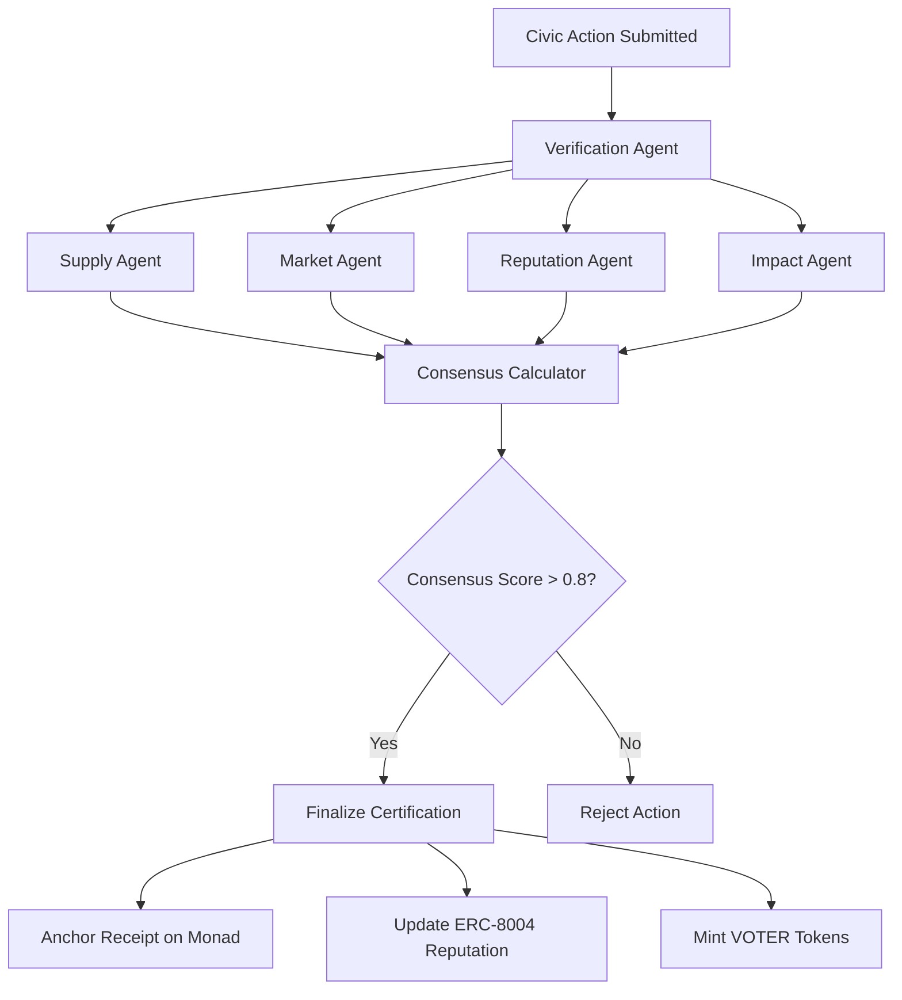

# Adaptive System Architecture

## Beyond Hardcoded Tyranny

Traditional smart contracts are authoritarian code: hardcoded constants, centralized operators, artificial scarcity enforced through mathematics. We reject this model entirely.

The VOTER protocol implements **agentic governance** with agents off‑chain/TEE, on‑chain anchoring on a cheap EVM (Monad), and ERC‑8004 registries on L2. **ERC‑8004 was built for AI agents. We extend it to human civic participants.** Cheap EVM anchoring enables massive scale while maintaining cryptographic integrity.

Sources: docs.monad.xyz (throughput/cost), [ERC‑8004: Trustless Agents](https://ethereum-magicians.org/t/erc-8004-trustless-agents/25098)

## Core Principles: Resilient Adaptive Systems

### 1. Resilient Abundance (Beyond Artificial Scarcity)

Agents calculate optimal supply based on real demand and participation patterns. No hardcoded maximums. No artificial scarcity. The SupplyAgent monitors network health and adjusts token issuance within auditable bounds set by on-chain parameters. Economic abundance serves democratic participation rather than early-adopter speculation.

**Why artificial scarcity fails:**
- Creates exclusion by design
- Benefits early adopters at expense of participants
- Turns civic engagement into speculation
- Violates democratic principle of equal access

**Robustness Principle:** While agents optimize for abundance, the protocol enforces explicit, auditable minimum and maximum bounds on key parameters, ensuring stability and preventing runaway issuance even under extreme conditions or agent misbehavior.

### 2. Adaptive Parameters (Beyond Hardcoded Constants)
Every parameter becomes dynamically calibrated, but always within predefined, auditable safety rails:
- Token rewards per action (clamped by min/max)
- Verification thresholds (with defined ranges)
- Economic incentives (bounded for stability)
- Governance parameters (with fail-safes)

**Robustness Principle:** Agents dynamically adjust parameters, but the system maintains auditable, transparent guardrails. This prevents unintended consequences from emergent agent behavior and ensures predictable system behavior.

### 3. Distributed Consensus (Beyond Central Operators)
Instead of `OPERATOR_ROLE`, we implement multi-agent consensus, complemented by human-governed circuit breakers:
- Multiple specialized agents
- Distributed decision making
- Consensus-based execution
- No single points of failure, but with human-activated emergency pauses for ultimate safety.

**Robustness Principle:** Decentralization is balanced with the ability to intervene in emergencies, providing a robust safety net against unforeseen systemic risks.

## The Agent Architecture

### Agent Types

**1. Supply Optimization Agent**

The SupplyAgent continuously monitors current participation rates, economic conditions, political calendar events, and network growth patterns. It calculates optimal token supply to maximize civic engagement while maintaining economic stability. High participation periods trigger lower per-action rewards. Low engagement periods increase incentives. Natural market equilibrium through intelligent observation.

**2. Verification Agent Network (anchored on Monad)**

The VerificationAgent coordinates multi-agent consensus for civic action validation. Agents operate off-chain or in trusted execution environments, then anchor hash receipts on Monad through the attest contract. Zero personal information touches the blockchain. Verification scores emerge from distributed agent consensus rather than centralized gatekeeping.

**3. Market Making Agent**

The MarketAgent manages economic incentives by adjusting reward structures based on market conditions. It provides liquidity optimization and dynamic pricing for challenge markets. Economic parameters evolve based on observed outcomes rather than hardcoded rules. The agent ensures sustainable token economics while maximizing civic participation incentives.

**4. Impact Measurement Agent**

The ImpactAgent tracks real-world civic outcomes by monitoring CWC message delivery confirmations, measuring direct action participation verification, and calculating engagement effectiveness. It provides feedback loops that connect digital civic actions to authentic political impact. Representative response rates and policy outcomes inform future reward calculations.

**5. Reputation Agent**

The ReputationAgent builds credibility scores by tracking challenge market participation quality, evaluating information sourcing standards, and assessing constructive discourse contributions. It writes portable reputation to ERC-8004 registries, creating democratic credibility that follows participants across platforms. High-reputation users get priority congressional routing and template creation privileges.

### Agent Coordination Framework

**LangGraph Coordination Framework - Live and Operational:**

The certification workflow orchestrates five specialized agents through LangGraph state management. Each civic action triggers parallel agent analysis covering verification, supply impact, market conditions, reputation updates, and civic impact assessment. Agents reach consensus through distributed decision-making rather than centralized gatekeeping. High-confidence consensus triggers certification with Monad anchoring, reputation updates, and token rewards.

**This isn't theoretical. This system is operational.**

### Robust Information Elicitation (Carroll Mechanisms)

Building on the principles of robustness in mechanism design, particularly those explored by Gabriel Carroll, the VOTER protocol ensures the integrity and relevance of information processed by its agents. Traditional systems often struggle with private information and the difficulty of incorporating nuanced, disputable claims into decision-making. Inspired by "Carroll Mechanisms" as described in recent mechanism design research, we implement systems that incentivize the revelation of critical information and handle disputes about its veracity and relevance.

Our agentic system now incorporates:

### Challenge Market Integration

**Challenge Markets:** Any claim in civic actions can be disputed through staked challenges. The `VerificationAgent` and `MarketAgent` coordinate resolution through community consensus mechanisms rather than truth determination. Outcomes determine credibility scores anchored on-chain in `VOTERRegistry.sol` and written to ERC-8004 infrastructure for portable reputation.

**Quality Discourse Rewards:** The `MarketAgent` calculates quality bonuses for information sourcing standards and constructive engagement. The `ReputationAgent` tracks participation patterns and writes credibility scores to the ERC-8004 Reputation Registry.

**Credibility Building:** Rather than penalizing "false" claims, the system rewards good faith participation and quality sourcing. The `ReputationAgent` coordinates with other agents to prioritize high-reputation participants in congressional routing while requiring additional verification stakes for low-reputation claims.

These mechanisms enhance agent coordination for information quality assessment while avoiding centralized truth determination. The goal is robust credibility infrastructure that incentivizes constructive democratic discourse.

**Quality discourse pays. Bad faith costs.**

## Technical Implementation

### Smart Contract Architecture

**Agent Parameter Management:**
The AgentParameters contract stores dynamic values calculated by agents but enforces auditable minimum and maximum bounds. No hardcoded constants. Parameters evolve based on agent consensus within safety rails. The DAO controls which agent addresses can update parameters, preventing unauthorized manipulation.

**Dynamic Token Minting:**
CommuniqueCore handles dynamic token minting based on agent-calculated rewards. Each mint operation respects protocol-wide daily caps and per-user limits. Base amounts get multiplied by agent-determined impact scores, then clamped by on-chain bounds. Economic abundance serves civic participation while preventing runaway issuance.

**Consensus Verification:**
The AgentConsensusGateway validates multi-agent agreement before executing parameter changes or token mints. No single agent controls the system. Distributed decision-making eliminates central points of failure while maintaining human-governed circuit breakers for emergency situations.

### Agent Integration Stack

**N8N Workflow Engine (off-chain):**

Civic actions trigger webhook endpoints that activate parallel agent verification. The VerificationAgent, IdentityAgent, and ImpactAgent analyze submissions simultaneously rather than sequentially. Claude 3.5 Sonnet calculates consensus scores from agent outputs using sophisticated prompt engineering. High-confidence decisions automatically anchor hash receipts to Monad through the attest contract. 

The workflow orchestrator manages agent coordination, failure recovery, and result persistence. No single point of failure disrupts the civic action pipeline.

**ChromaDB Vector Memory System:**

Agents learn from every decision through vector-based memory storage. The system maintains separate collections for agent decisions and civic outcomes, enabling sophisticated pattern matching across historical contexts. 

When agents encounter new situations, they query similar historical contexts using vector embeddings. Decision effectiveness scores inform future parameter adjustments. Agent memory enables continuous improvement rather than static rule enforcement.

Memory persistence ensures agents retain learning across system restarts and upgrades. Historical patterns guide better civic action verification and reward calculation.

## Economic Model: Resilient Civic Engagement

### Abundance Through Intelligence within Robust Bounds

Instead of artificial limits, we create **natural equilibrium** through agent optimization, always constrained by auditable, on-chain bounds:

**Equilibrium Through Intelligence:**
Agents measure current demand patterns, assess civic action impact, and monitor overall network health. Machine learning models predict optimal token amounts using historical outcome data from vector memory. The system learns what reward levels maximize authentic civic participation.

Optimal amounts get clamped by smart contract minimums and maximums, ensuring economic stability. Agents optimize within safety rails rather than operating with unlimited authority. Natural market dynamics emerge through intelligent observation rather than hardcoded scarcity.

### Self-Regulating Supply within Safety Rails

The system maintains health through feedback loops, with protocol-enforced safety rails preventing extreme deviations:
- High participation: lower per-action rewards (clamped by min) create economic balance
- Low participation: higher incentives (clamped by max) drive increased engagement  
- Dynamic supply within defined caps: natural market equilibrium within auditable limits

## Governance Evolution

### Multi-Agent Democracy

Traditional governance: Token holders vote on proposals  
**Agentic governance:** Specialized agents optimize different aspects continuously

**Continuous Protocol Evolution:**
The SupplyAgent optimizes token economics. The SecurityAgent analyzes threat patterns. The UXAgent improves user experience flows. Each agent operates within its specialized domain while coordinating through the central orchestrator.

Integrated updates deploy automatically when improvement scores exceed safety thresholds. Hourly optimization cycles enable rapid adaptation to changing civic engagement patterns. The system evolves based on observed outcomes rather than static governance proposals.

Distributed agent optimization replaces centralized voting while maintaining human oversight through circuit breakers and parameter bounds.

### Emergent Protocol Evolution

The protocol evolves based on usage patterns: Agents identify inefficiencies, propose improvements, test in simulation, deploy if successful, monitor outcomes, and iterate continuously.

## Implementation Status

### Exists in repo
- On-chain: `VOTERRegistry`, `VOTERToken`, `CommuniqueCore` (no operator), `AgentParameters`, `AgentConsensusGateway`
- Tests: verified action path with multisig; dynamic rewards via parameters
- **Robustness: Parameter safety rails (min/max clamps, caps) implemented in `AgentParameters` and enforced in `CommuniqueCore`.**

### To build next
- CWC verification workflow (n8n) writing to `AgentConsensusGateway`
- Telemetry, anomaly auto-tightening
- Timelock and guardian pause; minimal admin UI & public endpoints

## Anti-Patterns to Avoid

### Traditional Web3 Mistakes

**Authoritarian Patterns to Avoid:**
- Hardcoded limits that never adapt to changing conditions
- Central operators with god-mode powers over user funds
- Fixed economic parameters that ignore market dynamics
- Artificial scarcity enforced through mathematics rather than value

### Agentic Alternatives (with Robustness)

**Adaptive Patterns We Implement:**
- Agent-determined parameters within auditable minimum and maximum bounds
- Distributed consensus mechanisms with human-governed circuit breakers for emergencies
- Dynamic economics that respond to real civic engagement patterns while maintaining stability
- Natural abundance through intelligent observation rather than artificial constraint

## Conclusion

The VOTER protocol represents a fundamental shift from authoritarian code to **adaptive governance**:

- **No artificial scarcity** - Abundance through intelligence
- **No hardcoded tyranny** - Evolution through agents
- **No central control** - Distributed consensus
- **No fixed economics** - Dynamic optimization

This architecture enables true democratic participation at scale: systems that serve humans rather than constraining them, abundance rather than artificial scarcity, evolution rather than stagnation.

**The future of democracy is agentic. The future of protocols is adaptive. The future of governance is emergent.**

*Built with Claude, optimized by agents, serving humans.*