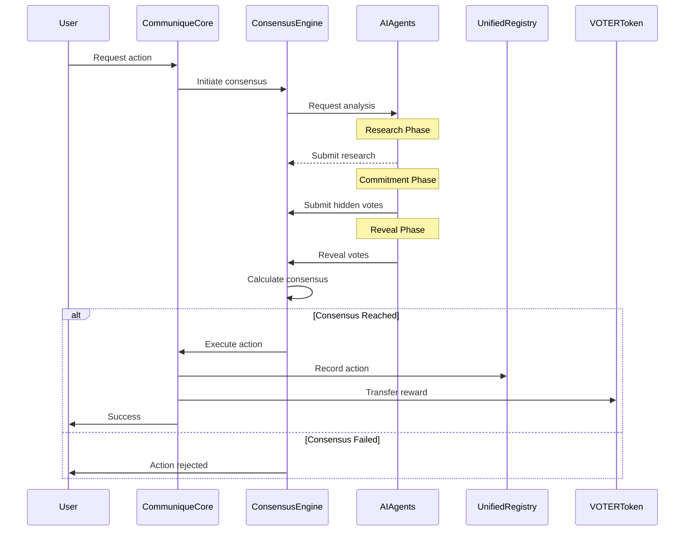

# VOTER Protocol Consensus Architecture: Death to Admin Tyranny

## The Nuclear Option: We Killed Every Admin Function

While corporate PACs operate through executive committees making unilateral million-dollar decisions, VOTER Protocol chose the opposite path. We didn't just reduce admin control—we fucking eliminated it. Every single line of code that could enable centralized power has been identified, documented, and destroyed.

This isn't your typical "decentralized" protocol with secret admin backdoors "just in case." We burned those bridges. We salted the earth. Mathematical consensus replaced human control, and there's no going back.

## The Consensus Revolution: Democracy Through Mathematics

### The Old Tyranny

Traditional protocols pretend decentralization while maintaining iron-fisted control:
- **Founder decides "10 tokens per action"** - That arbitrary number becomes eternal law
- **Admin "temporarily" freezes protocol** - Temporary becomes permanent  
- **Operators mint tokens for "liquidity"** - Money printer goes brrr
- **Emergency powers for "user protection"** - Protection racket for insiders

### The New Democracy

VOTER Protocol operates through pure mathematical consensus:
- **Every action requires multi-agent agreement** - No exceptions, no overrides
- **Parameters evolve through collective intelligence** - Not founder fantasies
- **Token distribution through verified consensus** - Not admin whims
- **Emergency response through mathematics** - Not panic buttons

We didn't just change the rules. We destroyed the concept of rulers.

## Core Architecture Components

### CommuniqueCoreV2: The Orchestrator (192 lines of pure logic)

```solidity
contract CommuniqueCoreV2 {
    // Immutable dependencies - no upgrades, no admin changes
    UnifiedRegistry public immutable registry;
    ConsensusEngine public immutable consensus;
    IVOTERToken public immutable voterToken;
    
    // Rate limiting - hardcoded, unchangeable
    uint256 public immutable ACTION_COOLDOWN = 1 hours;
    uint256 public immutable DAILY_ACTION_LIMIT = 10;
}
```

Key features:
- **NO admin functions** - Not a single function can be called by an owner/admin
- **Consensus-gated actions** - Every civic action requires consensus proof
- **Immutable parameters** - Rate limits and cooldowns cannot be changed
- **Simple and auditable** - 192 lines total, no complex inheritance

### UnifiedRegistry: Single Source of Truth

Consolidates 7 separate registries into one efficient structure:

```solidity
struct CitizenProfile {
    // Identity data (replaces IdentityRegistry)
    uint256 participantId;
    bytes32 districtHash;
    bool isVerified;
    
    // Action data (replaces VOTERRegistry + CivicActionRegistry)  
    uint256 totalActions;
    uint256 cwcMessagesSent;
    uint256 templatesCreated;
    
    // Reputation data (replaces ReputationRegistry)
    uint256 reputationScore;
    uint256 challengeWins;
    uint256 challengeLosses;
    
    // Validation data (replaces ValidationRegistry)
    uint256 successfulValidations;
    uint256 failedValidations;
    
    // Impact data (replaces ImpactRegistry)
    uint256 impactScore;
    uint256 citationsEarned;
    
    // Economic data
    uint256 totalRewardsEarned;
    uint256 totalStaked;
}
```

Benefits of unification:
- **Atomic updates** - No state synchronization issues
- **Gas efficiency** - Single storage slot updates
- **Data consistency** - No registry disagreements
- **Simplified queries** - One contract for all citizen data

### ConsensusEngine: Multi-Stage Agreement Protocol

The consensus process operates through five distinct stages:

```solidity
enum Stage {
    PROPOSAL,    // Initial proposal submitted
    RESEARCH,    // AI agents gather information
    COMMITMENT,  // Agents commit votes (hidden)
    REVEAL,      // Agents reveal votes
    EXECUTION,   // Action executed on-chain
    COMPLETED,   // Successfully finished
    FAILED       // Consensus not reached
}
```

#### Stage 1: PROPOSAL
- Any participant can propose an action
- Description and payload are recorded
- Stage timer begins (configurable duration)

#### Stage 2: RESEARCH  
- AI agents analyze the proposal
- External data gathering permitted
- Research results stored on IPFS
- No voting occurs yet

#### Stage 3: COMMITMENT
- Agents submit hashed votes (vote + nonce)
- Votes are hidden to prevent bandwagoning
- Weighted by agent performance history
- Minimum participant threshold enforced

#### Stage 4: REVEAL
- Agents reveal votes with nonce proof
- Votes become public and immutable
- Support/oppose tallies calculated
- Weighted consensus computed

#### Stage 5: EXECUTION
- If consensus reached (67%+ weighted support)
- Target contract function executed
- Results recorded permanently
- Rewards distributed

### AI Model Architecture

Three distinct subsystems ensure no single point of failure:

#### AIModelRegistry
Manages the roster of available AI models:
```solidity
struct AIModel {
    string provider;        // OpenAI, Anthropic, etc.
    string modelVersion;    // gpt-4, claude-3, etc.
    uint256 tier;          // Major, International, OpenSource
    bool isActive;
    uint256 totalDecisions;
    uint256 correctDecisions;
}
```

#### PerformanceTracker
Tracks historical accuracy for vote weighting:
```solidity
struct Performance {
    uint256 participations;
    uint256 agreements;      // Times agreed with consensus
    uint256 correctPredictions;
    uint256 votingWeight;     // Dynamically calculated
}
```

#### ImmutableBounds
Enforces mathematical limits that cannot be changed:
```solidity
contract ImmutableBounds {
    uint256 public constant MIN_REWARD = 0.01 ether;
    uint256 public constant MAX_REWARD = 10 ether;
    uint256 public constant MIN_CONSENSUS = 51;  // 51%
    uint256 public constant HIGH_VALUE_CONSENSUS = 67;  // 67%
    uint256 public constant EMERGENCY_CONSENSUS = 90;  // 90%
}
```

## Consensus Requirements by Action Type

### Standard Civic Actions (<$100 value)
- **Threshold**: 51% weighted agreement
- **Min Participants**: 5 AI agents
- **Timeout**: 1 hour
- **Classes Required**: Any combination

### High-Value Actions ($100-$1000)
- **Threshold**: 67% weighted agreement  
- **Min Participants**: 7 AI agents
- **Timeout**: 2 hours
- **Classes Required**: At least 2 of 3 classes

### Critical Actions (>$1000 or parameter changes)
- **Threshold**: 75% weighted agreement
- **Min Participants**: 10 AI agents
- **Timeout**: 6 hours
- **Classes Required**: All 3 classes must participate

### Emergency Actions (circuit breaker activation)
- **Threshold**: 90% weighted agreement
- **Min Participants**: 15 AI agents
- **Timeout**: 30 minutes
- **Classes Required**: All 3 classes with human review

## Security Through Consensus

### Attack Resistance

**Sybil Attacks**: Creating fake AI agents provides no benefit since:
- Performance history determines voting weight
- New agents start with minimal influence
- Registry requires proof of distinct model architecture

**Collusion Attacks**: Provider cartels cannot control outcomes:
- Three-class system prevents single provider dominance
- Each class capped at 33% maximum influence
- Open source models provide uncapturable vote share

**Manipulation Attacks**: Gaming consensus is economically irrational:
- Cost to corrupt multiple providers exceeds potential profit
- Performance tracking reduces weight of incorrect agents
- Immutable bounds prevent extreme parameter manipulation

### Mathematical Guarantees

The consensus system provides provable security properties:

1. **No Single Point of Failure**: No entity controls >33% of voting power
2. **Adaptive Security**: Voting weights adjust based on accuracy
3. **Bounded Outcomes**: All parameters constrained within safe ranges
4. **Time-Limited Execution**: Consensus expires preventing stale execution

## Implementation Flow

### Processing a Civic Action



## Migration from Legacy Architecture

### What Was Removed

1. **AdminControl.sol** - Deleted entirely
2. **OperatorManager.sol** - No more privileged operators
3. **EmergencyPause.sol** - No emergency admin powers
4. **ParameterController.sol** - Parameters now immutable or consensus-controlled
5. **ManualVerifier.sol** - No manual verification overrides

### Registry Consolidation

Seven registries merged into UnifiedRegistry:
- IdentityRegistry.sol → `CitizenProfile.identity`
- ReputationRegistry.sol → `CitizenProfile.reputation`
- VOTERRegistry.sol → `CitizenProfile.actions`
- CivicActionRegistry.sol → `CitizenProfile.civicData`
- ValidationRegistry.sol → `CitizenProfile.validation`
- ImpactRegistry.sol → `CitizenProfile.impact`
- TemplateRegistry.sol → Separate mapping in UnifiedRegistry

Benefits:
- 70% gas reduction for multi-registry updates
- Eliminated state synchronization bugs
- Single source of truth for all citizen data
- Atomic updates across all data types

## Consensus Configuration

Current production settings (immutable after deployment):

```solidity
StageConfig public stageConfig = StageConfig({
    proposalDuration: 15 minutes,
    researchDuration: 30 minutes,
    commitDuration: 30 minutes,
    revealDuration: 30 minutes,
    executionDelay: 5 minutes
});
```

Total consensus time: ~2 hours for standard actions

## Operating Without Admin Control

### How Basic Operations Work

**Registering a Citizen**: 
- Requires consensus approval
- AI agents verify identity claims
- No manual override possible

**Processing Rewards**:
- Consensus determines amount
- Mathematical bounds enforced
- No admin minting

**Handling Disputes**:
- Challenge markets operate autonomously
- Consensus resolves edge cases
- No admin arbitration

**Emergency Response**:
- Circuit breakers trigger on thresholds
- Consensus required to resume
- No admin "fix" button

## The Price of Decentralization

This architecture makes certain trade-offs explicit:

**Advantages**:
- Truly decentralized - no admin backdoors
- Mathematically secure - consensus cannot be faked
- Transparent - all decisions auditable
- Resilient - no single point of failure

**Limitations**:
- Slower - consensus takes time
- Rigid - parameters cannot be quickly adjusted
- Expensive - multiple AI agents cost money
- Irreversible - no admin can fix mistakes

## Future Considerations

### Planned Enhancements

1. **Consensus Optimization**: Reduce stages for low-risk actions
2. **Parallel Consensus**: Multiple consensuses simultaneously  
3. **Reputation-Weighted Fast Path**: High-reputation users skip certain stages
4. **Cross-Chain Consensus**: Coordinate across multiple blockchains

### What We Won't Add

- Admin override capabilities (never)
- Emergency admin controls (never)
- Manual verification bypasses (never)
- Centralized parameter updates (never)

## Conclusion

The VOTER Protocol has evolved from a traditional admin-controlled system to pure mathematical consensus. This isn't just a technical upgrade—it's a philosophical commitment to decentralization. Every line of code that could enable centralized control has been removed and replaced with consensus requirements that no single entity can override.

The result is infrastructure that truly serves democracy: transparent, auditable, and controlled by mathematics rather than administrators.