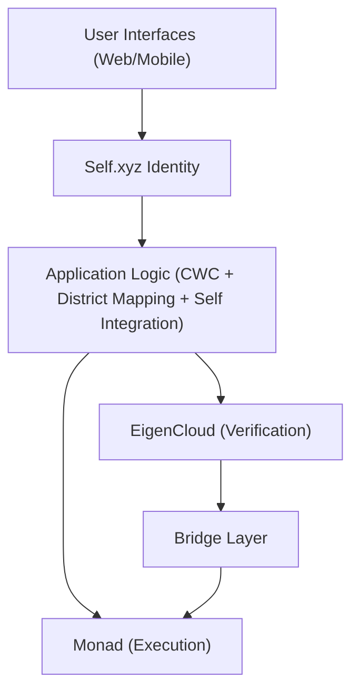
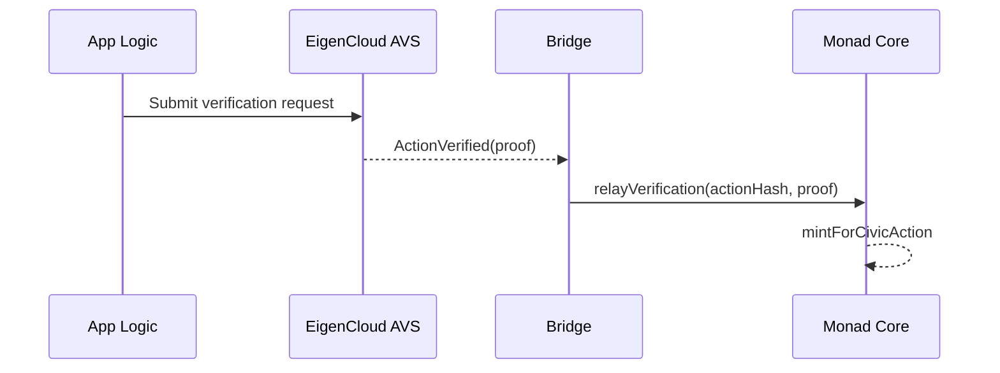

# Hybrid Monad + EigenCloud Architecture

## Executive Summary

The VOTER token platform is designed for a hybrid architecture combining Monad's high-performance execution with EigenCloud's verifiability infrastructure. This approach delivers both the speed needed for viral civic engagement and the cryptographic guarantees required for authentic democratic participation.

**Current Implementation Status:**
- ✅ **Monad execution layer**: Deployed with CIVIC token, governance, and core contracts
- ✅ **EIP-712 multisig verification**: Current verification mechanism for civic actions
- 🔄 **EigenCloud AVS integration**: Planned future upgrade for decentralized verification
- 🔄 **Cross-chain bridges**: Future implementation for advanced proof relay

## Architectural Overview



```mermaid
flowchart TB
  subgraph Monad [Monad Layer (Execution)]
    Core["CommuniqueCore"]
    Token["CIVICToken (ERC20Votes)"]
    Registry["VOTERRegistry"]
    Params["AgentParameters"]
  end
  Core --> Token
  Core --> Registry
  Core -->|read bounds/knobs| Params
```

```mermaid
flowchart TB
  subgraph EigenCloud [EigenCloud Layer (Verification)]
    AVS["Civic Action Verifier AVS"]
    CWC["CWC Prover"]
    ID["Identity Attestation"]
    Dispute["Dispute Resolution"]
  end
```



## Layer Responsibilities

### Self.xyz Identity Layer: Zero-Knowledge Verification

**Purpose**: Provide cryptographic proof of citizen identity without exposing personal data

**Components:**
- **Passport Verification**: ZK proofs of government-issued passports
- **Age Verification**: Prove 18+ eligibility without revealing exact age
- **Citizenship Proof**: Verify US citizenship without exposing passport details
- **Sybil Resistance**: Each passport can only be used once across the platform
- **Keyless Wallets**: Phone number serves as wallet address for seamless UX

**Privacy Benefits:**
- Zero personal data stored on-chain or in centralized databases
- Cryptographic proofs replace traditional KYC documentation
- Government-grade document verification without document exposure
- Selective disclosure of only necessary attributes

### Monad Layer: High-Performance Execution

**Purpose**: Handle high-frequency operations requiring speed and low costs

**Components:**
- **CIVIC Token Contract**: ERC-20 governance token with staking and voting
- **Governance System**: Proposal creation, voting, and execution
- **Gamification Engine**: Leaderboards, achievements, social features
- **User Management**: Onboarding, profiles, fee discounts

**Performance Benefits:**
- 10,000 TPS for mass user interactions
- 1-second finality for immediate feedback
- <1¢ fees for micro-transactions
- Full EVM compatibility for existing tooling

### EigenCloud Layer: Cryptographic Verification

**Purpose**: Provide tamper-proof verification of civic actions

**Components:**
- **Civic Action Verifier (AVS)**: Custom AVS for validating civic actions
- **Congressional Message Prover**: Verify CWC delivery and authenticity
- **Identity Attestation Service**: Decentralized identity verification
- **Dispute Resolution**: Handle challenges to civic action claims

**Verification Benefits:**
- Cryptographic proof of civic action authenticity
- Decentralized verification reducing single points of failure
- Intersubjective dispute resolution for edge cases
- Cross-chain proof anchoring for maximum security

### Bridge Layer: Cross-Chain Coordination

**Purpose**: Synchronize state between Monad execution and EigenCloud verification

**Components:**
- **Verification Oracle**: Relay EigenCloud proofs to Monad contracts
- **State Synchronizer**: Maintain consistency across chains
- **Proof Aggregator**: Bundle multiple verifications for efficiency
- **Emergency Circuit Breaker**: Halt operations if verification fails

### Control Plane on Monad (cheap EVM anchoring) + Optional L2 Mirror

- **Foundation on Monad (anchoring & composability)**
  - Integrity rails: anchor registries/attestations as IPFS CIDs on Monad with minimal on‑chain readable fields (status, timestamp, ids). Heavy payloads remain off‑chain; batches commit with Merkle roots for amortized gas. Source: docs.monad.xyz (throughput/cost).
  - Agents remain off‑chain/TEE; on‑chain stores only facts required for trust and machine composability.

- **Optional ETH/L2 interop**
  - Mirror ERC‑8004 registries (Identity/Validation/Reputation) on a major L2 (Base/OP) when ETH‑native consumers need on‑chain reads. Ensure entries are storage‑backed (not events‑only), per composability feedback in the thread.

- (optional) Validation marketplaces
  - If we require marketplace‑secured validation services, we can integrate a validation marketplace in the future. Not required for mail receipts.

Summary: we operate on Monad for cheap, EVM‑native anchoring and composability; mirror minimal trust signals to an ETH L2 (ERC‑8004) only when partners require it; liquidity and treasury sit on ETH/L2 (Safe), with no routine asset moves.

### ERC‑8004 Interop (optional, in progress)

- Context: [ERC‑8004: Trustless Agents](https://ethereum-magicians.org/t/erc-8004-trustless-agents/25098) defines on‑chain Identity/Reputation/Validation registries for agent trust.
- Our approach: Monad is source‑of‑truth for Validation (attestations). We optionally mirror Identity/Validation/Reputation to an ETH L2 ERC‑8004 registry for ETH‑native consumption. Ensure storage fields are on‑chain readable (not events‑only), per thread feedback.

## Technical Implementation

### On‑chain Anchoring (Monad)

- Registry (Monad): Stores template/channel CIDs and simple version graph; emits events for indexers; no PII
- Attest (Monad): Writes hash attestations for verification receipts (CWC/mail routing); supports revocations

Bridging is not routine. Treasury/liquidity remain on ETH/L2 (Safe). Mirror minimal trust signals to L2 ERC‑8004 registries only when partners require on‑chain reads.

## Data Flow

### Civic Action Processing

1. **User Action**: Citizen sends message through CWC integration
2. **Initial Recording**: Action recorded on Monad with "pending verification" status
3. **Verification Request**: Bridge submits action to EigenCloud AVS for verification
4. **EigenCloud Processing**: 
   - Verify CWC delivery confirmation
   - Validate citizen identity and district eligibility
   - Check for spam/gaming attempts
   - Generate cryptographic proof of verification
5. **Bridge Relay**: Verification proof relayed back to Monad
6. **Token Minting**: CIVIC tokens minted based on verified action
7. **User Notification**: Real-time notification of successful verification

### Verification Proof Structure

```typescript
interface VerificationProof {
  actionHash: bytes32;
  citizen: address;
  actionType: ActionType;
  timestamp: uint256;
  cwcDeliveryProof: {
    messageId: string;
    deliveryConfirmation: bytes;
    representativeOffice: string;
  };
  identityProof: {
    citizenId: bytes32;
    districtHash: bytes32;
    verificationTimestamp: uint256;
  };
  eigenSignature: bytes;
  blockProof: bytes;
}
```

## Performance Characteristics

### Throughput Analysis

**Monad Operations (High Frequency):**
- Token transfers: 10,000+ TPS
- Governance voting: 5,000+ TPS  
- Leaderboard updates: 8,000+ TPS
- Social interactions: 10,000+ TPS

**EigenCloud Verification (High Security):**
- Civic action verification: 100-500 TPS (sufficient for national scale)
- Identity attestations: 50-100 TPS
- Dispute resolutions: 10-20 TPS

**Bridge Coordination:**
- Proof relaying: 1,000+ TPS
- State synchronization: 500+ TPS

### Latency Profile

- **Immediate Feedback**: User sees action recorded instantly on Monad (1 second)
- **Verification Complete**: EigenCloud proof generated (30-60 seconds)
- **Token Reward**: CIVIC tokens minted after verification (2-3 minutes total)

## Security Model

### Trust Assumptions

**Monad Layer:**
- Validators secure token economic operations
- Multi-sig governance for critical parameters
- Standard smart contract security practices

**EigenCloud Layer:**
- Restaked ETH secures verification process ($13B+ TVL)
- Multiple AVS operators provide redundancy
- Slashing conditions for malicious behavior

**Bridge Layer:**
- Multi-signature relayer network
- Cryptographic proof verification
- Emergency pause mechanisms

### Attack Vectors and Mitigations

**Verification Gaming:**
- EigenCloud AVS validates CWC delivery confirmation
- Identity attestation prevents sybil attacks
- Rate limiting and quality scoring prevent spam

**Bridge Attacks:**
- Multi-sig relayer consensus required
- Cryptographic proof validation
- Time delays for large operations

**Economic Attacks:**
- Slashing conditions for malicious AVS operators
- Governance-controlled minting limits
- Circuit breakers for anomalous activity

## Deployment Strategy

### Phase 1: Monad Foundation (Months 1-2)
- Deploy enhanced CIVIC token with verification hooks
- Launch gamification and governance features
- Build user base with basic civic engagement

### Phase 2: EigenCloud Integration (Months 3-4)
- Deploy Civic Verifier AVS on EigenCloud
- Launch bridge contracts for cross-chain coordination
- Begin verified civic action processing

### Phase 3: Full Hybrid Operations (Months 5-6)
- Complete verification for all civic actions
- Launch advanced features requiring cryptographic proofs
- Scale to national civic engagement levels

## Competitive Advantages

### Technical Benefits
- **Performance + Security**: Best of both execution speed and verification integrity
- **Future-Proof**: Positioned in both major 2025 blockchain ecosystems
- **Regulatory Compliance**: Cryptographic proofs provide audit trail
- **Developer Experience**: Familiar EVM tools plus cutting-edge verification

### Market Positioning
- **First Hybrid Architecture**: Novel combination of execution and verification layers
- **Institutional Grade**: Validated anchoring and optional ERC‑8004 mirrors provide composability and credibility
- **Viral Potential**: Monad's performance enables memecoin-level adoption
- **Democratic Impact**: Verifiable civic engagement creates real political change

## Conclusion

The hybrid Monad + EigenCloud architecture provides the optimal foundation for tokenizing civic engagement at scale. By combining high-performance execution with cryptographic verification, the platform can deliver both the viral growth mechanics needed to compete for user attention and the authentic democratic participation required for real political impact.

This architecture positions the VOTER token platform uniquely at the intersection of DeFi performance, verification infrastructure, and civic technology—creating sustainable competitive advantages in the tokenized democracy space.