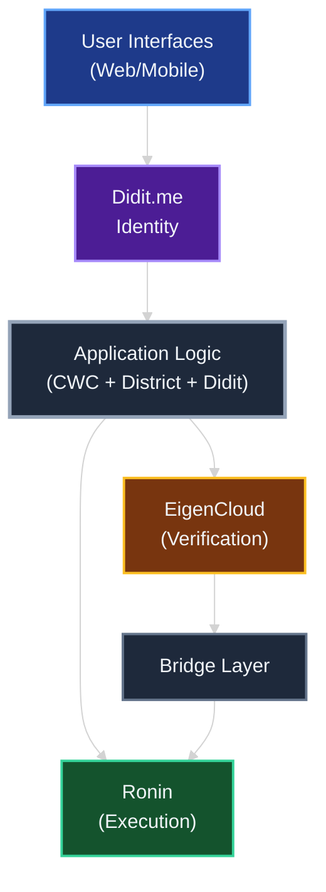
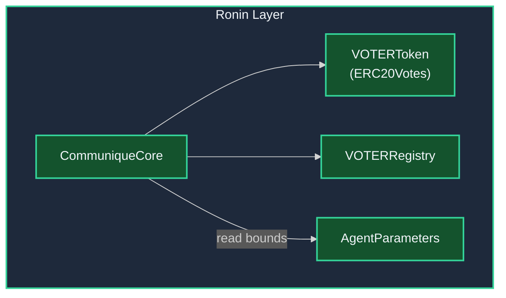
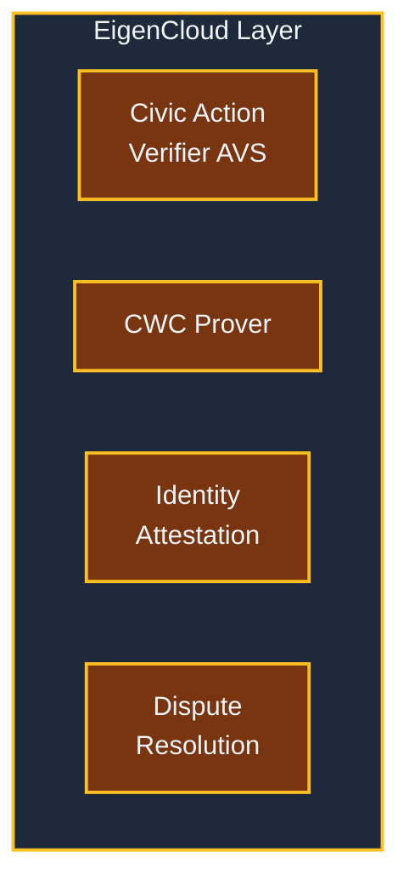
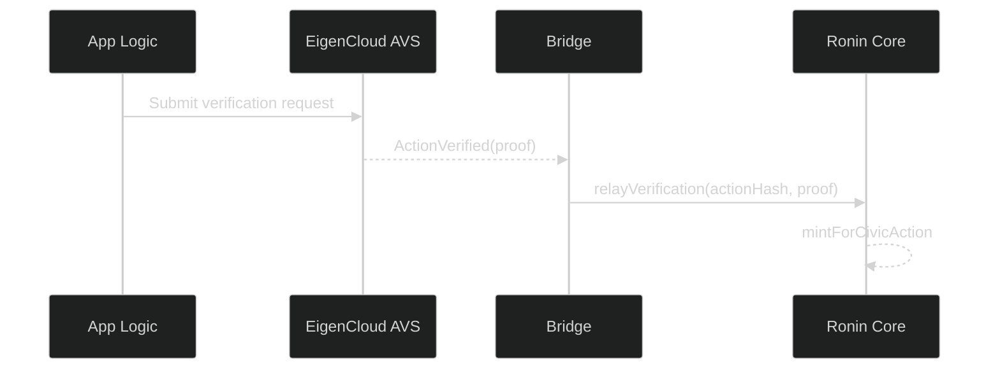
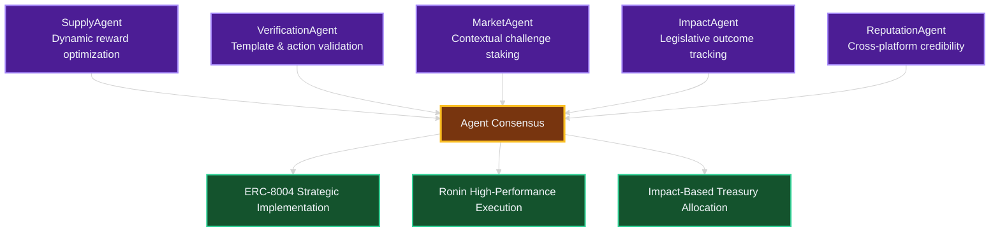

# Hybrid Ronin + EigenCloud Architecture

## Executive Summary

The VOTER token platform is designed for a hybrid architecture combining Ronin's proven high-performance execution with EigenCloud's verifiability infrastructure. **ERC-8004 was built for AI agents. We extend it to human civic participants.** This approach delivers both the speed needed for viral civic engagement and the cryptographic guarantees required for authentic democratic participation.

**Current Implementation Status:**
- 🔧 **Ronin execution layer**: Core contracts built with VOTER token, adaptive governance
- 🔧 **Multi-agent verification**: AgentConsensusGateway architecture designed for civic actions
- 🔧 **Cheap EVM anchoring**: Verification receipt and registry contracts ready for deployment
- 🔄 **EigenCloud AVS integration**: Planned for enhanced decentralized verification

## Architectural Overview

## Layer Responsibilities

### Didit.me Identity Layer: Cost-Efficient Verification

**Purpose**: Provide zero-cost identity verification with institutional-grade compliance options

**Components:**
- **Core KYC Free Forever**: ID verification, face match, passive liveness at zero cost
- **Premium Compliance**: $0.35 AML screening, $0.50 proof of address for high-value participants  
- **Global Coverage**: ISO 27001 certified, GDPR compliant, supports 190+ countries
- **Developer Sandbox**: Unlimited testnet verification without burning treasury
- **Privacy-First**: Zero PII on-chain, verifiable credentials with selective disclosure

**Strategic Benefits:**
- **Cost Revolution**: Free identity verification enables rapid user growth
- **Scalable Compliance**: From free core verification to institutional requirements
- **Production Ready**: Battle-tested infrastructure vs experimental alternatives
- **Privacy Preserved**: Cryptographic attestations without exposing personal data

### Ronin Layer: High-Performance Civic Infrastructure

**Purpose**: Handle mass civic engagement with proven high-throughput infrastructure

**Components:**
- **VOTER Token Contract**: ERC-20 governance token with agent-optimized rewards
- **Multi-Agent Coordination**: TypeScript agent system for dynamic parameter optimization
- **Challenge Markets**: Sophisticated Carroll Mechanisms with contextual intelligence
- **ERC-8004 Strategic Implementation**: Human-AI reputation infrastructure

**Proven Performance Benefits:**
- **100K TPS Capacity**: Handles millions of daily civic actions without congestion
- **Battle-Tested Infrastructure**: 2.27M daily active users prove production readiness
- **Sub-Cent Transactions**: Enable micro-civic-actions at scale  
- **Immediate Deployment**: Production-ready vs late 2025 alternatives

### EigenCloud Layer: Cryptographic Verification

**Purpose**: Provide tamper-proof verification of civic actions

**Components:**
- **Civic Action Verifier (AVS)**: Custom AVS for validating civic actions
- **Congressional Message Prover**: Verify CWC delivery and authenticity
- **Identity Attestation Service**: Decentralized identity verification
- **Dispute Resolution**: Handle challenges to civic action claims

**Verification Benefits:**
- Cryptographic proof of civic action authenticity
- Decentralized verification reducing single points of failure
- Intersubjective dispute resolution for edge cases
- Cross-chain proof anchoring for maximum security

### Bridge Layer: Cross-Chain Coordination

**Purpose**: Synchronize state between Ronin execution and EigenCloud verification

**Components:**
- **Verification Oracle**: Relay EigenCloud proofs to Ronin contracts
- **State Synchronizer**: Maintain consistency across chains
- **Proof Aggregator**: Bundle multiple verifications for efficiency
- **Emergency Circuit Breaker**: Halt operations if verification fails

### Agent-Optimized Control Plane

**Ronin Foundation (Proven High-Performance Infrastructure)**
- **Integrity rails**: Anchor registries/attestations as IPFS CIDs with minimal on-chain storage
- **Agent parameters**: Dynamic optimization within auditable bounds via intelligent agent coordination
- **Scalable architecture**: Heavy payloads off-chain, batched commits with Merkle roots
- **Multi-agent coordination**: Production-ready intelligent agents for parameter optimization and verification

**ERC‑8004 Human-AI Infrastructure**  
- Mirror Identity/Validation/Reputation registries to ETH L2 for cross-platform composability
- ERC-8004 serves both AI agent coordination and human civic reputation
- Storage‑backed entries (not events‑only) ensure proper on‑chain reads for partners

**Economic Infrastructure**
- Liquidity and treasury remain on ETH/L2 (Safe) with no routine asset bridging
- Agent-optimized reward calculations replace hardcoded parameters
- Challenge markets and Carroll Mechanisms for quality discourse incentives

**Impact-Based Treasury Allocation**
- ImpactAgent tracks which templates actually change legislative positions
- Treasury accumulates value through token economics and potential institutional revenue
- Governance directs funds to legislators who demonstrably learn from constituents
- 501(c)(4) structure enables unlimited lobbying for citizen priorities
- PAC structure supports candidates based on verified responsiveness

**Real Impact Examples:**

*Healthcare Template Impact:*
Template: "Rural hospital closures affect 15M Americans." Campaign generates 25K verified messages. Three senators cite statistic in healthcare debate. Amendment to protect rural hospitals passes. ImpactAgent verifies causality. Treasury allocates $250K across supporting legislators via 501(c)(4).

*Economic Policy Shift:*
Template: "Minimum wage increase creates 50K jobs locally." Mass campaign reaches 100K participants. House members reference job creation data. Committee vote flips. Template creator earns 50K VOTER. Representatives who changed position receive campaign support.

**We don't count messages. We count minds changed.**

## Technical Implementation

### On‑chain Anchoring (Ronin)

- Registry (Ronin): Stores template/channel CIDs and simple version graph; emits events for indexers; no PII
- Attest (Ronin): Writes hash attestations for verification receipts (CWC/mail routing); supports revocations

Bridging is not routine. Treasury/liquidity remain on ETH/L2 (Safe). Mirror minimal trust signals to L2 ERC‑8004 registries only when partners require on‑chain reads.

## Data Flow

### Civic Action Processing

1. **User Action**: Citizen sends message through CWC integration via mail client
2. **Initial Recording**: Action recorded on Ronin with "pending verification" status
3. **Agent Verification**: Multi-agent consensus evaluates action authenticity and quality
4. **Agent Processing**: 
   - VerificationAgent confirms CWC delivery
   - ImpactAgent tracks if template data appears in legislative records
   - ReputationAgent updates ERC-8004 credibility scores
   - SupplyAgent calculates performance-adjusted VOTER rewards
   - MarketAgent processes any challenge market outcomes
5. **Impact Tracking**: ImpactAgent monitors for template influence on votes and speeches
6. **Consensus Execution**: Agent consensus triggers on-chain parameter updates
7. **Token Minting**: VOTER tokens minted based on verified impact scores
8. **User Notification**: Real-time notification with credibility and reward updates
9. **Treasury Allocation**: Proven impact directs funds to responsive legislators

**Complete Loop Example:**

Day 1: User creates template about infrastructure costs. Day 7: 10K citizens use template via CWC. Day 14: Representative cites cost data in committee. Day 21: Committee vote changes. Day 28: ImpactAgent verifies causality. Day 30: Creator receives 25K VOTER bonus. Day 45: Treasury allocates $75K to representative's campaign. Day 60: Media covers "democracy that rewards learning." The loop closes.

### Verification Proof Structure

**Cryptographic Proof Components:**

Verification proofs contain six essential elements for tamper-proof civic action validation. The action hash uniquely identifies each civic engagement. Citizen address links actions to specific participants. Action type categorizes the civic engagement (CWC message, direct action, etc.). Timestamp provides chronological ordering.

**CWC Delivery Verification:**
Congressional message proofs include unique message identifiers from the CWC system, cryptographic delivery confirmations showing successful transmission, and representative office routing information for transparency.

**Identity Attestation:**
Zero-knowledge identity proofs contain hashed citizen identifiers for sybil resistance, district hash for congressional routing verification, and verification timestamps for chronological tracking. Personal information never appears in proofs.

**Cryptographic Integrity:**
EigenCloud signatures provide tamper-proof validation from restaked validators. Block proofs anchor verification to specific blockchain states for cross-chain composability and dispute resolution.

## Performance Characteristics

### Throughput Analysis

**Ronin Operations (High Frequency):**
- Token transfers: 100,000+ TPS
- Governance voting: 50,000+ TPS  
- Leaderboard updates: 80,000+ TPS
- Social interactions: 100,000+ TPS

**EigenCloud Verification (High Security):**
- Civic action verification: 100-500 TPS (sufficient for national scale)
- Identity attestations: 50-100 TPS
- Dispute resolutions: 10-20 TPS

**Bridge Coordination:**
- Proof relaying: 1,000+ TPS
- State synchronization: 500+ TPS

### Latency Profile

- **Immediate Feedback**: User sees action recorded instantly on Ronin (1 second)
- **Verification Complete**: EigenCloud proof generated (30-60 seconds)
- **Token Reward**: VOTER tokens minted after verification (2-3 minutes total)

## Security Model

### Trust Assumptions

**Ronin Layer:**
- Validators secure token economic operations
- Multi-sig governance for critical parameters
- Standard smart contract security practices

**EigenCloud Layer:**
- Restaked ETH secures verification process ($13B+ TVL)
- Multiple AVS operators provide redundancy
- Slashing conditions for malicious behavior

**Bridge Layer:**
- Multi-signature relayer network
- Cryptographic proof verification
- Emergency pause mechanisms

### Attack Vectors and Mitigations

**Verification Gaming:**
- EigenCloud AVS validates CWC delivery confirmation
- Identity attestation prevents sybil attacks
- Rate limiting and quality scoring prevent spam

**Bridge Attacks:**
- Multi-sig relayer consensus required
- Cryptographic proof validation
- Time delays for large operations

**Economic Attacks:**
- Slashing conditions for malicious AVS operators
- Governance-controlled minting limits
- Circuit breakers for anomalous activity

## Deployment Strategy

### Phase 1: Ronin Foundation (Months 1-2)
- Deploy enhanced VOTER token with verification hooks
- Launch gamification and governance features
- Build user base with basic civic engagement

### Phase 2: EigenCloud Integration (Months 3-4)
- Deploy Civic Verifier AVS on EigenCloud
- Launch bridge contracts for cross-chain coordination
- Begin verified civic action processing

### Phase 3: Full Hybrid Operations (Months 5-6)
- Complete verification for all civic actions
- Launch advanced features requiring cryptographic proofs
- Scale to national civic engagement levels

## Carroll Mechanisms: Credibility Infrastructure

### Challenge Markets for Quality Discourse
- **Disputable Claims**: Any claim in civic actions can be challenged through staked disputes
- **Community Consensus**: Markets resolve through participant evaluation, not truth determination
- **Quality Discourse Rewards**: Rewards focus on sourcing standards and constructive engagement
- **Portable Reputation**: ERC-8004 credibility scores follow participants across platforms

### Multi-Agent Coordination

**Agent System Architecture:**
- **Multi-agent coordination**: Production-ready intelligent agents with specialized roles
- **Dynamic parameter optimization**: Agents adjust system parameters within smart contract bounds
- **Contextual intelligence**: Sophisticated decision-making based on historical data and district metrics
- **Smart contract integration**: Seamless communication between agent decisions and on-chain execution

**Templates that change minds get funded. Legislators who learn get supported.**

## Competitive Advantages

### Technical Benefits
- **Performance + Security**: Best of both execution speed and verification integrity
- **Human-AI Infrastructure**: ERC-8004 serves both AI agent coordination and human civic reputation
- **Regulatory Compliance**: Cryptographic proofs provide audit trail
- **Developer Experience**: Familiar EVM tools plus cutting-edge verification

### Market Positioning
- **First Human-AI Democracy**: Infrastructure that serves both humans and AI agents
- **Institutional Grade**: Validated anchoring and ERC‑8004 mirrors provide composability and credibility
- **Viral Potential**: Ronin's proven 100K TPS enables memecoin-level adoption
- **Democratic Impact**: Verifiable civic engagement creates real political change

## Conclusion

The hybrid Ronin + EigenCloud architecture provides optimal foundation for agent-optimized democratic participation at scale. By combining high-performance execution with multi-agent consensus, the platform delivers both viral growth mechanics and authentic civic impact through portable ERC-8004 reputation.

This architecture positions the VOTER Protocol uniquely at the intersection of human-AI infrastructure, agent optimization, and democratic technology—infrastructure that serves both humans and AI agents in building better governance.

**Quality discourse pays. Bad faith costs.**