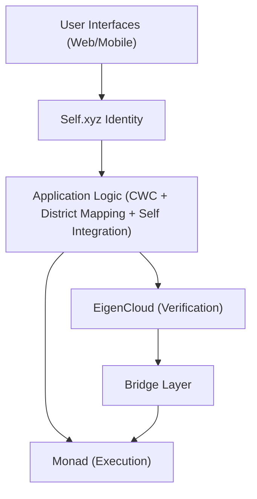
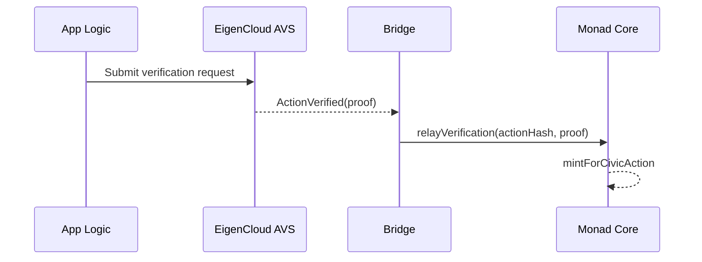
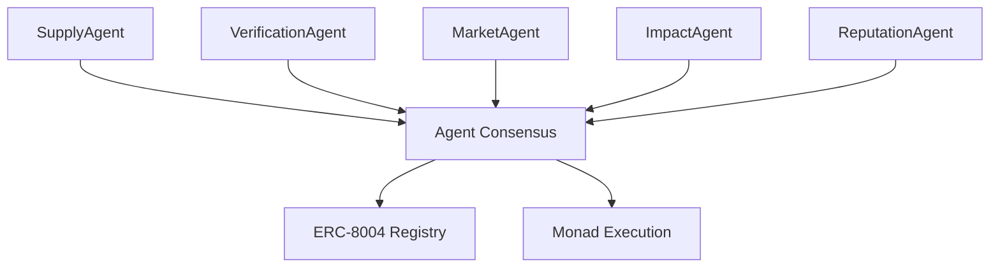

# Hybrid Monad + EigenCloud Architecture

## Executive Summary

The VOTER token platform is designed for a hybrid architecture combining Monad's high-performance execution with EigenCloud's verifiability infrastructure. **ERC-8004 was built for AI agents. We extend it to human civic participants.** This approach delivers both the speed needed for viral civic engagement and the cryptographic guarantees required for authentic democratic participation.

**Current Implementation Status:**
- 🔧 **Monad execution layer**: Core contracts built with VOTER token, adaptive governance
- 🔧 **Multi-agent verification**: AgentConsensusGateway architecture designed for civic actions
- 🔧 **Cheap EVM anchoring**: Verification receipt and registry contracts ready for deployment
- 🔄 **EigenCloud AVS integration**: Planned for enhanced decentralized verification

## Architectural Overview



```mermaid
flowchart TB
  subgraph Monad [Monad Layer (Execution)]
    Core["CommuniqueCore"]
    Token["VOTERToken (ERC20Votes)"]
    Registry["VOTERRegistry"]
    Params["AgentParameters"]
  end
  Core --> Token
  Core --> Registry
  Core -->|read bounds/knobs| Params
```

```mermaid
flowchart TB
  subgraph EigenCloud [EigenCloud Layer (Verification)]
    AVS["Civic Action Verifier AVS"]
    CWC["CWC Prover"]
    ID["Identity Attestation"]
    Dispute["Dispute Resolution"]
  end
```



## Layer Responsibilities

### Self.xyz Identity Layer: Zero-Knowledge Verification

**Purpose**: Provide cryptographic proof of citizen identity without exposing personal data

**Components:**
- **Passport Verification**: ZK proofs of government-issued passports
- **Age Verification**: Prove 18+ eligibility without revealing exact age
- **Citizenship Proof**: Verify US citizenship without exposing passport details
- **Sybil Resistance**: Each passport can only be used once across the platform
- **Keyless Wallets**: Phone number serves as wallet address for seamless UX

**Privacy Benefits:**
- Zero personal data stored on-chain or in centralized databases
- Cryptographic proofs replace traditional KYC documentation
- Government-grade document verification without document exposure
- Selective disclosure of only necessary attributes

### Monad Layer: Cheap EVM Anchoring + Agent Optimization

**Purpose**: Handle high-frequency operations with dynamically calibrated parameters and cheap EVM anchoring

**Components:**
- **VOTER Token Contract**: ERC-20 governance token with dynamically calibrated rewards
- **Agent Governance**: Multi-agent consensus for dynamic parameter optimization
- **Carroll Mechanisms**: Challenge markets and credibility infrastructure  
- **ERC-8004 Integration**: Human-AI reputation registry mirroring

**Performance Benefits:**
- High throughput for mass civic engagement
- 1-second finality for immediate feedback
- Sub-cent fees enable micro-civic-actions
- Cheap EVM anchoring for verification receipts

### EigenCloud Layer: Cryptographic Verification

**Purpose**: Provide tamper-proof verification of civic actions

**Components:**
- **Civic Action Verifier (AVS)**: Custom AVS for validating civic actions
- **Congressional Message Prover**: Verify CWC delivery and authenticity
- **Identity Attestation Service**: Decentralized identity verification
- **Dispute Resolution**: Handle challenges to civic action claims

**Verification Benefits:**
- Cryptographic proof of civic action authenticity
- Decentralized verification reducing single points of failure
- Intersubjective dispute resolution for edge cases
- Cross-chain proof anchoring for maximum security

### Bridge Layer: Cross-Chain Coordination

**Purpose**: Synchronize state between Monad execution and EigenCloud verification

**Components:**
- **Verification Oracle**: Relay EigenCloud proofs to Monad contracts
- **State Synchronizer**: Maintain consistency across chains
- **Proof Aggregator**: Bundle multiple verifications for efficiency
- **Emergency Circuit Breaker**: Halt operations if verification fails

### Agent-Optimized Control Plane

**Monad Foundation (Cheap EVM Anchoring)**
- Integrity rails: anchor registries/attestations as IPFS CIDs on Monad with minimal on‑chain readable fields
- Agent parameters: dynamic optimization within auditable bounds stored on-chain
- Heavy payloads remain off‑chain; batches commit with Merkle roots for amortized gas
- Agents remain off‑chain/TEE; on‑chain stores only facts required for trust and composability

**ERC‑8004 Human-AI Infrastructure**  
- Mirror Identity/Validation/Reputation registries to ETH L2 for cross-platform composability
- ERC-8004 serves both AI agent coordination and human civic reputation
- Storage‑backed entries (not events‑only) ensure proper on‑chain reads for partners

**Economic Infrastructure**
- Liquidity and treasury remain on ETH/L2 (Safe) with no routine asset bridging
- Agent-optimized reward calculations replace hardcoded parameters
- Challenge markets and Carroll Mechanisms for quality discourse incentives

**Quality discourse pays. Bad faith costs.**

## Technical Implementation

### On‑chain Anchoring (Monad)

- Registry (Monad): Stores template/channel CIDs and simple version graph; emits events for indexers; no PII
- Attest (Monad): Writes hash attestations for verification receipts (CWC/mail routing); supports revocations

Bridging is not routine. Treasury/liquidity remain on ETH/L2 (Safe). Mirror minimal trust signals to L2 ERC‑8004 registries only when partners require on‑chain reads.

## Data Flow

### Civic Action Processing

1. **User Action**: Citizen sends message through CWC integration via mail client
2. **Initial Recording**: Action recorded on Monad with "pending verification" status
3. **Agent Verification**: Multi-agent consensus evaluates action authenticity and quality
4. **Agent Processing**: 
   - VerificationAgent confirms CWC delivery
   - ReputationAgent updates ERC-8004 credibility scores
   - SupplyAgent calculates performance-adjusted VOTER rewards
   - MarketAgent processes any challenge market outcomes
5. **Consensus Execution**: Agent consensus triggers on-chain parameter updates
6. **Token Minting**: VOTER tokens minted based on agent-determined amounts
7. **User Notification**: Real-time notification with credibility and reward updates

### Verification Proof Structure

```typescript
interface VerificationProof {
  actionHash: bytes32;
  citizen: address;
  actionType: ActionType;
  timestamp: uint256;
  cwcDeliveryProof: {
    messageId: string;
    deliveryConfirmation: bytes;
    representativeOffice: string;
  };
  identityProof: {
    citizenId: bytes32;
    districtHash: bytes32;
    verificationTimestamp: uint256;
  };
  eigenSignature: bytes;
  blockProof: bytes;
}
```

## Performance Characteristics

### Throughput Analysis

**Monad Operations (High Frequency):**
- Token transfers: 10,000+ TPS
- Governance voting: 5,000+ TPS  
- Leaderboard updates: 8,000+ TPS
- Social interactions: 10,000+ TPS

**EigenCloud Verification (High Security):**
- Civic action verification: 100-500 TPS (sufficient for national scale)
- Identity attestations: 50-100 TPS
- Dispute resolutions: 10-20 TPS

**Bridge Coordination:**
- Proof relaying: 1,000+ TPS
- State synchronization: 500+ TPS

### Latency Profile

- **Immediate Feedback**: User sees action recorded instantly on Monad (1 second)
- **Verification Complete**: EigenCloud proof generated (30-60 seconds)
- **Token Reward**: VOTER tokens minted after verification (2-3 minutes total)

## Security Model

### Trust Assumptions

**Monad Layer:**
- Validators secure token economic operations
- Multi-sig governance for critical parameters
- Standard smart contract security practices

**EigenCloud Layer:**
- Restaked ETH secures verification process ($13B+ TVL)
- Multiple AVS operators provide redundancy
- Slashing conditions for malicious behavior

**Bridge Layer:**
- Multi-signature relayer network
- Cryptographic proof verification
- Emergency pause mechanisms

### Attack Vectors and Mitigations

**Verification Gaming:**
- EigenCloud AVS validates CWC delivery confirmation
- Identity attestation prevents sybil attacks
- Rate limiting and quality scoring prevent spam

**Bridge Attacks:**
- Multi-sig relayer consensus required
- Cryptographic proof validation
- Time delays for large operations

**Economic Attacks:**
- Slashing conditions for malicious AVS operators
- Governance-controlled minting limits
- Circuit breakers for anomalous activity

## Deployment Strategy

### Phase 1: Monad Foundation (Months 1-2)
- Deploy enhanced VOTER token with verification hooks
- Launch gamification and governance features
- Build user base with basic civic engagement

### Phase 2: EigenCloud Integration (Months 3-4)
- Deploy Civic Verifier AVS on EigenCloud
- Launch bridge contracts for cross-chain coordination
- Begin verified civic action processing

### Phase 3: Full Hybrid Operations (Months 5-6)
- Complete verification for all civic actions
- Launch advanced features requiring cryptographic proofs
- Scale to national civic engagement levels

## Carroll Mechanisms: Credibility Infrastructure

### Challenge Markets for Quality Discourse
- **Disputable Claims**: Any claim in civic actions can be challenged through staked disputes
- **Community Consensus**: Markets resolve through participant evaluation, not truth determination
- **Quality Discourse Rewards**: Rewards focus on sourcing standards and constructive engagement
- **Portable Reputation**: ERC-8004 credibility scores follow participants across platforms

### Multi-Agent Coordination


**Quality discourse pays. Bad faith costs.**

## Competitive Advantages

### Technical Benefits
- **Performance + Security**: Best of both execution speed and verification integrity
- **Human-AI Infrastructure**: ERC-8004 serves both AI agent coordination and human civic reputation
- **Regulatory Compliance**: Cryptographic proofs provide audit trail
- **Developer Experience**: Familiar EVM tools plus cutting-edge verification

### Market Positioning
- **First Human-AI Democracy**: Infrastructure that serves both humans and AI agents
- **Institutional Grade**: Validated anchoring and ERC‑8004 mirrors provide composability and credibility
- **Viral Potential**: Monad's performance enables memecoin-level adoption
- **Democratic Impact**: Verifiable civic engagement creates real political change

## Conclusion

The hybrid Monad + EigenCloud architecture provides optimal foundation for agent-optimized democratic participation at scale. By combining cheap EVM anchoring with multi-agent consensus, the platform delivers both viral growth mechanics and authentic civic impact through portable ERC-8004 reputation.

This architecture positions the VOTER Protocol uniquely at the intersection of human-AI infrastructure, agent optimization, and democratic technology—infrastructure that serves both humans and AI agents in building better governance.

**Quality discourse pays. Bad faith costs. Democracy scales.**