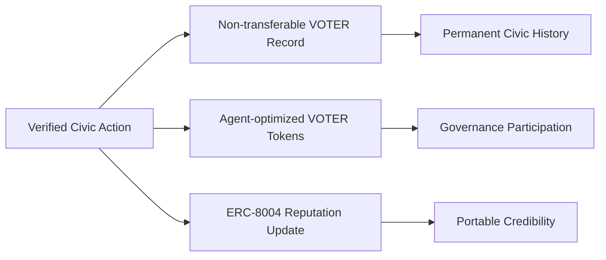
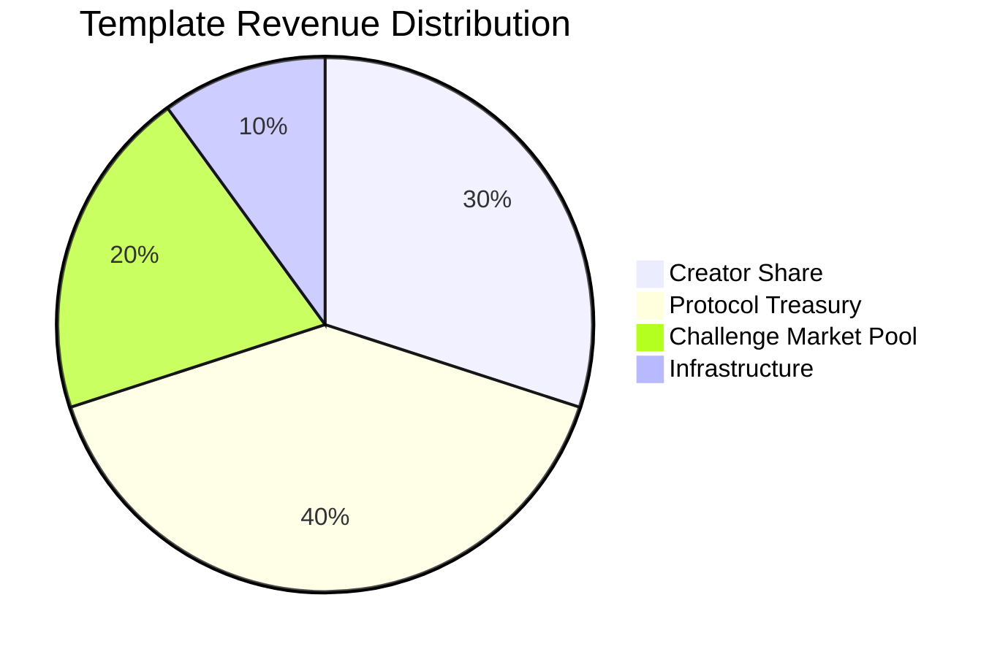

# Token Model: VOTER Records + VOTER

## Executive Summary

We separate authentic participation from incentives, with all verification receipts anchored on Monad for cheap EVM anchoring (hashes only; no PII). **ERC‑8004 was built for AI agents. We extend it to human civic participants.** Mirror to an ETH L2 (ERC‑8004 registries) when ETH‑native consumers need on‑chain reads.

Sources: [ERC‑8004](https://github.com/ethereum/ERCs/blob/master/ERCS/erc-8004.md), [Monad docs](https://docs.monad.xyz)

## The Two-Token System

### VOTER Records (Non‑Transferable)
- **Purpose**: Immutable proof of verified civic action
- **Properties**: Non-transferable, soul-bound, permanent
- **Creation**: 1:1 with verified civic actions (CWC messages, direct action campaigns)
- **Function**: Reputation, verification, historical record

### VOTER Tokens (Tradeable)
- **Purpose**: Platform governance and economic incentives
- **Properties**: ERC-20 compatible, tradeable, stakeable
- **Creation**: Minted per verified civic action with dynamically calibrated amounts based on impact measurement and market conditions
- **Function**: Governance voting, challenge market staking, and rewards distribution

## Token Economics

### VOTER Record Creation

Every verified civic action creates three outcomes: a permanent, non-transferable record of participation; dynamically calculated VOTER tokens based on impact and market conditions; and portable reputation scores written to ERC-8004 registries that follow users across platforms.

**Eligible Actions (examples):**
- Certified legislative submissions (via adapters)
- Direct outreach (mailto‑based)
- Community organizing/advocacy with verifiable receipts

**Verification Requirements (policy‑driven):**
- Identity/address attestation (when required by adapter)
- Action authenticity (submission receipts, mail routing receipts)
- Anti‑spam measures (rate limits, quality scoring)

### Template Economics: Smart Contract Implementation

**On-Chain Template Registry Architecture:**

The TemplateRegistry tracks message templates through their entire lifecycle. Each template stores its IPFS hash for decentralized content, creator address for attribution, creation block for timestamping, usage metrics for performance analysis, revenue totals for creator compensation, credibility scores from challenge market outcomes, and deprecation status for lifecycle management.

Template challengers get tracked separately, enabling dispute resolution workflows. Creator revenue accumulation ensures transparent compensation distribution. The registry serves as the authoritative source for template economics and reputation.

**Revenue Distribution Architecture:**

**Revenue Flow Mechanics:**
Institutional customers pay USD for verified civic engagement analytics and bulk outreach services. Revenue gets distributed across four pools: template creators receive 30% for contribution incentives, protocol treasury gets 40% for development and operations, challenge market pools receive 20% for dispute resolution rewards, and infrastructure maintenance takes 10% for system operations.

Performance multipliers adjust creator shares based on template effectiveness, challenge market outcomes, and usage patterns. High-performing templates with strong credibility scores earn enhanced revenue shares.

**Challenge Market State Machine:**
- Template challenges trigger state transitions in TemplateRegistry
- Successful challenges redistribute accumulated revenue share
- Challenge resolution updates credibility scores automatically
- Failed challenge attempts slash challenger stakes

### Carroll Mechanisms Economics

**Challenge Market Types:**
- Template-level disputes affect template credibility and revenue sharing
- Usage-level disputes affect individual reputation and stake redistribution
- Community consensus determines resolution, not centralized truth arbitration
- Winners receive losing stakes; protocol takes small fee for treasury operations

**Quality discourse pays. Bad faith costs.**

**Reputation Integration:**
- ERC-8004 Reputation Registry tracks credibility scores across platforms
- High-reputation participants get priority congressional routing and template creation privileges
- Low-reputation claims require higher stakes to challenge template usage
- Template creators build reputation through successful template performance metrics

### VOTER Token Utility

**Governance Power:**
- Vote on platform features and policies
- Approve new action types for VOTER record creation
- Decide on fee structures and reward distributions
- Select community moderators and validators

**Economic Benefits:**
- Access to premium features (analytics, bulk messaging tools)
- Staking rewards from protocol revenue distribution
- Priority access to new features and campaigns
- Challenge market participation and winnings
- Reputation-based reward multipliers

**Network Effects:**
- Social credibility through verified civic history
- Community building around shared causes
- Cross-platform integration with civic organizations

## Market Positioning

### Regulatory Framework
- Utility‑first design; clear functional purpose
- Minimal on‑chain data; off‑chain KYC when legally required

### Competitive Advantages
- Verifiable participation receipts anchored on Monad
- UX mirrors email; zero lift for end users
- ERC‑8004 infrastructure serves both AI agent coordination and human civic reputation

## Technical Implementation

### Smart Contract Architecture

**VOTERRegistry - Civic History Management:**
The registry maintains non-transferable civic action records for each participant. Records include timestamps for chronological ordering, action types for categorization, content hashes for verification, verified status from multi-agent consensus, and credibility scores from ERC-8004 reputation integration. Civic history becomes permanent and portable across platforms.

**VOTERToken - Governance and Challenge Markets:**
The token contract extends ERC-20 with voting capabilities and challenge market functionality. Challenge markets track disputed claims through challenger/defender pairings, staked amounts for economic incentives, resolution status for transparency, and winner determination for stake redistribution. Quality discourse pays through market-based consensus.

**AgentParameters - Dynamic System Configuration:**
The parameters contract stores agent-calculated values within auditable bounds. Authorized agents can update specific parameters based on multi-agent consensus, but all changes respect minimum and maximum limits enforced by the contract. Human-governed circuit breakers provide ultimate safety controls.

### Integration Points
- **CWC API** for congressional message verification
- **Identity providers** for KYC/address verification  
- **ERC-8004 Reputation Registry** for portable credibility across platforms—built for AI agents, extended to human civic participants
- **Multi-Agent System** (SupplyAgent, VerificationAgent, MarketAgent, ImpactAgent, ReputationAgent)
- **Challenge Market Resolution** through community consensus mechanisms
- **Social platforms** for civic action sharing
- **DeFi protocols** for VOTER token liquidity and yield

## Growth Strategy

### Phase 1: Foundation (Months 1‑6)
- Deploy Monad contracts: Registry, Attest
- Ship certified adapter (e.g., CWC) + mail routing receipts
- Launch with verified civic actors; “Verify on‑chain” links

### Phase 2: Growth (Months 6‑12)
- Gamification/leaderboards; referrals
- ERC‑8004 reputation infrastructure enables portable democratic credibility across platforms

### Phase 3: Ecosystem (Months 12‑24)
- Additional adapters (other legislatures)
- Partnerships; global expansion

## Risk Analysis & Mitigation

### Regulatory Compliance
- **Legal Framework**: Utility-first token design with clear functional purpose avoids securities classification
- **Privacy Protection**: Zero-knowledge proofs ensure compliance with GDPR/CCPA while maintaining verification
- **International Compliance**: Modular framework adapts to different jurisdictions without compromising core functionality

### Technical Security
- **Smart Contract Resilience**: Comprehensive audits and formal verification of all critical pathways
- **Multi-Agent Consensus**: Distributed decision-making eliminates single points of failure
- **Emergency Controls**: Human-governed circuit breakers provide ultimate safety without compromising agent optimization

### Economic Stability
- **Agent-Optimized Parameters**: Dynamic supply adjusts to market conditions within auditable safety rails
- **Diversified Revenue**: USD institutional credits provide stability beyond token appreciation
- **Network Effects**: Growing reputation infrastructure creates sustainable competitive moats

## Success Metrics

### Democratic Infrastructure Adoption
- **Monthly active verified civic actors**: Building the verified citizen base
- **Congressional messages via CWC integration**: Direct democratic engagement volume
- **Cross-platform reputation portability**: ERC-8004 integration success

### Agent-Optimized Economics
- **Dynamic reward effectiveness**: Agent optimization outperforming hardcoded parameters
- **Challenge market quality**: Community consensus improving discourse standards
- **Network effects strength**: Growing reputation infrastructure value

### Authentic Political Impact
- **Representative response rates**: Verified constituents getting better signal-to-noise
- **Policy engagement measurability**: Democracy infrastructure creating real outcomes
- **Institutional adoption**: Government offices integrating with verification infrastructure

## Conclusion

The hybrid token model positions VOTER at the intersection of digital economic incentives and authentic democratic participation. By separating proof-of-civic-engagement from pure speculation, we create sustainable incentives for verified political action while building infrastructure that serves both humans and AI agents.

Agent-optimized parameters replace hardcoded tyranny. Challenge markets surface truth through community consensus. ERC-8004 reputation creates portable democratic credibility. This isn't just another governance token—it's foundational infrastructure for democracy that competes in the attention economy.

**Quality discourse pays. Bad faith costs. Democracy scales.**