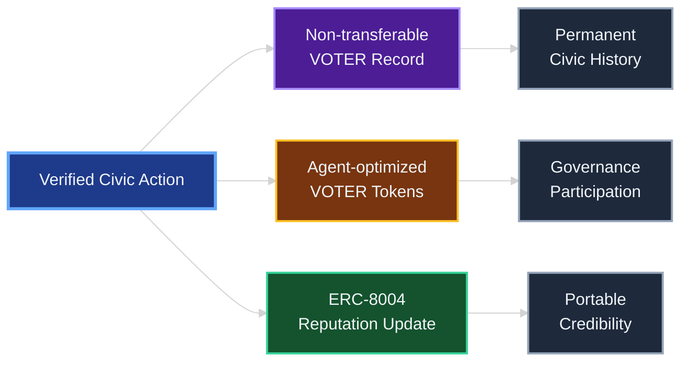

# VOTER Tokenomics

## The Deal

Citizens do civic shit, get tokens. No PII on-chain, just hashes on Monad because it's cheap. **ERC‑8004 was built for AI agents. We extend it to human civic participants.** Mirror to ETH L2 when someone actually needs to read it.

Sources: [ERC‑8004](https://github.com/ethereum/ERCs/blob/master/ERCS/erc-8004.md), [Monad docs](https://docs.monad.xyz)

## The Two-Token System

### VOTER Records (Non‑Transferable)
- **Purpose**: Immutable proof of verified civic action
- **Properties**: Non-transferable, soul-bound, permanent
- **Creation**: 1:1 with verified civic actions (CWC messages, direct action campaigns)
- **Function**: Reputation, verification, historical record

### VOTER Tokens (Tradeable)
- **Purpose**: Platform governance and economic incentives
- **Properties**: ERC-20 compatible, tradeable, stakeable
- **Creation**: Minted per verified civic action with dynamically calibrated amounts based on impact measurement and market conditions
- **Function**: Governance voting, challenge market staking, and rewards distribution

## Token Economics

### VOTER Record Creation

Do civic action, get three things: permanent record you can't trade, VOTER tokens based on actual impact, and reputation that follows you everywhere.

**Eligible Actions (examples):**
- Certified legislative submissions (via adapters)
- Direct outreach (mailto‑based)
- Community organizing/advocacy with verifiable receipts

**Verification Requirements (policy‑driven):**
- Identity/address attestation (when required by adapter)
- Action authenticity (submission receipts, mail routing receipts)
- Anti‑spam measures (rate limits, quality scoring)

### Template Economics: Impact Drives Everything

**On-Chain Template Registry Architecture:**

The TemplateRegistry tracks message templates through their entire lifecycle. Each template stores its IPFS hash for decentralized content, creator address for attribution, creation block for timestamping, usage metrics for performance analysis, impact scores for mind-changing potential, credibility scores from challenge market outcomes, and deprecation status for lifecycle management.

Template challengers get tracked separately, enabling dispute resolution workflows. The registry serves as the authoritative source for template credibility and reputation.

**Templates That Actually Change Things:**

Your template makes a claim: "This policy costs families $2K/year." Ten thousand people use it. Three senators cite that exact figure in floor speeches. Two votes flip. That's verified impact.

**How Impact Rewards Work:**

When templates introduce information that changes legislative positions, creators earn massive credibility boosts. When mass campaigns shift votes, participants get bonus VOTER tokens. When citizen expertise shapes amendments, the system proves who moved mountains.

**Bootstrap Phase (Now):**
Citizens earn VOTER tokens for verified civic actions. Templates that demonstrably change minds earn creators 10x normal rewards. Token value comes from belief that democracy needs better information flows. Challenge markets verify impact claims.

**Impact-Based Treasury Allocation:**
As treasury accumulates value, governance directs funds to legislators who learned from citizen input. Not those who already agreed, but those whose positions evolved based on template campaigns. Your information changed their mind. Your treasury funds their campaign.

**Challenge Market Mechanics:**
- Template challenges trigger state transitions in TemplateRegistry
- Successful challenges win the opposing stake (redistribution, not new money)
- Challenge resolution updates credibility scores automatically
- Failed challenge attempts lose staked tokens to defender

### Carroll Mechanisms Economics

**Challenge Market Types:**
- Template-level disputes affect template credibility and revenue sharing
- Usage-level disputes affect individual reputation and stake redistribution
- Community consensus determines resolution, not centralized truth arbitration
- Winners receive losing stakes; protocol takes small fee for treasury operations

**Quality discourse pays. Bad faith costs.**

**Reputation Integration:**
- ERC-8004 Reputation Registry tracks credibility scores across platforms
- High-reputation participants get priority congressional routing and template creation privileges
- Low-reputation claims require higher stakes to challenge template usage
- Template creators build reputation through successful template performance metrics

### What VOTER Tokens Actually Do

**Governance (if you care):**
- Vote on shit that matters
- Decide what counts as civic action  
- Control the treasury (when there is one)

**Economic Perks:**
- Stake for yields (if value exists)
- Win challenge markets by being right
- Higher reputation = bigger rewards
- Access premium features (when we build them)

**Social Capital:**
- Verified civic history follows you
- Quality discourse builds real credibility  
- Reputation that actually means something

## Why This Works

### Regulatory
- It's utility, not securities
- No PII on-chain
- KYC only when legally required

### Competitive Edge  
- Verified receipts on cheap Monad
- Email UX - normies can use it
- ERC‑8004 serves both AI agents and humans

## Technical Implementation

### Smart Contract Architecture

**VOTERRegistry - Civic History Management:**
The registry maintains non-transferable civic action records for each participant. Records include timestamps for chronological ordering, action types for categorization, content hashes for verification, verified status from multi-agent consensus, and credibility scores from ERC-8004 reputation integration. Civic history becomes permanent and portable across platforms.

**VOTERToken - Governance and Challenge Markets:**
The token contract extends ERC-20 with voting capabilities and challenge market functionality. Challenge markets track disputed claims through challenger/defender pairings, staked amounts for economic incentives, resolution status for transparency, and winner determination for stake redistribution. Quality discourse pays through market-based consensus.

**AgentParameters - Dynamic System Configuration:**
The parameters contract stores agent-calculated values within auditable bounds. Authorized agents can update specific parameters based on multi-agent consensus, but all changes respect minimum and maximum limits enforced by the contract. Human-governed circuit breakers provide ultimate safety controls.

### Integration Points
- **CWC API** for congressional message verification
- **Identity providers** for KYC/address verification  
- **ERC-8004 Reputation Registry** for portable credibility across platforms—built for AI agents, extended to human civic participants
- **Multi-Agent System** (SupplyAgent, VerificationAgent, MarketAgent, ImpactAgent, ReputationAgent)
- **Challenge Market Resolution** through community consensus mechanisms
- **Social platforms** for civic action sharing
- **DeFi protocols** for VOTER token liquidity and yield

## Path to Launch

**First**: Get the core working
- Deploy contracts when ready
- Connect CWC integration
- Test with real users

**Then**: Build network effects
- Add gamification that actually engages
- Make reputation portable via ERC-8004
- Let quality content creators emerge

**Eventually**: Scale if it works
- More legislative integrations if demand exists
- International expansion if US succeeds
- Partnerships when we have leverage

## Risk Analysis & Mitigation

### Regulatory Compliance
- **Legal Framework**: Utility-first token design with clear functional purpose avoids securities classification
- **Privacy Protection**: Zero-knowledge proofs ensure compliance with GDPR/CCPA while maintaining verification
- **International Compliance**: Modular framework adapts to different jurisdictions without compromising core functionality

### Technical Security
- **Smart Contracts**: Audited, not rugged
- **Multi-Agent Consensus**: No single point of failure
- **Emergency Controls**: Humans can hit the brakes

### Economic Stability  
- **Dynamic Supply**: Agents adjust within safety rails
- **Revenue**: Maybe institutions pay someday
- **Network Effects**: Reputation creates real moats

## How We Know It's Working

### People Actually Use It
- Citizens sending verified messages
- Representatives actually responding
- Reputation meaning something

### Economics Make Sense
- Agents beat hardcoded params
- Challenge markets surface quality
- Network effects actually happening

### Real Political Impact  
- Better signal-to-noise for offices
- Measurable policy outcomes
- Government offices caring

## Templates Close the Loop

**From Information to Impact to Funding:**

Templates surface information legislators didn't have. That information changes positions. Changed positions get funded. Democracy starts rewarding learning over ideology.

The ImpactAgent tracks which templates actually moved mountains:
- Template data appears in floor speeches
- Voting patterns shift after campaigns  
- Amendments reflect citizen expertise
- Media picks up template talking points

When we prove a template changed reality, creators earn credibility that actually means something. When legislators learn from constituents, they earn campaign support from the citizen treasury through a 501(c)(4) social welfare organization—unlimited funds for those who actually listen.

**Treasury to Electoral Pipeline:**
- VOTER tokens accumulate value through platform growth
- High-credibility participants vote on funding priorities
- 501(c)(4) deploys unlimited funds for issue advocacy
- Connected PAC provides direct candidate support
- Public dashboard tracks: template → mind change → electoral support

**We don't count messages sent. We count minds changed. Changed minds get funded.**

## The Bottom Line

We separate civic participation from speculation. Citizens earn tokens for real democratic action. Templates that change reality get rewarded. Legislators who learn get funded.

Agents optimize instead of hardcoded bullshit. Challenge markets make quality discourse pay. Impact tracking proves what actually works. Reputation actually follows you.

This isn't another governance token. It's democracy infrastructure that competes for attention while creating real political impact.

**Quality discourse pays. Bad faith costs. Templates that change reality win.**