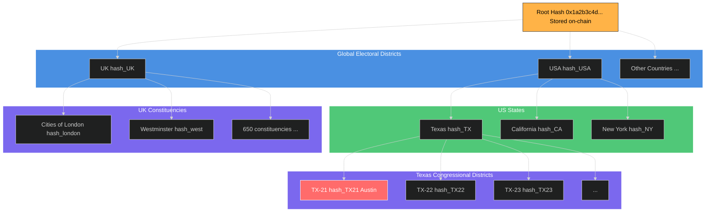
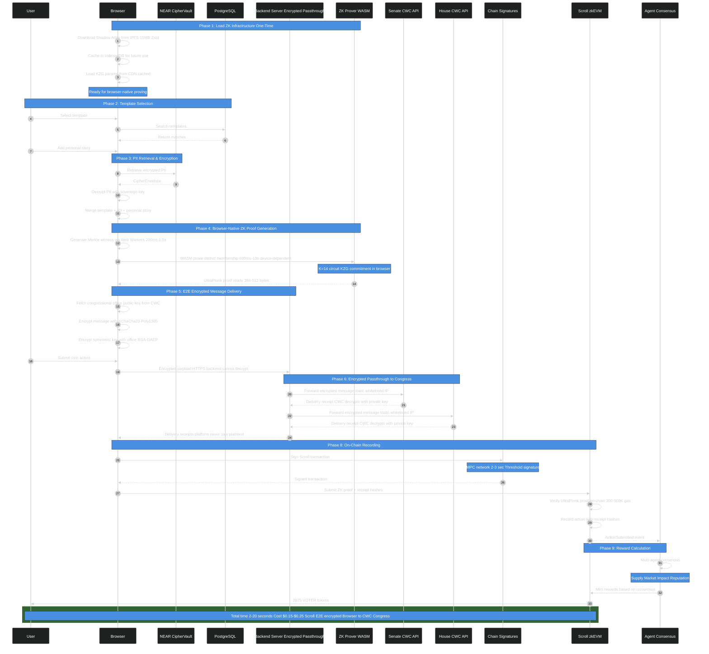

# Zero-Knowledge Infrastructure

**Complete specification for Voter Protocol's browser-native zero-knowledge proving system.**

**Classification**: Technical Architecture
**Last Updated**: 2026-01-23

> **Cross-References**:
> - Main architecture overview: `/ARCHITECTURE.md`
> - Production deployment details: `/docs/ZK-PRODUCTION-ARCHITECTURE.md`
> - Noir proving infrastructure: `/docs/NOIR-PROVING-INFRASTRUCTURE.md`
> - Merkle forest specification: `/docs/operations/MERKLE-FOREST-SPEC.md`

---

## Table of Contents

1. [Shadow Atlas (Global District Registry)](#shadow-atlas-global-district-registry)
2. [District Membership Proof (Noir/Barretenberg)](#district-membership-proof-noirbarretenberg--on-chain-registry)
3. [Browser-Native Proving Architecture](#browser-native-proving-architecture)
4. [Client-Side Proof Generation](#client-side-proof-generation)
5. [Smart Contract Verification](#smart-contract-verification)
6. [Performance Characteristics](#performance-characteristics)
7. [Security Model](#security-model)

---

## Shadow Atlas (Global District Registry)



**Merkle tree of all electoral districts worldwide**

**Storage**:
- Merkle trees: IPFS (CID: Qm...) - One tree per district (12 levels, 4,096 addresses)
- District roots: On-chain via DistrictRegistry.sol (mapping district_root → country_code)
- Update frequency: Quarterly (or when redistricting)
- Size per district: ~50KB per district tree (vs ~50MB global tree)
- Cost: Free (IPFS gateway) or $10/mo (Pinata pinning)

**API**:
```
GET /api/shadow-atlas/root
→ { root: "0x1a2b3c...", updated_at: 1728518400 }

GET /api/shadow-atlas/proof/:district_id
→ { path: [hash1, hash2, ...], indices: [0, 1, 0, ...] }
```

---

## District Membership Proof (Noir/Barretenberg + On-Chain Registry)

**Updated October 2025:** Production architecture using Noir/Barretenberg circuit with on-chain district registry.

**Architecture**: Single-tier Merkle circuit with on-chain district registry. K=14 verifier (20KB) fits EIP-170 with 18% margin. Production-ready for deployment.

**Key Insight**: District→country mappings are PUBLIC data (congressional districts are not secrets), so we use governance + transparency (on-chain registry) instead of cryptography for this layer. This avoids "ZK-maximalism"—forcing everything into cryptographic proofs when simpler solutions exist.

**Two-Step Verification Model**:
1. **Step 1 (Cryptographic)**: UltraPlonk proof proves "I am a member of district X"
2. **Step 2 (On-Chain Registry)**: DistrictRegistry.sol checks "district X belongs to country Y"

**Security**: Attack requires compromising BOTH cryptography (breaking ZK proof) AND governance (compromising multi-sig). Each layer independently provides security.

### Noir Circuit Implementation

```rust
// Noir District Membership Circuit (Barretenberg backend)
use Noir stdlib::{
    gates::GateInstructions,
    AssignedValue, Context,
    // Uses BN254 curve (Ethereum-compatible)
};
use crate::poseidon_hash::{hash_pair_with_hasher, hash_single_with_hasher, create_poseidon_hasher};
use crate::merkle::verify_merkle_path_with_hasher;

/// District membership circuit (K=14, 16,384 rows, 117,473 advice cells, 8 columns)
/// Production-ready: 8-15 second proving on mid-range Android
#[derive(Clone, Debug)]
pub struct DistrictMembershipCircuit {
    // Private witnesses (NEVER revealed, stay in browser)
    pub identity_commitment: Fr,  // Poseidon(user_id, secret_salt)
    pub leaf_index: usize,         // Position in district tree (0-4095)
                                   // CONSTRAINED via bit decomposition (cannot be faked)
    pub merkle_path: Vec<Fr>,      // 12 sibling hashes (single-tier district tree)

    // Public inputs (context for verification)
    pub action_id: Fr,             // Action identifier (verified by on-chain contract)
}

impl DistrictMembershipCircuit {
    /// Verify single-tier Merkle membership with CONSTRAINED index and nullifier
    ///
    /// # Security Properties
    /// 1. Leaf index derived from constrained bit decomposition (cannot be faked)
    /// 2. Nullifier COMPUTED in-circuit (not witnessed) - prevents double-voting
    /// 3. Non-commutativity of Poseidon enforces correct sibling ordering
    ///
    /// # Returns
    /// (district_root, nullifier, action_id) - Public outputs verified by DistrictGate.sol
    pub fn verify_membership(
        &self,
        ctx: &mut Context<Fr>,
        gate: &impl GateInstructions<Fr>,
    ) -> (AssignedValue<Fr>, AssignedValue<Fr>, AssignedValue<Fr>) {
        // Create reusable Poseidon hasher (eliminates ~33,600 wasted cells)
        let mut hasher = create_poseidon_hasher(ctx, gate);

        // 1. Hash identity to create leaf
        let identity_assigned = ctx.load_witness(self.identity_commitment);
        let leaf_hash = hash_single_with_hasher(&mut hasher, ctx, gate, identity_assigned);

        // 2. Verify district tree: identity ∈ district tree (12 levels, CONSTRAINED)
        let leaf_index_assigned = ctx.load_witness(Fr::from(self.leaf_index as u64));
        let siblings: Vec<_> = self.merkle_path.iter()
            .map(|&h| ctx.load_witness(h))
            .collect();

        let computed_district_root = verify_merkle_path_with_hasher(
            &mut hasher,
            ctx,
            gate,
            leaf_hash,
            leaf_index_assigned,  // ← CONSTRAINED via bit decomposition
            siblings,
            12, // tree_depth (4,096 addresses per district)
        );

        // 3. Compute nullifier IN-CIRCUIT (prevents double-voting)
        // nullifier = Poseidon(identity_commitment, action_id)
        let action_id_assigned = ctx.load_witness(self.action_id);
        let computed_nullifier = hash_pair_with_hasher(
            &mut hasher,
            ctx,
            gate,
            identity_assigned,
            action_id_assigned,
        );

        // Public outputs: district_root, nullifier, action_id
        // Verified by DistrictGate.sol via two-step process:
        // 1. ZK proof verification (this circuit)
        // 2. Registry lookup (district_root → country_code)
        (computed_district_root, computed_nullifier, action_id_assigned)
    }
}
```

### Why Noir/Barretenberg + Registry

**Current Implementation (K=14 Single-Tier)**:

| Metric | Production Value |
|--------|------------------|
| **Rows** | 16,384 (K=14) |
| **Advice cells** | 117,473 |
| **Advice columns** | 8 |
| **Merkle levels** | 12 (district tree only) |
| **Hash operations** | 13 (12 Merkle + 1 nullifier) |
| **Verifier bytecode** | 20,142 bytes |
| **EIP-170 compliance** | ✅ (18% under 24KB limit) |
| **Verification gas** | ~300-400k (estimated) |
| **Mobile proving** | 8-15 seconds (estimated) |
| **WASM memory** | <600MB |

**Production Advantages**:
- ✅ **Fits EIP-170** (20KB < 24KB limit) - Deployable to any EVM chain
- ✅ **Mobile-usable** (8-15s proving on mid-range Android)
- ✅ **Dual-layer security** (ZK cryptography + governance registry)
- ✅ **Transparent** (on-chain registry is publicly auditable)
- ✅ **Efficient** (8 advice columns minimize verifier size)

---

## Browser-Native Proving Architecture

### Client-Side Architecture

**Zero-knowledge proofs generated entirely in browser (WASM, no cloud dependency)**

**Key Components**:
- Backend server whitelisted by House/Senate CWC APIs (static IP for Congressional access)
- E2E encryption: browser → encrypted transit → CWC decryption
- Congressional office public keys retrieved from CWC API (not stored platform-side)

**Security Advantages**:
- Zero cloud proving infrastructure ($0/month browser-native, no server costs)
- Address never leaves browser (true client-side privacy, not just encrypted)
- No trusted execution environments required (browser sandbox + on-chain verification)
- Cypherpunk-aligned (peer-reviewed mathematics, zero cloud proving dependency)

### Complete Civic Action Flow



---

## Client-Side Proof Generation

### Shadow Atlas Loading (First Time Only)

```javascript
// Progressive IPFS download with IndexedDB caching
async function loadShadowAtlas(): Promise<MerkleTree> {
  // Check IndexedDB cache first
  const cached = await idb.get('shadow-atlas-2025-Q1');
  if (cached) return deserializeMerkleTree(cached);

  // Download from IPFS (15MB Zstd compressed, 50MB uncompressed)
  const ipfsCID = 'bafybeigdyrzt5sfp7udm7hu76uh7y26nf3efuylqabf3oclgtqy55fbzdi';
  const compressed = await ipfs.cat(ipfsCID);
  const atlas = await zstd.decompress(compressed);

  // Cache for future use
  await idb.set('shadow-atlas-2025-Q1', atlas);
  return deserializeMerkleTree(atlas);
}
```

### Web Worker Witness Generation

```javascript
// Parallel Poseidon hashing across 4 workers
async function generateWitness(
  address: Address,
  tree: MerkleTree
): Promise<MerkleWitness> {
  const workers = await initWorkerPool(4); // 4 Web Workers

  // Find address in tree (binary search on sorted leaves)
  const leafIndex = tree.findLeafIndex(address);

  // Generate Merkle path in parallel
  const pathPromises = tree.getPath(leafIndex).map((node, i) =>
    workers[i % 4].poseidonHash(node.left, node.right)
  );

  const path = await Promise.all(pathPromises);

  return {
    leafIndex,
    path,
    root: tree.root,
    districtId: tree.getDistrictId(leafIndex)
  };
}
```

### WASM Noir/Barretenberg Proving

```javascript
// Browser-native proof generation with KZG commitment
async function generateDistrictProof(
  witness: MerkleWitness
): Promise<ProofResult> {
  // Load KZG parameters from CDN (cached after first load)
  const kzgParams = await loadKZGParams();

  // Initialize WASM prover
  const prover = await wasmProver.init({
    circuit: 'district-membership-k12',
    kzgParams,
    threads: navigator.hardwareConcurrency // Use all CPU cores
  });

  // Generate proof (600ms-10s device-dependent)
  const proof = await prover.prove({
    publicInputs: [witness.root, witness.districtId],
    privateInputs: [witness.leafIndex, witness.path]
  });

  return proof; // 384-512 bytes
}
```

### Client-Side Proof Generation Flow

```javascript
// Load Noir/Barretenberg prover WASM (8-12MB, cached after first load)
import { Barretenberg } from '@voter-protocol/bb.js';
import { Noir } from '@noir-lang/noir_js';
const api = await Barretenberg.new(); // Initialize WASM

// Fetch district tree from IPFS (~50KB per district)
const districtTree = await fetch(`https://ipfs.io/ipfs/${DISTRICT_CID}/${district_id}`);
const merklePath = districtTree.getMerklePath(userAddress);

// Generate identity commitment (private, never leaves browser)
const identityCommitment = poseidon([userId, secretSalt]);

// Prepare circuit witnesses (private inputs, NEVER revealed)
const witnesses = {
  identity_commitment: identityCommitment,   // Private: user identity
  leaf_index: merklePath.leafIndex,          // Private: position in tree (0-4095)
  merkle_path: merklePath.siblings,          // Private: 12 sibling hashes
  action_id: hash("contact_rep"),            // Public context
};

// Generate UltraPlonk proof (2-8 seconds on mobile, 600ms-2s on desktop)
const { proof, publicOutputs } = await noirProver.prove(
  witnesses,
  {
    k: 12,  // 4,096 rows
    onProgress: (percent) => updateProgressBar(`Generating proof: ${percent}%`),
  }
);

// Public outputs computed by circuit (verified on-chain):
// - district_root: Merkle root of user's district
// - nullifier: Poseidon(identity_commitment, action_id) - prevents double-voting
// - action_id: Action identifier
const { district_root, nullifier, action_id } = publicOutputs;

// Submit to DistrictGate.sol for verification (permissionless - any actionId works)
// EIP-712 signature ensures signer gets credit, not MEV bots
const deadline = Math.floor(Date.now() / 1000) + 3600; // 1 hour
const signature = await signer.signTypedData(domain, types, {
  proofHash: keccak256(proof),
  districtRoot: district_root,
  nullifier,
  actionId: action_id,
  country: "USA",
  nonce: await districtGate.nonces(signer.address),
  deadline
});

const tx = await districtGate.verifyAndAuthorizeWithSignature(
  signer.address,           // Original signer (gets credit)
  proof,                    // 384-512 byte UltraPlonk proof
  district_root,            // District Merkle root (checked against registry)
  nullifier,                // Prevents double-voting
  action_id,                // Action identifier (ANY bytes32 is valid)
  "USA",                    // Expected country (verified via registry lookup)
  deadline,
  signature
);

// Result: Proof verified, action authorized
// Gas cost: ~200-300k (ZK verification + registry lookup + nullifier tracking)
```

---

## Smart Contract Verification

### Two-Step Process

```solidity
// Step 1: DistrictRegistry.sol - Maps district roots to countries (governance-controlled)
contract DistrictRegistry {
    mapping(bytes32 => bytes3) public districtToCountry;  // district_root → ISO country code
    address public governance;  // Multi-sig address

    function registerDistrict(bytes32 districtRoot, bytes3 country) external onlyGovernance {
        require(districtToCountry[districtRoot] == bytes3(0), "Already registered");
        districtToCountry[districtRoot] = country;
        emit DistrictRegistered(districtRoot, country, block.timestamp);
    }

    function getCountry(bytes32 districtRoot) external view returns (bytes3) {
        bytes3 country = districtToCountry[districtRoot];
        require(country != bytes3(0), "District not registered");
        return country;
    }
}

// Step 2: DistrictGate.sol - Master verification orchestration
// PERMISSIONLESS ACTIONS: Any bytes32 actionId is valid (no authorization required)
// Spam mitigated by: rate limits (60s), gas costs, ZK proof generation time (8-15s)
contract DistrictGate {
    address public immutable verifier;  // UltraPlonkVerifier (K=14 single-tier circuit, 20,142 bytes)
    DistrictRegistry public immutable registry;
    NullifierRegistry public immutable nullifierRegistry;

    function verifyAndAuthorizeWithSignature(
        address signer,             // ← Original signer (gets credit, MEV resistant)
        bytes calldata proof,
        bytes32 districtRoot,       // ← District Merkle root (not global)
        bytes32 nullifier,          // ← Prevents double-voting
        bytes32 actionId,           // ← Action identifier (ANY bytes32 is valid)
        bytes3 expectedCountry,     // ← ISO 3166-1 alpha-3 code (e.g., "USA")
        uint256 deadline,
        bytes calldata signature
    ) external {
        // Verify EIP-712 signature (prevents MEV theft)
        require(block.timestamp <= deadline, "Signature expired");
        bytes32 digest = _getEIP712Digest(proof, districtRoot, nullifier, actionId, expectedCountry, deadline);
        require(ECDSA.recover(digest, signature) == signer, "Invalid signature");

        // Step 1: Verify ZK proof (cryptographic layer)
        uint256[3] memory publicInputs = [
            uint256(districtRoot),
            uint256(nullifier),
            uint256(actionId)
        ];
        (bool success, bytes memory result) = verifier.call(
            abi.encodeWithSignature("verifyProof(bytes,uint256[3])", proof, publicInputs)
        );
        require(success && abi.decode(result, (bool)), "ZK proof verification failed");

        // Step 2: Check district→country mapping (governance layer)
        bytes3 actualCountry = registry.getCountry(districtRoot);
        require(actualCountry != bytes3(0), "District not registered");
        require(actualCountry == expectedCountry, "Unauthorized district");

        // Step 3: Record nullifier (prevents double-voting, includes rate limiting)
        nullifierRegistry.recordNullifier(actionId, nullifier, districtRoot);

        emit ActionVerified(signer, msg.sender, districtRoot, actualCountry, nullifier, actionId);
    }
}
```

### Permissionless Action Model

Actions are **permissionless** - any `bytes32` can be used as an actionId:
- `keccak256("contact_representative")` - Standard civic action
- `Poseidon(templateId)` - Template-specific namespace (Communique integration)
- `bytes32(campaignId)` - Campaign identifier

Spam resistance without authorization:
- **Rate limits**: 60-second cooldown between actions per user
- **Gas costs**: ~$0.003-0.05 per transaction on Scroll L2
- **Proof generation**: 8-15 seconds per proof prevents mass generation
- **Nullifier uniqueness**: Same person can't act twice on same action

---

## Performance Characteristics

### K=14 Single-Tier Circuit

**Performance Characteristics**:
- **Browser proving time**: 8-15 seconds (device-dependent, mid-range Android target)
  - Desktop: 2-5s (high-end laptops, estimated)
  - Mobile: 8-15s (mid-range Android, Snapdragon 7 series, estimated)
  - Low-end: 15-25s (budget devices, still usable, estimated)

- **Proof characteristics**:
  - Proof size: 384-512 bytes (KZG commitments + evaluations)
  - Public inputs: 3 field elements (district_root, nullifier, action_id)
  - Verification gas: **300-400k gas** on Scroll zkEVM (estimated)
  - Verifier bytecode: **20,142 bytes** (fits EIP-170 24KB limit with 18% margin)

- **Resource usage**:
  - WASM size: ~8-12MB (Noir/Barretenberg prover, cached after first load)
  - Memory peak: <600MB during proving
  - Battery: <2% on mobile (acceptable for verification flow)
  - Network: ~50KB district tree download from IPFS

---

## Security Model

**Security Model**:
- **Layer 1 (Cryptographic)**: UltraPlonk proof prevents identity spoofing and address fabrication
- **Layer 2 (Governance)**: On-chain registry prevents fake districts and unauthorized mappings
- **Layer 3 (Economic)**: Gas costs + rate limits + proof generation time prevent spam
- **Attack Scenario**: Adversary must compromise cryptography (break ZK proof) AND governance (compromise multi-sig) AND economics (subsidize spam)
- **Defense in Depth**: Each layer independently provides security, combined provides strong assurance

---

## Development Roadmap

### Month 2: ZK Infrastructure

- [ ] Shadow Atlas compiler (district trees, 12 levels each)
- [ ] ~~ResidencyCircuit.circom (circuit definition)~~ **→ Phase 1 uses Noir/Barretenberg**
- [ ] ~~Groth16 trusted setup ceremony~~ **→ Phase 1: KZG (Ethereum's universal ceremony)**
- [ ] ~~WASM prover compilation~~ **→ Phase 1: Noir/Barretenberg WASM prover (2-8 seconds mobile)**
- [ ] ~~ResidencyVerifier.sol generation~~ **→ Phase 1: UltraPlonkVerifier.sol (K=14, 20,142 bytes)**
- [ ] Client-side proof generation library **→ Phase 1: Noir/Barretenberg browser proving**

### Month 3: Multi-Chain Settlement

- [ ] Deploy contracts to Scroll testnet
- [ ] DistrictGate.sol deployment **→ Phase 1: Two-step verification (ZK + registry)**
- [ ] DistrictRegistry.sol deployment **→ Phase 1: Multi-sig governed mapping**
- [ ] UltraPlonkVerifier.sol deployment **→ Phase 1: K=14 single-tier verifier (20,142 bytes)**

### Month 7: Security & Audit

- [ ] ~~ZK circuit audit (ResidencyCircuit trusted setup verification)~~ **→ Phase 1: KZG uses Ethereum's ceremony**
- [ ] Noir circuit audit (single-tier K=14, Axiom Noir stdlib integration (20,142 byte verifier)) **→ Phase 1**
- [ ] Smart contract audit (DistrictRegistry.sol, DistrictGate.sol) **→ Phase 1**
- [ ] Browser WASM security review (Subresource Integrity, COOP/COEP headers, KZG parameters integrity) **→ Phase 1**

---

## See Also

- **Production Architecture**: `/docs/ZK-PRODUCTION-ARCHITECTURE.md` - Detailed security model, governance, and production deployment
- **Noir Infrastructure**: `/docs/NOIR-PROVING-INFRASTRUCTURE.md` - Noir/Barretenberg proving system details
- **Merkle Forest**: `/docs/operations/MERKLE-FOREST-SPEC.md` - Multi-boundary composite proofs and tree structure
- **Main Architecture**: `/ARCHITECTURE.md` - Complete protocol overview with all components
