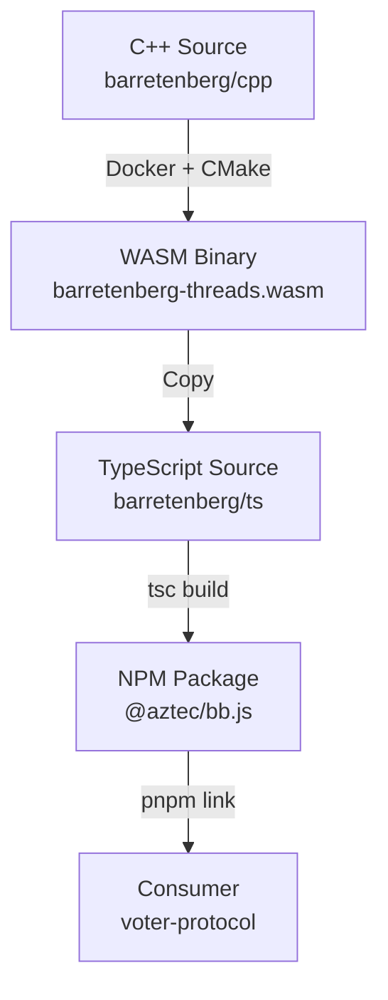

# Vendor Engineering Strategy: Upstream bb.js

**Objective:** Establish a robust development environment to modify, build, and verify `aztec-packages` (C++ & TS) directly within the `voter-protocol` context, enabling the "Stateful Proving" feature.

## 1. Composition: The "In-Tree Vendor" Pattern

To bypass the friction of managing multiple repositories and to allow the AI agent (me) to assist with the C++ work, we will compose the codebase by treating `aztec-packages` as a vendored dependency.

**Structure:**
```text
voter-protocol/
├── packages/
├── contracts/
├── vendor/                 <-- NEW: Upstream dependencies
│   └── aztec-packages/     <-- Clone of github.com/AztecProtocol/aztec-packages
├── pnpm-workspace.yaml
└── package.json
```

**Why this approach?**
1.  **Agent Access:** I can read/write files in `vendor/aztec-packages` because it is inside your active workspace.
2.  **Atomic Context:** You can see the consumer (`voter-protocol`) and the producer (`bb.js`) in the same editor window.
3.  **Simplified Linking:** We can use relative paths or `pnpm link` with high reliability.

## 2. The Build Pipeline

The `bb.js` dependency chain is deep. We must control the entire flow:



### Prerequisites
*   **Docker:** Required to build the C++ WASM binary deterministically (matching Aztec's CI).
*   **Node/PNPM:** For the TypeScript build.

## 3. Implementation Plan

### Step 1: Provisioning
1.  Create `vendor/` directory.
2.  Clone `aztec-packages` into `vendor/aztec-packages`.
3.  Checkout the tag corresponding to the installed `@aztec/bb.js` version (currently `v2.1.8`) or the latest stable release.
    *   *Rationale:* We want to build from the source that matches our dependencies, or upgrade everything to the latest tip-of-tree to be on the bleeding edge.
    *   *Command:* `git checkout aztec-packages-v2.1.8` (or similar tag found in repo).

### Step 2: The "Red" State (Reproduction)
1.  Create a test case in `voter-protocol` (e.g., `scripts/test-stateful-keygen.ts`).
2.  Attempt to call `generateProvingKey`.
3.  **Expect:** Compilation error (missing API) or Runtime error (missing WASM export).

### Step 3: The C++ Modification
1.  Modify `vendor/aztec-packages/barretenberg/cpp/src/barretenberg/wasm/main.cpp`.
2.  Add `WASM_EXPORT` for `acir_get_proving_key`.
3.  Build WASM using Aztec's build container (command to be determined from their `bootstrap.sh`).

### Step 4: The TypeScript Modification
1.  Modify `vendor/aztec-packages/barretenberg/ts/src/barretenberg_wasm/barretenberg_wasm.ts`.
2.  Expose the new WASM function to the `Barretenberg` class.
3.  Build the TS package.

### Step 5: Linking & Verification
1.  In `voter-protocol`, run `pnpm link ./vendor/aztec-packages/barretenberg/ts`.
2.  Run `scripts/test-stateful-keygen.ts`.
3.  **Expect:** Success (PK generated and usable).

## 4. Execution Command

To begin, I need you to approve the cloning of the repository.

**Proposed Command:**
```bash
mkdir -p vendor
git clone https://github.com/AztecProtocol/aztec-packages.git vendor/aztec-packages
```
*(Note: This is a large repo. We might want to do a shallow clone if bandwidth is a concern, but a full clone is safer for navigating history.)*
